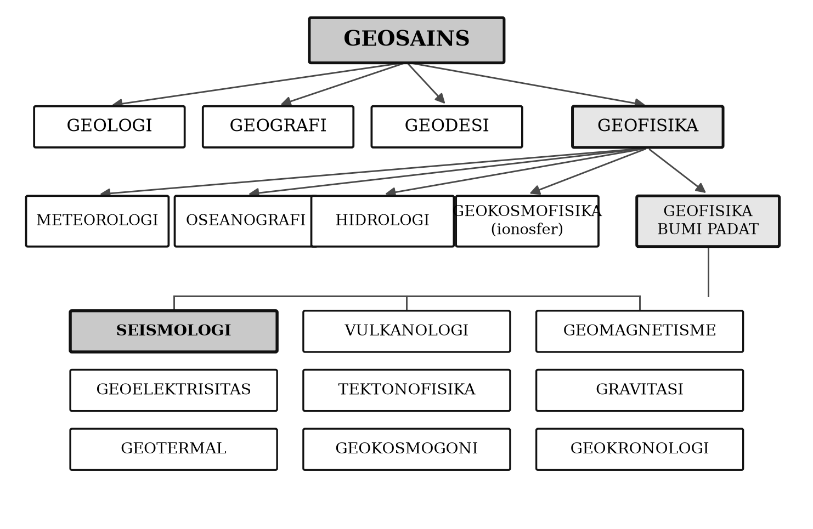
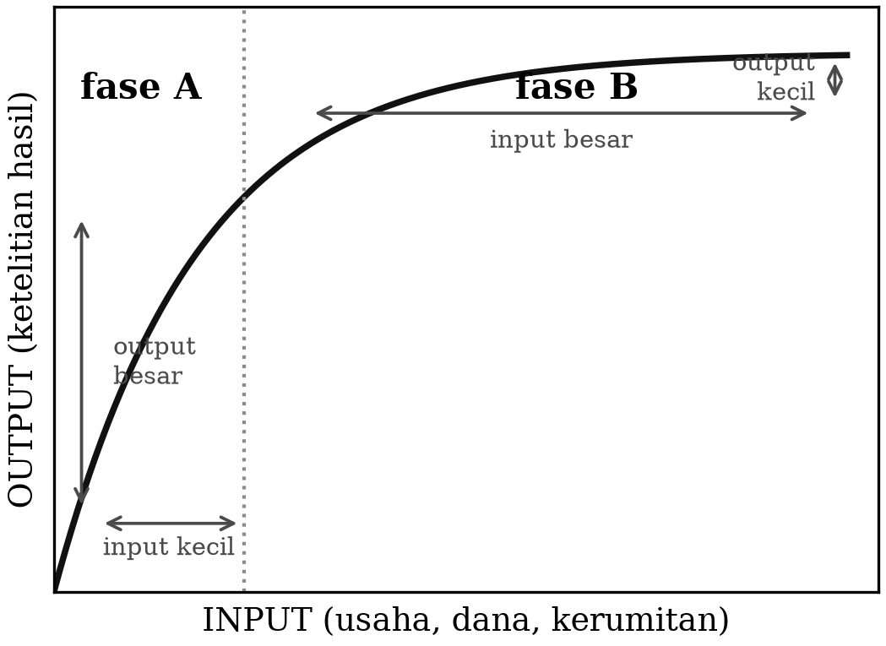

# BAB 1 — SEJARAH DAN WAWASAN SEISMOLOGI

::: {custom-style="Tujuan"}
**Tujuan Pembelajaran.** Setelah mempelajari bab ini mahasiswa mampu:
(1) menjelaskan batasan seismologi dan kedudukannya di dalam geosains;
(2) mengurutkan tonggak-tonggak perkembangan teori elastisitas dan seismologi
dari abad ke-17 hingga masa kini;
(3) menerangkan mengapa pemasangan seismograf mengubah seismologi dari ilmu
deskriptif menjadi ilmu matematis-fisis;
(4) menyebutkan lembaga, jaringan, dan basis data seismologi yang beroperasi
saat ini, baik global maupun di Indonesia; dan
(5) menempatkan sejarah pengamatan gempa di Indonesia di dalam sejarah
seismologi dunia.
:::

## 1.1 Apa itu seismologi

Kata *seismologi* berasal dari bahasa Yunani, *seismos* yang berarti gempa atau
guncangan, dan *logos* yang berarti ilmu. Kadang-kadang orang terpaku pada
terjemahan harfiah itu dan menganggap seismologi semata-mata "ilmu gempa
bumi". Kenyataannya, seperti ilmu pengetahuan pada umumnya, seismologi telah
tumbuh jauh melampaui batasan-batasan awalnya.

Studi gempa bumi memang masih merupakan bagian terpenting dalam seismologi,
tetapi beberapa cabang lain telah berkembang di dalamnya. Gelombang elastik
yang dipancarkan dari sumber gempa memungkinkan struktur penyusun bagian dalam
bumi dipelajari dan diungkapkan. Karena itu ilmu yang mempelajari sifat-sifat
fisis bagian dalam bumi kemudian menjadi cabang penting dari seismologi.
Selain itu, kualitas rekaman gempa pada stasiun seismograf di seluruh dunia
yang terus membaik telah memungkinkan struktur bagian dalam bumi dipelajari
dengan makin teliti.

Berdasarkan itu semua, seismologi dapat didefinisikan dengan dua cara.

**Definisi pertama.** Seismologi adalah:

a. ilmu gempa bumi, ditambah
b. ilmu fisika bagian dalam bumi, yaitu yang berhubungan dengan penjalaran
   gelombang seismik dan kesimpulan yang dapat ditarik darinya mengenai
   struktur bagian dalam bumi.

**Definisi kedua.** Seismologi adalah ilmu tentang gelombang elastik (seismik)
yang meliputi:

a. asal atau sumbernya (gempa bumi, letusan gunung api, ledakan, longsoran,
   sumber buatan, dan sebagainya),
b. penjalarannya di dalam bumi, dan
c. perekamannya, termasuk interpretasinya.

Di samping itu ada pula **seismologi terapan**, yang di dalamnya dapat
dibedakan beberapa cabang. Yang paling besar adalah *prospeksi seismik*, yaitu
penyelidikan dengan metode seismik untuk mencari minyak dan gas bumi, mineral,
bahan galian lain, panas bumi, sampai pengukuran kedalaman batuan dasar
(*bedrock*) untuk keperluan pembangunan. Masalah membedakan gempa bumi dari
ledakan — termasuk ledakan nuklir — dapat dikategorikan sebagai cabang lain
dari seismologi terapan; cabang inilah yang, seperti akan diuraikan pada
Subbab 1.6, memberi seismologi dorongan pendanaan terbesar sepanjang abad
ke-20. Dua cabang terapan yang jauh lebih muda dan justru sangat penting bagi
Indonesia adalah **seismologi teknik** (*engineering seismology*) yang menjadi
dasar peraturan bangunan tahan gempa, dan **seismologi gunung api** yang
menjadi tulang punggung pemantauan bahaya letusan.

### Kedudukan seismologi di dalam geosains

Seismologi adalah bagian dari ilmu yang jauh lebih luas, yakni **geofisika**.
Geofisika dapat diartikan sebagai penerapan ilmu fisika untuk mempelajari
bumi, baik bumi padat, laut, atmosfer, maupun ionosfer. Geofisika bumi padat
(*solid earth geophysics*), atau geofisika dalam pengertian terbatas, adalah
penerapan ilmu fisika terhadap bagian dalam bumi.

Sebagaimana ilmu fisika dapat dibagi menjadi beberapa disiplin yang lebih
kecil sesuai variasi gejala fisika yang dipelajari, geofisika bumi padat juga
dapat dibagi menjadi cabang-cabang berikut.

1. **Seismologi** — mempelajari gempa bumi dan fenomena fisika yang
   berhubungan dengannya.
2. **Vulkanologi** — mempelajari gunung api, mata air panas, dan gejala
   terkait (juga merupakan bagian dari geologi).
3. **Geomagnetisme** — mempelajari medan magnet bumi, termasuk
   paleomagnetisme.
4. **Geoelektrisitas** — mempelajari sifat-sifat kelistrikan bumi.
5. **Tektonofisika** — bersama geologi, menggunakan ilmu fisika untuk
   mempelajari proses tektonik.
6. **Gravitasi** — mempelajari dan mengukur kuat medan gravitasi bumi serta
   menafsirkannya (juga merupakan bagian dari geodesi).
7. **Geotermal** — mempelajari suhu bagian dalam bumi, termasuk eksplorasi
   panas bumi.
8. **Geokosmogoni** — mempelajari asal-usul bumi.
9. **Geokronologi** — mempelajari kejadian bumi, termasuk penentuan umurnya.

**Geodesi**, yang mempelajari bentuk dan ukuran bumi, adalah ilmu yang sangat
dekat hubungannya dengan geofisika. Pada saat ini sudah biasa menggabungkan
geofisika dengan geodesi serta ilmu-ilmu lain yang berkaitan dengan bumi —
seperti geologi dan geografi — ke dalam satu unit ilmu yang lebih besar, yaitu
**geosains**. Skema pembagian geosains dapat dilihat pada Gambar 1.1.

::: {custom-style="ImageCaption"}
**Gambar 1.1.** Pembagian geosains, geofisika, dan geofisika bumi padat.
Batas antarcabang bersifat administratif belaka; dalam praktik penelitian
modern hampir semua persoalan penting dikerjakan lintas cabang.
:::

Geokimia, yang juga berhubungan dengan bumi, tidak dimasukkan dalam daftar di
atas karena geokimia merupakan bagian dari hampir semua subjek geosains.

Batasan mengenai geofisika bumi padat sebenarnya tidak seratus persen
memuaskan. Yang dimaksud dengan "bumi padat" di sini adalah seluruh bagian
bumi dikurangi bagian cair (laut, hidrosfer) dan gas (atmosfer). Padahal, bumi
bersifat padat dalam pengertian fisika hanya sampai kedalaman sekitar 80–100
km. Pada kedalaman yang lebih besar material bumi berperilaku plastis dalam
skala waktu geologi — meskipun tetap padat dan tetap merambatkan gelombang S
dalam skala waktu detik — dan di dalam inti luar material bumi benar-benar
cair.

### Tiga front kerja seismologi

Seismologi, seperti geofisika pada umumnya, bekerja pada tiga front paralel:
**pengamatan atau pengukuran di lapangan** (termasuk perekaman gempa),
**penyelidikan di laboratorium**, dan **kajian teoretis**. Persoalan yang
timbul sering kali sangat sukar, karena sebagian besar objek yang dipelajari —
bagian dalam bumi — tidak dapat diukur secara langsung. Sebagai gantinya kita
mengandalkan pengamatan tidak langsung yang dilakukan di permukaan bumi atau
sangat dekat dengannya, dan jelas bahwa penafsiran pengamatan semacam itu
memiliki tingkat kesulitan yang besar. Meskipun demikian, pengamatan
seismologi — umumnya dalam bentuk rekaman seismogram — jauh lebih sedikit
mengandung ambiguitas dibandingkan pengamatan geofisika lain seperti gravitasi
dan magnetik, sehingga kesimpulannya lebih dapat dipercaya.

Penelitian laboratorium yang berkaitan dengan seismologi juga banyak
dilakukan, terutama menyangkut perilaku berbagai material pada tekanan dan
temperatur tinggi. Di sini dimungkinkan meniru proses di dalam bumi yang
terjadi di daerah gempa, demikian pula penjalaran gelombang di bagian dalam
bumi; eksperimen semacam itu biasa disebut **seismologi model**. Keuntungannya
adalah parameter-parameter dapat dikontrol jauh lebih baik daripada parameter
alami. Pada masa kini "laboratorium" seismologi juga mencakup **laboratorium
komputasi**: penghitungan seismogram sintetis untuk model bumi tiga dimensi
melalui metode beda hingga dan elemen spektral, yang perannya sekarang
setidaknya sama besar dengan eksperimen fisis.

Seismologi dikenal sebagai ilmu yang independen baru sekitar awal abad ke-20.
Akan tetapi landasan teorinya — khususnya teori elastisitas dan penjalaran
gelombang — telah berkembang jauh lebih awal, terutama oleh Cauchy dan Poisson
pada pertengahan abad ke-19. Pengamatan gempa dan efeknya telah dilakukan dan
tercatat dalam sejarah jauh sebelum itu; alat khusus untuk mendeteksi gempa,
yaitu seismoskop, sudah dipakai di Tiongkok sekitar satu abad sesudah Masehi.
Namun dasar teoretis dan pengamatan baru benar-benar terpadu satu sama lain
pada akhir abad ke-19, berkat perkembangan konstruksi seismograf yang
memungkinkan dua disiplin tersebut digabungkan.

## 1.2 Perkembangan teori elastisitas dan seismologi

Tonggak-tonggak perkembangan teori elastisitas dan seismologi dirangkum dalam
Tabel 1.1. Bagian pertama tabel ini adalah daftar yang disusun dalam naskah
asli; bagian kedua adalah kelanjutannya sampai masa kini.

Table: **Tabel 1.1.** Tonggak perkembangan teori elastisitas dan seismologi.

| Tahun | Nama | Temuan |
|:------|:-----|:-------|
| 1638 | Galileo | Deformasi batang/balok (*problem Galileo*): batang yang ditopang di kedua pinggirnya dan dibebani di tengah melengkung sesuai berat bebannya |
| 1660 | Hooke | Kesebandingan linear antara *stress* dan *strain* (hukum Hooke) |
| 1798 | Cavendish | Penentuan densitas rata-rata bumi melalui pengukuran tetapan gravitasi umum |
| 1821 | Navier | Persamaan umum elastisitas |
| 1822 | Cauchy | Dasar-dasar teori elastisitas, termasuk gelombang elastik dan penjalarannya di dalam medium |
| 1830 | Stokes | Kompresibilitas dan modulus geser |
| 1860 | Mallet | Peta seismisitas dunia yang pertama; istilah "seismologi" dipopulerkan |
| 1874 | De Rossi | Skala intensitas pertama, terdiri atas 10 tingkat |
| 1878 | Hoernes | Klasifikasi gempa: tektonik, vulkanik, dan runtuhan |
| 1880 | Gray, Milne, Ewing | Konstruksi seismograf di Jepang; berdirinya *Seismological Society of Japan* |
| 1887 | Rayleigh | Gelombang permukaan dengan gerakan partikel eliptik retrograd (gelombang Rayleigh) |
| 1888 | Schmidt | Lintasan gelombang di dalam bumi melengkung karena kecepatan bertambah dengan kedalaman |
| 1897 | Wiechert | Hipotesis inti besi (*iron core*) |
| 1899 | Knott | Refleksi dan refraksi gelombang elastik; partisi energi pada bidang batas |
| 1900 | Wiechert | Seismograf Wiechert, memakai massa besar untuk memperpanjang perioda natural |
| 1900 | Montessus de Ballore, Milne | Peta seismisitas dunia |
| 1906 | Oldham | Pembuktian keberadaan inti bumi secara seismologi |
| 1906 | Galitzin | Seismograf elektromagnetik; penerapan induksi elektromagnetik |
| 1906 | Reid | Teori bingkas elastik (*elastic rebound theory*) sesudah gempa San Francisco |
| 1909 | Mohorovičić | Diskontinuitas Mohorovičić antara kerak dan mantel |
| 1911 | Love | Gelombang permukaan dengan gerakan partikel horizontal (gelombang Love) |
| 1913 | Gutenberg | Kedalaman batas inti luar ≈ 2900 km dari daerah bayangan gelombang P |
| 1922 | Turner | Indikasi adanya gempa berfokus dalam |
| 1928 | Wadati | Keberadaan gempa dalam dibuktikan |
| 1935 | Benioff | Konstruksi seismograf regangan (*strain seismograph*) |
| 1935 | Richter | Skala magnitudo gempa |
| 1936 | Lehmann | Penemuan inti dalam (*inner core*) |
| 1954 | Benioff, Wadati | Penemuan zona seismik menunjam (*dipping seismic zone*), antara lain memakai data gempa di bawah Pulau Jawa |

::: {custom-style="Kotak"}
**Catatan Pemutakhiran 1.1 — Lanjutan tabel sejarah.** Naskah asli mengakhiri
Tabel 1.1 pada tahun 1954. Dua per tiga dari seismologi yang dipakai orang
hari ini justru lahir sesudah tahun itu. Tabel 1.2 melanjutkannya.
:::

Table: **Tabel 1.2.** Tonggak perkembangan seismologi sejak pertengahan abad ke-20.

| Tahun | Nama / lembaga | Temuan atau peristiwa |
|:------|:---------------|:----------------------|
| 1958 | Benioff, Press, Ewing | Perekaman pertama osilasi bebas bumi (gempa Kamchatka 1952 dan Chili 1960) |
| 1960 | Gempa Chili $M_w$ 9,5 | Gempa terbesar yang pernah terekam; memicu studi osilasi bebas dan tsunami trans-Pasifik |
| 1961–1970 | Proyek WWSSN | Jaringan seismograf standar sedunia; seismogram terkalibrasi seragam untuk pertama kalinya |
| 1963–1968 | Wilson, Isacks, Oliver, Sykes | Seismologi menjadi bukti kunci tektonik lempeng: sesar transform, zona Wadati–Benioff, mekanisme sumber di pematang tengah samudra |
| 1964 | Aki | Konsep momen seismik $M_0$ |
| 1966 | Aki | Model sumber $\omega^{-2}$ dan spektrum sumber |
| 1970 | Brune | Model spektrum sumber dan tegangan lepas (*stress drop*) |
| 1977 | Kanamori | Magnitudo momen $M_w$; magnitudo yang tidak jenuh |
| 1981 | Dziewoński & Anderson | Model referensi bumi PREM |
| 1981 | Dziewoński, Chou & Woodhouse | Metode inversi tensor momen sentroid (CMT); awal katalog Harvard/Global CMT |
| 1984 | Woodhouse & Dziewoński | Tomografi seismik global mantel yang pertama |
| 1991–1995 | Kennett & Engdahl | Model kecepatan iasp91 dan ak135 untuk penentuan lokasi rutin |
| 1996 | CTBT | Perjanjian Pelarangan Menyeluruh Uji Coba Nuklir; jaringan pemantauan internasional (IMS) |
| 2000-an | Campillo, Shapiro, Wapenaar | Interferometri derau ambien: struktur bumi dicitrakan tanpa gempa |
| 2004 | Gempa Aceh–Andaman $M_w$ 9,1–9,3 | Gempa pertama yang terekam lengkap oleh jaringan digital global; pendorong lahirnya InaTEWS |
| 2008 | BMKG | InaTEWS diresmikan sebagai sistem peringatan dini tsunami nasional |
| 2010-an | Kanamori, Duputel, Rivera | Metode *W-phase* untuk penentuan $M_w$ gempa besar dalam hitungan menit |
| 2010-an | — | Penginderaan akustik terdistribusi (DAS) memakai serat optik telekomunikasi sebagai larik seismometer |
| 2018–kini | Ross, Zhu & Beroza, Mousavi | Pembelajaran mesin untuk deteksi dan *picking* fase (PhaseNet, EQTransformer) |
| 2023 | EarthScope Consortium | Penggabungan IRIS dan UNAVCO menjadi satu lembaga pengelola fasilitas seismologi–geodesi AS |

## 1.3 Pengamatan gempa bumi

Catatan tentang kejadian gempa bumi sudah ada sejak sekitar 1800 SM. Sampai
tahun 1600-an, catatan itu masih bersifat kualitatif-deskriptif. Kebanyakan
laporan hanya menyebut akibat yang ditimbulkan gempa pada bangunan, topografi,
dan sebagainya. Sudah umum bahwa efek sekunder teramati dan digambarkan lebih
rinci, sementara efek primer seperti patahan permukaan justru mendapat
perhatian lebih kecil.

Baru pada tahun 1700-an kejadian gempa dilaporkan secara lebih ilmiah. Gempa
Lisabon 1 November 1755 dipelajari secara sistematis; gempa Calabria, Italia,
tahun 1783 dipelajari oleh sebuah komisi ilmu pengetahuan khusus. Gempa Cutch
(Kachchh) di India tahun 1819 tampaknya merupakan yang pertama dilaporkan
sebagai efek yang jelas dari aktivitas sesar. Studi lanjut atas pengamatan
lapangan yang berhubungan dengan rekahan permukaan dilaporkan dari gempa Owari
(Nōbi), Jepang, tahun 1891 dan dari gempa San Francisco tahun 1906. Yang
tersebut terakhir melahirkan teori bingkas elastik oleh Reid — teori mekanisme
gempa yang masih valid sampai sekarang dan akan dibahas dalam Bab 5.

::: {custom-style="Kotak"}
**Catatan Pemutakhiran 1.2 — Tahun gempa San Francisco.** Naskah asli
menyebut gempa San Francisco terjadi pada 1908. Tanggal yang benar adalah
**18 April 1906**; laporan Komisi Penyelidikan Gempa Bumi Negara Bagian
California yang memuat teori Reid terbit pada 1908–1910, dan kemungkinan
itulah sumber kekeliruan tahun tersebut.
:::

Pada tahun 1878, R. Hoernes dari Jerman mengusulkan klasifikasi gempa bumi
yang juga masih valid sampai sekarang, yaitu:

1. **Gempa runtuhan** (*collapse earthquakes*), disebabkan runtuhnya rongga di
   dalam bumi seperti gua atau lubang tambang;
2. **Gempa vulkanik** (*volcanic earthquakes*), berkaitan dengan pergerakan
   magma dan fluida di bawah gunung api;
3. **Gempa tektonik** (*tectonic earthquakes*), disebabkan proses penyesaran
   akibat pergerakan kerak bumi.

Gempa tektoniklah yang signifikan secara global; gempa jenis 1 dan 2 pada
umumnya hanya signifikan secara lokal dan bermagnitudo kecil. Pada masa kini
daftar itu perlu ditambah satu kategori yang belum ada ketika Hoernes menulis,
yaitu **gempa terinduksi dan terpicu** (*induced and triggered earthquakes*):
gempa yang dipicu aktivitas manusia seperti pengisian waduk besar, injeksi
fluida pada lapangan panas bumi dan minyak, penambangan dalam, serta
penyimpanan gas bawah tanah.

Berdasarkan pengamatan, efek gempa akan jauh lebih kuat pada tanah lunak dan
basah daripada pada tanah keras dan kering; demikian juga amplitudo
gerakannya. Hasil pengamatan lama ini telah dikonfirmasi dengan perekaman
instrumental, dan sekarang dikenal sebagai **efek situs** (*site effect*) yang
menjadi pokok bahasan Bab 9 — sebuah faktor yang, seperti akan kita lihat,
sangat menentukan pola kerusakan gempa Yogyakarta 2006.

Satu hal yang perlu diperhatikan adalah arah jatuhnya tiang atau pilar akibat
gempa. Sebelumnya dipercaya bahwa arah jatuhnya pilar berkaitan langsung
dengan arah letak pusat gempa. Kenyataannya, dalam banyak kasus arah jatuhnya
pilar justru tegak lurus terhadap arah pusat gempa. Ini menjadi jelas bila
diingat bahwa penyebab jatuhnya pilar dapat berupa gelombang longitudinal
(yang searah penjalaran) maupun gelombang transversal (yang tegak lurus arah
penjalaran).

Gempa bawah laut dapat dirasakan di atas kapal karena gelombang gempa menjalar
di dalam air dari kejutan di bawah dasar laut; ini hanya mungkin untuk
gelombang longitudinal. Beberapa laporan menyatakan sensasinya seolah-olah
kapal menabrak batu keras. Efek lain gempa bawah laut adalah **tsunami**.
Tsunami adalah gelombang pada permukaan laut dengan panjang gelombang beberapa
ratus kilometer tetapi tinggi yang kecil di laut dalam, menjalar dengan
kecepatan $c=\sqrt{gh}$, yaitu sekitar 220 m/s (≈ 790 km/jam) pada perairan
sedalam 5 km dan makin lambat pada perairan dangkal. Di laut terbuka tsunami
hampir tidak terasa, tetapi ketika menghantam pantai — khususnya pada teluk
sempit — tinggi gelombangnya melonjak dan dapat menyebabkan kerusakan besar.
Tsunami dibahas tersendiri dalam Bab 11.

Untuk menyatakan efek gempa secara semi-kuantitatif — sehingga disebut
**pengamatan makroseismik** — De Rossi dari Italia memperkenalkan skala
intensitas pada tahun 1870-an, disusul Forel dari Swiss pada 1881; keduanya
kemudian digabung menjadi skala Rossi–Forel. Dengan menggambarkan harga
intensitas di atas peta diperoleh **peta isoseismal**, yaitu peta garis-garis
yang menghubungkan titik-titik berintensitas sama. Dari peta isoseismal,
magnitudo dan kedalaman gempa dapat diperkirakan secara kasar: bila intensitas
turun dengan cepat terhadap jarak, gempanya dangkal. Skala intensitas modern
dibahas dalam Bab 4.

## 1.4 Pengetahuan awal tentang bagian dalam bumi

Untuk waktu yang cukup lama, pengetahuan tentang bagian dalam bumi merupakan
objek spekulasi dan imajinasi bebas. Pendapat pertama yang cukup ilmiah boleh
jadi yang berdasarkan pengamatan lava cair yang keluar dari gunung api, yang
sampai pada kesimpulan bahwa bagian dalam bumi panas, membara, dan meleleh.
Pendapat ini didukung oleh kenyataan bahwa temperatur di dalam bumi naik
dengan bertambahnya kedalaman. Namun Poisson tidak percaya bahwa pusat bumi
berupa gas bertemperatur ratusan ribu derajat, dan mengingatkan bahwa suhu itu
tidak bisa diperkirakan hanya dengan mengekstrapolasi gradien suhu yang diukur
dekat permukaan — sebuah peringatan metodologis yang tetap relevan sampai
sekarang. Dengan memakai hasil pengamatan efek pasang surut terhadap bumi
padat, Lord Kelvin pada 1863 mengklaim bahwa bumi secara keseluruhan lebih
kaku (*rigid*) daripada kaca; pendapat ini kemudian didukung, hanya saja
pembandingnya bukan kaca melainkan baja.

Sejak awal abad ke-19, perkiraan densitas rata-rata bumi telah mendekati
kenyataan, antara lain berkat percobaan Cavendish (1798). Karena harga
densitas rata-rata itu (sekitar 5,5 g/cm³) jauh melebihi densitas batuan
permukaan (2,7 g/cm³), kesimpulannya adalah densitas bumi harus bertambah
dengan kedalaman dan mencapai maksimum di pusatnya. Pada 1897 geofisikawan
Jerman Wiechert menyimpulkan secara teoretis bahwa bagian dalam bumi terdiri
atas mantel silikat yang melingkupi inti besi — usulan pertama yang dikenal
sebagai hipotesis inti besi. Keberadaan inti bumi kemudian dikonfirmasi secara
seismologi oleh Oldham (1906), dan kedalaman batas inti direvisi menjadi
sekitar 2900 km oleh Gutenberg pada 1913. Nilai yang dipakai sekarang adalah
**2891 km** menurut model PREM.

## 1.5 Instalasi seismograf: seismologi menjadi sains

Pada Subbab 1.3 telah disinggung bahwa pengamatan gempa dapat dilakukan secara
kualitatif dengan skala intensitas sejak 1870-an. Namun laporan deskriptif
murni masih terlalu jauh jaraknya dari dasar matematis teori elastisitas untuk
dapat menyatukan dua disiplin itu. Dengan pemasangan seismograf, jembatan
pemersatu antara keduanya terwujud dan gempa bumi dapat dipelajari secara
eksak. Inilah yang mengubah seismologi menjadi sains: bukan lagi sekadar ilmu
deskriptif alamiah, melainkan ilmu matematis-fisis.

Sekarang sama sulitnya memahami seismologi tanpa seismograf dan astronomi
tanpa teleskop. Sementara teleskop sudah ada sejak tahun 1600-an, seismogram
yang pertama kali benar-benar dapat dipakai baru tercatat pada 1880, ketika
tiga orang Inggris — Gray, Milne, dan Ewing — membuat seismograf di Jepang.
Setelah itu perkembangan seismograf tumbuh cepat: Wiechert (Jerman) menerbitkan
konstruksi seismograf mekanisnya pada awal 1900-an, dan Galitzin (Rusia)
membuat seismograf elektromagnetik pada 1906. Beberapa seismograf jenis awal
masih dioperasikan dan bekerja dengan baik, khususnya di Eropa. Justru karena
magnifikasinya yang kecil, alat-alat lama itu masih penting untuk merekam
gempa sangat besar yang kadang-kadang sudah di luar jangkauan seismograf
modern yang bermagnifikasi besar — persoalan yang dalam istilah modern disebut
**rentang dinamik**, dan yang baru benar-benar terpecahkan oleh seismometer
digital pita lebar (Bab 2).

Segera setelah seismogram pertama dipelajari, identifikasi gelombang
longitudinal dan transversal menjadi jelas, demikian pula gelombang Rayleigh.
Pada 1890-an Oldham di Inggris dan Wiechert di Jerman secara terpisah
mengemukakan bahwa ketiga jenis gelombang itu ada pada seismogram. Melalui
penemuan ini, sambungan dengan teori elastisitas terbangun dan dimulailah
periode yang sangat berarti dalam seismologi: periode ditemukannya
bidang-bidang diskontinuitas di dalam bumi. Pada 1913 Gutenberg mengonfirmasi
kedalaman batas inti berdasarkan data seismogram. Pada 1936 Inge Lehmann
menemukan inti dalam. Penemuan lain yang terkenal adalah diskontinuitas di
bawah kerak bumi, ditemukan Mohorovičić pada 1909 dengan rekaman gempa Kupa
Valley di Kroasia, yang kemudian dinamakan **diskontinuitas Mohorovičić**
atau, singkatnya, **Moho**.

Keberadaan gempa dalam ditemukan oleh seismolog Inggris Turner (1922) dan
seismolog Jepang Wadati (1928). Gempa jenis ini mempunyai kedalaman sampai
beberapa ratus kilometer; gempa terdalam yang teramati mencapai sekitar 700 km,
dan wilayah Indonesia bagian timur — khususnya di bawah Laut Banda dan Laut
Flores — termasuk daerah dengan gempa terdalam di dunia. Pada 1954 Wadati dan
Benioff, antara lain dengan data gempa di bawah Pulau Jawa, memperoleh **zona
seismik menunjam** (zona Wadati–Benioff) yang berhubungan dengan lempeng kerak
bumi yang menunjam di bawah lempeng lain pada daerah subduksi. Zona inilah
yang, sepuluh tahun kemudian, menjadi salah satu bukti kunci teori tektonik
lempeng.

::: {custom-style="Kotak"}
**Catatan Pemutakhiran 1.3 — Angka kedalaman.** Naskah asli menyebut inti
dalam "ditemukan pada tahun 1930-an dan kedalamannya sekitar 5000 km", serta
"gempa yang paling dalam mencapai 720 km dijumpai di kepulauan Indonesia".
Angka baku yang dipakai sekarang: batas inti dalam–inti luar berada pada
kedalaman **5150 km** (PREM), dan gempa terdalam yang terlokasi dengan baik
berada pada kedalaman sekitar **700 km**, dengan beberapa kejadian yang
dilaporkan mendekati 750 km. Perbedaan ini bukan sekadar soal ketelitian
angka: kedalaman maksimum gempa berhubungan langsung dengan batas kestabilan
mineral olivin di dalam lempeng yang menunjam, sebuah persoalan fisika mineral
yang belum ada ketika naskah asli ditulis.
:::

## 1.6 Seismologi sebagai usaha internasional

Untuk beberapa lama, menjadikan seismologi sebagai ilmu yang populer bukanlah
hal mudah. Namun sejak Perang Dunia II seismologi kembali menjadi sangat
berarti karena dengannya dimungkinkan mendeteksi dan mengenali ledakan,
khususnya ledakan nuklir. Karena itu, khususnya di Amerika Serikat sejak
1950-an, penelitian seismologi mendapat dukungan dana yang sangat besar dari
pemerintah. Melalui proyek VELA Uniform, Amerika Serikat mengeluarkan dana
besar tidak hanya untuk dalam negeri tetapi juga dikompetisikan secara terbuka
di luar negeri; hasil paling nyata bagi ilmu pengetahuan adalah **WWSSN**
(*World-Wide Standardized Seismograph Network*), sekitar 120 stasiun dengan
instrumen dan kalibrasi seragam yang menjadi tulang punggung penemuan tektonik
lempeng pada 1960-an. Pada 1970-an proyek ini mulai dihentikan dan dilanjutkan
di dalam negeri dengan penelitian yang lebih bersifat aplikasi.

UNESCO juga mempunyai ketertarikan besar pada masalah gempa karena bencana
yang diakibatkannya, dan mengeluarkan dana untuk mempelajari risiko gempa bagi
manusia maupun bangunan di seluruh dunia serta mencari cara menguranginya
(mitigasi). Dalam *International Geophysical Year* (IGY) 1957–1958
diprakarsai kerja sama internasional untuk memperbaiki jejaring pengamatan
gempa, khususnya di belahan bumi selatan termasuk Antartika. Selama 1960-an,
*International Upper Mantle Project* memberikan sumbangan berarti bagi
kerja sama antarcabang geofisika, dan setelah proyek itu berakhir pada 1970,
*International Geodynamics Project* menggantikannya.

Pada masa kini, kerangka kerja sama itu telah dilembagakan secara permanen.
Beberapa yang penting untuk diketahui mahasiswa:

- **FDSN** (*International Federation of Digital Seismograph Networks*) —
  federasi yang menetapkan standar data (format miniSEED, metadata
  StationXML) dan protokol layanan data (*FDSN web services*) yang dipakai
  hampir semua pusat data seismologi dunia, termasuk BMKG.
- **GSN** (*Global Seismographic Network*) dan **EarthScope Consortium** —
  jaringan global pita lebar dan lembaga pengelola fasilitas seismologi
  Amerika Serikat, hasil penggabungan IRIS dan UNAVCO pada 2023.
- **GEOFON** — jaringan global dan pusat data yang dikelola GFZ Potsdam,
  Jerman; mitra utama Indonesia dalam pembangunan InaTEWS dan dalam proyek
  MERAMEX.
- **ISC** (*International Seismological Centre*) — penyusun buletin gempa
  global yang paling lengkap dan otoritatif, kelanjutan dari *International
  Seismological Summary*.
- **Global CMT Project** — katalog tensor momen sentroid untuk hampir semua
  gempa $M_w \gtrsim 5$ sejak 1976.
- **CTBTO/IMS** — jaringan pemantauan internasional untuk verifikasi
  Perjanjian Pelarangan Menyeluruh Uji Coba Nuklir; penerus fungsi VELA dalam
  bentuk multilateral.

## 1.7 Sejarah pengamatan gempa di Indonesia

Kepulauan Indonesia adalah salah satu laboratorium seismologi alam terbaik di
dunia, dan pengamatan gempa di sini berumur lebih tua daripada yang biasanya
disadari mahasiswa.

**Catatan sejarah.** Kompilasi sistematis pertama atas gempa di Nusantara
disusun oleh ahli geologi Belanda **Arthur Wichmann** dalam *Die Erdbeben des
Indischen Archipels* (1918, dengan tambahan pada 1922), yang menghimpun
laporan gempa dan tsunami sejak abad ke-16 dari arsip kolonial, catatan
pelayaran, dan berita lokal. Katalog Wichmann sampai hari ini masih dipakai
sebagai sumber utama untuk gempa-gempa prainstrumental di Indonesia, misalnya
dalam merekonstruksi sejarah tsunami Selat Sunda dan gempa besar Sumatra.

**Pengamatan instrumental.** Cikal bakal kelembagaan pengamatan geofisika di
Indonesia adalah observatorium magnet dan meteorologi yang berdiri di Batavia
pada 1866. Pengamatan seismik instrumental dimulai pada akhir abad ke-19 dan
awal abad ke-20, dan pada masa itu stasiun-stasiun di Hindia Belanda termasuk
di antara yang paling penting di belahan bumi selatan justru karena letaknya:
data dari sinilah yang antara lain dipakai Wadati dan Benioff untuk memerikan
zona seismik menunjam di bawah Jawa. Setelah kemerdekaan, lembaga itu berganti
nama beberapa kali hingga menjadi Badan Meteorologi dan Geofisika (BMG), dan
sejak 2008 menjadi **Badan Meteorologi, Klimatologi, dan Geofisika (BMKG)**.

**Masa kini.** Perkembangan paling cepat terjadi setelah bencana gempa dan
tsunami Aceh–Andaman 26 Desember 2004. Sebelum peristiwa itu, jaringan
seismik nasional relatif jarang dan sebagian besar masih analog. Sesudahnya,
dengan dukungan kerja sama internasional — antara lain dengan Jerman melalui
GITEWS/GFZ — dibangun **InaTEWS** yang diresmikan pada 2008. Jumlah sensor
seismik yang dioperasikan BMKG tumbuh dari beberapa puluh menjadi ratusan;
pada 2024 dilaporkan sekitar **553 sensor seismik** beroperasi, ditambah
puluhan *intensitymeter* dan akselerograf untuk pemantauan gerakan tanah kuat.
Rincian jaringan ini dibahas dalam Bab 2.

Di lingkungan perguruan tinggi, penelitian seismologi Indonesia berkembang
melalui kerja sama dengan lembaga asing dalam bentuk eksperimen lapangan
berskala besar. Yang paling relevan bagi buku ini adalah **MERAMEX** (2004),
penggelaran sekitar 130 stasiun seismik sementara — 99 periode pendek dan 13
pita lebar di darat, ditambah 14 OBS di lepas pantai selatan — di Jawa Tengah
selama lebih dari 150 hari, hasil kerja sama GFZ Potsdam dengan mitra
Indonesia termasuk UGM. Eksperimen itu dirancang untuk mencitrakan hubungan
antara zona subduksi dan busur gunung api Merapi. Dua tahun kemudian, gempa
Yogyakarta 2006 terjadi persis di dalam wilayah yang telah dicitrakan itu, dan
model kecepatan hasil MERAMEX menjadi bahan yang sangat berharga untuk
menentukan lokasi gempa susulannya (Bab 6 dan Bab 14).

## 1.8 Fase perkembangan sebuah ilmu

Akhirnya, kita dapat menyimpulkan perkembangan seismologi sebagaimana ilmu
pengetahuan pada umumnya. Pada awalnya, dengan pemikiran yang relatif sederhana
dapat diperoleh hasil dengan ketepatan yang mengherankan: Gutenberg menetapkan
kedalaman batas inti dalam radius kesalahan satu persen hanya dengan mistar,
tabel logaritma, dan seismogram kertas. Tetapi pada fase berikutnya, ketika
orang ingin memperbaiki hasil itu, banyak sekali masalah dijumpai; diperlukan
input yang relatif besar untuk output yang biasa saja. Ilustrasi hubungan
antara output dan input dalam fase-fase perkembangan seismologi dapat dilihat
pada Gambar 1.2: pada fase A input kecil memberikan output besar, sedangkan
pada fase B situasinya berbalik.

::: {custom-style="ImageCaption"}
**Gambar 1.2.** Hubungan antara output dan input dalam perkembangan
seismologi pada fase A (tahap awal) dan fase B (tahap lanjut).
:::

Pesan Gambar 1.2 bukanlah bahwa fase B tidak berharga. Justru sebaliknya:
seluruh seismologi terapan yang menyelamatkan nyawa — peringatan dini tsunami
yang harus keluar dalam tiga menit, peta bahaya gempa yang menjadi dasar SNI
bangunan, mikrozonasi yang menjelaskan mengapa satu dusun runtuh sementara
dusun tetangganya utuh — semuanya adalah pekerjaan fase B. Ketelitian yang
kelihatan "biasa saja" dalam grafik itu adalah selisih antara bangunan yang
berdiri dan bangunan yang runtuh.

::: {custom-style="Ringkasan"}
**Ringkasan Bab 1**

1. Seismologi adalah ilmu tentang gelombang elastik: sumbernya, penjalarannya
   di dalam bumi, serta perekaman dan penafsirannya. Ia mencakup studi gempa
   bumi sekaligus studi struktur bagian dalam bumi.
2. Seismologi merupakan cabang geofisika bumi padat, yang bersama geodesi,
   geologi, dan geografi membentuk geosains.
3. Landasan teoretis seismologi (teori elastisitas) berkembang pada abad
   ke-19, sedangkan landasan pengamatannya (skala intensitas) berkembang
   sedikit lebih awal. Keduanya baru terpadu setelah seismograf yang andal
   dibuat pada 1880-an.
4. Sesudah 1954 — batas akhir tabel sejarah dalam naskah asli — seismologi
   masih mengalami revolusi besar: tektonik lempeng, momen seismik dan
   magnitudo momen, model referensi bumi, tomografi, jaringan digital global,
   interferometri derau ambien, dan pembelajaran mesin.
5. Indonesia memiliki sejarah pengamatan gempa yang panjang, dari katalog
   Wichmann (1918) hingga jaringan BMKG dan InaTEWS masa kini, serta menjadi
   tempat eksperimen seismologi berskala besar seperti MERAMEX (2004).
:::

::: {custom-style="Soal"}
**Soal Latihan**

**1.1** Jelaskan perbedaan antara "seismologi" dan "seismologi terapan", dan
berikan masing-masing dua contoh persoalan yang menjadi pokok kajiannya di
Indonesia.

**1.2** Mengapa pengamatan seismologi dikatakan lebih sedikit mengandung
ambiguitas dibandingkan pengamatan gravitasi dan magnetik? Kaitkan jawaban
Anda dengan sifat gelombang sebagai pembawa informasi.

**1.3** Dari Tabel 1.1 dan 1.2, susunlah garis waktu yang menunjukkan selang
waktu antara (a) penemuan teoretis dan (b) konfirmasi observasionalnya, untuk
tiga pasangan peristiwa. Apa yang dapat Anda simpulkan tentang hubungan teori
dan pengamatan dalam seismologi?

**1.4** Hitunglah kecepatan tsunami di Palung Jawa dengan kedalaman laut 6 km,
dan perkirakan waktu tempuh gelombang tsunami dari sumber di palung itu sampai
ke pantai selatan Yogyakarta yang berjarak sekitar 250 km. Bandingkan dengan
waktu yang tersedia untuk mengeluarkan peringatan dini.

**1.5** Naskah asli buku ini menyebutkan bahwa magnitudo gempa terbesar yang
tercatat adalah "sekitar 8 skala Richter". Carilah magnitudo gempa Aceh 2004
dan gempa Chili 1960 dalam skala magnitudo momen. Mengapa pernyataan dalam
naskah asli itu dapat dibenarkan pada zamannya, tetapi keliru sekarang?
(Petunjuk: bacalah lebih dulu Subbab 4.5.)

**1.6** Carilah data MERAMEX pada pusat data GEOFON. Berapa banyak stasiun yang
metadatanya masih dapat diakses hari ini? Apa arti keberadaan arsip semacam
ini bagi keberlanjutan penelitian?
:::

::: {custom-style="Bacaan"}
**Bacaan Lanjut**

- Båth, M. (1979). *Introduction to Seismology*, 2nd ed. Birkhäuser, Basel.
  *(Rujukan utama naskah asli; masih sangat baik untuk penjelasan fisis yang
  intuitif.)*
- Bolt, B. A. (2006). *Earthquakes*, 5th ed. W. H. Freeman, New York.
- Lay, T. & Wallace, T. C. (1995). *Modern Global Seismology*. Academic Press,
  San Diego.
- Shearer, P. M. (2019). *Introduction to Seismology*, 3rd ed. Cambridge
  University Press.
- Stein, S. & Wysession, M. (2003). *An Introduction to Seismology,
  Earthquakes, and Earth Structure*. Blackwell, Oxford.
- Wichmann, A. (1918). *Die Erdbeben des Indischen Archipels bis zum Jahre
  1857*. Verhandelingen der Koninklijke Akademie van Wetenschappen, Amsterdam.
- Bormann, P. (ed.) (2012). *New Manual of Seismological Observatory Practice
  (NMSOP-2)*. GFZ, Potsdam. *(Rujukan praktis paling lengkap; tersedia bebas
  secara daring.)*
:::
