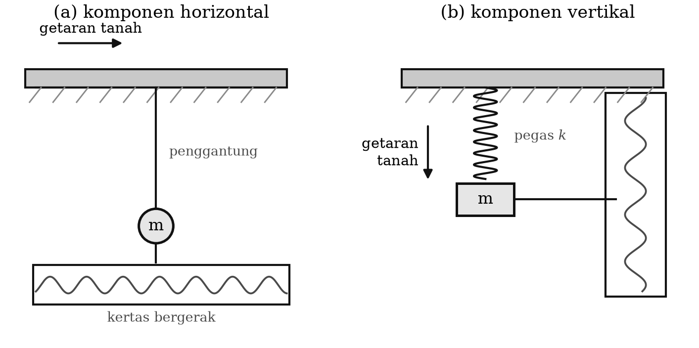
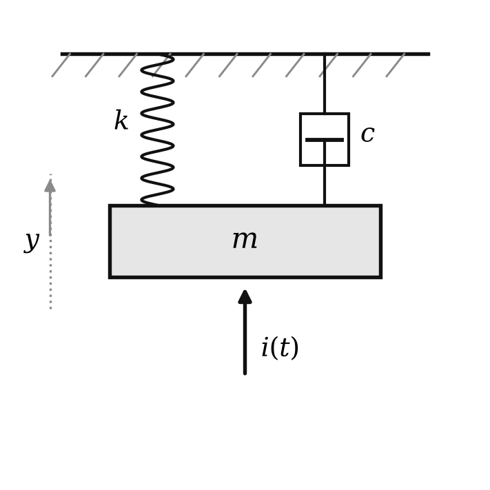
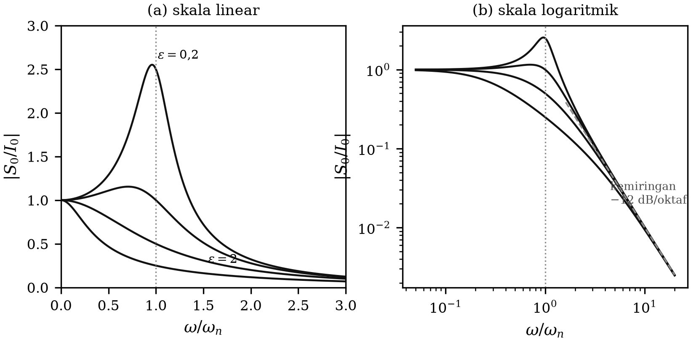
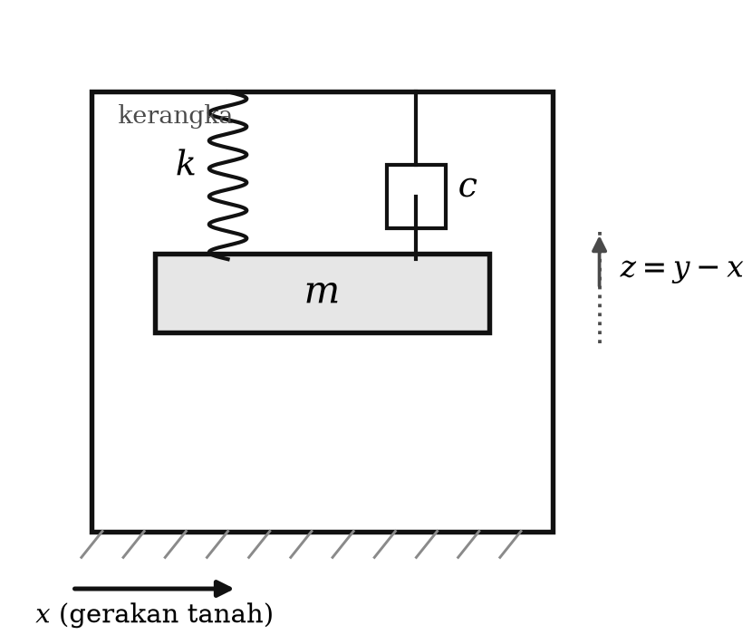
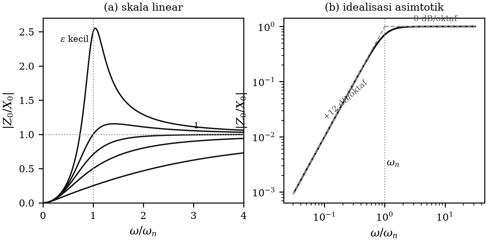
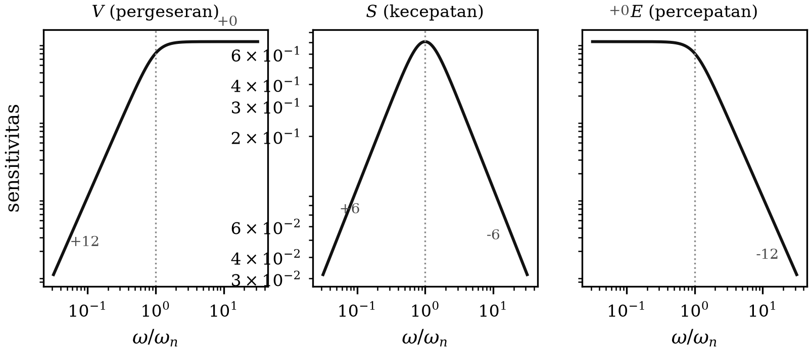
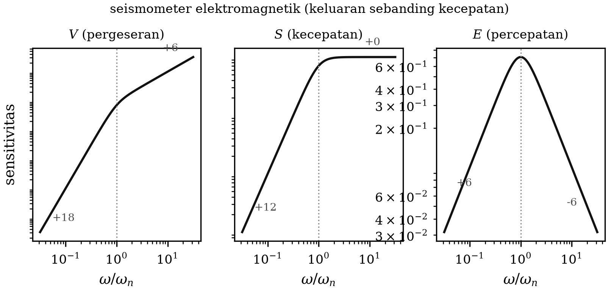
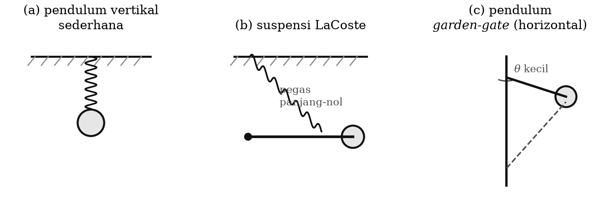
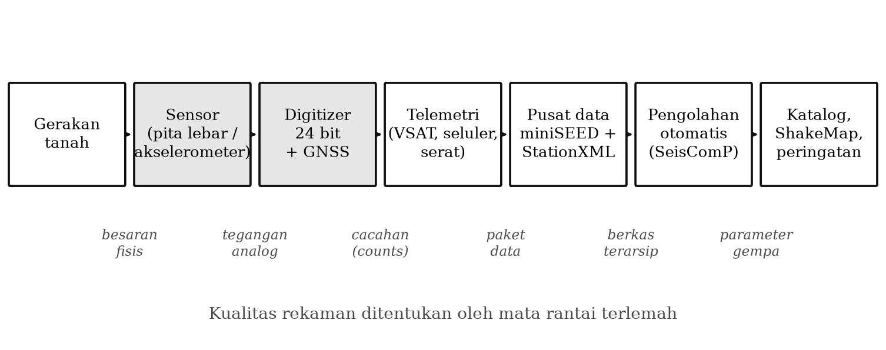
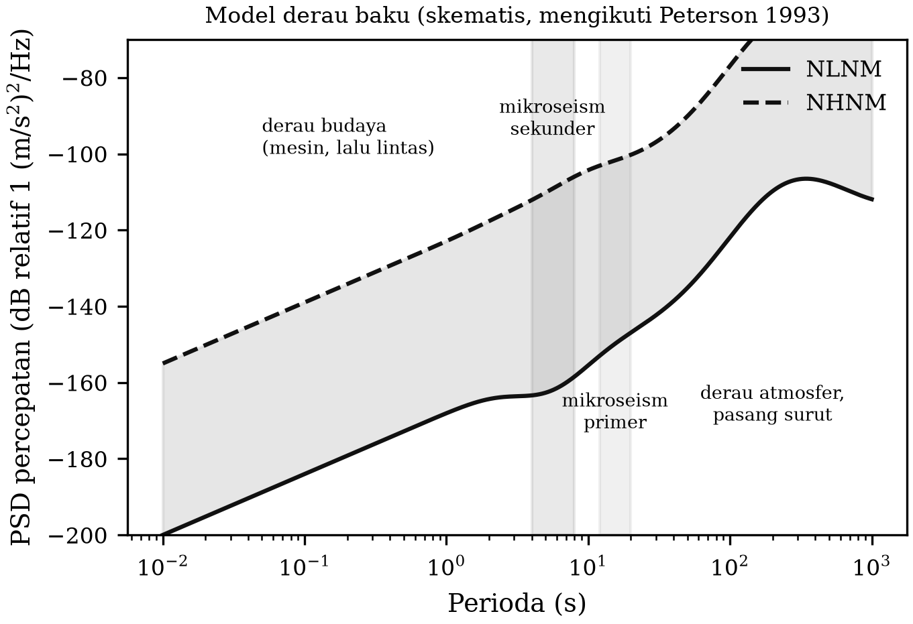

# BAB 2 — INSTRUMENTASI DAN JARINGAN SEISMIK

::: {custom-style="Tujuan"}
**Tujuan Pembelajaran.** Setelah mempelajari bab ini mahasiswa mampu:
(1) membedakan seismograf, seismogram, seismometer, dan seismoskop;
(2) menurunkan persamaan gerak seismometer sebagai sistem orde dua dan
menjelaskan tanggapan amplitudo serta tanggapan fasenya;
(3) menjelaskan mengapa "problem perioda" membatasi seismometer mekanis dan
bagaimana umpan balik gaya (*force balance*) menyelesaikannya;
(4) membaca kurva tanggapan instrumen dalam bentuk *poles and zeros* serta
menjelaskan arti koreksi instrumen;
(5) menjelaskan rantai akuisisi digital modern — sensor, digitizer, pewaktuan,
telemetri, dan format data; dan
(6) menyebutkan jaringan seismik yang beroperasi di Indonesia serta memilih
konfigurasi jaringan yang sesuai untuk suatu tujuan penelitian.
:::

## 2.1 Definisi

**Seismograf** adalah instrumen yang menghasilkan rekaman gerakan tanah secara
terus-menerus.

**Seismogram** adalah rekaman gerakan tanah yang dihasilkan oleh seismograf.

**Seismometer** adalah seismograf yang parameter-parameter fisisnya diketahui
dengan baik, sehingga gerakan tanah — simpangan terhadap titik setimbangnya —
setiap saat dapat diukur harganya dengan teliti. Dalam seismograf
elektromagnetik, yang disebut seismometer biasanya adalah transduser atau
sensornya, yaitu bagian yang mengubah sinyal getaran menjadi sinyal listrik
yang terukur; sedangkan seismograf adalah keseluruhan peralatan, termasuk
seismometer, yang merekam gerakan tanah.

**Seismoskop** adalah alat yang hanya dapat mengidentifikasi terjadinya gempa,
tanpa merekamnya sebagai fungsi waktu.

## 2.2 Prinsip dasar seismometer

Massa yang digantung dengan tali akan cenderung diam apabila penggantungnya
bergetar secara horizontal bersama tanah, karena massa mempunyai kelembaman.
Dengan demikian sebuah pena yang terpasang pada massa tersebut akan menggores
kertas yang ikut bergetar bersama tanah. Kalau secara bersamaan kertas juga
digerakkan ke samping, jejak gerakan tanah akan terekam pada kertas itu
(Gambar 2.1a).

Hal serupa terjadi kalau massa digantung dengan pegas. Bila penggantung
bergetar secara vertikal bersama tanah, massa juga cenderung diam, dan pena
yang terpasang padanya membuat jejak getaran tanah pada kertas yang bergetar
bersama tanah (Gambar 2.1b). Sistem massa yang digantung pegas, pada
prinsipnya, dapat dipakai untuk seismometer komponen vertikal.

Jadi prinsip dasar seismometer adalah **ayunan massa atau pendulum** — baik
dengan tali maupun dengan pegas. Prinsip ini tidak berubah sampai hari ini:
seismometer pita lebar termahal sekalipun tetaplah sebuah massa inersial yang
digantung, hanya saja simpangannya tidak lagi digores dengan pena melainkan
diukur secara elektronik dan dilawan dengan gaya umpan balik.

::: {custom-style="ImageCaption"}
**Gambar 2.1.** Pendulum sebagai prinsip dasar seismometer: (a) seismometer
komponen horizontal, dan (b) seismometer komponen vertikal.
:::

## 2.3 Tinjauan sistem orde dua

Sistem massa dengan pegas atau tali merupakan sistem orde dua, yang secara
matematis simpangannya terhadap titik kesetimbangan memenuhi persamaan
diferensial orde dua. Secara umum, dalam sistem ini masih ada satu faktor lagi
yang menyertainya, yaitu redaman. Sistem massa, pegas, dan peredam
diilustrasikan pada Gambar 2.2: massa $m$, pegas dengan tetapan $k$, dan
peredam dengan tetapan $c$, dengan gaya luar (masukan) $i(t)$ bekerja **pada
massa**. Inilah tinjauan yang umum dijumpai dalam buku-buku fisika.

::: {custom-style="ImageCaption"}
**Gambar 2.2.** Sistem massa, pegas, dan peredam dengan gaya luar (masukan)
yang bekerja pada massa.
:::

Simpangan massa terhadap titik setimbangnya memenuhi

$$m\ddot{y} + c\dot{y} + k y = i(t) \text{~~~~~~~~~~~~~~~~} (2.1)$$

atau

$$\ddot{y} + \frac{c}{m}\dot{y} + \frac{k}{m} y = \frac{i(t)}{m} \text{~~~~~~~~~~~~~~~~} (2.2)$$

dengan $y$ adalah simpangannya. Persamaan di atas adalah persamaan getaran
selaras teredam yang dipaksa oleh gaya luar. Secara umum persamaan itu dapat
ditulis

$$\ddot{s} + 2\varepsilon\,\omega_n\,\dot{s} + \omega_n^{2}\,s = i(t) \text{~~~~~~~~~~~~~~~~} (2.3)$$

dengan $s$ adalah simpangan yang dapat berupa perubahan posisi (pergeseran),
perubahan sudut (rotasi), atau perubahan bentuk (deformasi); $\varepsilon$
adalah **faktor redaman**; dan $\omega_n$ adalah **frekuensi natural** atau
frekuensi diri sistem tanpa redaman.

Penyelesaian Persamaan (2.3) cukup kompleks: penyelesaian umum persamaan
homogennya ditambah penyelesaian khususnya. Penyelesaian umumnya saja ada
beberapa bentuk. Untuk $\varepsilon = 0$ penyelesaiannya berbentuk sinus atau
kosinus tak teredam. Untuk $\varepsilon > 0$ ada tiga kemungkinan: sinus atau
kosinus teredam bila $\varepsilon < 1$ (*under damped*), eksponensial dengan
sedikit *overshoot* bila $\varepsilon = 1$ (*critically damped*), dan
eksponensial murni bila $\varepsilon > 1$ (*over damped*).

Namun ada cara penyelesaian yang mudah dan, walaupun tidak lengkap, dapat
menjelaskan dengan baik tanggapan sistem: **penyelesaian keadaan tetap**
(*steady state solution*). Andaikan masukan $i(t) = I_0 e^{j\omega t}$
memberikan keluaran $s(t) = S_0 e^{j\omega t}$. Dengan memasukkan keduanya ke
Persamaan (2.3) diperoleh

$$\left(-\omega^{2} + 2j\varepsilon\omega_n\omega + \omega_n^{2}\right) S_0 = I_0 \text{~~~~~~~~~~~~~~~~} (2.4)$$

sehingga perbandingan keluaran terhadap masukan adalah

$$\frac{S_0}{I_0} = \frac{1}{\omega_n^{2}-\omega^{2} + 2j\varepsilon\omega_n\omega} \text{~~~~~~~~~~~~~~~~} (2.5)$$

dengan harga mutlak

$$\left|\frac{S_0}{I_0}\right| = \frac{1}{\sqrt{(\omega_n^{2}-\omega^{2})^{2} + 4\varepsilon^{2}\omega_n^{2}\omega^{2}}} \text{~~~~~~~~~~~~~~~~} (2.6)$$

dan beda fase antara keluaran dan masukan

$$\varphi = -\arctan\frac{2\varepsilon\omega_n\omega}{\omega_n^{2}-\omega^{2}} \text{~~~~~~~~~~~~~~~~} (2.7)$$

Harga $|S_0/I_0|$ adalah perbandingan amplitudo keluaran dan masukan, sehingga
disebut **tanggapan amplitudo** (*amplitude response*) sistem orde dua. Untuk
menggambarkannya sebagai fungsi $\omega$, cukup ditinjau tiga harga khusus:
untuk $\omega = 0$ diperoleh $1/\omega_n^{2}$; untuk $\omega = \omega_n$
diperoleh $1/(2\varepsilon\omega_n^{2})$; dan untuk $\omega \to \infty$
diperoleh 0. Jika harga-harga ini disketsa akan dihasilkan Gambar 2.3a, dan
bila disketsa pada kertas berskala logaritmik — yang secara praktis lebih
bermakna — diperoleh Gambar 2.3b.

Secara intuitif gambaran ini mudah dibayangkan. Jika kita ingin menggoyang
massa yang tergantung pada seutas tali, usaha yang diperlukan akan besar
sekali bila goyangannya berfrekuensi tinggi, dan kecil sekali bila
frekuensinya mendekati nol (untuk amplitudo simpangan yang sama). Hal lain
yang dapat dibaca pada Gambar 2.3 adalah bahwa bila $\varepsilon$ sangat kecil,
tanggapan amplitudo menjadi besar sekali pada $\omega = \omega_n$. Inilah
**resonansi**: keadaan ketika masukan kecil menghasilkan keluaran yang sangat
besar.

::: {custom-style="ImageCaption"}
**Gambar 2.3.** Tanggapan amplitudo sistem orde dua: (a) dengan skala linear,
dan (b) dengan skala logaritmik, untuk beberapa harga faktor redaman
$\varepsilon$.
:::

Di samping tanggapan amplitudo, sistem juga mempunyai **tanggapan fase**
(*phase response*) $\varphi$ seperti pada Persamaan (2.7). Keduanya merupakan
fungsi frekuensi sehingga biasa disebut **tanggapan frekuensi** (*frequency
response*), dan sering pula disebut spektrum amplitudo dan spektrum fase.

## 2.4 Tanggapan frekuensi seismometer

Seismometer adalah sistem orde dua, sehingga dapat terdiri atas komponen
massa, pegas, dan peredam. Akan tetapi tanggapan frekuensinya sangat berbeda
dari sistem orde dua yang dibahas pada Subbab 2.3. Perbedaan itu diakibatkan
oleh **tempat bekerjanya masukan**: pada seismometer, masukan bekerja pada
penggantung pegas berupa getaran tanah, bukan pada massa seperti dalam
tinjauan buku fisika pada umumnya. Inilah satu-satunya perbedaan, tetapi
akibatnya menentukan seluruh watak instrumen.

Sistem seismometer diilustrasikan pada Gambar 2.4, dengan $x$ simpangan
gerakan tanah dan $y$ simpangan massa terhadap kerangka acuan tetap. Keluaran
seismometer adalah simpangan relatif

$$z = y - x \text{~~~~~~~~~~~~~~~~} (2.8)$$

dan pada sistem ini berlaku

$$m\ddot{y} + c(\dot{y}-\dot{x}) + k(y-x) = 0 \text{~~~~~~~~~~~~~~~~} (2.9)$$

yang, dengan Persamaan (2.8), menjadi

$$m\ddot{z} + c\dot{z} + kz = -m\ddot{x} \text{~~~~~~~~~~~~~~~~} (2.10)$$

atau

$$\ddot{z} + \frac{c}{m}\dot{z} + \frac{k}{m}z = -\ddot{x} \text{~~~~~~~~~~~~~~~~} (2.11)$$

yang secara lebih umum dituliskan sebagai

$$\ddot{z} + 2\varepsilon\omega_n\dot{z} + \omega_n^{2} z = -\ddot{x} \text{~~~~~~~~~~~~~~~~} (2.12)$$

::: {custom-style="ImageCaption"}
**Gambar 2.4.** Sistem seismometer dengan masukan $x$ (simpangan tanah) dan
keluaran $z = y - x$ (jejak yang tergores pada rekaman).
:::

Perhatikan bahwa suku pemaksa pada Persamaan (2.12) adalah $-\ddot{x}$, yaitu
**percepatan** tanah, bukan simpangannya. Inilah asal-usul semua sifat khas
tanggapan seismometer.

Dengan cara yang sama seperti Subbab 2.3, andaikan $x(t) = X_0 e^{j\omega t}$
menghasilkan $z(t) = Z_0 e^{j\omega t}$. Substitusi ke Persamaan (2.12)
memberikan

$$\left(-\omega^{2} + 2j\varepsilon\omega_n\omega + \omega_n^{2}\right) Z_0 = \omega^{2} X_0 \text{~~~~~~~~~~~~~~~~} (2.13)$$

sehingga

$$\frac{Z_0}{X_0} = \frac{\omega^{2}}{\omega_n^{2}-\omega^{2}+2j\varepsilon\omega_n\omega} \text{~~~~~~~~~~~~~~~~} (2.14)$$

dan tanggapan amplitudonya

$$\left|\frac{Z_0}{X_0}\right| = \frac{\omega^{2}}{\sqrt{(\omega_n^{2}-\omega^{2})^{2}+4\varepsilon^{2}\omega_n^{2}\omega^{2}}} \text{~~~~~~~~~~~~~~~~} (2.15)$$

serta tanggapan fasenya

$$\varphi = -\arctan\frac{2\varepsilon\omega_n\omega}{\omega_n^{2}-\omega^{2}} \text{~~~~~~~~~~~~~~~~} (2.16)$$

Tanggapan amplitudo Persamaan (2.15) mudah disketsa dengan meninjau tiga harga
khusus: untuk $\omega = 0$ tanggapannya 0; untuk $\omega = \omega_n$
tanggapannya $1/(2\varepsilon)$; dan untuk $\omega \to \infty$ tanggapannya 1
(Gambar 2.5). Jadi seismometer sederhana adalah **pengukur simpangan yang
baik hanya untuk frekuensi di atas frekuensi naturalnya**, dan tanggapannya
merosot sebagai $\omega^{2}$ — yaitu 12 dB per oktaf — di bawah $\omega_n$.

::: {custom-style="ImageCaption"}
**Gambar 2.5.** Tanggapan amplitudo seismometer sebagai fungsi frekuensi sudut
(kiri) dan idealisasi asimtotiknya dalam skala logaritmik (kanan). Angka pada
gambar kanan menunjukkan kemiringan garis dalam dB/oktaf.
:::

Tanggapan amplitudo adalah perbandingan amplitudo keluaran terhadap amplitudo
masukan, sehingga untuk seismometer ia disebut juga **perbesaran** atau
*magnification* $V$ — yaitu sensitivitas terhadap pergeseran. Ini berlaku untuk
seismometer mekanis (*direct recording seismometer*). Seismometer juga
mempunyai sensitivitas terhadap kecepatan $S$ dan terhadap percepatan $E$.
Karena $v = dx/dt$ dan $a = dv/dt$, maka

$$V = \left|\frac{Z_0}{X_0}\right| = \frac{\omega^{2}}{\sqrt{(\omega_n^{2}-\omega^{2})^{2}+4\varepsilon^{2}\omega_n^{2}\omega^{2}}} \text{~~~~~~~~~~~~~~~~} (2.17)$$

$$S = \frac{V}{\omega} = \frac{\omega}{\sqrt{(\omega_n^{2}-\omega^{2})^{2}+4\varepsilon^{2}\omega_n^{2}\omega^{2}}} \text{~~~~~~~~~~~~~~~~} (2.18)$$

$$E = \frac{V}{\omega^{2}} = \frac{1}{\sqrt{(\omega_n^{2}-\omega^{2})^{2}+4\varepsilon^{2}\omega_n^{2}\omega^{2}}} \text{~~~~~~~~~~~~~~~~} (2.19)$$

Sketsa masing-masing sensitivitas dapat dilihat pada Gambar 2.6.

::: {custom-style="ImageCaption"}
**Gambar 2.6.** Sensitivitas pergeseran $V$, kecepatan $S$, dan percepatan $E$
untuk seismometer mekanis. Angka dalam gambar menyatakan kemiringan asimtot
dalam dB/oktaf.
:::

Dalam seismometer elektromagnetik, untuk mengubah sinyal pergeseran menjadi
sinyal listrik dipakai kumparan yang ikut bergerak bersama massa (*moving
coil*) di dalam medan magnet permanen, sehingga tegangan yang dihasilkan
sebanding dengan **kecepatan** gerakan kumparan relatif terhadap magnet. Jadi
seismogramnya adalah seismogram kecepatan. Akibatnya, tanggapan amplitudo
terhadap pergeseran untuk seismometer elektromagnetik menjadi satu tingkat
lebih curam pada frekuensi rendah, yaitu 18 dB/oktaf (Gambar 2.7). Inilah
sebabnya geofon dan seismometer periode pendek "buta" terhadap sinyal periode
panjang.

::: {custom-style="ImageCaption"}
**Gambar 2.7.** Sensitivitas pergeseran, kecepatan, dan percepatan untuk
seismometer elektromagnetik.
:::

Untuk mengubah seismogram kecepatan $v(t)$ menjadi seismogram pergeseran
dilakukan pengintegralan,

$$x(t) = \int v(t)\,dt \text{~~~~~~~~~~~~~~~~} (2.20)$$

sedangkan seismogram percepatan diperoleh dengan penurunan,

$$a(t) = \frac{dv(t)}{dt} \text{~~~~~~~~~~~~~~~~} (2.21)$$

Seismometer yang dirancang peka terhadap percepatan disebut **akselerograf**.
Karena percepatan besar berhubungan dengan gerakan kuat, alat ini sering
disebut *strong motion seismograph*. Akselerograf tidak dimaksudkan untuk
merekam gempa jauh yang lemah, melainkan justru untuk tetap terbaca (tidak
*clipping*) ketika gempa kuat terjadi di dekatnya — dan karena itu menjadi
alat utama seismologi teknik (Bab 9).

## 2.5 Problem perioda

Pada subbab sebelumnya dijelaskan bahwa tanggapan seismometer tidak
menguntungkan untuk frekuensi rendah, yakni untuk $\omega < \omega_n$. Dengan
demikian seismometer akan lebih baik tanggapan frekuensinya apabila
$\omega_n$-nya kecil, atau periodenya panjang:

$$T_n = \frac{2\pi}{\omega_n} \text{~~~~~~~~~~~~~~~~} (2.22)$$

Sistem massa yang tergantung pada sebuah pegas mempunyai frekuensi sudut
natural

$$\omega_n = \sqrt{\frac{k}{m}} \text{~~~~~~~~~~~~~~~~} (2.23)$$

Untuk memperkecil $\omega_n$ dapat dilakukan dengan memperkecil $k$ dan/atau
memperbesar $m$. Akan tetapi usaha ini tidak mudah: dengan memperkecil $k$,
pegas menjadi panjang dan lemah, tidak kuat menahan beban massa karena
gravitasi — apalagi kalau $m$ juga harus diperbesar. Sebagai contoh, untuk
mendapatkan seismometer vertikal berperioda 10 sekon ($\omega_n = 0{,}628$
rad/s) dengan pegas sederhana, orang harus memakai pegas yang perpanjangan
statisnya mencapai puluhan meter. Contoh lain adalah seismograf Wiechert, yang
memakai massa sampai puluhan ton untuk memperoleh tanggapan yang baik pada
frekuensi rendah. Seismometer vertikal berukuran wajar umumnya berperioda 1
sampai 2 sekon; membuat yang lebih panjang secara murni mekanis sangat sulit.
Inilah **problem perioda**.

Usaha untuk memperoleh seismometer berperioda panjang antara lain:

1. **Memperbaiki konfigurasi mekanis.** Yang paling terkenal adalah
   suspensi *LaCoste* (pegas panjang-nol) dan pendulum *garden-gate* untuk
   komponen horizontal, yang membuat gaya pemulih efektif menjadi sangat kecil
   tanpa memerlukan pegas yang lemah (Gambar 2.8).
2. **Menggabungkan seismometer dengan sistem orde dua yang lain**, misalnya
   dengan galvanometer yang sekaligus berfungsi sebagai perekam. Sistem
   seismometer–galvanometer inilah yang dipakai pada seismograf
   Press–Ewing dan pada jaringan WWSSN.
3. **Menggunakan umpan balik elektronik.** Inilah jalan yang ditempuh hampir
   semua seismometer modern, dan dibahas tersendiri pada Subbab 2.6.

::: {custom-style="ImageCaption"}
**Gambar 2.8.** Perubahan konfigurasi sistem massa–pegas untuk memperpanjang
perioda natural: (a) pendulum vertikal sederhana, (b) suspensi LaCoste dengan
pegas panjang-nol, (c) pendulum *garden-gate* untuk komponen horizontal.
:::

::: {custom-style="Kotak"}
**Catatan Pemutakhiran 2.1 — Umpan balik positif vs. umpan balik gaya.**
Naskah asli menyebut usaha ketiga sebagai "menggunakan umpan balik (*feedback*)
positif (elektronis) pada frekuensi rendah", dengan peringatan bahwa umpan
balik positif dapat membuat sistem tidak stabil. Peringatan itu benar, dan
justru karena itulah teknik yang akhirnya menang bukanlah umpan balik positif,
melainkan **umpan balik negatif penyeimbang gaya** (*force-balance feedback*),
yang uraiannya diberikan pada Subbab 2.6. Perbedaannya penting dan bersifat
mendasar, bukan sekadar tanda aljabar.
:::

## 2.6 Seismometer umpan balik gaya dan seismometer pita lebar

Gagasan **penyeimbang gaya** (*force balance*) membalik cara berpikir tentang
seismometer. Alih-alih membiarkan massa bergerak dan mengukur simpangannya,
massa justru **dijaga agar tidak bergerak**: simpangan massa diukur oleh
transduser perpindahan yang sangat peka (biasanya kapasitif), sinyalnya
diperkuat, lalu dikirimkan sebagai arus ke kumparan gaya (*forcer coil*) yang
mendorong massa kembali ke titik nolnya. Yang direkam sebagai keluaran bukan
simpangan massa, melainkan **arus umpan balik yang diperlukan untuk menahan
massa tetap diam** — dan arus itu sebanding dengan percepatan tanah.

Keuntungannya sangat besar dan menjelaskan mengapa seluruh instrumentasi
seismologi modern memakainya:

- **Linearitas.** Karena massa praktis tidak bergerak, ketaklinearan pegas dan
  suspensi hampir tidak berperan.
- **Rentang dinamik lebar.** Sensor yang sama dapat merekam derau bumi
  terlemah maupun gempa kuat setempat, sehingga tidak perlu lagi tiga
  instrumen dengan magnifikasi berbeda seperti pada zaman analog.
- **Pita lebar.** Perioda efektif sistem ditentukan oleh rangkaian umpan
  balik, bukan lagi oleh $k/m$ mekanis. Dengan demikian instrumen berukuran
  wajar dapat memiliki tanggapan datar terhadap kecepatan dari 120 s (bahkan
  360 s) sampai 50 Hz. Inilah jawaban tuntas atas "problem perioda".
- **Kalibrasi stabil.** Tanggapan ditentukan komponen elektronik presisi yang
  jauh lebih stabil daripada pegas mekanis.

Berdasarkan pita frekuensinya, seismometer yang dipakai sekarang lazim
dikelompokkan seperti pada Tabel 2.1.

Table: **Tabel 2.1.** Kelompok sensor seismik yang lazim dipakai saat ini.

| Kelompok | Pita tanggapan (datar terhadap) | Contoh | Penggunaan khas |
|:---------|:--------------------------------|:-------|:----------------|
| Geofon / periode pendek | 4,5–100 Hz (kecepatan) | Geofon 4,5 Hz; SS-1 | Seismik eksplorasi, jaringan gempa mikro, larik *nodal* |
| Periode pendek | 1–100 Hz (kecepatan) | Mark L4-C, Lennartz LE-3D | Jaringan lokal gempa dan gunung api |
| Pita lebar | 0,0083–50 Hz (120 s–50 Hz) | Trillium 120, Güralp 3T, STS-2 | Jaringan regional dan global, tensor momen |
| Pita sangat lebar | 0,0028–10 Hz (360 s) | STS-1, Trillium 360 | Osilasi bebas bumi, tomografi global |
| Akselerometer (FBA) | DC–100 Hz (percepatan) | Episensor ES-T, Titan | Gerakan tanah kuat, bangunan, peringatan dini |

::: {custom-style="Kotak"}
**Kotak 2.1 — Mengapa akselerometer masih diperlukan.** Seismometer pita
lebar memiliki rentang dinamik besar, tetapi tetap akan *clipping* bila massa
inersialnya menabrak batas mekanis akibat guncangan sangat kuat di dekat
sumber. Akselerometer FBA dirancang dengan sensitivitas jauh lebih rendah dan
batas skala penuh $\pm 2g$ hingga $\pm 4g$, sehingga tetap linear justru pada
saat rekaman paling dibutuhkan. Karena itu stasiun modern lazim memasang
keduanya berdampingan (*co-located*), dan seismogram gempa kuat dianalisis
dengan menggabungkan keduanya.
:::

## 2.7 Tanggapan instrumen dan koreksi instrumen

Seismogram digital yang kita unduh dari pusat data bukanlah gerakan tanah,
melainkan **cacahan** (*counts*) keluaran pengubah analog-ke-digital. Untuk
memperoleh gerakan tanah yang sebenarnya, rekaman harus dibersihkan dari
pengaruh instrumen — inilah **koreksi instrumen** (*instrument response
removal*), langkah pertama yang wajib pada hampir semua pengolahan data
seismik kuantitatif, termasuk penentuan magnitudo dan tensor momen.

Secara matematis, hubungan antara gerakan tanah $u(t)$ dan rekaman $y(t)$
adalah konvolusi dengan tanggapan impuls instrumen $h(t)$,

$$y(t) = h(t) * u(t) \quad\Longleftrightarrow\quad Y(\omega) = H(\omega)\,U(\omega) \text{~~~~~~~~~~~~~~~~} (2.24)$$

sehingga gerakan tanah dipulihkan dengan **dekonvolusi** dalam kawasan
frekuensi,

$$U(\omega) = \frac{Y(\omega)}{H(\omega)} \text{~~~~~~~~~~~~~~~~} (2.25)$$

Fungsi alih $H(\omega)$ lazim dinyatakan dalam bentuk **kutub dan nol**
(*poles and zeros*):

$$H(s) = A_0 \frac{\prod_{i=1}^{M}(s - z_i)}{\prod_{k=1}^{N}(s - p_k)}, \qquad s = j\omega \text{~~~~~~~~~~~~~~~~} (2.26)$$

dengan $z_i$ nol, $p_k$ kutub, dan $A_0$ faktor normalisasi. Untuk seismometer
sederhana Persamaan (2.14), fungsi alihnya terhadap **pergeseran** tanah
memiliki dua nol di titik asal dan sepasang kutub konjugat

$$p_{1,2} = -\varepsilon\omega_n \pm j\,\omega_n\sqrt{1-\varepsilon^{2}} \text{~~~~~~~~~~~~~~~~} (2.27)$$

Dua nol di titik asal itulah wujud matematis dari kemiringan 12 dB/oktaf yang
kita lihat pada Gambar 2.5. Untuk seismometer elektromagnetik, yang keluarannya
sebanding dengan kecepatan, terdapat tiga nol — dan itulah 18 dB/oktaf pada
Gambar 2.7. Dengan kata lain, seluruh isi Subbab 2.4 dapat diringkas menjadi
satu daftar kutub dan nol.

Dalam praktik, kutub dan nol setiap kanal seismik disimpan dalam metadata
stasiun berformat **StationXML** (dahulu *dataless* SEED) dan tersedia dari
pusat data bersama dengan datanya. Dekonvolusi dikerjakan dengan perangkat
lunak baku (ObsPy, SAC, SeisComP) dan selalu memerlukan **penapisan
prawatas** (*pre-filter*), karena pada frekuensi tempat instrumen hampir tidak
peka, pembagian oleh $H(\omega)$ akan memperkuat derau secara tak terkendali.

## 2.8 Rantai akuisisi digital

Seismograf modern adalah rantai beberapa komponen; kualitas rekaman ditentukan
oleh mata rantai yang paling lemah (Gambar 2.9).

::: {custom-style="ImageCaption"}
**Gambar 2.9.** Rantai akuisisi data seismik digital modern, dari gerakan
tanah sampai basis data dan pengguna.
:::

**Sensor.** Seismometer pita lebar dan/atau akselerometer, ditanam pada
pilar beton yang terikat batuan dasar, di dalam vault, terowongan, atau lubang
bor. Pemilihan lokasi (*site selection*) sangat menentukan: derau
dari angin, pohon, lalu lintas, mesin, dan gelombang laut sering kali jauh
lebih membatasi daripada spesifikasi instrumen.

**Digitizer.** Pengubah analog-ke-digital 24 bit dengan rentang dinamik
sekitar 135–140 dB, lazim menerapkan penapis desimasi FIR. Laju cuplik
(*sampling rate*) yang lazim: 100 atau 200 sps untuk pemantauan gempa lokal,
20–40 sps untuk regional, dan 1 sps untuk kanal periode sangat panjang. Sesuai
kriteria Nyquist, frekuensi tertinggi yang dapat direkonstruksi adalah setengah
laju cuplik,

$$f_{\text{Nyquist}} = \frac{f_s}{2} \text{~~~~~~~~~~~~~~~~} (2.28)$$

dan penapis anti-alias mutlak diperlukan sebelum pencuplikan.

**Pewaktuan.** Inilah komponen yang sering diremehkan mahasiswa, padahal
menentukan segalanya. Kesalahan waktu 0,1 detik pada satu stasiun akan
menggeser lokasi hiposenter sekitar 0,6 km untuk gelombang P. Pewaktuan
modern memakai GNSS/GPS dengan ketelitian lebih baik dari satu milidetik.
Setiap kali hasil penentuan lokasi tampak aneh, pemeriksaan pertama yang harus
dilakukan adalah *time quality flag* pada rekaman.

**Telemetri dan penyimpanan.** Data dikirim ke pusat lewat VSAT, seluler,
radio, atau serat optik, dan disimpan dalam format **miniSEED**. Pengiriman
waktu nyata memakai protokol *SeedLink*; pengambilan data arsip memakai
**FDSN web services** yang seragam di seluruh dunia.

**Pengolahan otomatis.** Perangkat lunak seperti **SeisComP** melakukan
deteksi, *picking*, asosiasi fase, penentuan lokasi, dan penentuan magnitudo
secara otomatis dalam hitungan detik — inilah tulang punggung operasional
BMKG dan InaTEWS.

## 2.9 Derau seismik dan mutu stasiun

Setiap seismogram selalu memuat **derau latar** (*background noise*). Naskah
asli membahasnya sebagai "gelombang mikroseismik" dalam Bab 3; di sini kita
tinjau dari sisi instrumentasi, yaitu sebagai tolok ukur mutu stasiun.

Mutu sebuah stasiun dinilai dengan membandingkan rapat spektral daya (*power
spectral density*, PSD) percepatan tanah terhadap **model derau baku**
NLNM dan NHNM (*New Low/High Noise Model*, Peterson 1993) — kurva batas bawah
dan batas atas derau yang teramati di stasiun-stasiun dunia. Dalam praktik
operasional, mutu stasiun dipantau dengan **PPSD** (*probabilistic power
spectral density*): histogram PSD selama berminggu-minggu, yang segera
memperlihatkan masalah seperti kebocoran vault, sensor yang tidak rata,
gangguan listrik 50 Hz, atau derau lalu lintas siang hari.

::: {custom-style="ImageCaption"}
**Gambar 2.10.** Model derau baku NLNM dan NHNM (Peterson, 1993) beserta pita
frekuensi sumber derau yang lazim: mikroseism primer dan sekunder, derau
budaya, dan derau atmosfer.
:::

Puncak derau yang paling menonjol pada hampir semua stasiun adalah
**mikroseism sekunder** pada perioda 4–8 detik, yang dibangkitkan oleh
interferensi gelombang laut yang berlawanan arah dan berfrekuensi dua kali
frekuensi gelombang laut penyebabnya; dan **mikroseism primer** pada perioda
12–20 detik, yang berfrekuensi sama dengan gelombang laut penyebabnya. Untuk
stasiun-stasiun di Jawa bagian selatan — termasuk stasiun-stasiun MERAMEX —
sumber mikroseism yang dominan adalah Samudra Hindia, sehingga tingkat derau
mengikuti musim: naik pada musim badai di lintang selatan.

## 2.10 Kalibrasi seismometer

Seismometer adalah alat ukur, dan alat ukur perlu ditera. Beberapa metode
kalibrasi:

1. **Meja getar** (*shake table*). Seismometer diletakkan di atas meja yang
   dapat digetarkan dengan frekuensi terpilih dan amplitudo terukur. Dari
   himpunan data amplitudo masukan, amplitudo keluaran, dan frekuensi, dapat
   diplot tanggapan amplitudo seismometer. Ini metode paling langsung, tetapi
   memerlukan meja getar yang mahal dan hanya praktis di laboratorium.
2. **Kalibrasi pulsa.** Masukan berupa impuls mekanis pada meja getar atau
   impuls listrik pada kumparan kalibrasi; dapat pula berupa fungsi undak
   (*step function*). Keluarannya adalah tanggapan impuls atau tanggapan
   undak, dan tanggapan frekuensi diperoleh sebagai transformasi Fourier
   tanggapan impuls tersebut.
3. **Teknik kumparan kalibrasi.** Dapat dilakukan bila seismometer dilengkapi
   kumparan kalibrasi. Sinyal masukan berupa sinyal listrik sinusoidal dengan
   amplitudo dan frekuensi yang dapat divariasi. Inilah metode yang, dalam
   bentuk modernnya, dijalankan otomatis oleh digitizer masa kini.
4. **Teknik fungsi pindah.** Fungsi pindah setiap elemen dalam seismograf
   (seismometer, penguat, penapis, perekam) ditentukan sendiri-sendiri, dan
   tanggapan keseluruhan adalah hasil kali fungsi-fungsi pindah itu. Inilah
   yang secara langsung diwujudkan oleh rantai *stages* dalam metadata
   StationXML.
5. **Kalibrasi jembatan.** Willmore memakai jembatan Wheatstone untuk
   mengeliminasi pengaruh arus luar yang melewati kumparan bergerak, sehingga
   teknik kumparan kalibrasi dapat diterapkan.
6. **Perbandingan dengan sensor rujukan** (*co-located comparison*). Metode
   yang paling banyak dipakai di lapangan sekarang: sensor yang akan ditera
   dipasang berdampingan dengan sensor rujukan terkalibrasi, lalu rasio
   spektrum keduanya dihitung dari derau ambien selama beberapa jam. Metode ini
   tidak memerlukan sumber getaran khusus sama sekali.

## 2.11 Jenis seismograf yang pernah dibuat

Daftar berikut berguna untuk membaca literatur lama dan untuk memahami
seismogram arsip, yang sampai sekarang masih dipakai untuk mempelajari gempa
besar sebelum era digital.

1. **Seismograf mekanis Wiechert** — sistem massa–pegas bermassa sangat besar.
2. **Seismograf mekanis-optis Milne–Shaw** — sistem optis untuk pembacaan
   simpangan.
3. **Seismograf puntiran Wood–Anderson** — memakai puntiran kawat sebagai
   pengganti pegas, hanya untuk gerak horizontal. Instrumen inilah yang
   mendefinisikan magnitudo lokal Richter (Subbab 4.5).
4. **Seismograf kumparan bergerak Galitzin (1906)** — seismograf
   elektromagnetik; dikembangkan lebih lanjut oleh Gutenberg, Benioff,
   Willmore, Hiller, Grenet dan Coulomb, Kirnos dan Kharin.
5. **Seismograf Press–Ewing (Columbia)** — seismograf periode panjang yang
   memakai gabungan seismometer–galvanometer.
6. **Seismograf reluktansi Benioff** — prinsipnya sama dengan kumparan
   bergerak, tetapi yang bergerak adalah sumber medan magnetnya.
7. **Seismograf elektrostatik Benioff dan Gane** — keping kapasitor ditempel
   pada massa, sehingga kapasitansinya berubah sesuai gerakan tanah. Prinsip
   inilah yang hidup kembali sebagai transduser perpindahan pada seismometer
   umpan balik gaya modern.
8. **Seismograf regangan Benioff** — mengukur perubahan jarak antara dua patok
   yang terpisah di atas tanah dengan *strain gauge*. Penerusnya yang modern
   adalah *strainmeter* liang bor dan, dalam arti tertentu, DAS.

## 2.12 Jejaring seismograf

**Jejaring seismograf** (*seismographic network*) adalah gabungan banyak
seismograf yang dipasang untuk tujuan tertentu. Jejaring dapat bersifat lokal
maupun global. Untuk menyelidiki aktivitas tektonik lokal — misalnya aktivitas
suatu sesar — diperlukan jejaring lokal; untuk mempelajari tektonik global
diperlukan jejaring global, dengan jejaring lokal dapat masuk di dalamnya.

**Jejaring global generasi lama** yang perlu dikenal karena arsipnya masih
dipakai: WWSSN (*World-Wide Standardized Seismographic Network*), dengan
stasiun seperti DAV (Davao), MUN (Mundaring), dan BAG (Baguio); SRO
(*Seismographic Research Observatory*) dengan CHTO (Chiang Mai), CTAO
(Charters Towers), MAJO (Matsushiro); serta GDSN (*Global Digital Seismographic
Network*) yang mencakup stasiun SRO ditambah stasiun digital lain seperti LEM
(Lembang) dan TAU (Tasmania).

**Jejaring global masa kini:** GSN yang dikelola EarthScope Consortium
(Amerika Serikat), GEOFON yang dikelola GFZ Potsdam (Jerman), GEOSCOPE
(Prancis), dan puluhan jaringan nasional yang datanya dipertukarkan lewat
FDSN. Semua data ini dapat diakses dari mana saja, termasuk dari ruang kuliah
di Yogyakarta, memakai *web service* baku — sebuah perubahan besar dibanding
zaman ketika seismogram harus dipesan lewat surat.

### 2.12.1 Jaringan seismik di Indonesia

**Jaringan operasional BMKG.** BMKG mengoperasikan jaringan seismik nasional
yang menjadi tulang punggung informasi gempa dan peringatan dini tsunami
(InaTEWS). Jumlah sensornya bertumbuh pesat setelah 2004: dari beberapa ratus
pada awal 2010-an menjadi sekitar **553 sensor seismik** pada 2024, ditambah
puluhan *intensitymeter* dan akselerograf untuk pemantauan gerakan tanah kuat.
Sebagian besar sensor adalah pita lebar dengan digitizer 24 bit, terhubung ke
pusat lewat VSAT dan seluler, dan diolah otomatis oleh SeisComP.

**Jaringan gunung api.** PVMBG (Badan Geologi) mengoperasikan jaringan
seismik di sekitar gunung api aktif, termasuk Merapi, dengan sensor periode
pendek dan pita lebar berjarak beberapa kilometer dari puncak. Jaringan jenis
ini dibahas dalam Bab 12.

**Jaringan penelitian sementara.** Untuk menjawab pertanyaan ilmiah tertentu,
jaringan sementara digelar selama beberapa bulan sampai beberapa tahun dengan
kerapatan jauh melebihi jaringan permanen. Dua contoh yang menjadi rujukan
tetap buku ini diuraikan dalam Kotak 2.2.

::: {custom-style="Kotak"}
**Kotak 2.2 — Dua penggelaran jaringan sementara di Jawa Tengah**

**MERAMEX (2004).** *MERapi AMphibious EXperiment* adalah kerja sama GFZ
Potsdam dengan mitra Indonesia (antara lain LIPI, BMG, dan UGM) yang menggelar
sekitar **130 stasiun seismik** di Jawa Tengah selama lebih dari 150 hari,
Mei–Oktober 2004. Jaringan ini terdiri atas 112 stasiun darat — 99 sensor
periode pendek dan 13 sensor pita lebar — yang merekam secara menerus,
ditambah 14 stasiun **OBS** (*ocean bottom seismometer*) yang meliputi
busur muka (*forearc*) di lepas pantai selatan. Kata "amfibi" pada namanya
merujuk tepat pada gabungan darat–laut ini, yang memungkinkan lempeng menunjam
dicitrakan dari palung sampai busur gunung api. Hasilnya berupa model
tomografi kecepatan gelombang P dan S untuk Jawa Tengah yang dipakai luas
sampai sekarang (Bab 6).

**Jaringan gempa susulan Yogyakarta (2006).** Setelah gempa 27 Mei 2006, GFZ
bersama mitra Indonesia menggelar jaringan sementara berisi **16 stasiun** di
sekitar Sesar Opak untuk merekam gempa susulan. Dari jaringan inilah diperoleh
lebih dari dua ribu kejadian gempa susulan yang kemudian direlokasi dan
menjadi bukti utama dalam perdebatan mengenai bidang sesar mana yang
sebenarnya pecah (Anggraini, 2013; lihat Bab 14).

Pelajaran instrumentasinya jelas: **untuk gempa kerak dangkal, kerapatan
jaringan jauh lebih menentukan daripada kecanggihan tiap-tiap sensor.**
Jaringan permanen berjarak antarstasiun ratusan kilometer tidak akan pernah
mampu memisahkan dua bidang sesar yang berjarak 10 km.
:::

### 2.12.2 Teknologi jaringan generasi baru

**Larik nodal** (*nodal array*). Perekam otonom berukuran sebesar botol air
minum yang berisi geofon, digitizer, GPS, dan baterai untuk 30 hari, dapat
digelar ratusan sampai ribuan unit oleh tim kecil. Sangat sesuai untuk
pencitraan struktur dangkal dan pemetaan cekungan — misalnya untuk mikrozonasi
Cekungan Yogyakarta.

**DAS** (*Distributed Acoustic Sensing*). Serat optik telekomunikasi biasa
diubah menjadi larik regangan dengan ribuan kanal berjarak beberapa meter
sepanjang puluhan kilometer, dengan cara menembakkan pulsa laser dan mengukur
hamburan balik Rayleigh. Bagi Indonesia, yang jaringan serat optiknya
membentang sepanjang pantai dan bahkan menyeberangi selat, teknologi ini
membuka kemungkinan pemantauan di tempat yang selama ini kosong dari stasiun —
termasuk dasar laut.

**Seismometer MEMS dan jaringan warga.** Akselerometer MEMS berbiaya rendah
memungkinkan jaringan padat berbasis partisipasi masyarakat dan pemasangan di
gedung. Kepekaannya jauh di bawah instrumen penelitian, tetapi untuk gerakan
tanah kuat di daerah padat penduduk, jumlah dapat mengalahkan mutu.

::: {custom-style="Ringkasan"}
**Ringkasan Bab 2**

1. Seismometer adalah sistem orde dua dengan masukan pada kerangkanya, bukan
   pada massanya; suku pemaksanya adalah percepatan tanah $-\ddot{x}$.
2. Tanggapan amplitudo seismometer sederhana adalah nol pada frekuensi rendah,
   $1/(2\varepsilon)$ pada resonansi, dan satu pada frekuensi tinggi;
   kemiringan asimtotnya 12 dB/oktaf (18 dB/oktaf untuk sensor
   elektromagnetik).
3. "Problem perioda" — sulitnya membuat $\omega_n$ kecil secara mekanis —
   diselesaikan secara tuntas oleh umpan balik penyeimbang gaya, yang
   melahirkan seismometer pita lebar.
4. Rekaman digital adalah cacahan, bukan gerakan tanah. Koreksi instrumen
   dilakukan dengan dekonvolusi memakai kutub dan nol dari metadata
   StationXML.
5. Rantai akuisisi modern terdiri atas sensor, digitizer 24 bit, pewaktuan
   GNSS, telemetri, format miniSEED, dan pengolahan otomatis SeisComP.
6. Mutu stasiun diukur terhadap model derau NLNM/NHNM; puncak mikroseism
   sekunder pada 4–8 s adalah ciri universal.
7. Indonesia memiliki jaringan permanen BMKG (± 553 sensor pada 2024) dan
   jaringan gunung api PVMBG; untuk penelitian struktur dan gempa susulan,
   jaringan sementara yang rapat seperti MERAMEX (2004) dan jaringan gempa
   susulan Yogyakarta (2006) tetap tidak tergantikan.
:::

::: {custom-style="Soal"}
**Soal Latihan**

**2.1** Sebuah seismometer vertikal memakai pegas dengan tetapan
$k = 100$ N/m dan massa $m = 1$ kg. (a) Hitung $\omega_n$ dan $T_n$.
(b) Berapa massa yang diperlukan agar $T_n = 20$ s dengan pegas yang sama?
(c) Diskusikan mengapa jawaban (b) menunjukkan bahwa pendekatan mekanis murni
tidak praktis.

**2.2** Turunkan Persamaan (2.15) dari Persamaan (2.12) secara lengkap, dan
tunjukkan bahwa untuk $\omega \gg \omega_n$ seismometer merekam pergeseran
tanah secara langsung dengan perbesaran mendekati satu.

**2.3** Sebuah seismometer memiliki $T_n = 1$ s dan $\varepsilon = 0{,}7$.
Hitung tanggapan amplitudonya pada perioda 0,1 s; 1 s; 10 s; dan 100 s.
Nyatakan hasilnya dalam dB relatif terhadap tanggapan pada frekuensi tinggi,
lalu jelaskan mengapa instrumen ini tidak cocok untuk merekam gelombang
permukaan gempa jauh.

**2.4** Jelaskan mengapa dekonvolusi tanggapan instrumen selalu memerlukan
penapis prawatas. Apa yang terjadi bila penapis itu tidak dipakai pada data
yang mengandung derau periode panjang?

**2.5** Sebuah stasiun merekam dengan laju cuplik 100 sps. (a) Berapa
frekuensi Nyquist-nya? (b) Bila sinyal 70 Hz masuk tanpa penapis anti-alias,
pada frekuensi berapa ia akan muncul palsu dalam rekaman? (c) Apa akibat
praktisnya bagi analisis gempa gunung api?

**2.6** Sebuah stasiun memiliki kesalahan pewaktuan sistematis $+0{,}5$ detik.
Perkirakan besarnya pergeseran hiposenter yang ditimbulkannya bila kecepatan
gelombang P adalah 6 km/s. Bandingkan dengan jarak antara Sesar Opak dan sesar
yang diduga pecah pada gempa Yogyakarta 2006 (sekitar 10–20 km), lalu
simpulkan.

**2.7** Rancanglah jaringan sementara untuk memantau gempa susulan sebuah gempa
kerak dangkal $M_w$ 6,3 pada kedalaman 10 km. Tentukan jumlah stasiun, jarak
antarstasiun, jenis sensor, laju cuplik, dan lama penggelaran. Berikan alasan
untuk setiap pilihan.
:::

::: {custom-style="Bacaan"}
**Bacaan Lanjut**

- Bormann, P. (ed.) (2012). *New Manual of Seismological Observatory Practice
  (NMSOP-2)*, Bab 5 (Seismic Sensors and their Calibration) dan Bab 7
  (Seismic Networks). GFZ, Potsdam.
- Havskov, J. & Alguacil, G. (2016). *Instrumentation in Earthquake
  Seismology*, 2nd ed. Springer.
- Wielandt, E. (2012). Seismic sensors and their calibration. Dalam NMSOP-2.
- Peterson, J. (1993). *Observations and modeling of seismic background noise*.
  USGS Open-File Report 93-322.
- Krischer, L. dkk. (2015). ObsPy: a bridge for seismology into the scientific
  Python ecosystem. *Computational Science & Discovery*, 8, 014003.
- Dokumentasi teknis BMKG mengenai jaringan seismik nasional dan InaTEWS,
  tersedia daring melalui laman resmi BMKG dan repositori data gempa BMKG.
:::
