# BAB 3 — GELOMBANG SEISMIK

::: {custom-style="Tujuan"}
**Tujuan Pembelajaran.** Setelah mempelajari bab ini mahasiswa mampu:
(1) membedakan gelombang badan dan gelombang permukaan serta menjelaskan
gerakan partikel masing-masing;
(2) menghitung kecepatan gelombang P dan S dari konstanta elastik dan
densitas;
(3) menerapkan hukum Snell pada medium berlapis dan pada bumi yang membola;
(4) mengenali dan menamai fase-fase gelombang gempa jauh dan gempa dekat
sesuai tata nama IASPEI;
(5) menjelaskan dispersi gelombang permukaan serta membedakan kecepatan fase
dan kecepatan grup;
(6) menggunakan diagram waktu tempuh dan model referensi bumi (iasp91, ak135,
PREM) untuk memperkirakan waktu tiba fase; dan
(7) menjelaskan atenuasi, hamburan, dan anisotropi sebagai informasi tambahan
yang terkandung dalam seismogram.
:::

## 3.1 Jenis gelombang seismik

**Gelombang seismik** adalah gelombang elastik yang menjalar di dalam bumi.
Gelombang elastik yang menjalar dalam medium seperti gelombang suara, atas
dasar sifat-sifatnya, dapat pula dikategorikan sebagai gelombang seismik.

Gelombang seismik diklasifikasikan menjadi dua kelompok besar: **gelombang
badan** dan **gelombang permukaan**. Gelombang badan merambat di dalam badan
medium, yang berarti dapat pula merambat di permukaan medium. Gelombang
permukaan adalah gelombang yang terpandu oleh suatu bidang batas medium;
karena itu amplitudonya mengecil dengan cepat terhadap kedalaman, atau terhadap
jarak dari permukaan pemandunya.

Gelombang badan dibedakan menjadi dua jenis:

1. **Gelombang P** — gelombang primer atau longitudinal — yang dapat menjalar
   dalam segala medium (padat, cair, maupun gas). Gerakan partikel medium yang
   dilewatinya searah dengan arah penjalaran gelombang.
2. **Gelombang S** — gelombang sekunder atau transversal — yang hanya menjalar
   dalam medium padat. Gerakan partikel yang ditimbulkannya tegak lurus arah
   penjalaran gelombang.

Gelombang S selanjutnya dapat diuraikan menjadi dua komponen:

- **Gelombang SV**, yaitu gelombang S yang gerakan partikelnya terpolarisasi
  pada bidang vertikal (bidang yang memuat arah penjalaran dan arah vertikal);
- **Gelombang SH**, yaitu gelombang S yang gerakan partikelnya horizontal.

Pada umumnya gelombang S memiliki kedua komponen ini. Pemisahan SH dan SV
bukan sekadar kenyamanan matematis: pada bidang batas, SH tidak terkopel
dengan P dan SV, sehingga persoalan SH selalu lebih sederhana — dan itulah
sebabnya gelombang Love (yang murni SH) dibahas terpisah dari gelombang
Rayleigh.

Ada tiga macam gelombang permukaan yang perlu dikenal:

1. **Gelombang Rayleigh (R)**, yaitu gelombang yang terpandu pada permukaan
   bebas (*free boundary*) medium, baik berlapis maupun homogen. Gerakan
   partikelnya eliptik retrograd pada bidang vertikal.
2. **Gelombang Love (L atau LQ)**, yaitu gelombang yang gerakan partikelnya
   horizontal dan tegak lurus arah penjalaran — pada hakikatnya gelombang SH
   yang terperangkap dalam lapisan. Gelombang Love **hanya ada bila medium
   berlapis**; keberadaannya pada seismogram adalah bukti langsung bahwa kerak
   bumi tidak homogen.
3. **Gelombang Stoneley**, yaitu gelombang yang terpandu pada bidang batas
   antara dua medium padat, atau antara padat dan cair (dalam bentuk terakhir
   ini penting dalam pengukuran liang bor).

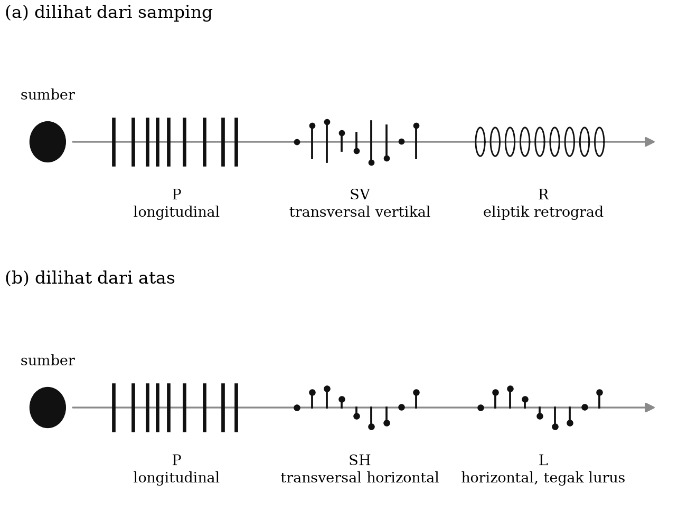

::: {custom-style="ImageCaption"}
**Gambar 3.1.** Gerakan partikel medium yang dilewati gelombang P, S, L, dan
R, serta posisinya terhadap sumber: (a) dilihat dari samping, (b) dilihat dari
atas. Digambar ulang mengikuti Båth (1979).
:::

## 3.2 Kecepatan gelombang seismik

Dari teori elastisitas, persamaan gerak medium elastik homogen isotropik
menghasilkan dua persamaan gelombang yang terpisah, satu untuk bagian
irotasional (dilatasi) dan satu untuk bagian ekuivoluminal (rotasi), dengan
kecepatan

$$v_p = \sqrt{\frac{\lambda + 2\mu}{\rho}} = \sqrt{\frac{B + \tfrac{4}{3}\mu}{\rho}} \text{~~~~~~~~~~~~~~~~} (3.1)$$

$$v_s = \sqrt{\frac{\mu}{\rho}} \text{~~~~~~~~~~~~~~~~} (3.2)$$

dengan $\lambda$ dan $\mu$ tetapan Lamé, $\mu$ juga disebut **modulus geser**
atau rigiditas, $B$ **modulus bulk**, dan $\rho$ densitas medium.

Dua persamaan ini memuat hampir seluruh isi seismologi struktur. Perhatikan
tiga akibat langsungnya:

- Karena $\lambda + 2\mu > \mu$ untuk semua bahan nyata, selalu berlaku
  $v_p > v_s$: gelombang P selalu tiba lebih dahulu. Dari sinilah nama
  "primer" dan "sekunder".
- Dalam zat cair $\mu = 0$, sehingga $v_s = 0$: **gelombang S tidak menjalar
  dalam zat cair.** Kenyataan inilah yang memberi tahu kita bahwa inti luar
  bumi bersifat cair.
- Kecepatan tidak bergantung frekuensi. Gelombang badan dalam medium homogen
  **tidak mengalami dispersi**.

Dalam teori elastisitas, konstanta elastik yang sering disebut adalah modulus
geser $\mu$, modulus bulk $B$, modulus Young $E$, dan **rasio Poisson**
$\sigma$. Sebenarnya hanya ada dua modulus yang saling bebas; setiap konstanta
elastik dapat diturunkan dari dua konstanta lain. Rasio Poisson berhubungan
langsung dengan rasio kecepatan:

$$\sigma = \frac{(v_p/v_s)^{2} - 2}{2\left[(v_p/v_s)^{2} - 1\right]} \text{~~~~~~~~~~~~~~~~} (3.3)$$

Untuk batuan kerak dan mantel pada umumnya $\sigma \approx 0{,}25$ (disebut
*padatan Poisson*), yang memberikan

$$\frac{v_p}{v_s} = \sqrt{3} \approx 1{,}73 \text{~~~~~~~~~~~~~~~~} (3.4)$$

Nilai $v_p/v_s$ adalah salah satu parameter diagnostik terpenting dalam
seismologi terapan. Penyimpangannya dari 1,73 menunjukkan kehadiran fluida,
lelehan, atau rekahan. Dalam tomografi MERAMEX di Jawa Tengah, misalnya, zona
$v_p/v_s$ tinggi di bawah Merapi ditafsirkan sebagai daerah yang jenuh fluida
dan lelehan (Bab 6); sebaliknya, anomali $v_p/v_s$ di sekitar zona sumber
gempa Yogyakarta 2006 dipakai untuk membatasi geometri sesar yang pecah
(Bab 14).

Kecepatan gelombang permukaan pada umumnya mengalami **dispersi**, yaitu
kecepatannya merupakan fungsi frekuensi atau panjang gelombang. Untuk
gelombang Rayleigh yang menjalar pada permukaan medium homogen (tidak
berlapis), dispersi tidak terjadi dan kecepatannya

$$v_R \approx 0{,}92\, v_s \text{~~~~~~~~~~~~~~~~} (3.5)$$

bila rasio Poisson mediumnya $\sigma = 0{,}25$.

Tabel 3.1 memberikan gambaran besaran yang perlu dihafal secara kasar oleh
setiap mahasiswa seismologi.

Table: **Tabel 3.1.** Kecepatan gelombang seismik yang khas (nilai bulat, model ak135/PREM).

| Medium / lapisan | $v_p$ (km/s) | $v_s$ (km/s) | Kedalaman |
|:-----------------|:-------------|:-------------|:----------|
| Sedimen lunak / endapan alluvial | 0,3–2,0 | 0,1–0,8 | 0–0,1 km |
| Kerak atas (granitik) | 5,8–6,2 | 3,4–3,6 | 0–20 km |
| Kerak bawah (basaltik) | 6,5–7,2 | 3,7–4,0 | 20–35 km |
| Mantel atas tepat di bawah Moho | 8,0–8,1 | 4,5 | 35–100 km |
| Mantel bawah, tepat di atas CMB | 13,7 | 7,3 | 2891 km |
| Inti luar (cair) | 8,0–10,3 | 0 | 2891–5150 km |
| Inti dalam | 11,0–11,3 | 3,5 | 5150–6371 km |

## 3.3 Hukum Snell

Penjalaran gelombang seismik dalam medium berlapis mengikuti hukum Snell:
gelombang yang melewati bidang batas antara dua medium dipantulkan atau
dibiaskan mengikuti relasi

$$\frac{\sin i}{v} = p = \text{konstan} \text{~~~~~~~~~~~~~~~~} (3.6)$$

dengan $i$ dapat berupa sudut datang, sudut pantul, atau sudut bias; $v$
kecepatan gelombang dalam medium bersangkutan; dan $p$ tetapan yang disebut
**parameter gelombang** atau *ray parameter*. Parameter gelombang bernilai
tetap untuk semua gelombang yang berasal dari satu berkas yang sama.

Sebagai contoh, gelombang P yang datang pada bidang batas antara dua medium
(Gambar 3.2) dapat dipantulkan dan dibiaskan sebagai gelombang P maupun SV,
dan semuanya harus memenuhi

$$\frac{\sin i_1}{v_{p1}} = \frac{\sin r_1}{v_{p1}} = \frac{\sin r_2}{v_{s1}} = \frac{\sin i_1'}{v_{p2}} = \frac{\sin i_2'}{v_{s2}} \text{~~~~~~~~~~~~~~~~} (3.7)$$

dengan $i_1$ sudut datang gelombang P, $r_1$ sudut pantul P, $r_2$ sudut
pantul SV, $i_1'$ sudut bias P, dan $i_2'$ sudut bias SV. Peristiwa satu jenis
gelombang berubah menjadi jenis lain pada bidang batas disebut **konversi
mode** (*mode conversion*), dan justru konversi inilah yang dimanfaatkan
metode *receiver function* untuk memetakan kedalaman Moho (Bab 6).

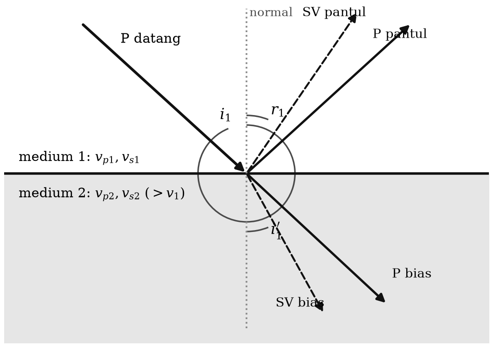

::: {custom-style="ImageCaption"}
**Gambar 3.2.** Pantulan dan pembiasan gelombang yang datang pada bidang batas
antara dua medium sesuai hukum Snell, beserta konversi mode P–SV.
:::

Apabila kecepatan dalam medium 2 lebih besar daripada dalam medium 1, ada
sudut datang tertentu yang membuat gelombang dibiaskan dengan sudut bias 90°.
Sudut datang ini disebut **sudut kritis** $i_c$:

$$\sin i_c = \frac{v_1}{v_2} \text{~~~~~~~~~~~~~~~~} (3.8)$$

Sudut datang yang lebih besar dari itu mengakibatkan pantulan sempurna
(*total internal reflection*).

Pada medium banyak lapis, berlakunya hukum Snell terlihat lebih jelas lagi.
Gambar 3.3 melukiskan dua berkas gelombang dengan parameter gelombang berbeda
($p_1$ dan $p_2$) yang menjalar pada medium tiga lapis. Untuk masing-masing
berkas berlaku

$$\frac{\sin i_1}{v_1} = \frac{\sin i_2}{v_2} = \frac{\sin i_3}{v_3} = p \text{~~~~~~~~~~~~~~~~} (3.9)$$

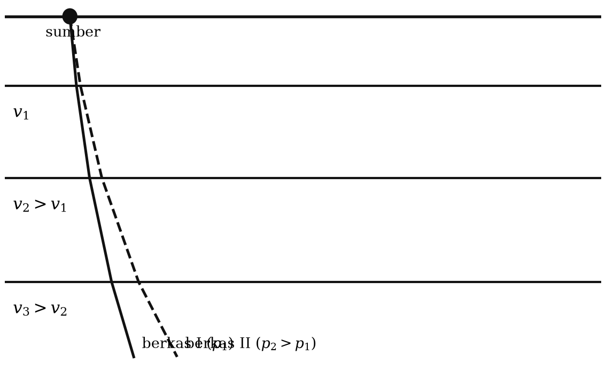

::: {custom-style="ImageCaption"}
**Gambar 3.3.** Penjalaran dua berkas gelombang dengan parameter gelombang
yang berbeda pada medium tiga lapis. Berkas dengan $p$ lebih besar berjalan
lebih landai dan menembus lebih dangkal.
:::

Kecuali di dekat permukaan bumi, kecepatan gelombang di dalam mantel bertambah
secara berangsur dengan kedalaman. Karena itu lintasan gelombang gempa di
dalam mantel melengkung ke atas, seperti terlihat pada Gambar 3.4. Bagaimanapun
bentuk lintasannya, hukum Snell tetap berlaku, hanya bentuk rumusnya sedikit
berbeda karena geometri bola:

$$\frac{R\,\sin i}{v} = p = \text{konstan} \text{~~~~~~~~~~~~~~~~} (3.10)$$

atau, sesuai Gambar 3.4,

$$\frac{R_0 \sin i_0}{v_0} = \frac{R_1 \sin i_1}{v_1} = \frac{R_2 \sin i_2}{v_2} = \dots \text{~~~~~~~~~~~~~~~~} (3.11)$$

dengan $i_i$ sudut yang dibentuk berkas gelombang dengan garis radial di suatu
titik, $v_i$ kecepatan di titik itu, dan $R_i$ jarak titik tersebut dari pusat
bumi; $R_0$ adalah jejari bumi. Besaran $p$ dalam bentuk bola ini memiliki
satuan s/rad atau s/derajat, dan — inilah kaitannya dengan pengamatan — sama
dengan kemiringan kurva waktu tempuh:

$$p = \frac{dT}{d\Delta} \text{~~~~~~~~~~~~~~~~} (3.12)$$

Persamaan (3.12) adalah salah satu hubungan terpenting dalam seismologi:
ia menghubungkan besaran yang **dapat diukur langsung dari data** (kemiringan
kurva waktu tempuh) dengan besaran yang **menentukan lintasan di dalam bumi**.
Dari sinilah inversi Herglotz–Wiechert menurunkan profil kecepatan bumi
terhadap kedalaman, dan dari sini pula sudut tinggal landas gelombang dihitung
untuk penyelesaian mekanisme sumber (Bab 5).

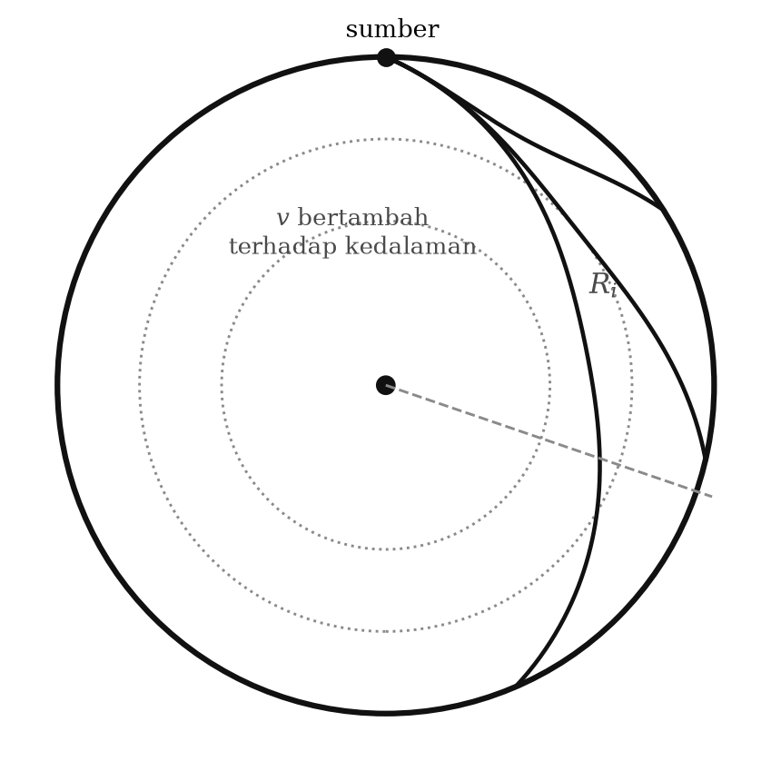

::: {custom-style="ImageCaption"}
**Gambar 3.4.** Penjalaran gelombang di dalam mantel bumi. Kenaikan kecepatan
terhadap kedalaman membuat lintasan melengkung ke atas; hukum Snell dalam
bentuk bola tetap berlaku.
:::

## 3.4 Gelombang kepala

Gelombang seismik yang datang dari medium berkecepatan rendah ke medium
berkecepatan lebih tinggi akan dibiaskan sejajar bidang batas apabila sudut
datangnya sama dengan sudut kritis. Gelombang yang menjalar di sepanjang
bidang batas ini akan terus-menerus membiaskan energi kembali ke medium atas
dengan sudut sama dengan sudut kritis (Gambar 3.5). Gelombang bias inilah yang
disebut **gelombang kepala** (*head wave*). Gejala ini sangat jelas terlihat
dalam eksperimen laboratorium maupun di lapangan pada eksplorasi seismik bias;
dalam ilmu optika, gejala serupa tidak lazim diperkenalkan.

Terjadinya gelombang kepala dapat dijelaskan dengan asas Huygens: setiap titik
yang dilewati gelombang menjadi titik sumber gelombang baru, dan superposisi
muka gelombang dari banyak sumber baru itu menghasilkan muka gelombang yang
sesungguhnya. Berdasarkan Gambar 3.5, muka gelombang untuk gelombang kepala
berbentuk datar bila bidang batas antarmediumnya datar.

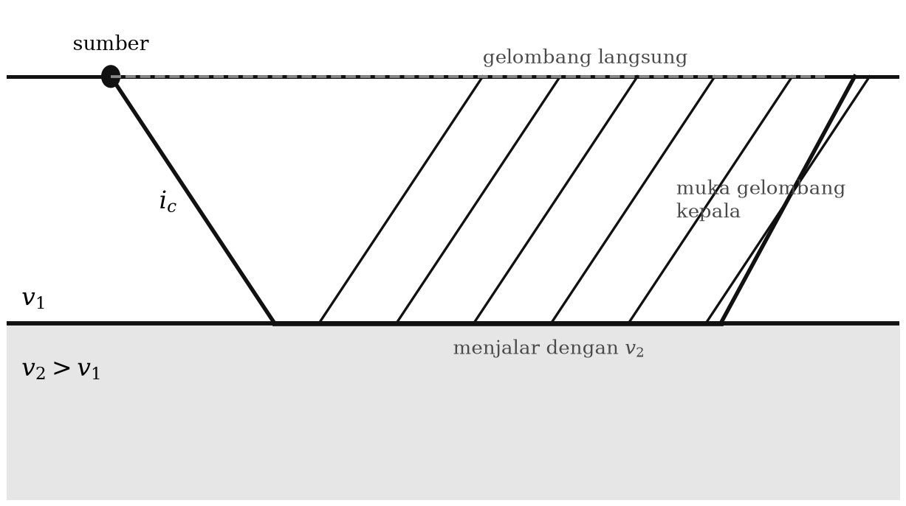

::: {custom-style="ImageCaption"}
**Gambar 3.5.** Penjalaran gelombang kepala dan proses kejadiannya menurut
asas Huygens.
:::

Dalam seismologi gempa bumi, gelombang kepala terjadi pada gempa dangkal dan
terekam oleh stasiun-stasiun yang dekat dengan episenter; gelombang ini
terbiaskan oleh diskontinuitas Conrad dan diskontinuitas Mohorovičić. Dalam
eksplorasi seismik bias dangkal, gelombang ini terbiaskan oleh bidang batas
perlapisan batuan dekat permukaan.

## 3.5 Gelombang badan dari gempa jauh

Dalam analisis gelombang badan dari gempa jauh (*teleseismic*), beberapa hal
perlu diperhatikan:

1. Struktur dekat permukaan (Conrad dan Moho) tidak perlu diperhitungkan
   secara rinci, karena gelombang kepala tidak lagi teramati pada jarak jauh.
2. Struktur bumi global (mantel, inti luar, inti dalam) sangat mempengaruhi
   penjalaran gelombang badan.
3. Secara seismologi, mantel dan inti dalam bersifat padat, sedangkan inti
   luar bersifat cair.
4. Gelombang P menjalar dalam medium padat maupun cair; gelombang S hanya
   dalam medium padat.
5. Kecepatan gelombang badan bertambah secara berangsur dengan kedalaman,
   sehingga lintasannya melengkung ke atas.
6. Pada permukaan bumi dan pada bidang batas mantel–inti luar serta inti
   luar–inti dalam, gelombang dapat dipantulkan maupun dibiaskan.

Akibatnya, gelombang badan yang sampai ke suatu stasiun terdiri atas banyak
**fase** dengan lintasan yang berbeda-beda (Gambar 3.6). Tata nama fase
mengikuti standar IASPEI dan bersifat sistematis, sehingga dapat dibaca seperti
mengeja:

- **P** dan **S** — fase yang menjalar di dalam mantel dari sumber langsung ke
  stasiun sebagai gelombang P atau S.
- **PP, SS** — dipantulkan sekali oleh permukaan bumi di tengah lintasan;
  demikian pula **PPP** dan **SSS** untuk dua kali pantulan.
- **PS, SP** — dipantulkan oleh permukaan bumi disertai konversi mode.
- **pP, sP, sS** — huruf kecil menandakan **fase kedalaman** (*depth phase*):
  gelombang meninggalkan sumber ke arah atas, dipantulkan permukaan bumi tepat
  di atas sumber, lalu menjalar ke stasiun. Selisih waktu tiba pP–P adalah
  penentu kedalaman gempa yang paling andal (Subbab 4.4).
- **PcP, ScS, PcS, ScP** — dipantulkan oleh permukaan inti luar (huruf c dari
  *core*).
- **PKP, SKS, PKS, SKP** — menembus inti luar; huruf **K** (dari Jerman
  *Kern*) menandakan penjalaran sebagai gelombang P di dalam inti luar yang
  cair.
- **PKIKP, PKJKP** — menembus inti dalam; **I** untuk gelombang P dan **J**
  untuk gelombang S di dalam inti dalam. Keberadaan fase J — yang sangat sukar
  diamati — adalah bukti langsung bahwa inti dalam bersifat padat.
- **PKiKP** — dipantulkan oleh permukaan inti dalam; **PKKP** — dipantulkan
  dari dalam oleh batas inti–mantel, dan seterusnya.

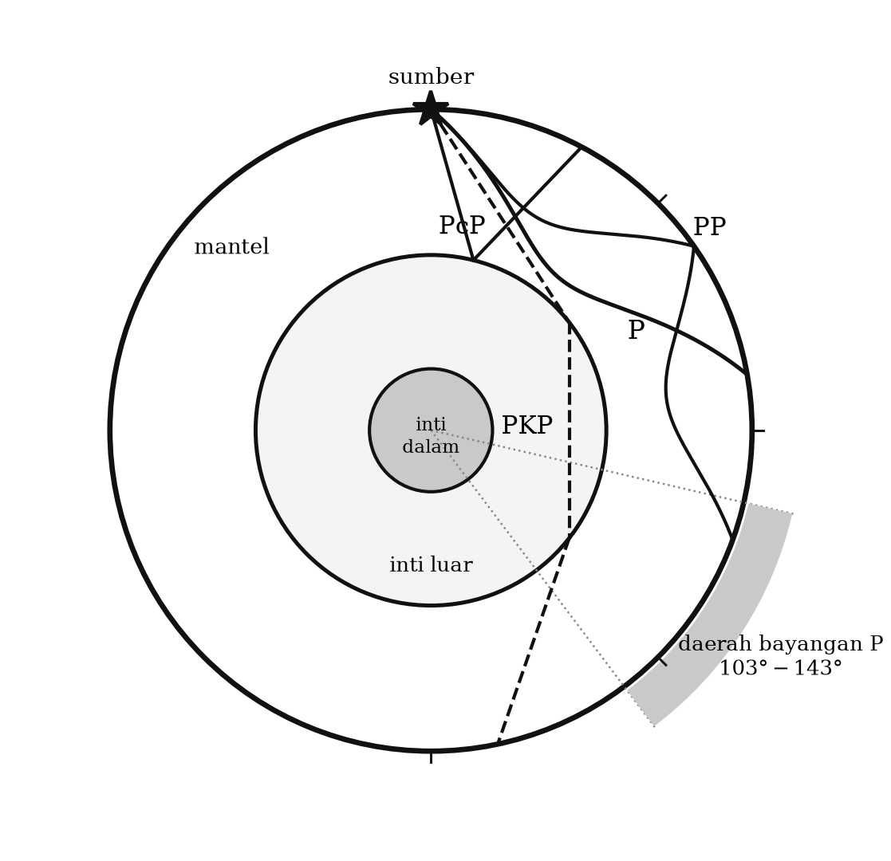

::: {custom-style="ImageCaption"}
**Gambar 3.6.** Beberapa fase gelombang badan dan lintasannya di dalam bumi.
Batas mantel–inti luar berada pada kedalaman 2891 km dan batas inti luar–inti
dalam pada 5150 km (PREM).
:::

Uraian singkat di atas menunjukkan betapa banyaknya fase yang mungkin terekam
di suatu stasiun. Beberapa gejala fisika penting yang dapat dibaca dari pola
fase ini:

**Daerah bayangan.** Karena adanya inti bumi, gelombang P yang kuat tidak
teramati pada jarak episenter $\Delta$ antara sekitar **103° dan 143°**. Sampai
103° fase P terlihat jelas, dan sesudah 143° fase PKP muncul kembali dengan
jelas. Daerah di antaranya disebut **daerah bayangan** (*shadow zone*). Dari
hilangnya gelombang P di daerah bayangan inilah Gutenberg menghitung kedalaman
batas inti, memperoleh sekitar 2900 km — angka yang, seratus tahun kemudian,
hanya bergeser menjadi 2891 km.

**Difraksi.** Kadang-kadang teramati kelanjutan fase P pada $\Delta > 103°$,
yang sebenarnya adalah gelombang P yang terdifraksi di sepanjang permukaan
inti luar; fase ini dinamai **Pdif** (dahulu Pdiff). Karena difraksi lebih
kuat untuk periode panjang, fase ini teramati lebih jauh pada seismogram
periode panjang.

**Kaustik dan cabang PKP.** Fase PKP terpecah menjadi beberapa cabang (dalam
tata nama modern: PKPab, PKPbc, PKPdf) yang terdeteksi pada rentang jarak
berbeda dan bertemu di sekitar $\Delta \approx 144°$, menghasilkan pemusatan
energi yang disebut **kaustik**. Justru dari pengamatan sinyal lemah di dalam
daerah bayangan inilah Inge Lehmann pada 1936 menyimpulkan bahwa harus ada
inti lain di dalam inti bumi — inti dalam.

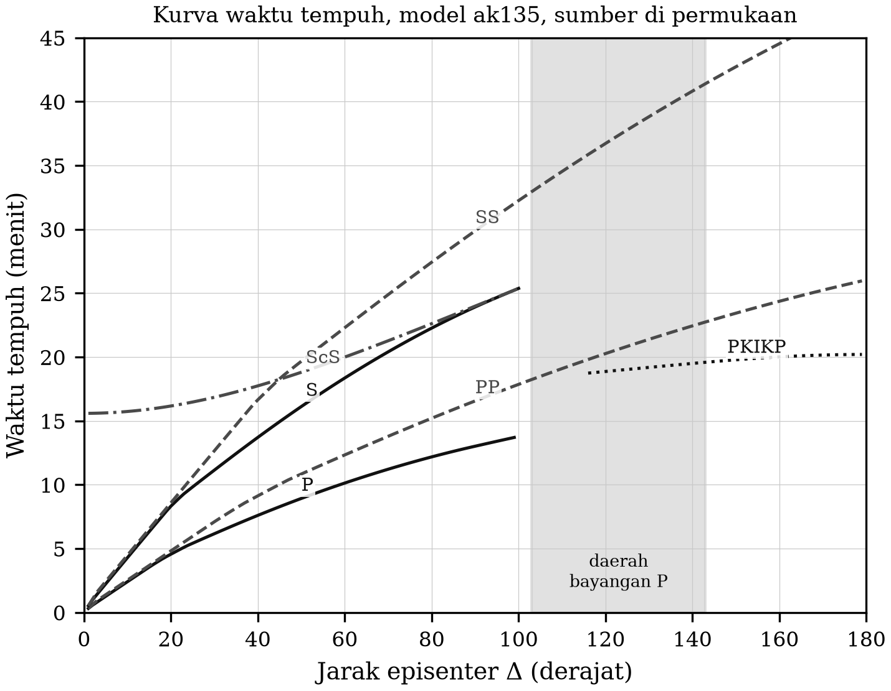

::: {custom-style="ImageCaption"}
**Gambar 3.7.** Kurva waktu tempuh fase-fase utama gelombang gempa terhadap
jarak episenter, dihitung untuk sumber di permukaan dengan model kecepatan
ak135 (Kennett, Engdahl & Buland, 1995). Bandingkan dengan diagram hodograf
klasik Jeffreys–Bullen yang dipakai dalam naskah asli.
:::

::: {custom-style="Kotak"}
**Catatan Pemutakhiran 3.1 — Model bumi rujukan.** Naskah asli merujuk pada
tabel waktu tempuh Gutenberg & Richter (1936), Jeffreys & Bullen (1967), dan
Herrin (1968). Tabel-tabel itu bersejarah, tetapi sejak 1990-an penentuan
lokasi rutin di seluruh dunia memakai model **iasp91** (Kennett & Engdahl,
1991) dan **ak135** (Kennett, Engdahl & Buland, 1995), sedangkan untuk
persoalan yang memerlukan densitas dan atenuasi — misalnya perhitungan momen
seismik dan osilasi bebas — dipakai **PREM** (Dziewoński & Anderson, 1981).
Perbedaan waktu tempuh antara Jeffreys–Bullen dan ak135 mencapai beberapa
detik pada jarak teleseismik; pada era ketika kesalahan lokasi diukur dalam
kilometer, perbedaan itu tidak lagi dapat diabaikan. Perangkat lunak baku
(misalnya modul `taup` dalam ObsPy) sekarang menghitung waktu tempuh untuk
model mana pun dalam sepersekian detik.
:::

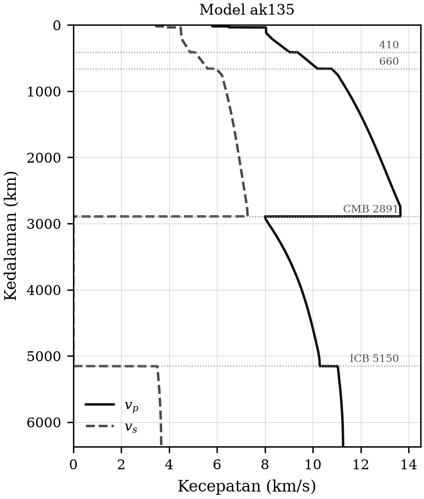

::: {custom-style="ImageCaption"}
**Gambar 3.8.** Model kecepatan dan densitas bumi ak135/PREM sebagai fungsi
kedalaman. Perhatikan lenyapnya $v_s$ pada inti luar dan munculnya kembali
pada inti dalam.
:::

## 3.6 Gelombang badan dari gempa dekat

Untuk jarak kurang dari sekitar 10°, penjalaran gelombang badan menjadi
kompleks karena dipengaruhi struktur kerak bumi yang beragam secara regional.
Gambar 3.9 melukiskan dua struktur kerak yang umum: kerak benua dan kerak
samudra. Dalam gambar itu OO adalah permukaan, CC diskontinuitas Conrad antara
lapisan atas (granitik) dan lapisan bawah (basaltik), dan MM diskontinuitas
Mohorovičić. Karena kecepatan di mantel lebih besar daripada di basalt, dan di
basalt lebih besar daripada di granit, gelombang kepala dapat terbentuk baik
pada CC maupun pada MM. Karena itu pada rekaman gempa dekat, khususnya di atas
kerak benua, dijumpai:

- **Pg dan Sg** — gelombang langsung dari sumber ke penerima melalui lapisan
  granitik;
- **P\* dan S\*** — gelombang kepala yang dibiaskan oleh diskontinuitas Conrad;
- **Pn dan Sn** — gelombang kepala yang dibiaskan sepanjang Moho.

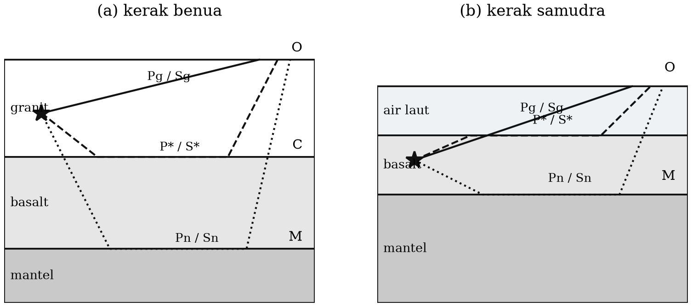

::: {custom-style="ImageCaption"}
**Gambar 3.9.** Struktur kerak bumi, fase gelombang, dan penjalarannya untuk
(a) kerak benua dan (b) kerak samudra. Digambar ulang mengikuti Båth (1979).
:::

Rekaman gempa dekat di atas kerak samudra lebih sederhana, karena hanya
dijumpai fase P\*/S\* dan Pn/Sn. Dalam rekaman gempa dekat di atas kerak
benua, fase Sg biasanya memiliki amplitudo terbesar sehingga dapat dipakai
sebagai penunjuk untuk mengidentifikasi fase lain. Umumnya Sg terdiri atas dua
fase, Sg1 dan Sg2; Sg1 adalah Sg yang sebenarnya, sedangkan Sg2 kemungkinan
milik lapisan granitik permukaan. Dalam analisis gempa dekat, keduanya jangan
dianggap satu fase. Pada kejadian yang lemah, gelombang P sering tidak
terlihat dan hanya gelombang S — biasanya Sn dan Sg1 — yang tampak; karena
fase-fase ini berperioda pendek, hanya seismograf periode pendek (atau kanal
frekuensi tinggi seismometer pita lebar) yang memadai untuk merekamnya.

Sebagai rangkuman dua subbab terakhir, tingkat kesulitan analisis rekaman
gempa bergantung pada jarak:

- **Jarak dekat (0°–10°)** — rumit, karena pengaruh struktur regional kerak
  bumi. Inilah kelompok jarak tempat hampir semua gempa merusak di Indonesia
  berada, termasuk gempa Yogyakarta 2006.
- **Jarak sedang (10°–100°)** — relatif sederhana dan mudah ditafsirkan,
  karena didominasi fase yang menjalar di dalam mantel.
- **Jarak jauh (> 100°)** — kembali sukar, karena banyaknya fase yang menjalar
  di inti luar maupun inti dalam.

::: {custom-style="Kotak"}
**Kotak 3.1 — Membaca seismogram gempa Yogyakarta 2006 dari jarak dekat.**
Gempa 27 Mei 2006 berpusat sekitar 20 km dari pusat Kota Yogyakarta. Pada
jarak sedekat itu ($\Delta < 0{,}5°$), gelombang P dan S datang hanya
beberapa detik berselang: dengan $v_p \approx 5{,}8$ km/s dan
$v_s \approx 3{,}4$ km/s, selisih waktu tiba S–P pada jarak hiposenter 25 km
hanya sekitar 3 detik. Konsekuensinya bersifat praktis dan pahit: **tidak ada
waktu untuk peringatan dini** bagi penduduk yang berada tepat di atas sumber.
Untuk gempa kerak dangkal di bawah kota, peringatan dini gempa tidak dapat
menggantikan bangunan tahan gempa. Aritmetika sederhana inilah pelajaran
mitigasi yang paling penting dari bab ini.
:::

## 3.7 Gelombang permukaan dan dispersi

Dalam penjalarannya, gelombang Love dan Rayleigh mengikuti permukaan bebas
bumi dan lapisan di bawahnya, dan pada seismogram gempa jauh keduanya
mendominasi bagian akhir rekaman. Sifat-sifatnya karena itu mengungkap
struktur kerak bumi dan bagian paling atas mantel.

Ada dua hal yang membuktikan bahwa kerak bumi berlapis dan tidak homogen:

1. **Timbulnya gelombang Love**, mengingat gelombang ini hanya terjadi pada
   medium berlapis.
2. **Adanya dispersi** pada gelombang Love maupun Rayleigh, yang tampak pada
   seismogram sebagai kedatangan gelombang berperioda panjang mendahului yang
   berperioda pendek.

**Dispersi** adalah gejala terurainya gelombang berdasarkan panjang
gelombangnya sepanjang perambatan, karena kecepatan merupakan fungsi frekuensi.
Gelombang yang terdispersi berubah bentuknya sepanjang lintasan (Gambar 3.10).

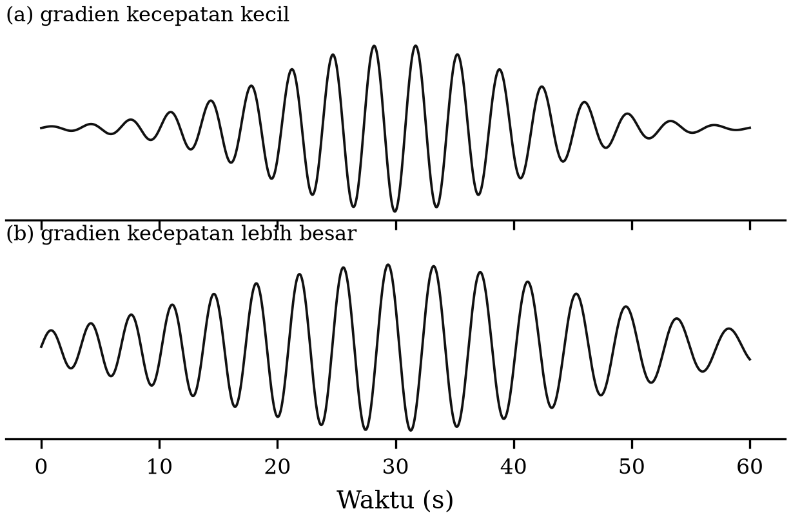

::: {custom-style="ImageCaption"}
**Gambar 3.10.** Bentuk gelombang yang mengalami dispersi: (a) akibat gradien
kecepatan vertikal yang kecil, dan (b) akibat gradien kecepatan yang lebih
besar.
:::

Penyebab fisis dispersi gelombang permukaan sederhana dan elegan: gelombang
berperioda panjang "merasakan" struktur sampai kedalaman yang lebih besar,
tempat kecepatan lebih tinggi, sehingga menjalar lebih cepat. Gelombang
Rayleigh berperioda 60 s masih terasa sampai kedalaman sekitar 200 km,
sedangkan yang berperioda 20 s hanya sampai sekitar 70 km. Karena itu **kurva
dispersi adalah sidik jari profil kecepatan terhadap kedalaman**, dan
inversinya adalah salah satu cara utama menentukan struktur kerak — termasuk
dalam tomografi derau ambien modern (Bab 6).

Konsekuensi lain dispersi adalah munculnya dua kecepatan yang berbeda.
**Kecepatan fase** $c$ adalah kecepatan penjalaran puncak gelombang pada
perioda tertentu,

$$c = c(\kappa) = \frac{\omega}{\kappa}, \qquad \kappa = \frac{2\pi}{\Lambda} \text{~~~~~~~~~~~~~~~~} (3.13)$$

dengan $\kappa$ bilangan gelombang dan $\Lambda$ panjang gelombang.
**Kecepatan grup** $U$ adalah kecepatan penjalaran amplop gelombang, yaitu
kecepatan perambatan energi,

$$U = \frac{d\omega}{d\kappa} \text{~~~~~~~~~~~~~~~~} (3.14)$$

Sebagai contoh, dua gelombang yang frekuensinya sedikit berbeda dan kecepatan
fasenya juga berbeda akan berinterferensi menghasilkan gelombang termodulasi
amplitudo (Gambar 3.11). Puncak-puncak sinus bergeser dengan kecepatan $c$,
sedangkan puncak amplopnya bergeser dengan kecepatan $U$ yang dapat lebih
lambat maupun lebih cepat.

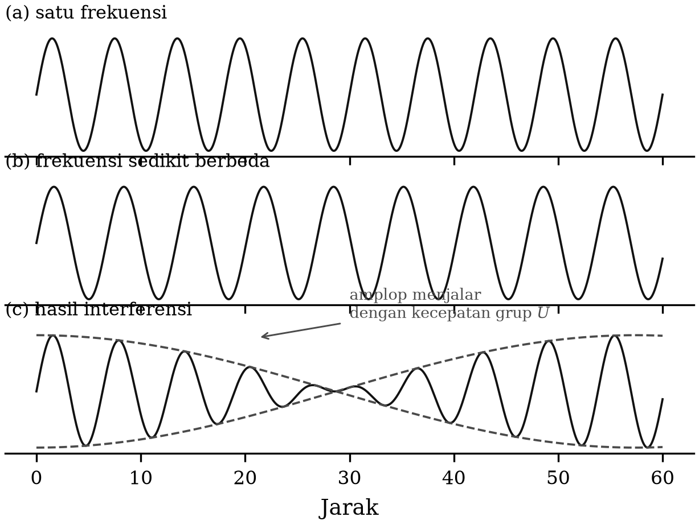

::: {custom-style="ImageCaption"}
**Gambar 3.11.** Ilustrasi kecepatan fase dan kecepatan grup: (a) gelombang
sinus berfrekuensi tunggal, (b) gelombang sinus dengan frekuensi sedikit
berbeda, dan (c) hasil interferensi keduanya. Amplop (c) menjalar dengan
kecepatan grup.
:::

Hubungan antara kecepatan grup dan kecepatan fase adalah

$$U = c + \kappa \frac{dc}{d\kappa} \text{~~~~~~~~~~~~~~~~} (3.15)$$

atau, dinyatakan terhadap panjang gelombang,

$$U = c - \Lambda \frac{dc}{d\Lambda} \text{~~~~~~~~~~~~~~~~} (3.16)$$

Untuk gelombang Love yang terekam pada seismogram, gelombang berperioda
panjang biasanya menjalar lebih cepat, sehingga kecepatan grupnya lebih kecil
daripada kecepatan fasenya (*dispersi normal*). Contoh yang lebih menarik
adalah dispersi gelombang pada permukaan zat cair, yang kecepatan grupnya
dapat lebih besar maupun lebih kecil daripada kecepatan fasenya, bergantung
pada daerah panjang gelombangnya.

### Gelombang mantel dan osilasi bebas bumi

Dengan dioperasikannya seismograf berperioda sangat panjang, ditemukan
gelombang permukaan jenis L dan R berperioda 8–10 menit, yang berkaitan dengan
panjang gelombang lebih dari 2000 km. Karena seluruh bagian mantel ikut
berosilasi secara serentak, gelombang ini disebut **gelombang mantel**. Jenis
L dinamai gelombang **G** (mengikuti Gutenberg, 1954) dan jenis R dinamai
**W** (dari bahasa Jerman *Wiederkehrwellen*). Gelombang mantel menyertai
gempa besar seperti gempa Chili 1960, yang gelombang mantelnya terekam sampai
puluhan jam — berarti telah mengelilingi bumi belasan kali sebelum melemah di
bawah ambang deteksi.

Gelombang permukaan berperioda lebih panjang lagi menimbulkan **osilasi bebas
bumi** (*free oscillations* atau *normal modes*). Gelombang jenis L
menimbulkan osilasi **torsional** (tanpa komponen radial), sedangkan jenis R
menimbulkan osilasi **sferoidal** (dengan komponen radial). Seperti semua
osilasi bebas, ini adalah gelombang berdiri.

Perioda osilasi bebas dapat dihitung secara teoretis, dan hasilnya dipakai
sebagai salah satu kendala terkuat pada model densitas bumi. Mode sferoidal
berperioda terpanjang adalah $_0S_2$ dengan perioda sekitar **53,9 menit**
(dijuluki *football mode*), sedangkan mode torsional terpanjang $_0T_2$
berperioda sekitar **44 menit**. Mode "napas" $_0S_0$ berperioda sekitar 20,5
menit.

Pola osilasi diberi notasi $_nT_l^m$ dan $_nS_l^m$, dengan $n$ nomor **mode
radial** ($n=0$ mode dasar, $n \ge 1$ nada atas atau *overtone*), sedangkan
$l$ dan $m$ adalah indeks harmonik bola yang membagi permukaan bumi oleh
bidang-bidang nodal.

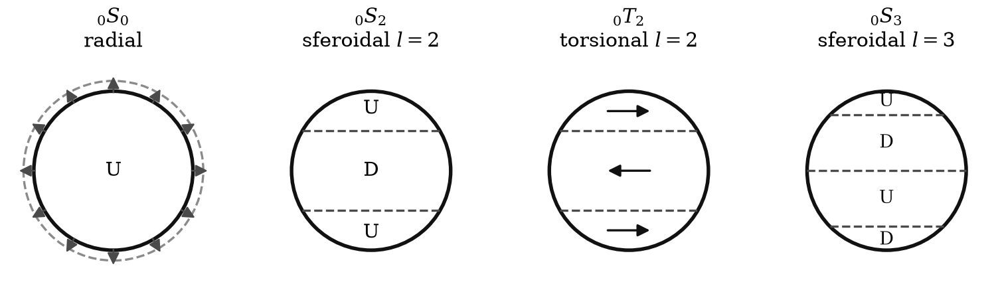

::: {custom-style="ImageCaption"}
**Gambar 3.12.** Pola osilasi bebas bumi. Bidang nodal digambarkan sebagai
garis putus-putus; U menandakan gerakan ke atas dan D ke bawah.
:::

::: {custom-style="Kotak"}
**Catatan Pemutakhiran 3.2 — Perioda osilasi bebas.** Naskah asli menyebut
"periode terpanjang yang terhitung adalah 44 menit untuk vibrasi torsional dan
56 menit untuk vibrasi sferoidal". Nilai baku sekarang adalah 44,0 menit untuk
$_0T_2$ dan **53,9 menit** untuk $_0S_2$. Angka-angka ini bukan sekadar
koreksi kosmetik: perioda mode-mode ini diukur sampai empat angka bermakna
dari gempa besar (Chili 1960, Aceh 2004, Tohoku 2011) dan menjadi salah satu
data terpenting yang membatasi model densitas bumi seperti PREM.
:::

### Gelombang kanal

Gelombang yang merambat dalam lapisan berkecepatan rendah (*low velocity
layer*) dapat terpantul oleh permukaan atas dan bawah lapisan itu. Bila
pantulan-pantulan itu berinterferensi saling menguatkan, gelombang terpandu di
dalam lapisan sebagai **gelombang kanal**, dan energinya terjaga dengan sangat
efisien. Umumnya gelombang kanal bersifat dispersif.

Lapisan berkecepatan rendah terdapat tidak hanya di dalam bumi, tetapi juga di
udara maupun di laut (untuk gelombang suara). Letusan di dalam laut
memancarkan sebagian energinya ke dalam kanal semacam itu — kanal SOFAR —
yang memandunya sebagai gelombang P sampai menghantam garis pantai dan
diteruskan ke dalam bumi. Gelombang P yang menjalar di dalam laut seperti itu
disebut **gelombang T** (dari *tertiary*), berkecepatan sekitar 1500 m/s.
Gelombang T rutin terekam di stasiun-stasiun pulau dan menjadi salah satu
teknik pemantauan CTBTO.

Di dalam bumi, lapisan berkecepatan rendah juga terdapat dekat permukaan,
yaitu **astenosfer** di mantel atas; gelombang kanal yang ditimbulkannya
dinamai Pa dan Sa (a dari astenosfer), dengan perioda sekitar 10 s untuk Pa
dan 20 s untuk Sa. Di dalam kerak bumi terdeteksi pula fase-fase yang bersifat
seperti gelombang kanal, yaitu Li, Lg1, Lg2, dan sebagainya. Fase **Lg** —
gelombang S yang terperangkap di dalam kerak benua — adalah salah satu fase
terpenting dalam pemantauan ledakan nuklir dan dalam penentuan magnitudo gempa
regional.

Gelombang permukaan bermode tinggi juga dapat menjelma menjadi gelombang
kanal. Itulah sebabnya gelombang permukaan bermode tinggi melemah cepat bila
melewati daerah transisi antara kerak samudra dan kerak benua, atau melewati
pegunungan tinggi: perubahan ketebalan kerak merusak interferensi yang semula
konstruktif.

## 3.8 Diagram waktu tempuh

Penentuan waktu tempuh gelombang dari pusat gempa ke stasiun dengan ketelitian
yang baik adalah salah satu persoalan seismologi yang paling penting. Data
waktu tempuh yang merupakan fungsi jarak episenter dan kedalaman gempa,
dikumpulkan dan diproses ulang secara berkesinambungan, memberikan hasil yang
makin akurat — dan sekaligus menghasilkan penentuan lokasi dan kedalaman gempa
yang lebih teliti.

Tabel waktu tempuh telah banyak dibuat: Gutenberg dan Richter (1936), Jeffreys
dan Bullen (1940, 1967), Herrin (1968), dan pada masa kini iasp91 serta ak135.
Diagram waktu tempuhnya — sering disebut **hodograf** — menempatkan waktu
tempuh $T$ sebagai ordinat dan jarak episenter $\Delta$ (dalam derajat) sebagai
absis (Gambar 3.7).

Penjalaran fase yang berbeda tidak saling bebas. Sebagai contoh, fase PP dan
PPP berhubungan dengan fase P melalui

$$T_{PP}(\Delta) = 2\,T_P\!\left(\frac{\Delta}{2}\right), \qquad
T_{PPP}(\Delta) = 3\,T_P\!\left(\frac{\Delta}{3}\right) \text{~~~~~~~~~~~~~~~~} (3.17)$$

dan fase PS berhubungan dengan P dan S melalui

$$T_{PS}(\Delta) = T_P(\Delta_1) + T_S(\Delta_2), \qquad \Delta = \Delta_1 + \Delta_2 \text{~~~~~~~~~~~~~~~~} (3.18)$$

dengan $\Delta_1$ dan $\Delta_2$ ditentukan oleh syarat parameter gelombang
yang sama pada titik pantul.

::: {custom-style="Kotak"}
**Catatan Pemutakhiran 3.3 — Ralat pada relasi waktu tempuh.** Naskah asli
menuliskan relasi ini sebagai satu rangkaian kesamaan,
"$t_{pp}(\Delta) = 2t_p(\Delta/2) = 3t_p(\Delta/3)$", yang secara harfiah
menyatakan bahwa waktu tempuh PP sama dengan waktu tempuh PPP — dan itu tidak
benar. Yang dimaksud jelas adalah dua relasi terpisah seperti pada Persamaan
(3.17): PP adalah dua penggal lintasan P, dan PPP adalah tiga penggal. Ralat
ini kami perbaiki.
:::

Dari tabel waktu tempuh dapat dibuat tabel turunan yang penting: tabel selisih
waktu tiba S–P untuk penentuan jarak episenter, dan tabel selisih pP–P untuk
penentuan kedalaman gempa. Sampai sekarang data pP–P masih dianggap paling
akurat untuk penentuan kedalaman gempa jauh.

Diagram waktu tempuh sangat penting bagi seismolog dalam membaca dan
mengidentifikasi fase gelombang. Aturan praktisnya: **jika penafsiran sebuah
fase hendak diterima, semua fase lain yang terbaca di sekitarnya — setidaknya
yang jelas dan signifikan — harus dapat dijelaskan dan cocok satu sama lain.**

## 3.9 Atenuasi, hamburan, dan anisotropi

Tiga sifat berikut tidak dibahas dalam naskah asli, tetapi merupakan bagian
baku seismologi modern dan menjadi sumber informasi yang penting.

**Atenuasi.** Amplitudo gelombang berkurang sepanjang lintasan bukan hanya
karena penyebaran geometris ($1/r$ untuk gelombang badan, $1/\sqrt{r}$ untuk
gelombang permukaan), tetapi juga karena kehilangan energi menjadi panas.
Kehilangan ini diperikan oleh **faktor mutu** $Q$, yang didefinisikan melalui
fraksi energi yang hilang tiap siklus,

$$\frac{1}{Q} = -\frac{1}{2\pi}\frac{\Delta E}{E} \text{~~~~~~~~~~~~~~~~} (3.19)$$

sehingga amplitudo berkurang sebagai

$$A(x) = A_0 \exp\!\left(-\frac{\omega x}{2 Q v}\right) \text{~~~~~~~~~~~~~~~~} (3.20)$$

Karena eksponennya sebanding dengan $\omega$, atenuasi bertindak sebagai
**penapis lolos rendah**: gempa jauh selalu terdengar "lebih tumpul" daripada
gempa dekat. Nilai $Q$ untuk gelombang S di kerak berkisar 100–1000; nilai
rendah menandakan batuan tersesarkan, jenuh fluida, atau bersuhu tinggi.
Pemetaan $Q$ (tomografi atenuasi) adalah salah satu cara mendeteksi kantong
magma, dan telah diterapkan pada Merapi memakai data MERAMEX.

**Hamburan dan koda.** Bagian ekor seismogram yang meluruh perlahan setelah
fase-fase utama disebut **koda**. Koda bukan derau, melainkan gelombang yang
terhambur oleh ketaklinearan dan ketakhomogenan kecil di dalam kerak. Peluruhan
koda dipakai untuk mengukur $Q_c$ dan — yang sangat berguna secara praktis —
untuk menentukan **magnitudo durasi**, yaitu magnitudo yang dihitung dari
lamanya rekaman gempa terlihat di atas derau. Untuk jaringan gempa mikro dan
gunung api, magnitudo durasi sering kali merupakan satu-satunya magnitudo yang
dapat diandalkan.

**Anisotropi.** Bila kecepatan gelombang bergantung pada arah penjalaran atau
arah polarisasi, medium disebut **anisotropik**. Gejala yang paling mudah
diamati adalah **pembelahan gelombang geser** (*shear wave splitting*):
gelombang S terurai menjadi dua gelombang terpolarisasi saling tegak lurus
yang menjalar dengan kecepatan berbeda, sehingga tiba dengan selisih waktu
yang terukur. Penyebabnya dapat berupa orientasi kristal olivin di mantel
(sehingga menjadi petunjuk arah aliran mantel), atau rekahan berorientasi di
kerak (sehingga menjadi petunjuk arah tegangan utama). Pengukuran pembelahan
gelombang S di sekitar zona sesar aktif — termasuk di Jawa — dipakai untuk
memantau perubahan medan tegangan.

## 3.10 Gelombang mikroseismik

Uraian tentang gelombang seismik tidak lengkap tanpa menyinggung **derau latar**
atau gelombang mikroseismik yang selalu ikut tercatat. Yang dimaksud adalah
gelombang gangguan yang berasal dari pengaruh luar, terutama atmosfer dan
lautan. Secara umum ini tidak berkaitan dengan gempa bumi, dan bidang studinya
berada di perbatasan antara seismologi, meteorologi, dan oseanografi.
Gelombang ini selalu ada dalam seismogram dengan intensitas yang bervariasi
dan jelas mengganggu perekaman gempa.

Gelombang mikroseismik adalah gelombang seismik yang amplitudo gerakan
partikelnya kurang dari $10^{-3}$ cm (Bullen dan Bolt, 1985). Dua teori
klasik menerangkan asalnya: **teori pantai**, yang menjelaskan bahwa
mikroseism berasal dari aktivitas ombak yang memecah pada pantai curam; dan
**teori siklon**, yang menerangkan bahwa gelombang ini berasal dari aktivitas
siklon di atas laut dalam. Kedua-duanya benar untuk kasus yang berbeda.

Mikroseism kelautan dibedakan menjadi dua (Darbyshire, 1969):

1. **Mikroseism primer**, berfrekuensi sama dengan gelombang laut penyebabnya,
   yaitu sekitar 0,05–0,08 Hz (perioda 12–20 s);
2. **Mikroseism sekunder**, berfrekuensi dua kali lipat frekuensi gelombang
   laut penyebabnya, sekitar 0,1–0,2 Hz (perioda 4–8 s).

::: {custom-style="Kotak"}
**Catatan Pemutakhiran 3.4 — Dari gangguan menjadi sumber data.** Naskah asli
menutup pembahasan mikroseism dengan catatan bahwa klasifikasinya "belum
begitu jelas". Penjelasan teoretis untuk mikroseism sekunder sebenarnya sudah
diberikan Longuet-Higgins (1950): interferensi dua rangkaian gelombang laut
yang berlawanan arah menghasilkan gangguan tekanan berfrekuensi ganda yang
tidak melemah terhadap kedalaman air, sehingga mampu menggetarkan dasar laut.

Yang jauh lebih mengubah keadaan adalah temuan tahun 2000-an bahwa derau ini
**bukan sekadar gangguan, melainkan sumber data**. Melalui korelasi silang
derau ambien antara dua stasiun, dapat dipulihkan fungsi Green empiris antara
keduanya — yaitu seismogram seolah-olah salah satu stasiun adalah sumber
gempa. Teknik ini, yang dikenal sebagai **interferometri derau ambien**,
memungkinkan pencitraan struktur bawah permukaan **tanpa memerlukan gempa sama
sekali**, dan telah diterapkan antara lain untuk memetakan struktur kerak atas
Jawa Tengah dan cekungan Yogyakarta (Bab 6 dan Bab 9).

Naskah asli menyebutkan tesis Woro (1985) tentang gangguan latar di Gunung
Merapi, yang menyimpulkan bahwa mikroseism di sana didominasi gelombang
Rayleigh yang berasal dari aktivitas di Samudra Hindia. Kesimpulan itu tetap
sahih — dan justru karena mikroseism Samudra Hindia bersifat mantap dan
tersebar merata itulah, wilayah Jawa Tengah menjadi tempat yang sangat baik
untuk penerapan interferometri derau ambien.
:::

::: {custom-style="Ringkasan"}
**Ringkasan Bab 3**

1. Gelombang badan (P dan S) merambat di dalam badan medium; gelombang
   permukaan (Rayleigh dan Love) terpandu oleh bidang batas dan amplitudonya
   meluruh terhadap kedalaman.
2. $v_p = \sqrt{(\lambda+2\mu)/\rho}$ dan $v_s = \sqrt{\mu/\rho}$; karena
   $\mu = 0$ dalam zat cair, gelombang S tidak menjalar di inti luar. Untuk
   $\sigma = 0{,}25$ berlaku $v_p/v_s = \sqrt{3}$.
3. Hukum Snell dalam bentuk bola, $R\sin i/v = p$, dengan $p = dT/d\Delta$,
   menghubungkan pengamatan waktu tempuh dengan lintasan gelombang di dalam
   bumi.
4. Tata nama fase IASPEI bersifat sistematis: huruf besar untuk lintasan
   turun, huruf kecil untuk fase kedalaman, c untuk pantulan di batas inti,
   K/I/J untuk penjalaran di inti.
5. Daerah bayangan gelombang P terbentang antara $\Delta \approx 103°$ dan
   $143°$; darinya kedalaman batas inti (2891 km) ditentukan.
6. Gelombang permukaan terdispersi; kecepatan grup $U = d\omega/d\kappa$
   berbeda dari kecepatan fase $c = \omega/\kappa$. Kurva dispersi adalah
   sidik jari struktur kecepatan terhadap kedalaman.
7. Model rujukan modern: iasp91 dan ak135 untuk waktu tempuh, PREM untuk
   densitas dan atenuasi.
8. Atenuasi ($Q$), hamburan (koda), dan anisotropi (pembelahan gelombang S)
   membawa informasi tambahan tentang fluida, rekahan, dan medan tegangan.
9. Derau mikroseismik, yang dahulu dipandang sebagai pengganggu, kini menjadi
   sumber data melalui interferometri derau ambien.
:::

::: {custom-style="Soal"}
**Soal Latihan**

**3.1** Batuan memiliki $\rho = 2700$ kg/m³, $\mu = 3{,}0 \times 10^{10}$ Pa,
dan $\lambda = 3{,}0 \times 10^{10}$ Pa. Hitung $v_p$, $v_s$, $v_p/v_s$, dan
rasio Poisson. Apakah batuan ini "padatan Poisson"?

**3.2** Sebuah gempa dekat memberikan selisih waktu tiba $t_S - t_P = 4{,}5$ s.
Dengan $v_p = 5{,}8$ km/s dan $v_p/v_s = 1{,}73$, hitunglah jarak hiposenter.
Turunkan pula rumus umum jarak sebagai fungsi $t_S-t_P$ (dikenal sebagai
"aturan praktis" yang dipakai analis BMKG).

**3.3** Gelombang P datang dari lapisan dengan $v_1 = 4{,}0$ km/s ke lapisan
dengan $v_2 = 6{,}5$ km/s. (a) Hitung sudut kritisnya. (b) Pada jarak berapa
gelombang kepala mulai tiba lebih dahulu daripada gelombang langsung bila
kedalaman bidang batas 3 km?

**3.4** Jelaskan mengapa fase pP sangat berguna untuk penentuan kedalaman
gempa, dan mengapa metode ini tidak dapat diandalkan untuk gempa dangkal
seperti gempa Yogyakarta 2006.

**3.5** Dengan memakai Gambar 3.7 atau perangkat lunak `taup`, tentukan waktu
tiba fase P, PP, S, dan PKP untuk gempa di permukaan pada $\Delta = 60°$,
$110°$, dan $150°$. Fase apa yang menjadi kedatangan pertama pada masing-
masing jarak?

**3.6** Sebuah gelombang Rayleigh berperioda 20 s memiliki kecepatan fase 3,8
km/s, dan yang berperioda 25 s memiliki kecepatan fase 3,9 km/s. Perkirakan
kecepatan grup pada perioda 22,5 s.

**3.7** Gelombang S berfrekuensi 1 Hz menjalar sejauh 200 km dalam medium
dengan $v_s = 3{,}5$ km/s dan $Q = 300$. Berapa fraksi amplitudo yang tersisa?
Ulangi untuk frekuensi 10 Hz, lalu jelaskan mengapa gempa jauh selalu
didominasi frekuensi rendah.

**3.8** Hitung waktu yang diperlukan gelombang mantel untuk satu kali
mengelilingi bumi bila kecepatan grupnya 3,8 km/s. Bandingkan dengan lamanya
rekaman gelombang mantel gempa Chili 1960, lalu perkirakan berapa kali
gelombang itu mengelilingi bumi.
:::

::: {custom-style="Bacaan"}
**Bacaan Lanjut**

- Aki, K. & Richards, P. G. (2002). *Quantitative Seismology*, 2nd ed.
  University Science Books. *(Rujukan teoretis baku.)*
- Kennett, B. L. N., Engdahl, E. R. & Buland, R. (1995). Constraints on
  seismic velocities in the Earth from traveltimes. *Geophysical Journal
  International*, 122, 108–124.
- Dziewoński, A. M. & Anderson, D. L. (1981). Preliminary reference Earth
  model. *Physics of the Earth and Planetary Interiors*, 25, 297–356.
- Shearer, P. M. (2019). *Introduction to Seismology*, 3rd ed. Cambridge
  University Press.
- Longuet-Higgins, M. S. (1950). A theory of the origin of microseisms.
  *Philosophical Transactions of the Royal Society A*, 243, 1–35.
- Shapiro, N. M. & Campillo, M. (2004). Emergence of broadband Rayleigh waves
  from correlations of the ambient seismic noise. *Geophysical Research
  Letters*, 31, L07614.
:::
