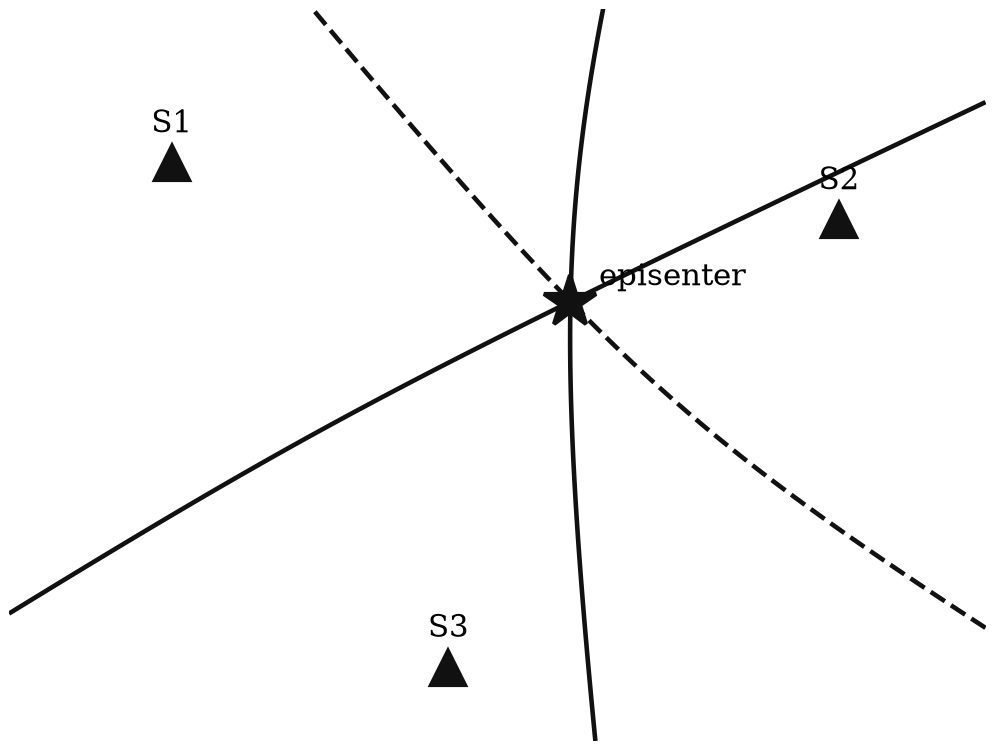
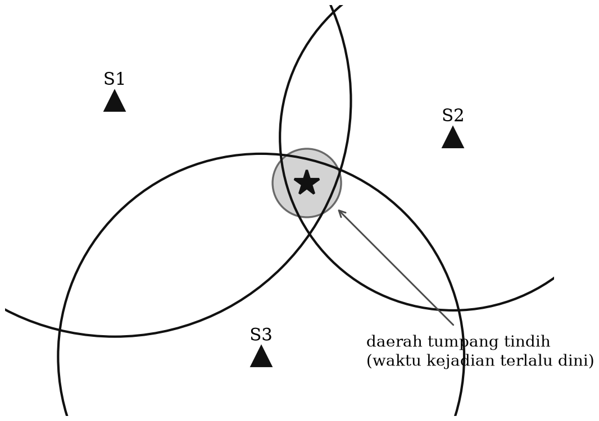
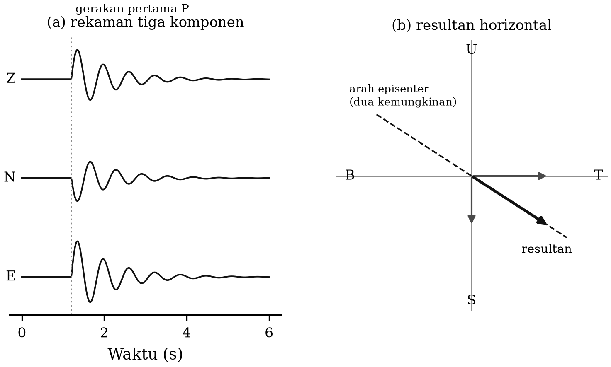
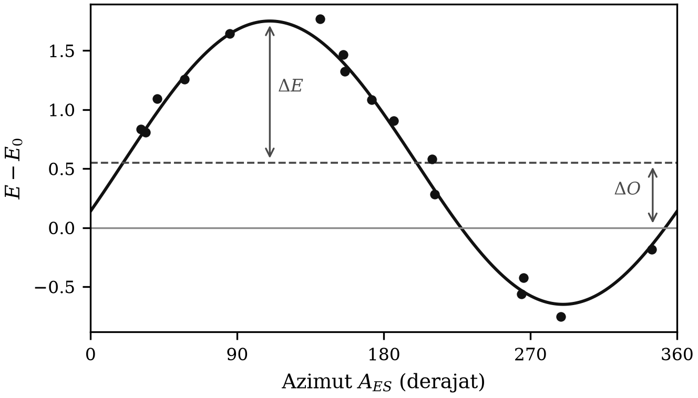
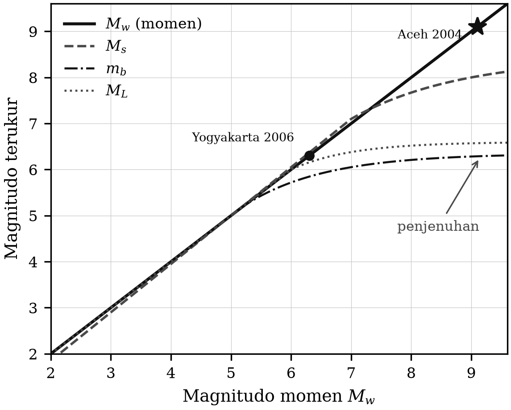

# BAB 4 — PARAMETER SUMBER DAN PENENTUANNYA

::: {custom-style="Tujuan"}
**Tujuan Pembelajaran.** Setelah mempelajari bab ini mahasiswa mampu:
(1) menyebutkan parameter sumber gempa dan membedakan parameter kinematik dari
parameter dinamik;
(2) menentukan episenter dengan metode grafis klasik (hiperbola, lingkaran,
Galitzin, Richter) dan menjelaskan keterbatasannya;
(3) menjelaskan metode Geiger dan penentuan lokasi modern (kuadrat terkecil,
probabilistik, dan relokasi beda-ganda);
(4) membuat dan menafsirkan diagram Wadati;
(5) menghitung berbagai jenis magnitudo, menjelaskan penjenuhan skala
magnitudo, dan menghitung momen seismik serta magnitudo momen;
(6) membedakan magnitudo dari intensitas, serta memakai skala MMI dan
SIG-BMKG; dan
(7) menerapkan semuanya pada data gempa Yogyakarta 2006.
:::

## 4.1 Parameter sumber

Yang termasuk parameter sumber gempa adalah:

1. **Lintang dan bujur episenter**, yaitu titik di permukaan bumi tepat di atas
   sumber gempa;
2. **Kedalaman fokus**; titik sumbernya sendiri disebut **hiposenter**;
3. **Waktu kejadian** atau waktu asal (*origin time*);
4. **Ukuran gempa**, yang berkaitan dengan energi yang dipancarkan sumber.

Parameter 1–3 disebut **parameter kinematik**, karena untuk menentukannya
hanya diperlukan pengukuran waktu tempuh gelombang. Parameter 4 disebut
**parameter dinamik**, karena untuk menentukannya diperlukan pengukuran
amplitudo dan perioda. Pada seismologi modern, daftar parameter dinamik
bertambah dengan **tensor momen** dan parameter sumber terinci seperti luas
bidang sesar, slip rata-rata, tegangan lepas, dan durasi rupture (Bab 5).

Waktu tiba gelombang yang terukur di seismogram merupakan fungsi lintang,
bujur, kedalaman, dan waktu kejadian, di samping fungsi kecepatan gelombang
terhadap kedalaman. Secara teoretis diperlukan sekurang-kurangnya empat
pengamatan bebas untuk menentukan empat parameter kinematik, dengan syarat
model kecepatan dianggap diketahui. Sebagai contoh, untuk menentukan episenter
dan waktu kejadian dengan metode lingkaran diperlukan sekurang-kurangnya tiga
data waktu tiba gelombang P di tiga stasiun; dua parameter lain — kecepatan
dan kedalaman — harus sudah diketahui, walaupun tidak secara eksplisit
(misalnya fungsi kecepatan tersirat di dalam tabel waktu tempuh).

::: {custom-style="Kotak"}
**Kotak 4.1 — Empat parameter, satu masalah pokok.** Kesulitan pokok
penentuan lokasi gempa bukan pada jumlah persamaan, melainkan pada
**korelasi antara kedalaman dan waktu kejadian**. Bila semua stasiun berada
jauh dari episenter, gelombang meninggalkan sumber dengan sudut yang hampir
sama, sehingga menambah kedalaman 5 km dan memajukan waktu kejadian sekitar
1 detik menghasilkan waktu tiba yang praktis sama. Inilah sebabnya kedalaman
adalah parameter yang paling sering keliru, dan mengapa fase pP, stasiun
berjarak dekat, atau data tambahan seperti InSAR sedemikian berharga.
:::

## 4.2 Penentuan episenter: metode grafis klasik

Empat metode berikut adalah warisan era pra-komputer. Metode-metode ini tidak
lagi dipakai dalam operasi rutin, tetapi tetap diajarkan karena dua alasan:
metode ini memperlihatkan **geometri persoalan** dengan cara yang tidak dapat
digantikan perangkat lunak, dan ketika hasil komputer terlihat ganjil,
seismolog yang baik akan memeriksanya dengan penalaran geometris yang sama.

### 4.2.1 Metode hiperbola

Menurut definisi, hiperbola adalah tempat kedudukan titik-titik yang selisih
jaraknya terhadap dua titik tetap adalah tetap. Bila selisih waktu kedatangan
gelombang P di dua stasiun diketahui sebesar $\Delta t$, maka tempat kedudukan
episenter yang mungkin adalah hiperbola dengan fokus di kedua stasiun itu dan
selisih jarak $v\,\Delta t$. Karena itu data waktu kedatangan P di tiga stasiun
$S_1$, $S_2$, dan $S_3$ memberikan tiga hiperbola yang berpotongan di satu
titik, yaitu episenter (Gambar 4.1). Dalam metode ini kecepatan $v$ harus
tetap (lintasan lurus) dan sumber dianggap di permukaan.

::: {custom-style="ImageCaption"}
**Gambar 4.1.** Metode hiperbola: episenter adalah titik potong tiga (cukup
dua) hiperbola dengan fokus kombinasi dua dari tiga stasiun.
:::

Dalam praktik metode ini tidak dapat diterapkan dengan baik untuk gempa pada
umumnya, karena bumi membola dan kecepatan gelombang tidak tetap. Metode ini
baik untuk gempa mikro dengan jaringan yang sangat lokal, tempat anggapan
kecepatan tetap mendekati kenyataan; untuk itu dapat dikembangkan metode
hiperboloida dengan data empat stasiun, sekaligus untuk menentukan kedalaman.

### 4.2.2 Metode lingkaran

Bila waktu tiba gelombang P di suatu stasiun dan waktu kejadian gempa
diketahui, jarak episenter dapat ditentukan dari tabel waktu tempuh, dan
tempat kedudukan episenter adalah lingkaran dengan stasiun sebagai pusat dan
jarak episenter sebagai jejari. Data dari tiga stasiun memberikan tiga
lingkaran yang harus berpotongan di satu titik.

Dalam praktik, waktu kejadian diandaikan lebih dahulu sebagai harga awal.
Akibatnya ketiga lingkaran dapat tidak saling memotong (bila waktu kejadian
diandaikan terlalu lambat) atau saling tumpang tindih (bila terlalu dini).
Langkah-langkah metode lingkaran:

1. Pastikan kedalaman sumber diketahui dari data lain, misalnya pP–P.
2. Andaikan waktu kejadian gempa sebagai harga awal.
3. Hitung waktu tempuh gelombang P, yaitu waktu tiba dikurangi waktu kejadian,
   untuk ketiga stasiun.
4. Tentukan jarak episenter dari waktu tempuh dengan memakai tabel seismologi.
5. Gambar tiga lingkaran di atas globe dengan stasiun sebagai pusat dan jarak
   episenter sebagai jejari.
6. Koreksi waktu kejadian: bila lingkaran tidak berpotongan, waktu kejadian
   harus dikurangi; bila tumpang tindih, ditambah. Besar koreksinya

   $$\Delta t = \frac{\Delta x}{dT/d\Delta} \text{~~~~~~~~~~~~~~~~} (4.1)$$

   dengan $\Delta x$ jejari daerah tumpang tindih dan $dT/d\Delta$ ditentukan
   dari tabel.
7. Ulangi langkah 2–6 sampai daerah tumpang tindih sangat kecil; episenter
   dibaca pada globe dan waktu kejadian adalah harga terakhir.

::: {custom-style="ImageCaption"}
**Gambar 4.2.** Metode lingkaran: episenter adalah titik potong tiga lingkaran
yang berpusat di tiga stasiun. Pada gambar ini ketiga lingkaran masih saling
tumpang tindih karena waktu kejadian yang diandaikan masih terlalu dini.
:::

Perhatikan bahwa langkah 6 dan 7 pada hakikatnya adalah **iterasi kuadrat
terkecil yang dikerjakan dengan tangan**. Metode Geiger (Subbab 4.3) tidak
lain adalah perumusan matematis dari prosedur yang sama.

### 4.2.3 Metode Galitzin

Metode Galitzin memungkinkan penentuan episenter dengan data dari **satu
stasiun** saja, asalkan stasiun itu memiliki seismograf tiga komponen.
Diperlukan tiga jenis data: amplitudo gerakan pertama P pada komponen
horizontal (utara–selatan dan timur–barat), polaritas gerakan pertama P pada
komponen vertikal, dan selisih waktu tiba S–P.

Langkah-langkahnya:

1. Tentukan kedalaman gempa; bila tidak dapat, anggap sumber di permukaan.
2. Cari resultan gerakan pertama P komponen horizontal dari amplitudo pada
   komponen NS dan EW (Gambar 4.3). Karena gerakan partikel gelombang P searah
   penjalarannya, episenter harus segaris dengan resultan tersebut — dapat di
   depan atau di belakang.
3. Baca polaritas gerakan pertama P pada komponen vertikal. Bila ke atas
   (kompresi), episenter berada di arah yang **ditinggalkan** resultan
   horizontal; bila ke bawah (dilatasi), episenter berada di arah yang
   **dituju** resultan horizontal.
4. Tentukan jarak episenter dari data S–P dengan tabel seismologi.
5. Tentukan letak episenter di atas globe berdasarkan arah dan jarak, memakai
   pita berskala yang lemas agar pengukuran mengikuti lingkaran besar.

::: {custom-style="ImageCaption"}
**Gambar 4.3.** Metode Galitzin: arah episenter sejajar dengan resultan
gerakan horizontal gelombang P (resultan komponen NS dan EW); polaritas
komponen vertikal menentukan mana dari dua arah yang benar.
:::

Selain amplitudo gelombang P, arah episenter dapat pula ditentukan dari
gelombang Rayleigh, karena gerakan partikelnya eliptik retrograd sehingga
memiliki komponen vertikal dan horizontal yang berhubungan tetap dengan arah
perambatan.

Gagasan metode Galitzin hidup terus dalam seismologi modern sebagai
**polarisasi tiga komponen** dan analisis *back-azimuth*, yang dikerjakan
otomatis lewat analisis nilai eigen matriks kovarians tiga komponen. Untuk
jaringan gunung api dengan stasiun tunggal, dan untuk peringatan dini gempa
yang harus memutuskan dalam hitungan detik, cara ini masih sangat relevan.

### 4.2.4 Metode Richter

Ini adalah metode kuantitatif yang memakai data waktu tiba P di banyak stasiun;
globe tidak diperlukan lagi. Langkah-langkahnya:

1. Pastikan kedalaman gempa atau andaikan gempa di permukaan.
2. Andaikan waktu kejadian dan posisi episenter sebagai harga awal (misalnya
   hasil metode lingkaran).
3. Hitung jarak episenter ke setiap stasiun, $E$, dari posisi episenter
   andaian dan posisi stasiun.
4. Hitung jarak episenter ke stasiun, $E_0$, dari data waktu tiba P dan tabel
   seismologi.
5. Hitung azimut dari gempa ke stasiun, $A_{ES}$.
6. Gambarkan grafik $(E - E_0)$ sebagai ordinat terhadap $A_{ES}$ sebagai
   absis. Umumnya grafiknya berupa gelombang sinus yang terangkat atau turun
   dan bergeser ke kanan atau ke kiri (Gambar 4.4).

**Penjelasan.** Bila waktu kejadian terlalu dini, $E_0$ menjadi terlalu besar
sehingga $(E-E_0)$ terlalu kecil dan grafik sinus turun; sebaliknya bila
terlalu lambat grafik terangkat naik. Bila letak episenter terlalu ke timur,
$E$ ke arah timur ($A_{ES}=90°$) terlalu besar dan ke arah barat
($A_{ES}=270°$) terlalu kecil, sehingga grafik sinus berpuncak pada 90° dan
berlembah pada 270°.

::: {custom-style="ImageCaption"}
**Gambar 4.4.** Grafik $E-E_0$ terhadap azimut $A_{ES}$ pada metode Richter.
Pergeseran vertikal rata-rata menentukan koreksi waktu kejadian, sedangkan
amplitudo dan fase sinusnya menentukan koreksi posisi episenter.
:::

Dengan demikian koreksi waktu kejadian dicari dari besarnya pengangkatan
grafik sinus,

$$\Delta O = \frac{\overline{(E-E_0)}}{dT/d\Delta} \text{~~~~~~~~~~~~~~~~} (4.2)$$

dan koreksi posisi episenter — koreksi bujur $\Delta x$ dan koreksi lintang
$\Delta y$ — dicari dari amplitudo dan fase sinusnya,

$$\Delta x = \Delta E \sin\alpha, \qquad \Delta y = \Delta E \cos\alpha \text{~~~~~~~~~~~~~~~~} (4.3)$$

dengan $\Delta E$ amplitudo grafik sinus (setengah jarak puncak ke lembah) dan
$\alpha$ azimut yang berkaitan dengan puncak grafik. Proses diulang sampai
$\Delta O$ dan $\Delta E$ cukup kecil.

Grafik $(E-E_0)$ terhadap azimut pada Gambar 4.4 sesungguhnya adalah bentuk
paling awal dari **diagram residual azimut** yang sampai sekarang dicetak
setiap kali sebuah gempa dilokasikan. Bila setelah iterasi selesai residual
masih memperlihatkan pola sistematis terhadap azimut, itu bukan lagi kesalahan
lokasi, melainkan **petunjuk bahwa model kecepatan 1-D tidak memadai** — dan
di situlah tomografi bermula.

## 4.3 Penentuan lokasi hiposenter modern

### 4.3.1 Diagram Wadati

Sebelum masuk ke metode numerik, ada satu alat grafis sederhana yang wajib
dikuasai. **Diagram Wadati** memplot selisih waktu tiba $(t_S - t_P)$ terhadap
waktu tiba $t_P$ untuk banyak stasiun pada satu gempa yang sama. Bila
$v_p/v_s$ tetap di seluruh daerah, titik-titiknya jatuh pada garis lurus

$$t_S - t_P = \left(\frac{v_p}{v_s} - 1\right)\left(t_P - t_0\right) \text{~~~~~~~~~~~~~~~~} (4.4)$$

Dari garis ini dapat dibaca dua hal sekaligus: **perpotongan dengan sumbu
$t_P$ memberikan waktu kejadian $t_0$**, dan **kemiringannya memberikan
$v_p/v_s$**. Diagram Wadati juga segera memperlihatkan pembacaan fase yang
keliru, karena titik yang salah baca akan melenceng jauh dari garis. Alat
sederhana ini masih dipakai setiap hari oleh analis, dan merupakan cara
tercepat untuk memeriksa mutu data gempa susulan.

### 4.3.2 Metode Geiger

Metode baku penentuan lokasi gempa dirumuskan Geiger (1910) dan tidak berubah
prinsipnya sampai sekarang. Misalkan parameter yang dicari adalah
$\mathbf{m} = (x, y, z, t_0)$. Waktu tiba terhitung di stasiun ke-$i$ adalah

$$t_i^{\text{cal}} = t_0 + T_i(x,y,z) \text{~~~~~~~~~~~~~~~~} (4.5)$$

dan **residual** antara pengamatan dan perhitungan adalah

$$r_i = t_i^{\text{obs}} - t_i^{\text{cal}} \text{~~~~~~~~~~~~~~~~} (4.6)$$

Karena $T_i$ merupakan fungsi taklinear dari koordinat, persoalan diselesaikan
dengan linearisasi di sekitar model awal $\mathbf{m}_0$:

$$r_i \approx \frac{\partial T_i}{\partial x}\delta x + \frac{\partial T_i}{\partial y}\delta y + \frac{\partial T_i}{\partial z}\delta z + \delta t_0 \text{~~~~~~~~~~~~~~~~} (4.7)$$

atau dalam bentuk matriks $\mathbf{r} = \mathbf{G}\,\delta\mathbf{m}$, yang
diselesaikan secara kuadrat terkecil,

$$\delta\mathbf{m} = \left(\mathbf{G}^{T}\mathbf{G}\right)^{-1}\mathbf{G}^{T}\mathbf{r} \text{~~~~~~~~~~~~~~~~} (4.8)$$

lalu model diperbarui, $\mathbf{m} \leftarrow \mathbf{m} + \delta\mathbf{m}$,
dan proses diulang sampai konvergen. Mutu hasilnya dinilai dari:

- **RMS residual** — akar rata-rata kuadrat residual; ukuran kecocokan data.
- **Celah azimut** (*azimuthal gap*) — sudut terbesar antara dua stasiun
  bertetangga dilihat dari episenter. Celah > 180° hampir selalu berarti
  episenter tidak terkendali.
- **Galat formal ERH dan ERZ** — galat horizontal dan vertikal dari matriks
  kovarians. Perlu diingat bahwa galat ini **hanya mengukur ketidakpastian
  akibat derau data, bukan akibat kesalahan model kecepatan** — dan dalam
  praktik kesalahan model biasanya lebih besar.

Perangkat lunak klasik yang menerapkan metode ini adalah HYPO71, HYPOELLIPSE,
dan HYPOCENTER; di lingkungan operasional BMKG, fungsi ini dijalankan oleh
modul pelokasi di dalam SeisComP.

### 4.3.3 Penentuan lokasi probabilistik

Kelemahan pendekatan linearisasi adalah asumsi bahwa fungsi galat berbentuk
elips tunggal, padahal untuk geometri jaringan yang buruk fungsi galat bisa
berbentuk pisang, berpuncak ganda, atau sangat asimetrik. **Metode
probabilistik** — yang paling dikenal adalah NonLinLoc (Lomax dkk., 2000) —
tidak melinearkan persoalan, melainkan mencacah fungsi kepadatan peluang
posterior atas seluruh ruang model:

$$\sigma(\mathbf{m}) \propto \exp\!\left(-\frac{1}{2}\sum_i \frac{r_i^{2}}{\sigma_i^{2}}\right) \text{~~~~~~~~~~~~~~~~} (4.9)$$

Hasilnya bukan satu titik dengan elips galat, melainkan **awan peluang** yang
memperlihatkan bentuk ketidakpastian yang sebenarnya. Untuk gempa susulan yang
sebagian besar berada di tepi atau di luar jaringan — situasi yang persis
dihadapi pada gempa Yogyakarta 2006 — perbedaan antara kedua pendekatan ini
dapat mencapai beberapa kilometer.

### 4.3.4 Relokasi beda-ganda

Sebagian besar kesalahan lokasi berasal dari kesalahan model kecepatan, dan
kesalahan itu **hampir sama** untuk dua gempa yang berdekatan dan terekam di
stasiun yang sama. Gagasan **metode beda-ganda** (*double-difference*,
hypoDD; Waldhauser & Ellsworth, 2000) adalah membuang kesalahan bersama itu
dengan bekerja pada selisih residual antara pasangan gempa:

$$dr_{ij}^{k} = \left(t_i^{k,\text{obs}} - t_j^{k,\text{obs}}\right) - \left(t_i^{k,\text{cal}} - t_j^{k,\text{cal}}\right) \text{~~~~~~~~~~~~~~~~} (4.10)$$

dengan $i, j$ dua gempa dan $k$ stasiun. Hasilnya adalah posisi **relatif**
antargempa yang jauh lebih tajam — sering kali sepuluh kali lebih baik —
walaupun posisi absolut kelompoknya tetap bergantung pada model. Bila
digabungkan dengan pengukuran selisih waktu tiba lewat **korelasi silang bentuk
gelombang**, ketelitian relatif dapat mencapai puluhan meter.

Inilah teknik yang mengubah awan gempa susulan yang kabur menjadi bidang sesar
yang tajam, dan yang menjadi inti perdebatan mengenai sesar mana yang pecah
pada gempa Yogyakarta 2006 (Bab 14).

::: {custom-style="Kotak"}
**Kotak 4.2 — Data non-seismologi sebagai penentu.** Untuk gempa kerak
dangkal, tiga jenis data lain sekarang rutin dipakai bersama data seismik:
**InSAR**, yang memetakan deformasi permukaan sampai ketelitian sentimeter
dari citra radar satelit sebelum dan sesudah gempa; **GNSS**, yang mengukur
pergeseran titik secara menerus; dan **geologi lapangan** berupa pemetaan
rekahan permukaan dan paritan (*trenching*). Untuk gempa Yogyakarta 2006,
justru analisis InSAR dan sebaran gempa susulan — bukan lokasi episenter awal
— yang memberikan bukti terkuat mengenai bidang sesar yang sebenarnya pecah.
:::

## 4.4 Kedalaman hiposenter

Kedalaman gempa dapat ditentukan dengan beberapa cara.

1. **Secara kasar dari perbandingan amplitudo.** Perbandingan antara amplitudo
   gelombang permukaan dan amplitudo gelombang badan mengecil bila gempa makin
   dalam, karena gempa dalam membangkitkan gelombang permukaan yang jauh lebih
   lemah. Cara ini hanya membedakan gempa dangkal dari gempa dalam; dalam
   bentuk modernnya, selisih $M_s - m_b$ dipakai sebagai salah satu kriteria
   pembeda gempa dari ledakan.
2. **Selisih waktu tiba pP–P.** Ini metode konvensional yang paling akurat
   untuk gempa jauh, dengan galat mencapai $\pm 5$ km untuk gempa dalam.
   Metode ini tidak baik untuk kedalaman kurang dari sekitar 100 km, karena
   selisih pP–P menjadi terlalu kecil dan fase pP berimpit dengan koda P.
3. **Pemodelan bentuk gelombang.** Bentuk gelombang yang terekam merupakan
   hasil konvolusi tiga kelompok parameter: parameter sumber (posisi,
   kedalaman, waktu kejadian, kekuatan, dan mekanisme), parameter medium
   penjalar (struktur dan kecepatan bumi), serta parameter penerima
   (seismometer, penguat, penapis). Dari ketiganya, parameter penerima
   diketahui dengan pasti dari metadata instrumen, parameter medium diketahui
   cukup baik dari penelitian sebelumnya, dan sebagian parameter sumber
   (episenter, waktu kejadian, kekuatan) sudah diketahui dengan baik. Dengan
   memasukkan parameter yang sudah diketahui sebagai tetapan dan parameter
   yang dicari sebagai variabel iterasi, dihitung **seismogram sintetis** yang
   kemudian dibandingkan dengan seismogram terekam — biasanya dengan asas
   kuadrat terkecil — sampai diperoleh kecocokan terbaik.

   Metode inilah yang dipakai dalam **CMT** (*Centroid Moment Tensor*) yang
   dikembangkan Dziewoński dkk. (1981) di Harvard, dan yang sejak 2006
   dilanjutkan sebagai **Global CMT Project**. Perlu dicatat bahwa dahulu
   metode ini memerlukan superkomputer; sekarang inversi tensor momen rutin
   dijalankan secara otomatis dalam hitungan menit pada komputer biasa di
   pusat-pusat data, termasuk di BMKG.
4. **Fase kedalaman regional dan gelombang terkonversi.** Untuk gempa dangkal
   pada jarak regional, kedalaman dibatasi oleh fase sPn dan sPmP serta oleh
   bentuk gelombang permukaan periode menengah. Untuk gempa yang sangat
   dangkal, kendala terkuat sering justru datang dari data geodetik.

## 4.5 Magnitudo dan energi

Magnitudo gempa adalah besaran yang berhubungan dengan kekuatan gempa **di
sumbernya**. Gempa bermagnitudo besar belum tentu merusak bila sumbernya
sangat dalam. Pengukuran magnitudo yang dilakukan di tempat berbeda harus
menghasilkan harga yang sama, walaupun guncangan yang dirasakan di
tempat-tempat itu tentu berbeda.

Richter pada tahun 1935 memperkenalkan konsep magnitudo, dengan skala yang
bersifat logaritmik. Dalam skala ini gempa dapat bermagnitudo negatif untuk
kejadian yang sangat kecil. Pada umumnya magnitudo diukur berdasarkan amplitudo
dan perioda fase gelombang tertentu, dengan bentuk umum

$$M = \log\left(\frac{a}{T}\right) + f(\Delta, h) + C_S + C_R \text{~~~~~~~~~~~~~~~~} (4.11)$$

dengan $a$ amplitudo gerakan tanah (dalam mikron), $T$ perioda gelombang,
$\Delta$ jarak episenter, $h$ kedalaman, $C_S$ koreksi stasiun akibat struktur
lokal, dan $C_R$ koreksi regional. Fungsi $f(\Delta,h)$ disebut **fungsi
kalibrasi**, yang mengoreksi pelemahan amplitudo akibat penyebaran geometris
dan atenuasi.

### 4.5.1 Magnitudo lokal $M_L$

Magnitudo lokal diperkenalkan Richter untuk gempa-gempa di California Selatan:

$$M_L = \log a - \log a_0(\Delta) \text{~~~~~~~~~~~~~~~~} (4.12)$$

dengan $a$ amplitudo maksimum (dalam mikron) yang tercatat oleh seismograf
torsi Wood–Anderson yang berperioda natural 0,8 s, magnifikasi 2800, dan
faktor redaman 0,8. Sebagai baku, $M_L = 0$ bila pada jarak 100 km amplitudonya
1 mikron. Fungsi $-\log a_0(\Delta)$ dapat dicari secara empiris untuk suatu
daerah dari perhitungan magnitudo memakai amplitudo di banyak stasiun, dengan
syarat hasilnya harus sama.

Karena seismograf Wood–Anderson praktis sudah tidak ada, $M_L$ modern dihitung
dengan **mensimulasikan** tanggapan Wood–Anderson pada rekaman digital setelah
koreksi instrumen. Perlu diketahui pula bahwa magnifikasi baku 2800 kemudian
diralat menjadi sekitar 2080 berdasarkan pengukuran ulang, sehingga nilai $M_L$
yang dihitung dengan konvensi berbeda dapat bergeser sekitar 0,13 satuan.

### 4.5.2 Magnitudo gelombang badan $m_b$

$$m_b = \log\left(\frac{a}{T}\right) + Q(\Delta, h) \text{~~~~~~~~~~~~~~~~} (4.13)$$

Dalam praktik, $a$ adalah amplitudo gerakan tanah maksimum dalam mikron yang
diukur pada beberapa siklus pertama gelombang P pada seismogram periode pendek
komponen vertikal, dan $T$ adalah perioda gelombang beramplitudo maksimum itu.
Fungsi $Q(\Delta,h)$ adalah fungsi kalibrasi Gutenberg–Richter.

### 4.5.3 Magnitudo gelombang permukaan $M_s$

$$M_s = \log\left(\frac{a}{T}\right) + 1{,}66\log\Delta + 3{,}3 \text{~~~~~~~~~~~~~~~~} (4.14)$$

dengan $a$ amplitudo maksimum gelombang permukaan — biasanya gelombang
Rayleigh berperioda $20 \pm 3$ s — pada seismogram periode panjang komponen
vertikal, dan $\Delta$ jarak episenter dalam derajat. Rumus ini hanya sahih
untuk gempa dangkal ($h < 60$ km).

### 4.5.4 Hubungan antarmagnitudo dan penjenuhan

Karena setiap jenis magnitudo mengukur amplitudo pada perioda yang berbeda,
nilainya untuk satu gempa yang sama tidak identik. Secara empiris

$$m_b = 0{,}56\, M_s + 2{,}9 \text{~~~~~~~~~~~~~~~~} (4.15)$$

yang berarti keduanya bernilai sama pada sekitar magnitudo 6,6 (Gambar 4.5).
Masuk akal bahwa gempa yang besar — dengan sumber berdimensi ruang dan waktu
yang besar — memancarkan lebih banyak gelombang berperioda panjang, sehingga
$M_s > m_b$ untuk gempa besar.

::: {custom-style="ImageCaption"}
**Gambar 4.5.** Hubungan antara berbagai skala magnitudo dan gejala
penjenuhan. Skala $m_b$ menjenuh di sekitar 6,0–6,5 dan $M_s$ di sekitar
8,0–8,5, sedangkan $M_w$ tidak menjenuh.
:::

::: {custom-style="Kotak"}
**Catatan Pemutakhiran 4.1 — Penjenuhan magnitudo dan magnitudo momen.**
Naskah asli menyatakan: *"Gempa yang paling besar tercatat mempunyai magnitudo
sekitar 8 skala Richter. Magnitudo yang lebih besar dari itu dikatakan sudah
jenuh (saturated), yang berarti nilai magnitudo 8 skala Richter ke atas tidak
dapat dipercaya kebenarannya."*

Diagnosis itu **tepat**, tetapi kesimpulannya sudah ditinggalkan. Gejala
penjenuhan memang nyata: setiap skala magnitudo klasik mengukur amplitudo pada
satu perioda tertentu, sedangkan gempa yang sangat besar memancarkan energinya
pada perioda yang jauh lebih panjang daripada perioda ukur itu. Akibatnya
$m_b$ menjenuh di sekitar 6,0–6,5 dan $M_s$ di sekitar 8,0–8,5.

Jawabannya bukan berhenti pada magnitudo 8, melainkan mengganti dasar
pengukurannya. Kanamori (1977) dan Hanks & Kanamori (1979) mendefinisikan
**magnitudo momen** $M_w$ langsung dari momen seismik $M_0$ — besaran fisis
sumber yang tidak bergantung perioda ukur, sehingga tidak pernah menjenuh:

$$M_w = \frac{2}{3}\log_{10} M_0 - 10{,}7 \quad (M_0 \text{ dalam dyne·cm})$$
$$M_w = \frac{2}{3}\left(\log_{10} M_0 - 9{,}1\right) \quad (M_0 \text{ dalam N·m})$$

Dengan skala ini, gempa Aceh–Andaman 2004 bermagnitudo $M_w$ 9,1–9,3 dan gempa
Chili 1960 bermagnitudo $M_w$ 9,5 — nilai yang mustahil dinyatakan dengan
skala Richter. **Sejak akhir 1990-an, $M_w$ adalah skala baku yang dilaporkan
BMKG, USGS, dan GCMT untuk gempa berkekuatan sedang ke atas.** Dalam buku ini,
setiap magnitudo yang ditulis tanpa keterangan lain adalah $M_w$.

Satu hal lagi perlu diluruskan: istilah "skala Richter" untuk gempa
bermagnitudo besar sudah tidak tepat secara teknis, meskipun masih lazim di
media massa. Yang benar adalah menyebut jenis magnitudonya.
:::

### 4.5.5 Energi gempa

Kekuatan gempa dapat pula diukur dari energi total yang dilepaskan, yaitu
dengan mengintegralkan rapat energi gelombang di sepanjang kereta gelombang
dan di seluruh luasan yang dilewatinya (bola untuk gelombang badan, silinder
untuk gelombang permukaan). Hubungan empiris baku antara energi gelombang
seismik $E_s$ dan magnitudo gelombang permukaan adalah hubungan
Gutenberg–Richter:

$$\log_{10} E_s = 11{,}8 + 1{,}5\, M_s \qquad (E_s \text{ dalam erg}) \text{~~~~~~~~~~~~~~~~} (4.16)$$

atau, dalam satuan SI,

$$\log_{10} E_s = 4{,}8 + 1{,}5\, M_s \qquad (E_s \text{ dalam joule}) \text{~~~~~~~~~~~~~~~~} (4.17)$$

Dari Persamaan (4.17) langsung terbaca dua aturan praktis yang wajib dihafal:
**kenaikan satu satuan magnitudo berarti amplitudo 10 kali lebih besar dan
energi $10^{1,5} \approx 32$ kali lebih besar.** Kenaikan dua satuan magnitudo
berarti energi 1000 kali lebih besar.

::: {custom-style="Kotak"}
**Catatan Pemutakhiran 4.2 — Ralat perhitungan energi.** Naskah asli memuat
dua rumus energi, $\log E = 4{,}78 + 2{,}57\, m_b$ dan
$\log E = 12{,}24 + 1{,}44\, M_s$, lalu memberikan contoh: *"untuk menghitung
energi gempa terbesar yang mungkin terjadi yaitu yang mempunyai magnitude
$M_s = 6{,}8$… menghasilkan angka sebesar $10^{22}$ erg."*

Ada dua persoalan di sini. Pertama, $M_s = 6{,}8$ jelas bukan "gempa terbesar
yang mungkin terjadi" — kemungkinan besar ini salah ketik dari contoh
perhitungan tertentu. Kedua, angka yang dihasilkan tidak konsisten dengan
rumus mana pun yang dituliskan: dengan Persamaan (4.16), $M_s = 6{,}8$
memberikan $\log E_s = 11{,}8 + 10{,}2 = 22{,}0$, yaitu $10^{22}$ erg
$= 10^{15}$ J. Jadi **angka $10^{22}$ erg itu benar, tetapi keterangan bahwa
itu adalah gempa terbesar yang mungkin terjadi tidak benar.**

Sebagai perbandingan yang benar: gempa Aceh 2004 ($M_w \approx 9{,}1$)
melepaskan energi gelombang seismik sekitar $1{,}4 \times 10^{18}$ J, yaitu
sekitar **seribu kali** lebih besar daripada contoh di atas. Adapun kesetaraan
dengan pembangkit listrik yang disebut dalam naskah asli tetap kami
pertahankan sebagai ilustrasi yang baik: $10^{15}$ J $\approx 278$ juta kWh,
setara dengan keluaran pembangkit 32 MW selama satu tahun.
:::

### 4.5.6 Momen seismik

Momen seismik adalah parameter dinamik yang paling mendasar, karena
didefinisikan langsung dari proses fisis penyesarannya:

$$M_0 = \mu\, \overline{D}\, S \text{~~~~~~~~~~~~~~~~} (4.18)$$

dengan $\mu$ modulus geser (rigiditas), $\overline{D}$ dislokasi rata-rata
pada bidang sesar, dan $S$ luas bidang sesar. Momen seismik dapat ditentukan
dari data lapangan (untuk gempa dangkal yang memunculkan rekahan permukaan),
dari amplitudo bagian datar spektrum sumber pada frekuensi rendah, atau dari
inversi tensor momen.

Hubungan empiris dengan magnitudo lokal untuk gempa California adalah

$$\log_{10} M_0 = 15{,}1 + 1{,}7\, M_L \text{~~~~~~~~~~~~~~~~} (4.19)$$

dengan $M_0$ dalam dyne·cm dan $M_L = 3$–6 (Wyss & Brune, 1968).

::: {custom-style="Kotak"}
**Kotak 4.3 — Contoh perhitungan: gempa Yogyakarta 2006.**

Gempa 27 Mei 2006 memiliki $M_w = 6{,}3$. Berapa momen seismiknya, dan berapa
besar sesar yang pecah?

**Momen seismik.** Dari $M_w = \tfrac{2}{3}(\log_{10}M_0 - 9{,}1)$ dengan
$M_0$ dalam N·m:
$$\log_{10} M_0 = \tfrac{3}{2}(6{,}3) + 9{,}1 = 18{,}55$$
$$M_0 \approx 3{,}5 \times 10^{18}\ \text{N·m} = 3{,}5\times 10^{25}\ \text{dyne·cm}$$

**Dimensi sesar.** Dengan $\mu = 3 \times 10^{10}$ Pa untuk kerak atas, dan
mengandaikan bidang sesar sepanjang $L = 20$ km dan selebar $W = 10$ km
(sesuai sebaran gempa susulan yang terbatas pada kedalaman 5–15 km), maka
$S = 2 \times 10^{8}$ m² dan

$$\overline{D} = \frac{M_0}{\mu S} = \frac{3{,}5\times10^{18}}{3\times10^{10} \times 2\times10^{8}} \approx 0{,}6\ \text{m}$$

Jadi slip rata-rata sekitar setengah meter — nilai yang wajar untuk gempa
bermagnitudo 6,3 dan konsisten dengan hasil pemodelan InSAR.

**Energi.** Dengan Persamaan (4.17) dan $M_s \approx 6{,}2$,
$\log_{10}E_s \approx 4{,}8 + 9{,}3 = 14{,}1$, sehingga
$E_s \approx 1{,}3\times10^{14}$ J.

**Pelajarannya.** Bandingkan dengan gempa Aceh 2004 yang energinya sepuluh
ribu kali lebih besar, tetapi korban jiwa di Yogyakarta mencapai lebih dari
5.700 orang. **Kerusakan tidak ditentukan oleh magnitudo saja, melainkan oleh
gabungan magnitudo, kedalaman, jarak ke permukiman, kondisi tanah, dan mutu
bangunan.** Gempa Yogyakarta 2006 adalah contoh paling jelas di Indonesia
bahwa gempa "sedang" di tempat yang salah jauh lebih mematikan daripada gempa
besar di tempat yang jauh.
:::

## 4.6 Intensitas gempa

### 4.6.1 Pengertian

Intensitas gempa sebenarnya bukan parameter sumber, tetapi mempunyai hubungan
yang kuat — walaupun tidak langsung — dengan magnitudo. Keduanya harus
dibedakan dengan tegas:

| | **Magnitudo** | **Intensitas** |
|:--|:--------------|:---------------|
| Menyatakan | kekuatan gempa di sumbernya | kekuatan guncangan di suatu tempat |
| Ditentukan dari | rekaman instrumen terkalibrasi | efek yang dirasakan dan terlihat |
| Nilai untuk satu gempa | satu | bervariasi menurut tempat |
| Satuan | bilangan (skala logaritmik) | tingkat (angka Romawi atau I–V) |

Intensitas dinyatakan dalam skala intensitas. Skala pertama yang dikenalkan
Rossi–Forel hanya memiliki 10 tingkat; karena dengan 10 tingkat gempa besar
belum dapat dibedakan dengan baik, jumlahnya ditambah menjadi 12 oleh
Mercalli, Cancani, dan Sieberg. Wood dan Neumann pada 1931 merevisinya menjadi
**skala MMI** (*Modified Mercalli Intensity*), dan Medvedev, Sponheuer, dan
Karnik pada 1964 memperkenalkan **skala MSK**. Jepang memakai skala JMA
sendiri dengan 7 tingkat, dan Eropa memakai **EMS-98** sebagai penerus MSK.

Dalam menentukan intensitas pada kejadian gempa besar, sering diperlukan
ekspedisi khusus untuk mengamati kerusakan di daerah episentral, dan daftar
isian (kuesioner) disebarkan kepada masyarakat. Data yang terkumpul kemudian
diterjemahkan ke dalam skala intensitas dan ditampilkan sebagai **peta
isoseismal**.

Walaupun intensitas bukan parameter sumber, peta isoseismal dapat dipakai
untuk memperkirakan tiga parameter sumber. Titik dengan intensitas maksimum
$I_0$ dianggap sebagai episenter. Kedalaman dapat diperkirakan dengan rumus
empiris jenis Kövesligethy,

$$I_0 - I_r = 3\log_{10}\frac{\sqrt{r^{2}+h^{2}}}{h} \text{~~~~~~~~~~~~~~~~} (4.20)$$

dengan $I_r$ intensitas pada jarak $r$ dari episenter dan $h$ kedalaman dalam
km. Magnitudo dapat diperkirakan dengan hubungan empiris klasik

$$M_s \approx \frac{2}{3} I_0 + 1 \text{~~~~~~~~~~~~~~~~} (4.21)$$

dan hubungan antara intensitas maksimum dengan percepatan tanah maksimum $a_0$
diberikan hubungan Cancani,

$$\log_{10} a_0 = \frac{I_0}{3} - 0{,}5 \qquad (a_0 \text{ dalam cm/s}^2) \text{~~~~~~~~~~~~~~~~} (4.22)$$

Hubungan-hubungan empiris ini bersifat regional dan hanya boleh dipakai
sebagai perkiraan kasar. Untuk Indonesia, hubungan intensitas–PGA yang dipakai
BMKG diturunkan dari data lokal.

### 4.6.2 Skala MMI

Berikut ringkasan tingkat-tingkat skala MMI, yang secara isi hampir sama
dengan MSK yang diuraikan dalam naskah asli.

| Tingkat | Nama | Ciri utama |
|:--------|:-----|:-----------|
| I | Tidak terasa | Hanya tercatat seismograf |
| II | Jarang terasa | Terasa oleh satu-dua orang yang sedang beristirahat, terutama di lantai atas |
| III | Lemah | Terasa di dalam rumah seperti getaran truk kecil lewat; benda gantung sedikit berayun |
| IV | Cukup terasa | Terasa oleh sebagian besar orang di dalam rumah; jendela, pintu, dan barang pecah belah berbunyi; mobil yang diam bergoyang |
| V | Membangunkan | Terasa oleh hampir semua orang; orang yang tidur terbangun; benda tak stabil bergeser atau terbalik; cairan tumpah |
| VI | Menakutkan | Semua orang lari ke luar; mebel berat bergeser; kerusakan ringan pada bangunan berkonstruksi buruk |
| VII | Merusak | Sulit berdiri; kerusakan ringan pada bangunan baik, sedang pada bangunan sedang, berat pada bangunan buruk; cerobong runtuh |
| VIII | Menghancurkan | Kerusakan berat pada bangunan sedang; sebagian bangunan buruk hancur; monumen berputar dan tumbang; tebing longsor |
| IX | Merusak umum | Kerusakan berat pada bangunan baik; bangunan buruk hancur total; pipa bawah tanah patah; rekahan tanah nyata |
| X | Menghancurkan umum | Sebagian besar bangunan hancur; rel bengkok; bendungan rusak berat; rekahan tanah beberapa desimeter sampai satu meter |
| XI | Katastrof | Hampir semua bangunan runtuh; jembatan dan jaringan bawah tanah hancur; jalan tak berguna |
| XII | Perubahan bentang alam | Seluruh struktur di atas dan di bawah tanah hancur; permukaan tanah berubah secara radikal |

::: {custom-style="Kotak"}
**Catatan Pemutakhiran 4.3 — Skala intensitas yang dipakai di Indonesia.**
Naskah asli menyatakan bahwa "skala MSK inilah yang dipakai orang sampai
sekarang". Untuk Indonesia, pernyataan itu perlu diperbarui dua kali.

Pertama, dalam praktik BMKG selama beberapa dasawarsa skala yang dilaporkan
adalah **MMI**, bukan MSK.

Kedua, dan lebih penting, BMKG kini mengembangkan dan memakai **Skala
Intensitas Gempabumi BMKG (SIG-BMKG)** dengan **lima tingkat (I–V)**. Alasan
penggantiannya bersifat praktis: skala dua belas tingkat terlalu rumit untuk
komunikasi cepat kepada masyarakat, dan uraian kerusakannya disusun
berdasarkan tipe bangunan Eropa dan Amerika awal abad ke-20 yang tidak
mencerminkan bangunan Indonesia. SIG-BMKG dirancang lebih sederhana,
disesuaikan dengan karakteristik bangunan dan budaya Indonesia, dan
diselaraskan dengan tindakan tanggap darurat.

Untuk keperluan ilmiah dan pembandingan internasional, MMI tetap dipakai;
untuk komunikasi publik dan tanggap darurat di Indonesia, SIG-BMKG adalah
rujukan resmi. Mahasiswa perlu terbiasa dengan keduanya dan dengan tabel
padanannya.
:::

Table: **Tabel 4.1.** Skala Intensitas Gempabumi BMKG (SIG-BMKG) dan padanan kasarnya dengan MMI.

| SIG | Nama | Deskripsi ringkas | Padanan MMI |
|:----|:-----|:------------------|:------------|
| I | Tidak dirasakan | Tidak dirasakan atau dirasakan hanya oleh beberapa orang, tercatat alat | I–II |
| II | Dirasakan | Dirasakan oleh orang banyak; benda ringan bergoyang | III–V |
| III | Kerusakan ringan | Bagian nonstruktur bangunan rusak: retak dinding, genting jatuh | VI |
| IV | Kerusakan sedang | Banyak retakan pada dinding, sebagian roboh; struktur mulai rusak | VII–VIII |
| V | Kerusakan berat | Banyak bangunan rusak berat dan roboh | IX ke atas |

*Catatan: padanan MMI bersifat perkiraan; rincian resmi dan kelas percepatan
yang berkaitan mengikuti ketentuan BMKG yang berlaku.*

### 4.6.3 Peta guncangan modern

Peta isoseismal yang digambar dari kuesioner kini dilengkapi — dan dalam
praktik operasional digantikan — oleh **peta guncangan** (*ShakeMap*) yang
dihasilkan otomatis dalam hitungan menit setelah gempa. Peta ini menggabungkan
tiga sumber data:

1. **Pengukuran langsung** PGA dan PGV dari jaringan akselerograf dan
   *intensitymeter*;
2. **Persamaan prediksi gerakan tanah** (GMPE) yang memperkirakan guncangan
   pada titik tanpa alat, berdasarkan magnitudo, jarak, dan mekanisme sumber;
3. **Koreksi kondisi tanah setempat** berdasarkan peta $V_{s30}$, yaitu
   kecepatan gelombang S rata-rata pada 30 meter teratas.

Selain itu, laporan masyarakat lewat kuesioner daring (*Did You Feel It?* dan
padanannya di Indonesia) mengembalikan peran pengamatan makroseismik dalam
bentuk baru, dengan cakupan yang jauh lebih luas daripada ekspedisi lapangan.

::: {custom-style="Kotak"}
**Kotak 4.4 — Intensitas gempa Yogyakarta 2006.** Intensitas maksimum gempa
27 Mei 2006 mencapai sekitar **MMI VII–IX** di Kabupaten Bantul dan Klaten,
dengan kerusakan terberat justru **tidak** berpusat tepat di episenter
instrumental, melainkan memanjang arah timur laut–barat daya sejajar dengan
sesar yang pecah, dan meluas pada daerah endapan lunak. Lebih dari 5.700 orang
meninggal, hampir 38.000 luka-luka, dan lebih dari seratus ribu rumah rusak
berat atau hancur.

Pola kerusakan ini adalah salah satu bukti makroseismik paling jelas di
Indonesia bahwa **peta isoseismal memuat informasi tentang orientasi sumber
dan tentang kondisi tanah, bukan hanya tentang jarak dari episenter.** Justru
ketidaksesuaian antara pusat kerusakan dan episenter instrumental itulah yang
memicu penelitian intensif mengenai bidang sesar mana yang sesungguhnya pecah
(Bab 14).
:::

::: {custom-style="Ringkasan"}
**Ringkasan Bab 4**

1. Parameter kinematik (lintang, bujur, kedalaman, waktu kejadian) ditentukan
   dari waktu tempuh; parameter dinamik (magnitudo, momen, tensor momen) dari
   amplitudo dan bentuk gelombang.
2. Metode grafis klasik — hiperbola, lingkaran, Galitzin, Richter —
   memperlihatkan geometri persoalan dan merupakan bentuk manual dari iterasi
   kuadrat terkecil.
3. Metode Geiger melinearkan persoalan dan menyelesaikannya secara kuadrat
   terkecil; mutunya dinilai dari RMS, celah azimut, dan galat formal.
4. Metode probabilistik (NonLinLoc) memberikan bentuk ketidakpastian yang
   sebenarnya; relokasi beda-ganda (hypoDD) memberikan posisi relatif yang
   jauh lebih tajam.
5. Diagram Wadati memberikan waktu kejadian dan $v_p/v_s$ sekaligus, serta
   menyingkap pembacaan fase yang keliru.
6. Semua skala magnitudo klasik menjenuh; magnitudo momen
   $M_w = \tfrac{2}{3}\log_{10}M_0 - 10{,}7$ tidak menjenuh dan merupakan
   skala baku sekarang.
7. Kenaikan satu satuan magnitudo setara dengan amplitudo 10 kali dan energi
   sekitar 32 kali lebih besar.
8. Intensitas berbeda dari magnitudo: satu gempa memiliki satu magnitudo
   tetapi banyak nilai intensitas. Indonesia memakai MMI untuk keperluan
   ilmiah dan SIG-BMKG lima tingkat untuk komunikasi publik.
:::

::: {custom-style="Soal"}
**Soal Latihan**

**4.1** Tiga stasiun mencatat waktu tiba P sebagai berikut (waktu dalam detik
setelah menit penuh): S1 pada 12,4 s; S2 pada 15,1 s; S3 pada 18,9 s. Dengan
$v_p = 6{,}0$ km/s dan anggapan lintasan lurus, gambarkan penyelesaian metode
hiperbola secara skematis dan jelaskan mengapa metode ini gagal bila salah
satu pembacaan meleset 1 detik.

**4.2** Buatlah diagram Wadati dari data berikut dan tentukan $t_0$ serta
$v_p/v_s$.

| Stasiun | $t_P$ (s) | $t_S$ (s) |
|:--|:--|:--|
| A | 5,2 | 9,0 |
| B | 7,8 | 13,5 |
| C | 10,1 | 17,5 |
| D | 12,6 | 21,9 |

**4.3** Turunkan matriks $\mathbf{G}$ pada Persamaan (4.7) untuk model
kecepatan homogen, dan jelaskan mengapa kolom untuk $\delta z$ dan kolom untuk
$\delta t_0$ menjadi hampir sebanding bila semua stasiun berjarak jauh.

**4.4** Sebuah gempa memiliki $M_0 = 1{,}0\times10^{20}$ N·m. Hitung $M_w$-nya.
Bila $\mu = 3\times10^{10}$ Pa dan slip rata-rata 2 m, berapa luas bidang sesar
yang pecah? Perkirakan panjang dan lebarnya dengan anggapan $L = 2W$.

**4.5** Bandingkan energi gempa Yogyakarta 2006 ($M_w$ 6,3) dengan gempa Aceh
2004 ($M_w$ 9,1). Berapa kali lipat perbedaannya? Berapa banyak gempa
bermagnitudo 6,3 yang diperlukan untuk melepaskan energi yang sama dengan satu
gempa bermagnitudo 9,1?

**4.6** Sebuah gempa dangkal memiliki intensitas maksimum MMI VIII dan
intensitas MMI V pada jarak 40 km dari episenter. Perkirakan kedalaman gempa
dengan Persamaan (4.20) dan magnitudonya dengan Persamaan (4.21). Diskusikan
seberapa jauh hasil ini dapat dipercaya.

**4.7** Jelaskan mengapa BMKG mengganti skala 12 tingkat dengan skala lima
tingkat untuk komunikasi publik, dan apa yang hilang serta apa yang diperoleh
dari penggantian itu.

**4.8** Unduh katalog gempa BMKG untuk wilayah Yogyakarta selama satu bulan
sesudah 27 Mei 2006. Buatlah peta episenter dan penampang kedalaman. Apakah
sebaran gempa susulan sejajar dengan jalur Sesar Opak? Simpan hasilnya untuk
dibandingkan dengan pembahasan Bab 14.
:::

::: {custom-style="Bacaan"}
**Bacaan Lanjut**

- Havskov, J. & Ottemöller, L. (2010). *Routine Data Processing in Earthquake
  Seismology*. Springer.
- Lomax, A., Virieux, J., Volant, P. & Berge-Thierry, C. (2000). Probabilistic
  earthquake location in 3D and layered models. Dalam *Advances in Seismic
  Event Location*. Kluwer.
- Waldhauser, F. & Ellsworth, W. L. (2000). A double-difference earthquake
  location algorithm. *Bulletin of the Seismological Society of America*, 90,
  1353–1368.
- Kanamori, H. (1977). The energy release in great earthquakes. *Journal of
  Geophysical Research*, 82, 2981–2987.
- Hanks, T. C. & Kanamori, H. (1979). A moment magnitude scale. *Journal of
  Geophysical Research*, 84, 2348–2350.
- Bormann, P. & Dewey, J. W. (2012). The new IASPEI standards for determining
  magnitudes from digital data. Dalam NMSOP-2. GFZ, Potsdam.
- Wald, D. J. dkk. (1999). TriNet ShakeMaps. *Earthquake Spectra*, 15,
  537–555.
:::
