# BAB 5 — MEKANISME SUMBER GEMPA

::: {custom-style="Tujuan"}
**Tujuan Pembelajaran.** Setelah mempelajari bab ini mahasiswa mampu:
(1) menjelaskan teori bingkas elastik dan kaitannya dengan pola radiasi empat
kuadran;
(2) memakai proyeksi stereo-net untuk menggambarkan orientasi garis dan bidang;
(3) menentukan penyelesaian bidang sesar dari polaritas gerakan pertama
gelombang P;
(4) membaca parameter mekanisme sumber (strike, dip, rake, sumbu P dan T) dan
mengenali jenis sesar dari diagram bola fokus;
(5) menjelaskan tensor momen seismik, dekomposisinya, dan cara membacanya; dan
(6) menafsirkan mekanisme sumber gempa-gempa penting di Indonesia.
:::

## 5.1 Mekanisme gempa bumi

Konsep klasik mengenai mekanisme gempa bumi diusulkan oleh Reid (1910) dalam
laporan Komisi Penyelidikan Gempa Bumi California yang dibentuk setelah gempa
San Francisco 1906. Laporan itu memperkenalkan **teori bingkas elastik**
(*elastic rebound theory*), yang pada dasarnya menyatakan bahwa gempa bumi
dihasilkan oleh proses penyesaran — atau pergeseran pada sesar yang sudah ada
— di dalam kerak bumi, sebagai akibat pelepasan mendadak regangan elastik yang
telah melampaui kekuatan batuan. Regangan elastik terakumulasi ketika batuan
mengalami deformasi yang menerus dan semakin besar. Ketika penyesaran terjadi,
bagian yang berseberangan meloncat ke posisi kesetimbangan yang baru, dan
energi yang dilepaskan berbentuk panas serta vibrasi gelombang elastik yang
menjalar dalam bumi dan dirasakan sebagai gempa bumi.

Perhatikan urutan sebab-akibatnya, yang sering terbalik dalam pemahaman awam:
**proses penyesaranlah yang mengakibatkan gempa bumi, bukan gempa bumi yang
menyebabkan terjadinya sesar.**

Proses ini diilustrasikan pada Gambar 5.1. Andaikan pada permukaan batuan yang
mengalami tegangan geser menerus digambarkan garis-garis sejajar yang tegak
lurus arah tegangan (Gambar 5.1a). Tegangan yang menerus menyebabkan batuan
berdeformasi sehingga garis-garis itu melengkung (Gambar 5.1b). Bila tegangan
terus bekerja, deformasi makin besar sampai pada suatu saat melampaui kekuatan
batuan, sehingga batuan patah dan bergeser di sepanjang bidang patahan.
Kejadian inilah yang disebut **penyesaran** (*faulting*), yang menyebabkan
tegangan terlepas dan batuan memperoleh posisi setimbang baru, sehingga
garis-garis yang semula lurus menjadi terputus dan bergeser (Gambar 5.1c).
Bila tegangan terus bekerja, siklus berulang. Sesar yang telah bergeser
berkali-kali dan masih bergeser sampai sekarang disebut **sesar aktif**.

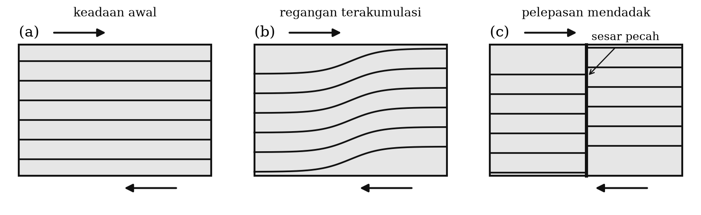

::: {custom-style="ImageCaption"}
**Gambar 5.1.** Ilustrasi teori bingkas elastik: (a) keadaan awal, (b)
akumulasi regangan, (c) pelepasan mendadak melalui penyesaran.
:::

Berdasarkan teori bingkas elastik, gerakan mendadak pada proses penyesaran
menghasilkan gerakan **kompresi** (menekan) dan **dilatasi** (menarik) pada
gerakan pertama gelombang P yang berasal dari sumber gempa. Kompresi dan
dilatasi terdistribusi pada permukaan bola yang melingkupi sumber dalam **empat
kuadran** yang berselang-seling (Gambar 5.2). Dua garis nodal membatasi
kuadran-kuadran itu, dan melukiskan dua **bidang nodal** yang saling tegak
lurus. Salah satu dari dua bidang nodal itu adalah bidang sesar yang
sebenarnya. Karena itu, dengan mengetahui distribusi gerakan pertama gelombang
P di permukaan bola yang melingkupi sumber, orientasi bidang sesar dapat
diselesaikan — inilah yang disebut **penyelesaian bidang sesar** (*fault plane
solution*).

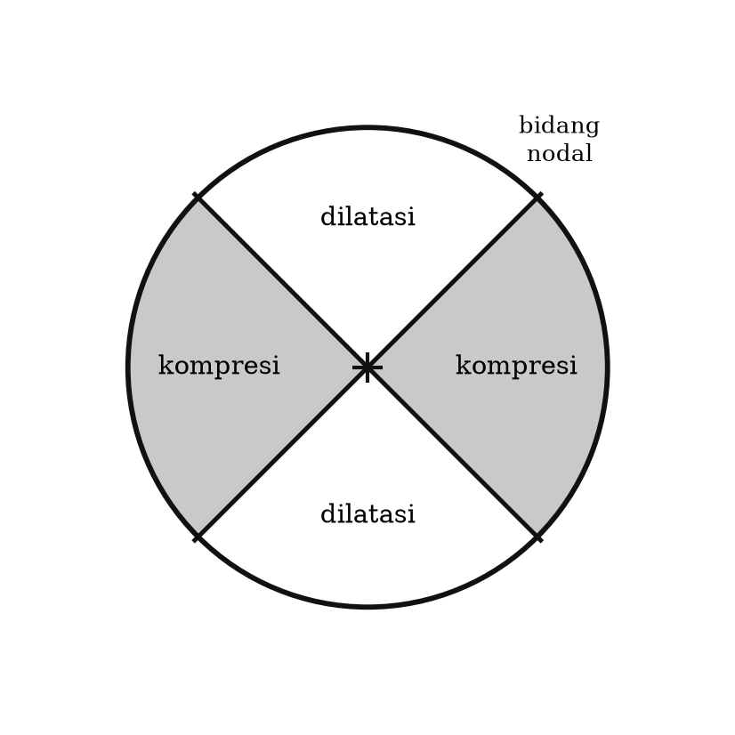

::: {custom-style="ImageCaption"}
**Gambar 5.2.** Gerakan pertama gelombang P yang terdistribusi dalam dua
kuadran kompresi dan dua kuadran dilatasi, dipisahkan oleh dua bidang nodal
yang saling tegak lurus.
:::

Usaha mempelajari penyelesaian bidang sesar pertama kali dilakukan oleh
seismolog Jepang pada 1920-an. Waktu itu di Jepang telah dioperasikan jaringan
stasiun yang cukup rapat, yang memungkinkan distribusi gerakan pertama P
dipetakan langsung di daerah sekitar gempa.

Era baru dimulai oleh Byerly (1938), yang memperkenalkan konsep **jarak
ekstended** dan **bola fokus** (*focal sphere*). Dengan konsep ini, tidak
hanya data stasiun dekat yang dapat dipakai; data stasiun yang sangat jauh pun
secara teoretis dapat dipakai. Penyelesaian diperoleh dengan memproyeksikan
distribusi kompresi dan dilatasi di permukaan bumi — melalui lintasan
penjalaran gelombangnya — ke permukaan bola fokus, yaitu bola satuan fiktif
berpusat pada fokus gempa, dengan medium di dalamnya dianggap homogen. Ini
dapat dilakukan karena **polaritas gerakan pertama gelombang P bersifat kekal
sepanjang penjalarannya** (Gambar 5.3).

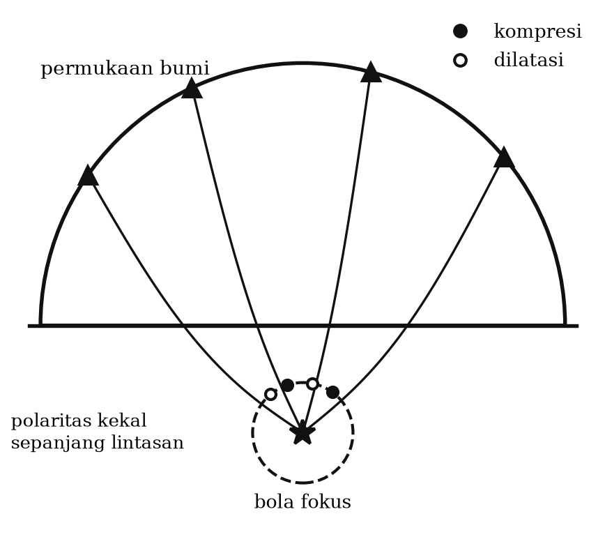

::: {custom-style="ImageCaption"}
**Gambar 5.3.** Polaritas gerakan pertama gelombang P yang kekal sepanjang
penjalarannya memungkinkan polaritas di bola fokus disimpulkan dari pengamatan
di permukaan bumi.
:::

Karena distribusi pada permukaan bola sukar dianalisis, diperlukan proyeksi
stereografik untuk menggambarkannya pada bidang dua dimensi.

Honda (1957), figur utama di antara seismolog Jepang dalam bidang ini,
memperkenalkan model sistem gaya pada sumber gempa. Ia mengusulkan dua tipe
sistem gaya yang mungkin untuk sumber titik: **kopel tunggal** (*single
couple*), disebut sistem gaya tipe I, dan **kopel ganda** (*double couple*),
disebut sistem gaya tipe II (Gambar 5.4). Pola radiasi gerakan pertama
gelombang P dan S dari kedua sistem gaya berbeda (Gambar 5.5). Berdasarkan
hasilnya, Honda menyimpulkan bahwa gempa menengah dan dalam di Jepang umumnya
diakibatkan sistem gaya tipe II. Sekarang para ahli gempa sepakat bahwa gempa
bumi pada dasarnya disebabkan oleh **sistem gaya kopel ganda**, dan alasan
teoretisnya jelas: hanya kopel ganda yang memenuhi kekekalan momentum sudut
untuk sumber dislokasi di dalam medium elastik.

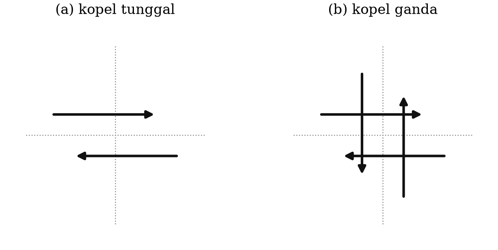

::: {custom-style="ImageCaption"}
**Gambar 5.4.** Model sistem gaya sumber gempa: (a) kopel tunggal, dan (b)
kopel ganda.
:::

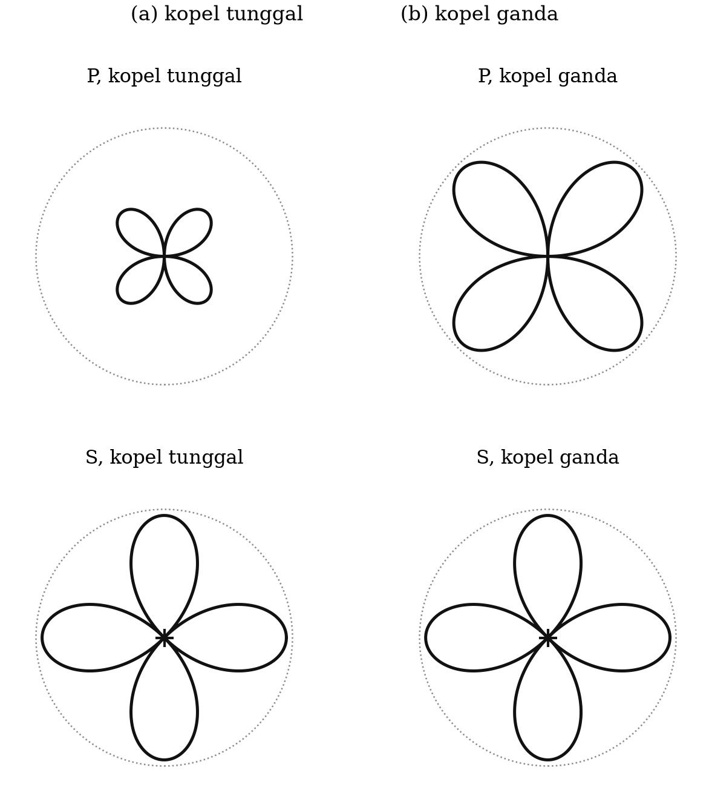

::: {custom-style="ImageCaption"}
**Gambar 5.5.** Pola radiasi gerakan pertama gelombang P dan S untuk sumber
(a) kopel tunggal dan (b) kopel ganda.
:::

Di samping gerakan pertama P dan S, banyak peneliti memanfaatkan sebanyak
mungkin informasi dalam rekaman. Keylis-Borok dkk. (1948) memakai perbandingan
amplitudo P terhadap S, dan perbandingan amplitudo SH terhadap SV. Yang
disebut terakhir lebih andal, karena dapat diukur di sepanjang kereta gelombang
fase S, bukan hanya pada gerakan pertamanya. Karena itu penggunaannya
berkembang luas (Ritsema, 1957; Ritsema & Veldkamp, 1960; Stauder, 1960, 1961;
Stauder & Bollinger, 1964). Secara praktis lebih baik memakai arkus tangen
perbandingan amplitudo SH terhadap SV, karena parameter itu memiliki arti
fisis sebagai **sudut polarisasi gelombang S**. Kesulitannya: untuk gempa
dekat ($\Delta < 45°$) polarisasinya taklinear, dan untuk gempa jauh
($\Delta > 80°$) fase S berinterferensi dengan fase lain. Karena itu polarisasi
gelombang S umumnya hanya dipakai untuk **memeriksa** penyelesaian bidang sesar
yang telah diperoleh dari polaritas gelombang P.

Era baru berikutnya dalam penyelesaian mekanisme sumber adalah pemakaian
**bentuk gelombang**, baik gelombang badan maupun gelombang permukaan.
Perkembangan komputer memungkinkan teknik inversi bentuk gelombang berkembang
intensif. Prosedur umumnya adalah pencocokan antara bentuk gelombang terekam
dan bentuk gelombang teoretis (seismogram sintetis), baik dalam kawasan waktu
maupun kawasan frekuensi. Bentuk gelombang teoretis dihitung dari sifat fisis
tiga komponen pokok: sumber gempa, medium penjalar gelombang, dan sistem
perekam.

Di antara ketiga komponen itu, modifikasi konsep **sumber gempa**-lah yang
mendominasi perkembangan teknik ini. Konsep sumber telah berubah dari sumber
titik menjadi sumber bergerak terbatas (*finite moving source*), dan dari
kopel ganda menjadi **tensor momen**. Ben-Menahem dkk. (1961, 1962) memakai
bentuk gelombang untuk menyelesaikan mekanisme gempa dengan sumber bergerak
terbatas. Dziewoński dkk. (1975, 1981) mengembangkan teknik inversi untuk
memperoleh tensor momen seismik dari bentuk gelombang permukaan dan gelombang
badan. Karena tensor momen dapat merepresentasikan mekanisme sumber, hasilnya
disebut **penyelesaian tensor momen** (*moment tensor solution*). Bila
kedalaman dan posisi ikut diiterasi, hasilnya disebut **penyelesaian tensor
momen sentroid** (*centroid moment tensor solution*), yang menafsirkan sumber
titik terbaik dari suatu gempa.

## 5.2 Proyeksi stereo-net dan pemakaiannya

Untuk mempresentasikan orientasi suatu bidang dalam ruang pada bidang dua
dimensi dipakai **proyeksi stereo-net**. Dalam gambar berbasis proyeksi ini,
orientasi garis dan bidang dapat ditentukan dengan pasti: orientasi garis (arah
dan kemiringan) diwakili oleh sebuah titik, dan orientasi bidang (jurus dan
kemiringan) diwakili oleh sebuah garis meridian berupa garis lengkung.

Ada dua tipe proyeksi stereo-net (Gambar 5.6):

- **Proyeksi sama luas** (*equal-area*, jaring Schmidt), yang mempertahankan
  perbandingan luas sehingga daya pisahnya lebih baik di bagian tengah;
- **Proyeksi sama sudut** (*equal-angle*, jaring Wulff), yang mempertahankan
  sudut sehingga daya pisahnya lebih besar di bagian pinggir.

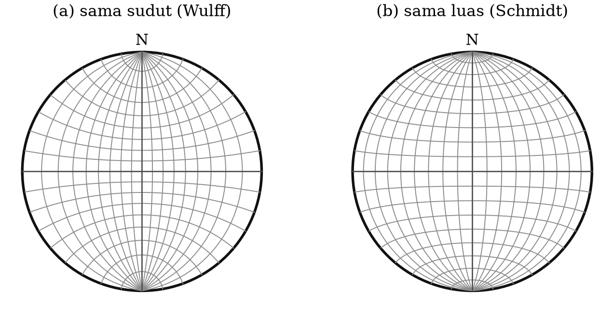

::: {custom-style="ImageCaption"}
**Gambar 5.6.** Proyeksi stereo-net: (a) sama sudut (jaring Wulff), dan (b)
sama luas (jaring Schmidt).
:::

Berdasarkan bagian bola yang dipakai, ada dua pilihan: setengah bola bagian
atas (*upper hemisphere*) dan setengah bola bagian bawah (*lower hemisphere*).
Walaupun keduanya dapat dipakai, dalam seismologi orang umumnya memilih
setengah bola bagian bawah, dan gambarnya dibayangkan terletak pada permukaan
cekungan setengah bola itu.

Orientasi **garis** ditentukan oleh dua parameter:

- **Trend** — azimut vektor garis, dalam derajat, diukur dari utara ke timur;
- **Plunge** — sudut kemiringan vektor garis, dalam derajat, diukur dari
  bidang horizontal.

Orientasi **bidang** ditentukan oleh dua parameter:

- **Strike** (jurus) — arah garis horizontal yang terletak pada bidang itu,
  dalam derajat dari utara ke timur, dengan konvensi menghadap arah yang
  memberikan kemiringan ke kanan;
- **Dip** (kemiringan) — sudut kemiringan bidang diukur tegak lurus strike.

Gambar 5.7 menunjukkan orientasi sebuah garis yang menjadi sebuah titik pada
proyeksi stereo-net, dan Gambar 5.8 menunjukkan orientasi sebuah bidang yang
menjadi sebuah garis lengkung.

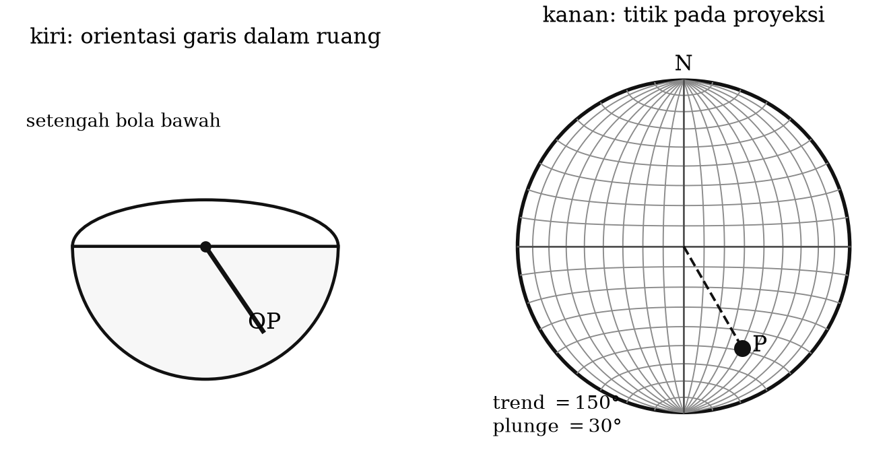

::: {custom-style="ImageCaption"}
**Gambar 5.7.** Kiri: orientasi garis OP digambarkan pada proyeksi stereo-net.
Kanan: pengukuran trend dan plunge; di sini trend = 150° dan plunge = 30°.
:::

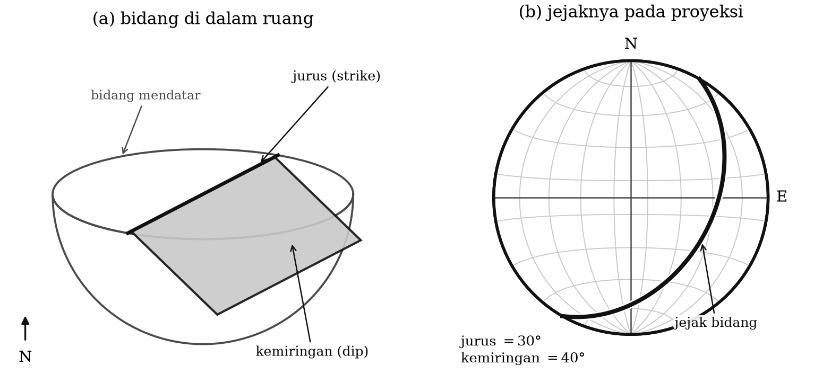

::: {custom-style="ImageCaption"}
**Gambar 5.8.** Kiri: orientasi bidang OAB digambarkan pada proyeksi
stereo-net. Kanan: pengukuran strike dan dip; di sini strike = 30° dan
dip = 40°.
:::

## 5.3 Penyelesaian bidang sesar memakai gelombang P

Dengan konsep bahwa polaritas gerakan pertama gelombang P kekal sepanjang
penjalarannya, distribusi kompresi dan dilatasi pada bola fokus dapat
diturunkan dari distribusinya di permukaan bumi. Sebuah stasiun di permukaan
bumi memiliki hubungan satu-satu dengan sebuah titik pada bola fokus. Posisi
titik itu ditentukan oleh:

- **trend** = azimut stasiun terhadap gempa, $A_{ES}$;
- **plunge** = **sudut tinggal landas** (*take-off angle*) gelombang pada
  sumber, $i_h$.

Sudut tinggal landas ditentukan dengan hukum Snell untuk bumi yang membola:

$$\frac{R_0 \sin i_0}{v_0} = \frac{R_h \sin i_h}{v_h} = p \text{~~~~~~~~~~~~~~~~} (5.1)$$

dengan $R_0$ jejari bumi, $R_h$ jarak radial hiposenter dari pusat bumi, $v_0$
kecepatan gelombang P di bawah permukaan bumi, $v_h$ kecepatan di hiposenter,
$i_0$ sudut datang gelombang di stasiun, $i_h$ sudut tinggal landas di
hiposenter, dan $p$ parameter gelombang (Gambar 5.9). Parameter gelombang
ditentukan dari

$$p = \frac{dT}{d\Delta} \text{~~~~~~~~~~~~~~~~} (5.2)$$

sehingga dapat diperoleh dari sebarang tabel waktu tempuh empiris
(Jeffreys–Bullen, Herrin, atau — pada masa kini — iasp91 dan ak135). Kecepatan
gelombang P sebagai fungsi kedalaman tersedia dalam tabel yang sama.

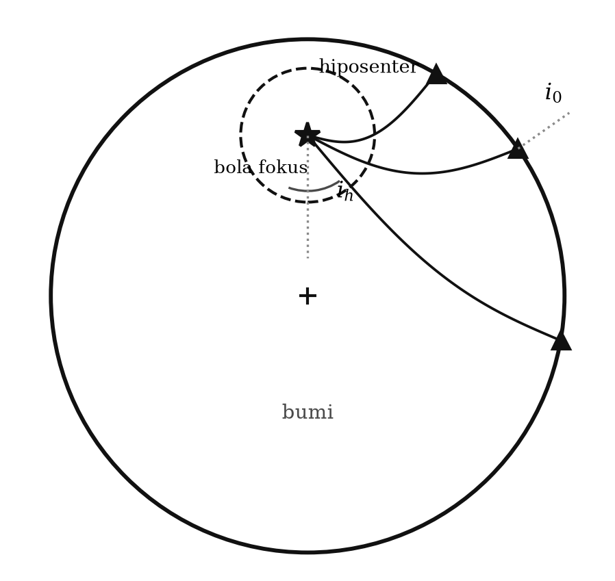

::: {custom-style="ImageCaption"}
**Gambar 5.9.** Bola fokus, sudut tinggal landas di pusat gempa, sudut datang
di permukaan bumi, dan konsep jarak ekstended.
:::

Setelah azimut, sudut tinggal landas, dan polaritas gerakan pertama diperoleh,
langkah berikutnya adalah memetakan himpunan data itu pada bola fokus dengan
proyeksi stereo-net **sama luas setengah bola bawah** — dipilih setengah bola
bawah karena sebagian besar data berkaitan dengan gelombang yang meninggalkan
hiposenter ke arah bawah, dan dipilih sama luas karena distribusi titik pada
bola fokus lebih rapat di bagian tengah sehingga daya pisah di tengah lebih
diperlukan.

Polaritas dibedakan dengan simbol berbeda, misalnya lingkaran untuk kompresi
dan segitiga untuk dilatasi. Kemudian garis-garis nodal ditarik, karena garis
ini memisahkan distribusi kompresi dan dilatasi menjadi empat kuadran. Sifat
ortogonal kedua garis nodal sangat membantu penarikannya ketika data terbatas.

Dua garis nodal itu mewakili dua bidang nodal, dan salah satunya adalah bidang
sesar. Sayangnya **tidak dapat ditentukan yang mana** hanya dari data
polaritas P — inilah **ambiguitas bidang sesar**, persoalan yang melekat pada
metode ini dan yang, seperti akan kita lihat pada Bab 14, menjadi inti
perdebatan mengenai gempa Yogyakarta 2006. Meskipun demikian, orientasi
**sumbu tekanan** (sumbu P) dan **sumbu tarikan** (sumbu T) dapat ditentukan
dengan pasti: titik P berada di tengah kuadran dilatasi, dan titik T di tengah
kuadran kompresi.

::: {custom-style="Kotak"}
**Kotak 5.1 — Jangan tertukar.** Sumbu **P** (*pressure*) terletak di tengah
kuadran **dilatasi**, dan sumbu **T** (*tension*) di tengah kuadran
**kompresi**. Ini terasa terbalik pada pandangan pertama, tetapi masuk akal
bila diingat bahwa gerakan pertama yang menjauhi sumber (kompresi) terjadi ke
arah tempat batuan "melenting keluar", yaitu ke arah sumbu tarikan. Kekeliruan
ini adalah salah satu yang paling sering terjadi dalam ujian.
:::

Tabel 5.1 memuat contoh himpunan data yang diperlukan untuk penyelesaian
bidang sesar, dan Gambar 5.10 adalah penyelesaiannya.

Table: **Tabel 5.1.** Contoh himpunan data untuk penyelesaian bidang sesar. Δ = jarak episenter $\Delta$; Az = azimut stasiun $A_{ES}$; Pol = polaritas gerakan pertama P (C = kompresi, D = dilatasi); i = sudut tinggal landas $i_h$. Kolom kanan adalah lanjutan kolom kiri. Data diambil dari bahan ajar asli Waluyo.

| Sta | Δ (°) | Az (°) | Pol | i (°) | Sta | Δ (°) | Az (°) | Pol | i (°) |
|:--|--:|--:|:-:|--:|:--|--:|--:|:-:|--:|
| DAV | 5,32 | 350 | D | 71,36 | SHK | 33,05 | 9 | D | 37,21 |
| CGP | 6,84 | 345 | D | 71,06 | BAL | 33,58 | 195 | C | 37,06 |
| BKB | 10,11 | 252 | C | 70,05 | OSK | 33,72 | 14 | D | 37,02 |
| JAY | 14,80 | 107 | C | 65,43 | KLB | 34,26 | 193 | C | 36,87 |
| KHKI | 14,87 | 227 | C | 65,24 | MUN | 35,01 | 195 | C | 36,68 |
| BAG | 15,64 | 338 | D | 63,61 | RMQ | 35,39 | 144 | C | 36,56 |
| TZZ | 16,27 | 116 | C | 61,84 | CD2 | 36,08 | 326 | D | 36,31 |
| SZP | 16,74 | 339 | D | 60,53 | MAJO | 36,20 | 16 | D | 36,27 |
| TRT | 16,79 | 236 | C | 60,34 | STK | 36,43 | 158 | C | 36,20 |
| MYK | 22,86 | 357 | D | 43,27 | AIK | 37,60 | 15 | C | 35,81 |
| WB3 | 22,93 | 161 | C | 43,13 | ADE | 38,33 | 164 | C | 35,57 |
| QIZ | 23,66 | 317 | D | 41,86 | YAM | 38,41 | 18 | D | 35,54 |
| MBL | 23,76 | 196 | C | 41,69 | BRS | 38,49 | 141 | C | 35,52 |
| NAH | 24,28 | 3 | D | 40,91 | KHM | 39,22 | 310 | C | 35,29 |
| MVI | 24,30 | 10 | C | 40,89 | SNY | 39,92 | 357 | D | 35,03 |
| KMI | 24,38 | 1 | D | 40,76 | COO | 40,27 | 145 | D | 34,93 |
| NGO | 24,57 | 3 | D | 40,51 | VLA | 41,40 | 6 | D | 34,55 |
| ISO | 25,77 | 151 | D | 39,28 | CNB | 42,67 | 152 | C | 34,14 |
| SNG | 26,37 | 282 | D | 38,85 | TOO | 42,95 | 158 | C | 34,06 |
| LOE | 28,88 | 304 | D | 38,12 | KKN | 47,13 | 307 | D | 32,58 |
| CTAO | 29,12 | 139 | C | 38,11 | KUR | 47,14 | 21 | D | 32,58 |
| NST | 29,44 | 299 | D | 38,06 | YSS | 47,17 | 15 | D | 32,57 |
| NOB | 30,98 | 8 | D | 37,71 | TAU | 48,30 | 160 | D | 32,18 |
| BDT | 31,10 | 301 | D | 37,70 | KOD | 49,45 | 282 | D | 31,79 |
| CHTO | 31,88 | 304 | D | 34,49 | | | | | |

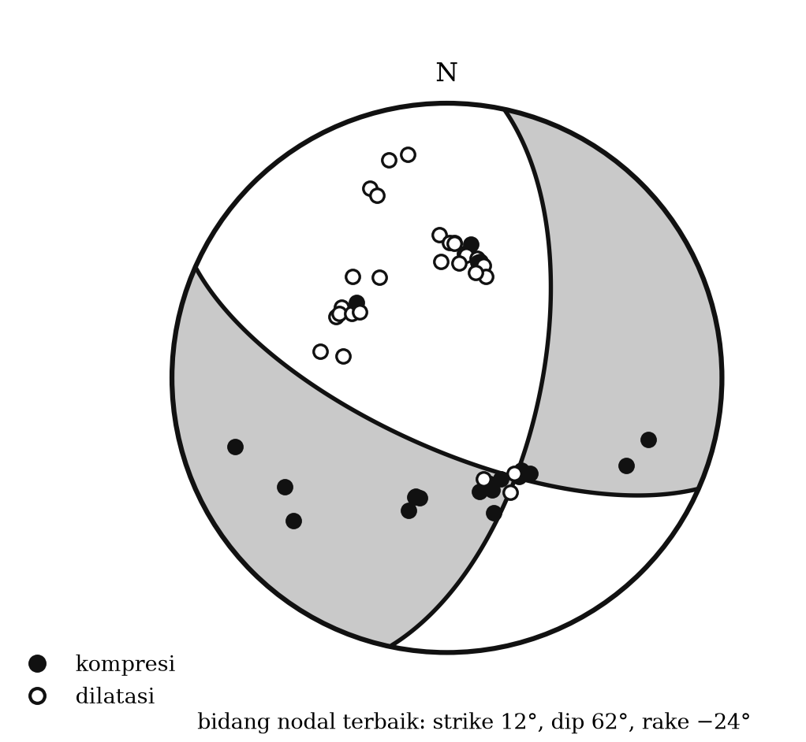

::: {custom-style="ImageCaption"}
**Gambar 5.10.** Penyelesaian bidang sesar berdasarkan himpunan data Tabel
5.1, digambar pada proyeksi sama luas setengah bola bawah. Lingkaran terbuka =
dilatasi, lingkaran terisi = kompresi. Dua bidang nodal ditarik sehingga
memisahkan keduanya, dan sumbu P serta T ditandai.
:::

Untuk memudahkan pembacaan, kuadran kompresi biasanya diarsir atau diblok
hitam. Dari pengarsiran itu orang dapat langsung membaca arah sumbu tekanan
dan tarikan, serta jenis sesar yang dominan. Gambar 5.11 memberikan contoh
untuk tiga jenis sesar murni: sesar geser (*strike slip*), sesar naik
(*reverse*), dan sesar turun (*normal*). Pada umumnya sesar merupakan
kombinasi antara sesar geser dan sesar naik atau turun (*oblique*).

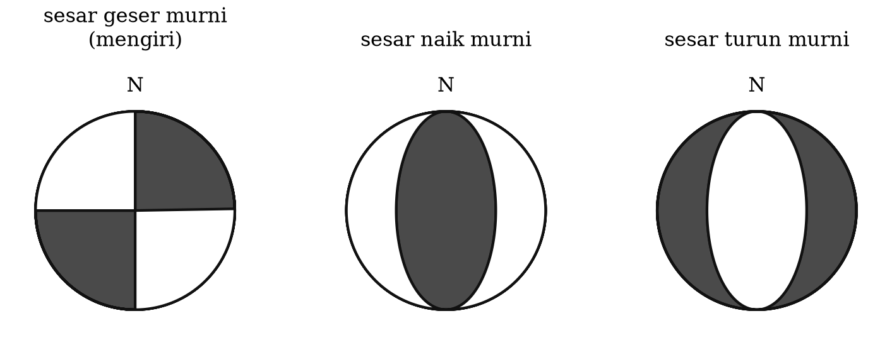

::: {custom-style="ImageCaption"}
**Gambar 5.11.** Diagram bola fokus (*beach ball*) untuk berbagai jenis sesar,
beserta arah sumbu P dan T.
:::

::: {custom-style="Kotak"}
**Kotak 5.2 — Cara cepat membaca bola fokus.** Empat pola yang perlu dikenali
dalam sekejap:
**(1) Bola dengan bidang gelap di tengah menyerupai "bola pantai" dengan
kuadran hitam di tepi kiri-kanan** → sesar naik (*thrust*), khas zona
subduksi, misalnya gempa megathrust Aceh 2004.
**(2) Bola dengan bagian putih di tengah dan hitam di tepi** → sesar turun
(*normal*), khas daerah regangan dan busur luar.
**(3) Bola dengan empat kuadran berselang-seling, dua garis nodal hampir
tegak lurus melewati pusat** → sesar geser, misalnya gempa Yogyakarta 2006 dan
Palu 2018.
**(4) Pola yang tidak dapat dipisahkan menjadi empat kuadran** → mekanisme
bukan kopel ganda; perlu dicurigai sumber vulkanik, longsoran, atau ledakan.
:::

## 5.4 Parameter mekanisme sumber

Penyelesaian bidang sesar diwakili oleh parameter-parameternya:

- strike, dip, dan **rake** (atau *slip*) bidang nodal 1;
- strike, dip, dan rake bidang nodal 2;
- trend dan plunge sumbu tekanan (P);
- trend dan plunge sumbu tarikan (T).

**Rake** adalah sudut yang dibentuk oleh arah slip penyesaran terhadap arah
strike, diukur pada bidang sesar. Konvensi Aki–Richards yang dipakai secara
internasional:

| Rake | Jenis sesar |
|:--|:--|
| $0°$ | Geser mengiri (*left-lateral / sinistral*) |
| $\pm 180°$ | Geser menganan (*right-lateral / dextral*) |
| $+90°$ | Naik (*reverse / thrust*) |
| $-90°$ | Turun (*normal*) |

Dari sepuluh parameter di atas, sesungguhnya hanya ada **empat yang saling
bebas** (misalnya strike, dip, rake, dan momen skalar); setiap parameter lain
dapat diturunkan dari empat itu. Gambar 5.12 menunjukkan bagaimana parameter
tersebut dibaca dari diagram bola fokus.

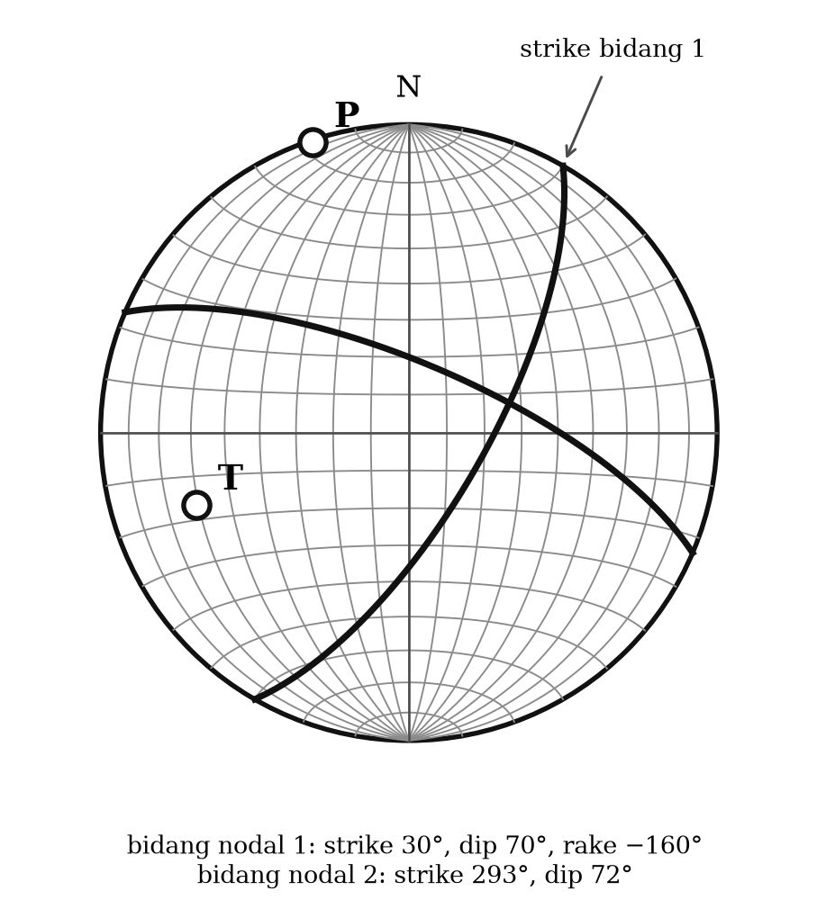

::: {custom-style="ImageCaption"}
**Gambar 5.12.** Penyelesaian bidang sesar dan penentuan parameter-
parameternya pada proyeksi stereo-net.
:::

## 5.5 Penggunaan polarisasi gelombang S

Polarisasi gelombang S dapat pula dipakai. Gelombang S dianggap terpolarisasi
linear dan sudut polarisasinya kekal sepanjang penjalaran, sehingga dapat
diukur di sepanjang kereta fase S — bukan hanya pada gerakan pertamanya
seperti pada gelombang P. Karena itu ketelitiannya cukup baik walaupun fase S
bukan kedatangan pertama.

Sudut polarisasi gelombang S mempola pada permukaan bola fokus sesuai jenis
sistem gaya penyebabnya:

1. **Kopel tunggal.** Arah polarisasi terletak sepanjang lingkaran besar,
   mengumpul dan menyebar di dua titik kutub gerakan; pada garis nodal, arah
   polarisasi sejajar atau tegak lurus garis nodal bersangkutan (Gambar
   5.13a). Garis nodal yang arah polarisasinya sejajar melukiskan bidang sesar
   yang sesungguhnya. **Jadi untuk sumber kopel tunggal, ambiguitas bidang
   sesar dapat dipecahkan.**
2. **Kopel ganda.** Arah polarisasi mengumpul di dua titik (sumbu tarikan) dan
   menyebar di dua titik lain (sumbu tekanan); pada garis nodal, arah
   polarisasi selalu tegak lurus garis nodal (Gambar 5.13b). **Untuk sumber
   kopel ganda, bidang sesar tidak dapat ditentukan dari polarisasi gelombang
   S.**

Karena gempa pada umumnya bersumber kopel ganda, penggunaan polarisasi S
umumnya tidak dapat memecahkan ambiguitas bidang sesar; kegunaannya adalah
untuk **memeriksa** penyelesaian berdasarkan polaritas P, dan untuk
**membedakan jenis sistem gaya**.

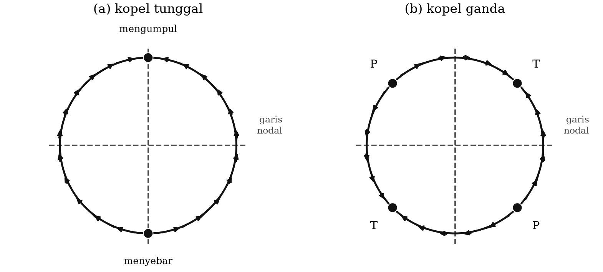

::: {custom-style="ImageCaption"}
**Gambar 5.13.** Arah polarisasi gelombang S di permukaan bola fokus untuk
sumber (a) kopel tunggal dan (b) kopel ganda.
:::

Secara teknis sudut polarisasi $\varepsilon$ ditentukan dengan

$$\tan\varepsilon = \frac{U_{SH}}{U_{SV}} \text{~~~~~~~~~~~~~~~~} (5.3)$$

dengan $U_{SH}$ dan $U_{SV}$ amplitudo komponen SH dan SV. Keduanya tidak
dapat diukur langsung dari seismogram, melainkan harus diturunkan dari
komponen vertikal, utara–selatan, dan timur–barat, yaitu $U_Z$, $U_N$, dan
$U_E$. Dari $U_N$ dan $U_E$ didefinisikan pergeseran radial dan tangensial:

$$U_R = U_N \cos\beta + U_E \sin\beta \text{~~~~~~~~~~~~~~~~} (5.4)$$

$$U_T = -U_N \sin\beta + U_E \cos\beta \text{~~~~~~~~~~~~~~~~} (5.5)$$

dengan $\beta$ **back azimuth**, yaitu arah dari stasiun kembali ke episenter.
Tanda untuk $U_Z$, $U_N$, dan $U_E$ positif berturut-turut untuk arah ke atas,
ke utara, dan ke timur; sehingga $U_R$ positif untuk arah menjauhi episenter,
dan $U_T$ positif untuk arah ke kanan terhadap arah penjalaran. Jika $U_{SV}$
diambil positif untuk arah ke atas, ia berlawanan tanda dengan $U_R$ karena
gelombang datang dari bawah, dan dengan sudut datang di permukaan $i_0$
berlaku

$$U_{SV} = U_Z \sin i_0 - U_R \cos i_0 \text{~~~~~~~~~~~~~~~~} (5.6)$$

$$U_{SH} = U_T \text{~~~~~~~~~~~~~~~~} (5.7)$$

sehingga

$$\tan\varepsilon = \frac{U_T}{U_Z \sin i_0 - U_R\cos i_0} \text{~~~~~~~~~~~~~~~~} (5.8)$$

Stauder dan Bollinger (1964) menghitung pengaruh sudut datang $i_0$ pada
Persamaan (5.8) dan mendapatkan bahwa perbedaan maksimum untuk $\varepsilon$
dengan dan tanpa faktor $\cos i_0$ hanya sekitar 5°. Karena perkiraan galat
perhitungan $\varepsilon$ yang berasal dari pengukuran amplitudo pada
seismogram berada dalam orde 10°, faktor $\cos i_0$ dapat diabaikan.

::: {custom-style="Kotak"}
**Catatan Pemutakhiran 5.1 — Batas naskah asli.** Naskah asli Waluyo berakhir
pada pembahasan polarisasi gelombang S ini. Subbab 5.6 sampai 5.9 berikut
adalah tambahan penyunting, yang memuat kerangka tensor momen — bahasa baku
yang dipakai seluruh katalog mekanisme sumber sekarang — beserta penerapannya
pada gempa-gempa Indonesia.
:::

## 5.6 Tensor momen seismik

Uraian empat kuadran pada Subbab 5.1 bersifat geometris. Perumusan yang setara
tetapi jauh lebih umum dan lebih mudah dipakai dalam inversi adalah **tensor
momen seismik**.

Setiap sumber seismik yang berdimensi jauh lebih kecil daripada panjang
gelombang yang diamati dapat diwakili oleh sistem sembilan pasang gaya
ekuivalen — yaitu sebuah tensor simetrik $3\times3$:

$$\mathbf{M} = \begin{pmatrix} M_{xx} & M_{xy} & M_{xz} \\ M_{xy} & M_{yy} & M_{yz} \\ M_{xz} & M_{yz} & M_{zz}\end{pmatrix} \text{~~~~~~~~~~~~~~~~} (5.9)$$

Karena simetrik, tensor ini memiliki **enam komponen bebas**. Simpangan tanah
yang teramati merupakan fungsi linear dari komponen-komponen ini,

$$u_n(\mathbf{x},t) = M_{pq} * G_{np,q}(\mathbf{x},t) \text{~~~~~~~~~~~~~~~~} (5.10)$$

dengan $G_{np,q}$ turunan fungsi Green medium. **Kelinearan inilah kunci
seluruh seismologi sumber modern**: karena $u_n$ linear terhadap $M_{pq}$,
tensor momen dapat diperoleh dengan inversi kuadrat terkecil biasa, sedangkan
strike, dip, dan rake masuk secara taklinear dan memerlukan pencarian.

Untuk sesar bidang dengan normal $\hat{n}$ dan arah slip $\hat{d}$, tensor
momennya adalah

$$M_{pq} = M_0\left(n_p d_q + n_q d_p\right) \text{~~~~~~~~~~~~~~~~} (5.11)$$

yang setara persis dengan sumber kopel ganda. Momen skalar diperoleh dari

$$M_0 = \frac{1}{\sqrt{2}}\left(\sum_{p,q} M_{pq}^{2}\right)^{1/2} \text{~~~~~~~~~~~~~~~~} (5.12)$$

dan magnitudo momen dari hubungan $M_w$ pada Subbab 4.5.4.

### Dekomposisi tensor momen

Tensor momen umum tidak harus berupa kopel ganda murni. Lazimnya ia
diuraikan menjadi tiga bagian:

$$\mathbf{M} = \underbrace{\mathbf{M}^{\text{ISO}}}_{\text{isotropik}} + \underbrace{\mathbf{M}^{\text{DC}}}_{\text{kopel ganda}} + \underbrace{\mathbf{M}^{\text{CLVD}}}_{\text{kopel linear vektor terkompensasi}} \text{~~~~~~~~~~~~~~~~} (5.13)$$

dengan bagian isotropiknya

$$\mathbf{M}^{\text{ISO}} = \tfrac{1}{3}\,(\mathrm{tr}\,\mathbf{M})\,\mathbf{I} \text{~~~~~~~~~~~~~~~~} (5.14)$$

dan dua suku sisanya bersama-sama membentuk bagian **deviatorik**
$\mathbf{M}^{\text{DEV}} = \mathbf{M} - \mathbf{M}^{\text{ISO}}$, yang jejaknya nol.
Pemisahan bagian deviatorik menjadi DC dan CLVD dilakukan atas dasar nilai
eigennya: bila nilai eigen deviatorik diurutkan
$\sigma_1 \ge \sigma_2 \ge \sigma_3$, maka
$\varepsilon = -\sigma_2/\max(|\sigma_1|, |\sigma_3|)$ berharga 0 untuk kopel
ganda murni dan 0,5 untuk CLVD murni.

Bagian **isotropik** ($\mathrm{tr}\,\mathbf{M} \neq 0$) menandakan perubahan
volume: ledakan, implosi, atau runtuhan rongga. Bagian **CLVD** dapat muncul
dari geometri sesar yang rumit, dari rupture pada bidang melengkung, atau dari
proses vulkanik seperti pembukaan retakan berisi fluida. Untuk gempa tektonik
biasa, komponen DC mendominasi (biasanya di atas 70–80 persen).

Dua penerapan praktis dari dekomposisi ini sangat penting bagi Indonesia:

- **Pemantauan ledakan.** Komponen isotropik yang besar dan positif adalah
  penanda ledakan — dasar verifikasi CTBT.
- **Seismologi gunung api.** Gempa di bawah Merapi dan gunung api aktif lain
  sering memperlihatkan komponen non-DC yang besar, yang ditafsirkan sebagai
  pergerakan fluida dan pembukaan retakan. Ini dibahas lebih lanjut dalam Bab
  12.

### Katalog mekanisme sumber

- **Global CMT** — katalog tensor momen untuk gempa $M_w \gtrsim 5$ sejak
  1976, hasil inversi gelombang badan dan permukaan periode panjang. Inilah
  katalog yang paling banyak dipakai dalam penelitian tektonik.
- **USGS W-phase dan body-wave moment tensor** — tersedia dalam hitungan menit
  setelah gempa besar; metode W-phase (Kanamori & Rivera, 2008) memakai fase
  periode sangat panjang antara P dan S sehingga tidak menjenuh bahkan untuk
  gempa $M_w$ 9.
- **BMKG** — menghitung mekanisme sumber untuk gempa signifikan di wilayah
  Indonesia dan menyediakannya melalui repositori data gempa.

## 5.7 Dari sumber titik ke sumber terbatas

Tensor momen memperlakukan gempa sebagai titik. Untuk gempa besar, anggapan
itu runtuh: panjang rupture gempa $M_w$ 7,5 mencapai seratus kilometer lebih,
dan proses rupture berlangsung puluhan detik. Beberapa besaran yang memerikan
sumber terbatas:

**Waktu paruh sumber** (*half duration*) $\tau$, yang secara kasar sebanding
dengan $M_0^{1/3}$.

**Kecepatan rupture** $v_r$, umumnya 0,7–0,9 kali $v_s$. Kejadian dengan
$v_r > v_s$ disebut **supershear**, dan gempa Palu 2018 adalah salah satu
contoh yang paling banyak dibahas di dunia.

**Tegangan lepas** (*stress drop*) $\Delta\sigma$, yaitu selisih tegangan
sebelum dan sesudah gempa. Untuk sesar melingkar berjejari $r$,

$$\Delta\sigma = \frac{7}{16}\frac{M_0}{r^{3}} \text{~~~~~~~~~~~~~~~~} (5.14)$$

Nilainya untuk gempa tektonik umumnya 1–10 MPa dan hampir tidak bergantung
magnitudo — kenyataan yang mengejutkan dan menjadi dasar hukum skala gempa.

**Inversi sesar terbatas** (*finite fault inversion*) membagi bidang sesar
menjadi banyak petak dan menyelesaikan slip pada setiap petak sebagai fungsi
waktu, dengan menggabungkan data seismik teleseismik, gerakan kuat, GNSS, dan
InSAR. Hasilnya adalah peta slip yang memperlihatkan **asperitas**, yaitu
petak-petak yang melepaskan sebagian besar momen.

## 5.8 Mekanisme sumber gempa-gempa Indonesia

Table: **Tabel 5.2.** Mekanisme sumber beberapa gempa penting di Indonesia. Nilai magnitudo dan mekanisme mengikuti katalog GCMT/USGS/BMKG; angka dibulatkan.

| Gempa | Tanggal | $M_w$ | Jenis mekanisme | Sumber tektonik |
|:--|:--|:--|:--|:--|
| Aceh–Andaman | 26 Des 2004 | 9,1–9,3 | Naik (*megathrust*) | Bidang kontak lempeng Sunda |
| Nias–Simeulue | 28 Mar 2005 | 8,6 | Naik | Megathrust Sunda |
| Yogyakarta | 27 Mei 2006 | 6,3 | Geser, jurus ± TL–BD | Sesar kerak di Cekungan Yogyakarta |
| Pangandaran | 17 Jul 2006 | 7,7 | Naik, dangkal, lambat | *Tsunami earthquake* di zona subduksi |
| Padang | 30 Sep 2009 | 7,6 | Naik/oblik dalam lempeng | Lempeng menunjam (*intraslab*) |
| Lombok | Jul–Ags 2018 | 6,4–6,9 | Naik | Sesar naik belakang busur Flores |
| Palu | 28 Sep 2018 | 7,5 | Geser mengiri, supershear | Sesar Palu–Koro |
| Mamuju–Majene | 15 Jan 2021 | 6,2 | Naik | Sesar naik Sulawesi Barat |
| Cianjur | 21 Nov 2022 | 5,6 | Geser dangkal | Sesar kerak Jawa Barat |

Gambar 5.14 menyandingkan bola fokus lima di antaranya. Bentuknya saja sudah
bercerita: bola fokus **sesar naik berkemiringan landai** hampir seluruhnya
gelap, karena hampir semua arah tinggal landas jatuh di kuadran tekanan;
**sesar naik berkemiringan sedang** menyisakan sabuk terang di kedua tepinya;
sedangkan **sesar geser hampir tegak** membentuk empat kuadran yang hampir
sama besar dengan dua bidang nodal yang hampir saling tegak lurus. Membiasakan
mata pada tiga bentuk ini adalah keterampilan dasar yang dipakai setiap hari.

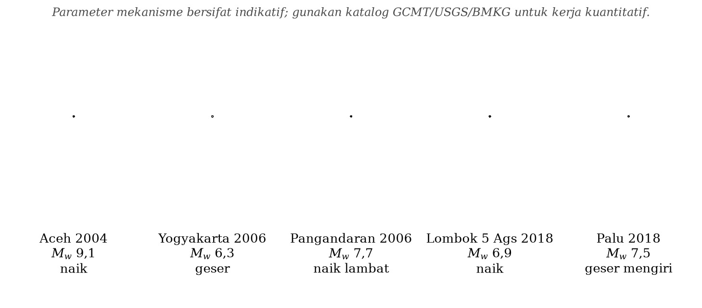

::: {custom-style="ImageCaption"}
**Gambar 5.14.** Bola fokus lima gempa penting di Indonesia (proyeksi
belahan bawah, utara di atas): sesar naik landai pada bidang kontak
antarlempeng (Aceh 2004, Pangandaran 2006), sesar naik berkemiringan sedang
pada belakang busur (Lombok 2018), dan sesar geser hampir tegak pada sesar
kerak (Yogyakarta 2006, Palu 2018).
:::

::: {custom-style="Kotak"}
**Kotak 5.3 — Mekanisme gempa Yogyakarta 2006 dan ambiguitas yang berarti.**

Penyelesaian mekanisme sumber gempa 27 Mei 2006 menunjukkan sesar **geser**
yang hampir tegak, dengan dua bidang nodal: satu berjurus kira-kira timur
laut–barat daya, dan satu lagi kira-kira barat laut–tenggara. Secara
seismologi murni, keduanya sama sahih — inilah ambiguitas bidang sesar yang
dibahas pada Subbab 5.3.

Yang membuat kasus ini istimewa adalah bahwa ambiguitas itu memiliki
konsekuensi nyata. Bidang berjurus timur laut–barat daya bersesuaian dengan
arah umum **Sesar Opak**, struktur yang sudah lama dikenal dan tergambar pada
peta geologi. Selama beberapa hari sesudah gempa, penjelasan resmi memang
menyebut Sesar Opak sebagai penyebabnya.

Namun ketika data gempa susulan dari jaringan sementara direlokasi, dan ketika
deformasi permukaan dipetakan dengan InSAR, gambarannya berubah: pusat
aktivitas gempa susulan dan pusat deformasi maksimum **tidak berimpit dengan
jejak Sesar Opak**, melainkan bergeser ke arah timur sejauh sekitar 10–20 km,
pada struktur yang sebelumnya belum terpetakan. Penafsiran ini didukung oleh
sejumlah penelitian, antara lain analisis InSAR ALOS/PALSAR dan analisis
sekuens gempa susulan (Anggraini, 2013).

**Tiga pelajaran metodologis:**

1. Mekanisme sumber dari polaritas P memberi tahu **orientasi** bidang, tetapi
   tidak memberi tahu **letak** bidang. Untuk mengetahui letaknya, diperlukan
   data lain: sebaran gempa susulan, geodesi, atau geologi.
2. Kesesuaian antara satu bidang nodal dan sebuah sesar yang sudah dikenal
   **bukan bukti** bahwa sesar itulah yang pecah. Godaan untuk mencocokkan
   hasil dengan struktur yang sudah tergambar di peta adalah salah satu jebakan
   penafsiran yang paling umum dalam seismologi.
3. Gempa merusak dapat berasal dari sesar yang belum ada dalam peta bahaya.
   Implikasinya bagi mitigasi bersifat langsung, dan menjadi salah satu alasan
   pemutakhiran besar peta sumber gempa Indonesia pada 2017 (Bab 10).

Pembahasan lengkap kasus ini diberikan pada Bab 14.
:::

## 5.9 Alur kerja penentuan mekanisme sumber masa kini

1. **Kumpulkan bentuk gelombang** tiga komponen dari jaringan lokal, regional,
   dan global lewat layanan data FDSN.
2. **Koreksi instrumen** dan tapis sesuai pita yang sesuai dengan magnitudo:
   makin besar gempanya, makin panjang perioda yang dipakai.
3. **Tentukan lokasi dan kedalaman** lebih dahulu; hasil tensor momen sangat
   peka terhadap kedalaman.
4. **Untuk gempa kecil sampai sedang:** pakai polaritas gerakan pertama P
   (perangkat seperti FOCMEC atau HASH), bila perlu ditambah rasio amplitudo
   S/P untuk mempersempit penyelesaian.
5. **Untuk gempa sedang sampai besar:** lakukan inversi tensor momen bentuk
   gelombang lengkap pada jarak regional, atau inversi W-phase untuk gempa
   besar.
6. **Periksa mutu**: kecocokan bentuk gelombang, persentase komponen DC,
   kestabilan hasil terhadap perubahan kedalaman dan model kecepatan, serta
   kesesuaian dengan katalog lain.
7. **Tafsirkan secara tektonik**: bandingkan sumbu P dan T dengan medan
   tegangan regional, dan bandingkan bidang nodal dengan struktur yang
   diketahui — dengan tetap mengingat peringatan pada Kotak 5.3.

::: {custom-style="Ringkasan"}
**Ringkasan Bab 5**

1. Teori bingkas elastik Reid menyatakan gempa terjadi karena pelepasan
   mendadak regangan elastik melalui penyesaran; penyesaran menyebabkan gempa,
   bukan sebaliknya.
2. Gerakan pertama gelombang P terdistribusi dalam empat kuadran kompresi dan
   dilatasi yang dipisahkan dua bidang nodal saling tegak lurus.
3. Polaritas P kekal sepanjang lintasan, sehingga dapat diproyeksikan ke bola
   fokus memakai azimut dan sudut tinggal landas, lalu dipetakan dengan
   proyeksi sama luas setengah bola bawah.
4. Salah satu bidang nodal adalah bidang sesar, tetapi data polaritas P saja
   tidak dapat menentukan yang mana — ambiguitas bidang sesar.
5. Sumbu P berada di tengah kuadran dilatasi, sumbu T di tengah kuadran
   kompresi.
6. Mekanisme diwakili oleh strike, dip, dan rake; hanya empat parameter yang
   saling bebas.
7. Tensor momen seismik adalah perumusan modern yang setara namun lebih umum,
   dengan enam komponen bebas dan hubungan linear terhadap simpangan
   teramati.
8. Dekomposisi tensor momen menjadi ISO, DC, dan CLVD memungkinkan pembedaan
   gempa tektonik, ledakan, dan proses vulkanik.
9. Gempa Yogyakarta 2006 adalah contoh baku bahwa mekanisme sumber menentukan
   orientasi bidang, bukan letaknya.
:::

::: {custom-style="Soal"}
**Soal Latihan**

**5.1** Sebuah sesar memiliki strike 45°, dip 88°, dan rake 178°. Tentukan
jenis sesarnya dan hitung parameter bidang nodal pasangannya.

**5.2** Dengan data Tabel 5.1, plot semua stasiun pada proyeksi sama luas
setengah bola bawah dan tarik dua bidang nodal yang memisahkan kompresi dari
dilatasi. Tentukan strike, dip, dan rake kedua bidang, serta trend dan plunge
sumbu P dan T. Bandingkan hasil Anda dengan Gambar 5.10.

**5.3** Jelaskan mengapa proyeksi sama luas lebih disukai daripada proyeksi
sama sudut untuk penyelesaian bidang sesar, dengan mengacu pada distribusi
sudut tinggal landas dalam Tabel 5.1.

**5.4** Sebuah gempa memiliki tensor momen (dalam $10^{18}$ N·m):
$M_{xx}=-1{,}2$, $M_{yy}=1{,}0$, $M_{zz}=0{,}2$, $M_{xy}=2{,}8$,
$M_{xz}=0{,}1$, $M_{yz}=-0{,}3$. (a) Hitung momen skalar dan $M_w$. (b) Hitung
jejak tensornya dan simpulkan apakah ada komponen isotropik. (c) Perkirakan
jenis sesarnya.

**5.5** Turunkan Persamaan (5.11) untuk sesar geser vertikal dengan strike
sepanjang sumbu $x$, dan tunjukkan bahwa hanya $M_{xy}$ yang tidak nol.

**5.6** Sebuah gempa $M_w$ 6,3 memiliki $\Delta\sigma = 3$ MPa. Perkirakan
jejari sesarnya dengan Persamaan (5.14), lalu bandingkan dengan perkiraan
dimensi sesar pada Kotak 4.3.

**5.7** Ambil solusi GCMT untuk gempa Palu 2018 dan gempa Lombok 5 Agustus
2018. Gambarkan bola fokusnya, tentukan jenis sesar masing-masing, dan
jelaskan kaitannya dengan tatanan tektonik setempat.

**5.8** Diskusikan: seandainya jaringan gempa susulan tidak digelar setelah
gempa Yogyakarta 2006, kesimpulan apa mengenai sesar penyebab yang mungkin
tetap dipegang sampai sekarang? Apa implikasinya bagi peta bahaya gempa
Yogyakarta?
:::

::: {custom-style="Bacaan"}
**Bacaan Lanjut**

- Aki, K. & Richards, P. G. (2002). *Quantitative Seismology*, 2nd ed., Bab
  3–4. University Science Books.
- Stein, S. & Wysession, M. (2003). *An Introduction to Seismology,
  Earthquakes, and Earth Structure*, Bab 4. Blackwell.
- Dziewoński, A. M., Chou, T.-A. & Woodhouse, J. H. (1981). Determination of
  earthquake source parameters from waveform data. *Journal of Geophysical
  Research*, 86, 2825–2852.
- Ekström, G., Nettles, M. & Dziewoński, A. M. (2012). The global CMT project
  2004–2010. *Physics of the Earth and Planetary Interiors*, 200–201, 1–9.
- Kanamori, H. & Rivera, L. (2008). Source inversion of W phase. *Geophysical
  Journal International*, 175, 222–238.
- Walter, T. R. dkk. (2008). The 26 May 2006 magnitude 6.4 Yogyakarta
  earthquake south of Mt. Merapi volcano. *Geochemistry, Geophysics,
  Geosystems*, 9, Q05S13.
- Anggraini, A. (2013). *The 26 May 2006 Yogyakarta earthquake, aftershocks
  and interactions*. Disertasi doktor, Universität Potsdam.
:::
