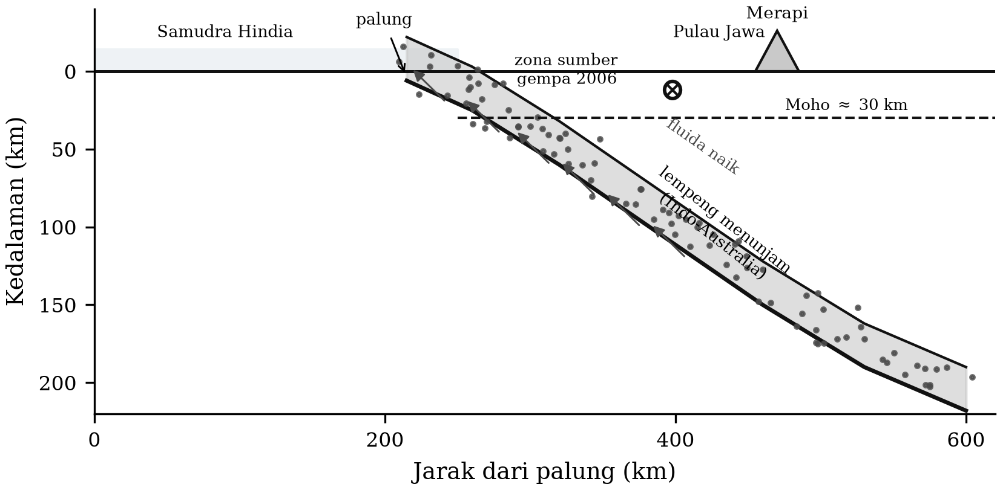

# BAB 6 — STRUKTUR BUMI DARI DATA SEISMIK

::: {custom-style="Tujuan"}
**Tujuan Pembelajaran.** Setelah mempelajari bab ini mahasiswa mampu:
(1) menjelaskan bagaimana model bumi satu dimensi diturunkan dari data waktu
tempuh dan osilasi bebas;
(2) menerangkan prinsip tomografi seismik dan menafsirkan penampang tomografi;
(3) menjelaskan metode *receiver function* dan tomografi derau ambien;
(4) menyebutkan struktur utama bumi beserta kedalamannya; dan
(5) menguraikan struktur kerak dan mantel atas di bawah Jawa Tengah
berdasarkan hasil MERAMEX serta kaitannya dengan gempa Yogyakarta 2006.
:::

## 6.1 Dari waktu tempuh ke model bumi

Bab 3 memperlihatkan bahwa parameter gelombang $p = dT/d\Delta$ dapat dibaca
langsung dari kemiringan kurva waktu tempuh. Herglotz dan Wiechert
menunjukkan bahwa hubungan itu dapat dibalik: dari kurva $T(\Delta)$ yang
lengkap, profil kecepatan terhadap kedalaman dapat dihitung tanpa mengandaikan
bentuk profilnya lebih dahulu. Inversi Herglotz–Wiechert memberikan kedalaman
titik balik berkas dengan parameter $p$ sebagai

$$z(p) = \frac{1}{\pi}\int_{0}^{\Delta_p} \operatorname{arcosh}\!\left(\frac{p_0}{p}\right) d\Delta \text{~~~~~~~~~~~~~~~~} (6.1)$$

Inilah metode yang dipakai Gutenberg, Jeffreys, dan Bullen untuk membangun
model bumi pertama, dan hasilnya — mantel, inti luar cair, inti dalam padat —
ternyata sangat awet.

Inversi ini memiliki dua kelemahan mendasar yang penting untuk diketahui:

1. **Zona kecepatan rendah tidak terdeteksi.** Bila kecepatan menurun terhadap
   kedalaman, berkas gelombang melengkung ke bawah dan tidak pernah kembali ke
   permukaan pada jarak yang bersesuaian, sehingga lapisan itu "tak terlihat"
   dalam data waktu tempuh. Astenosfer justru lapisan semacam ini.
2. **Hanya berlaku untuk bumi bersimetri bola.** Semua penyimpangan lateral —
   yang justru menjadi pokok perhatian tektonik — hilang dalam rata-rata.

Kendala tambahan datang dari **perioda osilasi bebas** (Subbab 3.7), yang peka
terhadap densitas dan tidak hanya terhadap kecepatan. Penggabungan waktu tempuh,
osilasi bebas, dan data massa serta momen inersia bumi menghasilkan model
rujukan **PREM** (Dziewoński & Anderson, 1981).

Table: **Tabel 6.1.** Struktur utama bumi menurut model rujukan PREM/ak135.

| Lapisan | Batas bawah (km) | Ciri seismologi |
|:--|--:|:--|
| Kerak samudra | ~7 | $v_p$ 5–7 km/s, tipis, muda |
| Kerak benua | 30–70 | Berlapis; diskontinuitas Conrad tidak selalu ada |
| Moho | 30–40 (benua) | Lonjakan $v_p$ dari ~7 ke ~8 km/s |
| Litosfer | ~100 | Kaku, ikut bergerak bersama lempeng |
| Astenosfer (zona kecepatan rendah) | ~220 | Penurunan $v_s$; berperan sebagai pelumas tektonik |
| Diskontinuitas 410 km | 410 | Transisi olivin → wadsleyit |
| Diskontinuitas 660 km | 660 | Transisi ringwoodit → bridgmanit + ferroperiklas; batas bawah gempa dalam |
| Mantel bawah | 2891 | Kenaikan kecepatan berangsur |
| Lapisan D″ | 2891 | Lapisan batas termal-kimiawi di atas CMB |
| Inti luar (cair) | 5150 | $v_s = 0$ |
| Inti dalam (padat) | 6371 | $v_s \approx 3{,}5$ km/s; anisotropik |

Perhatikan hubungan langsung antara Tabel 6.1 dan Indonesia: **diskontinuitas
660 km adalah kedalaman maksimum gempa di dunia**, dan zona Wadati–Benioff di
bawah Laut Banda dan Laut Flores termasuk yang paling dalam serta paling jelas
tergambar di dunia (Bab 7).

## 6.2 Tomografi seismik

**Tomografi seismik** memetakan penyimpangan kecepatan terhadap model rujukan
sebagai fungsi ruang tiga dimensi. Gagasannya sederhana: waktu tempuh sepanjang
sebuah berkas adalah integral kelambatan (*slowness*) $u = 1/v$ sepanjang
lintasan,

$$T = \int_{\text{lintasan}} u\, ds \text{~~~~~~~~~~~~~~~~} (6.2)$$

sehingga residual waktu tempuh terhadap model rujukan adalah

$$\delta T_i = \sum_{j} G_{ij}\, \delta u_j \text{~~~~~~~~~~~~~~~~} (6.3)$$

dengan $G_{ij}$ panjang berkas ke-$i$ di dalam sel ke-$j$. Persoalan menjadi
sistem persamaan linear besar yang diselesaikan dengan metode iteratif
(LSQR, SIRT) disertai **regularisasi** — pelicinan dan peredaman — karena
sistemnya hampir selalu tidak terkendali penuh.

Tiga hal yang wajib diperiksa dalam setiap penafsiran hasil tomografi:

1. **Liputan berkas.** Sel yang tidak dilewati berkas tidak memiliki
   informasi; nilainya semata-mata hasil regularisasi. Jangan menafsirkan
   anomali di daerah tanpa liputan.
2. **Uji resolusi.** Uji papan catur (*checkerboard test*) dan uji
   pemulihan anomali sintetis menunjukkan ukuran terkecil struktur yang dapat
   dipulihkan.
3. **Kebergantungan pada parameterisasi.** Ukuran sel, model awal, dan bobot
   regularisasi semuanya mempengaruhi hasil.

**Tomografi gempa lokal** (*local earthquake tomography*, LET) memakai gempa di
dalam daerah studi sendiri, sehingga hiposenter dan struktur harus diselesaikan
serentak. Inilah metode yang dipakai pada data MERAMEX.

## 6.3 Metode pencitraan lain

**Receiver function.** Ketika gelombang P teleseismik menumbuk sebuah
diskontinuitas di bawah stasiun, sebagian energinya terkonversi menjadi SV.
Fase konversi Ps tiba beberapa detik setelah P langsung, dengan selisih waktu
yang bergantung pada kedalaman diskontinuitas dan rasio $v_p/v_s$. Dengan
mendekonvolusikan komponen vertikal dari komponen radial, diperoleh
*receiver function* — deret waktu yang memuat puncak-puncak konversi. Ini
adalah cara paling langsung untuk mengukur **kedalaman Moho** di bawah sebuah
stasiun. Untuk Jawa Tengah, hasil receiver function memberikan tebal kerak
sekitar 30 km, menipis ke arah selatan.

**Tomografi derau ambien.** Seperti disinggung pada Bab 3, korelasi silang
derau ambien antara dua stasiun memulihkan fungsi Green empiris di antara
keduanya. Kurva dispersi gelombang Rayleigh yang diperoleh darinya
diinversikan menjadi model kecepatan gelombang S. Keunggulannya: **tidak
memerlukan gempa**, sehingga struktur dapat dicitrakan di daerah dengan
kegempaan rendah, dan resolusinya paling baik justru di kerak atas — persis
kedalaman yang paling penting untuk penilaian bahaya gempa. Metode ini telah
diterapkan untuk memetakan struktur kerak atas Jawa Tengah.

**Analisis gelombang permukaan dan mode normal** dipakai untuk skala global,
sedangkan **inversi bentuk gelombang penuh** (*full-waveform inversion*)
memakai seluruh bentuk gelombang, bukan hanya waktu tibanya, dan merupakan
metode paling teliti sekaligus paling mahal secara komputasi.

## 6.4 Struktur Jawa Tengah dari eksperimen MERAMEX

Eksperimen MERAMEX (Subbab 2.12.1) dirancang untuk menjawab satu pertanyaan
besar: **bagaimana hubungan antara lempeng yang menunjam dan gunung api di
atasnya?** Untuk itu diperlukan jaringan yang meliputi seluruh lintasan dari
palung sampai busur belakang — karena itulah bagian OBS di lepas pantai
selatan menjadi bagian yang menentukan, bukan pelengkap.

Gambaran umum yang muncul dari berbagai penelitian berbasis data MERAMEX dapat
diringkas sebagai berikut.

**Lempeng menunjam.** Zona Wadati–Benioff di bawah Jawa Tengah tergambar
sebagai bidang kegempaan yang menunjam ke arah utara, dengan sudut yang
bertambah curam terhadap kedalaman. Lempeng Australia menunjam di bawah
Lempeng Sunda dengan laju sekitar 6–7 cm per tahun, hampir tegak lurus
terhadap palung.

**Kerak dan Moho.** Tebal kerak di bawah Jawa Tengah berkisar sekitar 30 km,
menipis ke arah selatan menuju busur muka.

**Anomali di bawah Merapi.** Salah satu hasil yang paling banyak dikutip
adalah adanya daerah berkecepatan gelombang P rendah dan rasio $v_p/v_s$
tinggi di bawah kompleks Merapi, yang ditafsirkan sebagai zona jenuh fluida
dan lelehan parsial. Zona semacam ini menandai jalur naiknya fluida dari
lempeng yang menunjam menuju dapur magma.

**Struktur kerak di daerah Yogyakarta.** Bagian selatan daerah liputan
MERAMEX mencakup Cekungan Yogyakarta dan jalur Sesar Opak — daerah yang dua
tahun kemudian menjadi pusat gempa 27 Mei 2006. Model kecepatan yang diperoleh
dari MERAMEX kemudian dipakai sebagai model rujukan untuk menentukan lokasi
gempa susulan gempa tersebut.

::: {custom-style="ImageCaption"}
**Gambar 6.1.** Sketsa penampang tektonik melintang Jawa Tengah dari palung
sampai busur belakang, memperlihatkan lempeng yang menunjam, zona
Wadati–Benioff, kerak, jalur naiknya fluida menuju Merapi, dan posisi zona
sumber gempa Yogyakarta 2006 pada kerak dangkal. Sketsa skematis, tidak
berskala.
:::

::: {custom-style="Kotak"}
**Kotak 6.1 — Nilai sebuah eksperimen yang "terlambat dua tahun".**

MERAMEX berakhir pada Oktober 2004. Gempa Yogyakarta terjadi pada Mei 2006.
Jaringannya sudah dibongkar ketika gempa itu datang, dan tidak satu pun
stasiun MERAMEX merekam gempa utamanya.

Meskipun demikian, MERAMEX ternyata menjadi salah satu modal terpenting untuk
memahami gempa itu, karena dua alasan.

*Pertama*, penentuan lokasi gempa susulan memerlukan model kecepatan lokal.
Tanpa model itu, lokasi gempa susulan akan bergeser secara sistematis, dan
justru pergeseran sistematis itulah yang paling berbahaya dalam perdebatan
mengenai bidang sesar mana yang pecah. Model kecepatan dari MERAMEX
menyediakan dasar yang jauh lebih baik daripada model global.

*Kedua*, MERAMEX memberikan **keadaan awal** (*baseline*): gambaran kegempaan
dan struktur daerah itu **sebelum** gempa. Data prakejadian semacam ini sangat
langka, dan nilainya baru terlihat setelah peristiwa terjadi.

Pelajaran kebijakan risetnya jelas dan patut diulang kepada setiap mahasiswa:
**data lapangan yang baik tidak pernah kedaluwarsa, dan nilainya sering baru
terungkap bertahun-tahun kemudian.** Karena itu pengarsipan data secara
terbuka dan berstandar, lengkap dengan metadatanya, adalah bagian dari
pekerjaan ilmiah — bukan urusan administrasi belaka.
:::

::: {custom-style="Ringkasan"}
**Ringkasan Bab 6**

1. Inversi Herglotz–Wiechert menurunkan profil kecepatan 1-D dari kurva waktu
   tempuh, tetapi buta terhadap zona kecepatan rendah dan terhadap variasi
   lateral.
2. Model rujukan modern PREM dan ak135 menggabungkan waktu tempuh, osilasi
   bebas, serta massa dan momen inersia bumi.
3. Tomografi seismik memetakan penyimpangan kecepatan tiga dimensi; setiap
   penafsiran wajib disertai pemeriksaan liputan berkas dan uji resolusi.
4. Receiver function mengukur kedalaman Moho; tomografi derau ambien
   mencitrakan kerak atas tanpa memerlukan gempa.
5. MERAMEX menghasilkan gambaran lempeng menunjam, kerak setebal ~30 km, dan
   zona berfluida di bawah Merapi untuk Jawa Tengah, serta model kecepatan
   yang kemudian menjadi dasar analisis gempa Yogyakarta 2006.
:::

::: {custom-style="Soal"}
**Soal Latihan**

**6.1** Jelaskan mengapa zona kecepatan rendah tidak dapat dideteksi dengan
inversi waktu tempuh gelombang badan, dan sebutkan dua jenis data lain yang
dapat mendeteksinya.

**6.2** Sebuah receiver function memperlihatkan fase Ps tiba 3,8 s setelah P.
Dengan $v_p = 6{,}3$ km/s dan $v_p/v_s = 1{,}75$ serta sudut datang yang
hampir tegak, perkirakan kedalaman Moho.

**6.3** Rancanglah uji papan catur untuk jaringan MERAMEX. Ukuran anomali
terkecil berapa yang menurut Anda dapat dipulihkan di bawah Merapi, dan di
bawah lepas pantai selatan? Jelaskan perbedaannya.

**6.4** Anomali $v_p$ rendah dapat disebabkan oleh suhu tinggi, kehadiran
fluida, atau perubahan komposisi. Bagaimana penambahan informasi $v_s$ dan
rasio $v_p/v_s$ membantu membedakan ketiganya?

**6.5** Diskusikan: jika Anda memiliki anggaran untuk menggelar 100 stasiun
sementara selama satu tahun di Indonesia hari ini, di mana Anda akan
menggelarnya dan mengapa? Pertimbangkan nilai *baseline* seperti pada Kotak
6.1.
:::

::: {custom-style="Bacaan"}
**Bacaan Lanjut**

- Nolet, G. (2008). *A Breviary of Seismic Tomography*. Cambridge University
  Press.
- Rawlinson, N., Pozgay, S. & Fishwick, S. (2010). Seismic tomography: a
  window into deep Earth. *Physics of the Earth and Planetary Interiors*, 178,
  101–135.
- Koulakov, I. dkk. (2007). P and S velocity structure of the crust and upper
  mantle beneath Central Java from local tomography inversion. *Journal of
  Geophysical Research*, 112, B08310.
- Wagner, D. dkk. (2007). Joint inversion of active and passive seismic data in
  Central Java. *Geophysical Journal International*, 170, 923–932.
- Bodin, T. dkk. (2012). Transdimensional inversion of receiver functions and
  surface wave dispersion. *Journal of Geophysical Research*, 117, B02301.
:::
