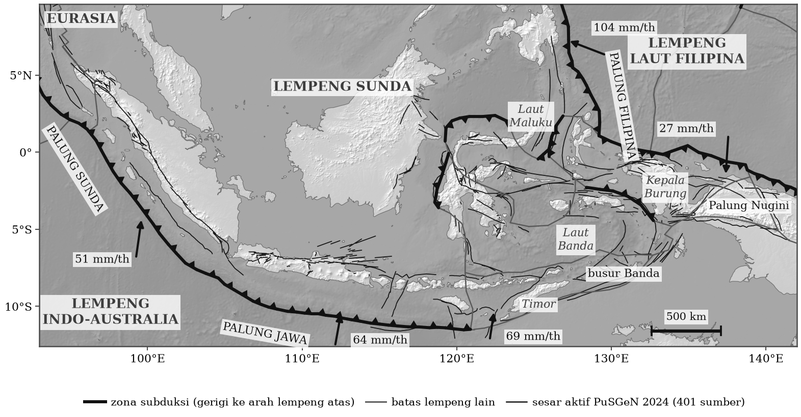
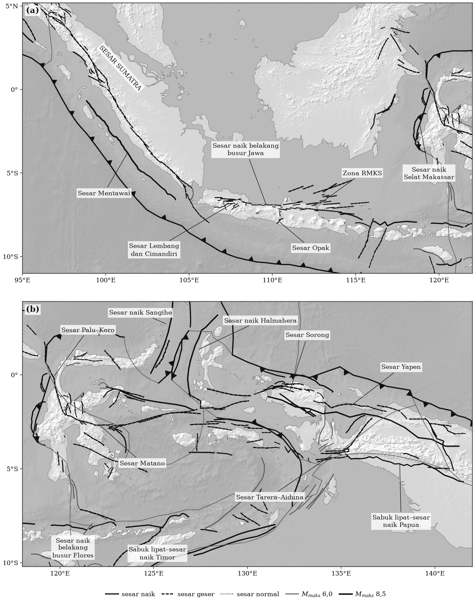
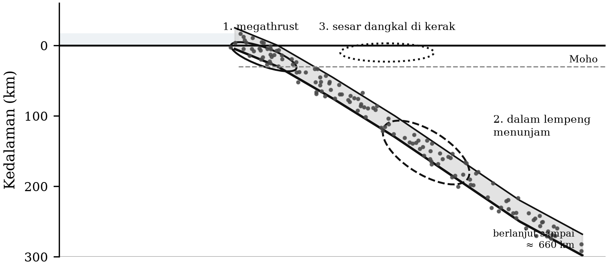

# BAB 7 — SEISMOTEKTONIK INDONESIA

::: {custom-style="Tujuan"}
**Tujuan Pembelajaran.** Setelah mempelajari bab ini mahasiswa mampu:
(1) menjelaskan tatanan lempeng yang membentuk kepulauan Indonesia;
(2) mengenali tiga kelompok sumber gempa di Indonesia dan ciri kegempaannya;
(3) membaca penampang zona Wadati–Benioff dan menghubungkannya dengan geometri
lempeng menunjam;
(4) menyebutkan sesar-sesar aktif utama di Indonesia beserta jenis
mekanismenya; dan
(5) menempatkan gempa Yogyakarta 2006 dalam kerangka seismotektonik Jawa.
:::

## 7.1 Tatanan lempeng

Kepulauan Indonesia terletak pada pertemuan tiga lempeng besar — **Eurasia
(Sunda)**, **Indo-Australia**, dan **Pasifik–Filipina** — serta sejumlah blok
mikro yang terjepit di antaranya, terutama di wilayah timur. Inilah sebabnya
Indonesia menjadi salah satu wilayah paling aktif secara seismik di dunia, dan
sekaligus salah satu yang paling rumit tatanan tektoniknya.

Beberapa unsur pokok yang perlu dikuasai:

**Zona subduksi Sunda.** Membentang dari lepas pantai barat Sumatra, ke
selatan Jawa, terus ke Nusa Tenggara. Lempeng Indo-Australia menunjam di bawah
Lempeng Sunda dengan laju sekitar 6–7 cm/tahun. Arah penunjaman berubah
sepanjang busur: di Sumatra bersifat **serong** (*oblique*) terhadap palung,
sedangkan di Jawa hampir **tegak lurus**. Perbedaan geometri ini menghasilkan
perbedaan tektonik yang mendasar, dan dibahas pada Subbab 7.4.

**Zona tumbukan Banda.** Di sebelah timur, tepi benua Australia telah memasuki
zona subduksi, menghasilkan tumbukan busur–benua dan geometri lempeng
menunjam yang melengkung tajam. Di sinilah gempa-gempa terdalam di dunia
terjadi.

**Sulawesi dan Maluku.** Wilayah pertemuan tiga lempeng dengan blok-blok mikro
yang berputar; dicirikan oleh sesar-sesar geser besar dan subduksi ganda yang
saling berhadapan di Laut Maluku.

**Papua.** Tumbukan lempeng Pasifik dengan tepi utara benua Australia,
menghasilkan sesar geser besar berarah barat–timur dan sabuk sesar naik.

::: {custom-style="ImageCaption"}
**Gambar 7.1.** Tatanan tektonik Indonesia di atas bayangan relief daratan
dan lantai samudra (Natural Earth, 1 menit busur). Batas lempeng menurut Bird
(2003); garis halus adalah 401 jalur sumber sesar aktif PuSGeN 2024. Anak
panah menunjukkan gerak lempeng bawah relatif terhadap lempeng atas, dihitung
dari komponen konvergen dan komponen menganan model tersebut.
:::

## 7.2 Peta sumber sesar aktif PuSGeN 2024

Gambar 7.1 memperlihatkan kerangka besarnya. Untuk bekerja dengan sumber gempa
secara lebih rinci, yang dipakai di Indonesia adalah **basis data sumber sesar
aktif PuSGeN**. Edisi 2024 memuat **401 sumber sesar**, masing-masing dengan
jalur (*trace*) yang terpetakan, jenis mekanisme, panjang, lebar bidang, sudut
kemiringan, laju geser, dan magnitudo maksimum $M_\text{maks}$ yang
diperkirakan dapat dihasilkannya. Gambar 7.2 menyajikan seluruh 401 sumber itu
dalam dua panel.

::: {custom-style="ImageCaption"}
**Gambar 7.2.** Seluruh 401 sumber sesar aktif PuSGeN 2024: (a) Sumatra dan
Jawa; (b) Sulawesi, Maluku, dan Papua. Gaya garis menunjukkan mekanisme dan
ketebalannya sebanding dengan $M_\text{maks}$ segmen. Wilayah Andaman di utara
5° LU tidak tercakup.
:::

Beberapa hal yang penting dibaca dari peta ini.

**Persebarannya tidak merata, dan itu bukan kebetulan.** Sumatra (86 sumber),
Jawa (82), Sulawesi (77), Bali–Nusa Tenggara–Banda–Maluku (68), dan Papua (62)
padat, sedangkan Maluku Utara hanya 16 dan Kalimantan 10. Sebagian
ketidakmerataan itu nyata secara tektonik — kerak Kalimantan memang jauh lebih
tenang — tetapi sebagian lagi mencerminkan **kerapatan pemetaan**, bukan
kerapatan sesar. Jawa dan Sumatra adalah wilayah yang paling lama dan paling
rapat dipelajari.

**Mekanismenya mengikuti tatanan lempeng.** Dari 401 sumber, **205
bermekanisme geser**, **145 sesar naik**, dan **51 sesar normal**. Sesar naik
berkumpul pada sabuk tumbukan: sabuk lipat–sesar naik Timor, Seram, dan Papua,
sesar naik belakang busur Flores, serta sabuk sesar naik belakang busur Jawa.
Sesar geser membentuk jalur-jalur panjang di dalam busur: Sesar Sumatra,
Palu–Koro–Matano, Sorong, dan Yapen. Sesar normal terkumpul di dua tempat yang
khas — pematang tengah samudra Andaman dan zona regangan busur luar Nusa
Tenggara.

**Panjang segmen menentukan batas atas magnitudo.** Sumber terpanjang pada
basis data adalah Sesar Andaman Barat (676 km, $M_\text{maks}$ 8,0), Sesar
naik Sangihe (643 km, 8,2), Sesar Mentawai (609 km, 8,7), Sesar naik Papua
Utara (596 km, 8,2), dan Sesar naik Halmahera (570 km, 8,3). Sebaliknya Sesar
Opak di Yogyakarta hanya sepanjang 47 km dengan $M_\text{maks}$ 6,9 — kecil
menurut ukuran daftar ini, tetapi justru sumber inilah yang paling dekat
dengan penduduk padat (Bab 14).

::: {custom-style="Kotak"}
**Catatan Pemutakhiran 7.1 — Satu angka yang perlu dibaca dengan hati-hati.**
Pada berkas PuSGeN 2024 yang dipakai untuk Gambar 7.2, segmen Salak (JAV18,
sesar naik belakang busur Jawa, panjang 20 km) tercantum dengan
$M_\text{maks}$ = 65,0. Nilai itu tidak mungkin: magnitudo tertinggi berikutnya
pada seluruh basis data adalah 8,7, dan segmen sepanjang 20 km tidak dapat
menghasilkan gempa jauh di atas $M_w$ 7. Hampir pasti yang dimaksud adalah
**6,5**, dan nilai itulah yang dipakai untuk menentukan ketebalan garis pada
Gambar 7.2.

Kejadian semacam ini pantas dijadikan pelajaran tersendiri: **setiap basis
data, termasuk yang resmi, perlu diperiksa kewajarannya sebelum dipakai.**
Pemeriksaan paling murah adalah yang paling sederhana — urutkan menurut setiap
kolom, lihat nilai terbesar dan terkecilnya, lalu tanyakan apakah keduanya
masuk akal secara fisis.
:::

## 7.3 Tiga kelompok sumber gempa

Untuk keperluan analisis bahaya gempa, sumber gempa di Indonesia dikelompokkan
menjadi tiga.

**1. Sumber megathrust.** Bidang kontak antarlempeng pada zona subduksi,
biasanya pada kedalaman 0–50 km. Menghasilkan gempa terbesar (hingga
$M_w > 9$), bermekanisme sesar naik, dan berpotensi menimbulkan tsunami
karena pergeseran vertikal dasar laut. Contoh: Aceh–Andaman 2004
($M_w$ 9,1–9,3), Nias 2005 ($M_w$ 8,6), Pangandaran 2006 ($M_w$ 7,7).

**2. Sumber dalam lempeng menunjam (*intraslab* dan *Benioff*).** Gempa di
dalam lempeng yang menunjam, pada kedalaman puluhan sampai ratusan kilometer.
Umumnya tidak menimbulkan tsunami, tetapi karena kedalamannya, guncangannya
terasa sangat luas. Contoh: gempa Padang 2009 ($M_w$ 7,6, kedalaman ~80 km).

**3. Sumber sesar dangkal di kerak (*shallow crustal*).** Gempa pada sesar di
dalam lempeng atas, biasanya pada kedalaman kurang dari 20 km. Magnitudonya
sedang, tetapi karena sangat dangkal dan sering berada tepat di bawah
permukiman, **kelompok inilah yang paling mematikan per satuan magnitudo**.
Contoh: Yogyakarta 2006 ($M_w$ 6,3, > 5.700 korban jiwa), Cianjur 2022
($M_w$ 5,6, ratusan korban jiwa).

::: {custom-style="Kotak"}
**Kotak 7.1 — Mengapa gempa "kecil" bisa jauh lebih mematikan.** Bandingkan
dua gempa: Bengkulu 2007 bermagnitudo $M_w$ 8,4 dengan korban jiwa di bawah
seratus, dan Yogyakarta 2006 bermagnitudo $M_w$ 6,3 dengan korban lebih dari
5.700 jiwa. Energi gempa Bengkulu lebih dari **seribu kali** lebih besar.

Penjelasannya terletak pada empat faktor yang selalu harus dipertimbangkan
bersama-sama:
**(1) kedalaman** — 10 km versus puluhan kilometer;
**(2) jarak ke permukiman padat** — di bawah kota versus di lepas pantai;
**(3) kondisi tanah setempat** — endapan lunak cekungan memperkuat guncangan;
**(4) kerentanan bangunan** — pasangan bata tanpa tulangan runtuh pada
guncangan yang dilalui bangunan bertulang dengan aman.

Magnitudo hanya satu dari empat faktor itu, dan sering kali bukan yang
menentukan.
:::

## 7.4 Zona Wadati–Benioff

Bila hiposenter gempa di suatu busur digambarkan pada penampang tegak lurus
palung, titik-titiknya membentuk bidang miring yang menunjam — **zona
Wadati–Benioff**. Zona ini adalah citra langsung lempeng yang menunjam, dan
penemuannya (antara lain memakai data gempa di bawah Jawa) merupakan salah
satu bukti kunci tektonik lempeng.

Ciri-ciri yang perlu dikenali:

- Sudut penunjaman umumnya landai dekat palung dan makin curam ke dalam.
- Kegempaan menghilang pada kedalaman sekitar 660 km, bersesuaian dengan batas
  mantel atas–mantel bawah.
- Kegempaan dalam tidak dapat dijelaskan oleh patahan getas biasa, karena pada
  tekanan sebesar itu batuan seharusnya berdeformasi secara plastis. Mekanisme
  yang diusulkan meliputi dehidrasi mineral berair dan ketakstabilan akibat
  transformasi fasa mineral.

::: {custom-style="ImageCaption"}
**Gambar 7.3.** Skema penampang zona Wadati–Benioff pada busur Sunda dengan
tiga kelompok sumber gempa: megathrust, dalam lempeng menunjam, dan sesar
dangkal di kerak atas.
:::

**Perbedaan Sumatra dan Jawa.** Karena penunjaman di Sumatra bersifat serong,
komponen geser dari konvergensi dipisahkan ke sebuah sesar geser besar di
dalam busur, yaitu **Sesar Sumatra** (Sesar Semangko) — proses yang disebut
*strain partitioning*. Di Jawa, penunjaman hampir tegak lurus sehingga tidak
ada sesar geser besar sepanjang busur; sebagai gantinya, deformasi kerak di
Jawa terbagi pada banyak sesar yang lebih pendek, lebih tersebar, dan
**jauh lebih sulit dipetakan**. Kenyataan inilah latar belakang tektonik gempa
Yogyakarta 2006: gempa merusak di Jawa dapat berasal dari struktur pendek yang
tidak menonjol dalam morfologi dan tidak selalu tercantum dalam peta.

## 7.5 Sesar-sesar aktif utama

Table: **Tabel 7.1.** Beberapa sesar aktif utama di Indonesia.

| Sesar | Wilayah | Jenis | Catatan |
|:--|:--|:--|:--|
| Sesar Sumatra (Semangko) | Sepanjang Bukit Barisan | Geser menganan | Panjang > 1.900 km; tersegmentasi; sumber gempa merusak berulang |
| Sesar Mentawai | Busur muka Sumatra | Geser | Di lepas pantai, sejajar palung |
| Sesar Cimandiri, Lembang, Baribis | Jawa Barat | Geser/naik | Dekat wilayah padat penduduk Bandung dan Jakarta |
| Sesar Opak dan struktur di sekitarnya | DI Yogyakarta | Geser | Berkaitan dengan gempa 2006; letak bidang yang pecah masih diperdebatkan |
| Sesar naik belakang busur Flores | Laut Flores, Bali–NTT | Naik | Sumber gempa Lombok 2018 |
| Sesar Palu–Koro | Sulawesi Tengah | Geser mengiri | Laju geser tinggi; sumber gempa Palu 2018 |
| Sesar Matano dan Lawanopo | Sulawesi | Geser | Menerus dari Palu–Koro |
| Sesar Sorong | Papua–Maluku Utara | Geser mengiri | Batas lempeng utama di timur |
| Sesar Yapen | Papua | Geser | Bagian sistem sesar utara Papua |

::: {custom-style="Kotak"}
**Kotak 7.2 — Dari 81 menjadi 401 sumber sesar.** Peta Sumber dan Bahaya
Gempa Indonesia tahun 2010 memuat **81** sesar aktif. Pemutakhiran tahun 2017
yang disusun Pusat Studi Gempa Nasional (PuSGeN) memuat **295** sesar aktif —
bertambah 214 dalam tujuh tahun. Basis data PuSGeN edisi **2024** yang dipakai
pada Gambar 7.2 memuat **401 sumber sesar**, bertambah lagi lebih dari seratus
dalam tujuh tahun berikutnya. Dari 401 sumber itu, 136 berstatus *baru* dan
171 berstatus *diperbarui datanya*; hanya 94 yang tidak berubah dari edisi
sebelumnya.

Yang bertambah bukanlah jumlah sesarnya, melainkan **pengetahuan kita tentang
sesar yang sudah ada di sana selama ini.** Penambahan itu dimungkinkan oleh
gabungan metode: pemetaan geologi dan paritan (*trenching*) untuk menentukan
umur dan laju geser, relokasi episenter dengan katalog yang lebih lengkap,
data geodesi GNSS dan InSAR untuk mengukur regangan, serta data topografi
resolusi tinggi (SRTM, IFSAR, LiDAR) yang menyingkap kelurusan morfologi yang
tidak terlihat di lapangan.

Bagi mahasiswa, angka ini memuat dua pesan sekaligus. Yang membesarkan hati:
kemajuan pengetahuan seismotektonik Indonesia dalam satu setengah dasawarsa
sangat besar. Yang harus diwaspadai: **daftar itu hampir pasti masih belum lengkap.**
Gempa Yogyakarta 2006 dan Cianjur 2022 sama-sama terjadi pada struktur yang
sebelumnya tidak menonjol dalam peta bahaya. Ketiadaan sesar dalam peta bukan
bukti ketiadaan bahaya.
:::

## 7.6 Kegempaan Jawa dan daerah Yogyakarta

Jawa memiliki tiga kelompok sumber gempa sekaligus: megathrust di selatan,
zona Benioff yang menunjam ke utara, dan sesar-sesar kerak dangkal di daratan.
Karena Jawa adalah pulau terpadat penduduknya di Indonesia, ketiganya
menyumbang risiko yang besar.

Untuk daerah Yogyakarta secara khusus:

- **Sumber megathrust** di selatan Jawa dapat menimbulkan guncangan luas dan
  ancaman tsunami di pantai selatan. Gempa Pangandaran 2006 memperlihatkan
  bahwa jenis "gempa tsunami" — gempa dengan rupture lambat yang guncangannya
  lemah tetapi tsunaminya besar — nyata terjadi di selatan Jawa. Gempa Pacitan
  6 Februari 2026 (BMKG melaporkan $M$ 6,2, kedalaman sekitar 40 km) kembali
  menunjukkan bahwa sumber subduksi selatan Jawa tetap aktif dan guncangannya
  terasa hingga Yogyakarta.
- **Sumber dalam lempeng menunjam** menghasilkan gempa yang sering terasa
  tetapi jarang merusak berat.
- **Sumber sesar dangkal** di Cekungan Yogyakarta — inilah yang menghasilkan
  gempa 27 Mei 2006, dan inilah yang paling berbahaya bagi kota.

**Cekungan Yogyakarta** sendiri merupakan unsur penting dalam cerita ini.
Cekungan ini diisi endapan vulkanik muda dan endapan alluvial dari Merapi yang
tebal dan relatif lunak, terbentang antara Pegunungan Kulon Progo di barat dan
Pegunungan Selatan di timur. Endapan lunak semacam ini **memperkuat guncangan**
(Bab 9), dan kombinasi antara sumber gempa dangkal tepat di bawah cekungan
berpenduduk padat dengan endapan yang memperkuat guncangan adalah resep
bencana yang terjadi pada 2006.

::: {custom-style="Ringkasan"}
**Ringkasan Bab 7**

1. Indonesia berada pada pertemuan lempeng Eurasia (Sunda), Indo-Australia,
   dan Pasifik–Filipina beserta blok-blok mikro.
2. Sumber gempa dikelompokkan menjadi megathrust, dalam lempeng menunjam, dan
   sesar dangkal di kerak; kelompok ketiga paling mematikan per satuan
   magnitudo.
3. Zona Wadati–Benioff mencitrakan lempeng menunjam dan berakhir pada
   kedalaman sekitar 660 km.
4. Penunjaman serong di Sumatra memisahkan komponen geser ke Sesar Sumatra;
   penunjaman tegak lurus di Jawa menyebarkan deformasi pada banyak sesar
   pendek yang sulit dipetakan.
5. Jumlah sesar aktif yang terpetakan bertambah dari 81 (2010) menjadi 295
   (2017), dan daftar itu masih belum lengkap.
6. Daerah Yogyakarta menghadapi ketiga kelompok sumber sekaligus, dengan
   Cekungan Yogyakarta yang berendapan lunak sebagai faktor pemburuk.
:::

::: {custom-style="Soal"}
**Soal Latihan**

**7.1** Dengan laju konvergensi 6,7 cm/tahun dan anggapan seluruhnya
terakumulasi sebagai regangan elastik pada bidang megathrust, berapa besar
slip yang tersimpan dalam 200 tahun? Bila slip itu dilepaskan sekaligus pada
bidang sepanjang 300 km dan lebar 150 km dengan $\mu = 4\times10^{10}$ Pa,
berapa $M_w$-nya?

**7.2** Unduh katalog gempa BMKG atau ISC untuk penampang tegak lurus palung
di selatan Jawa Tengah selebar 200 km. Gambarkan penampang kedalaman
hiposenter dan perkirakan sudut penunjaman pada kedalaman 50 km dan 200 km.

**7.3** Jelaskan mengapa Sumatra memiliki satu sesar geser besar sepanjang
busur sedangkan Jawa tidak, dan apa akibatnya bagi upaya pemetaan bahaya
gempa di Jawa.

**7.4** Bandingkan gempa Palu 2018 dan gempa Yogyakarta 2006: keduanya gempa
sesar geser dangkal. Mengapa dampaknya sangat berbeda? Faktor apa saja yang
berperan?

**7.5** Diskusikan pernyataan berikut: "Karena tidak ada sesar aktif yang
tergambar di bawah kota kami, kota kami aman dari gempa dangkal." Kemukakan
argumen tandingan berdasarkan Kotak 7.2.
:::

::: {custom-style="Bacaan"}
**Bacaan Lanjut**

- Hall, R. (2002). Cenozoic geological and plate tectonic evolution of SE Asia
  and the SW Pacific. *Journal of Asian Earth Sciences*, 20, 353–431.
- Hamilton, W. (1979). *Tectonics of the Indonesian Region*. USGS Professional
  Paper 1078.
- Pusat Studi Gempa Nasional (2017). *Peta Sumber dan Bahaya Gempa Indonesia
  Tahun 2017*. Kementerian PUPR, Bandung.
- Sieh, K. & Natawidjaja, D. (2000). Neotectonics of the Sumatran fault.
  *Journal of Geophysical Research*, 105, 28295–28326.
- Katili, J. A. (1975). Volcanism and plate tectonics in the Indonesian island
  arcs. *Tectonophysics*, 26, 165–188.
:::
