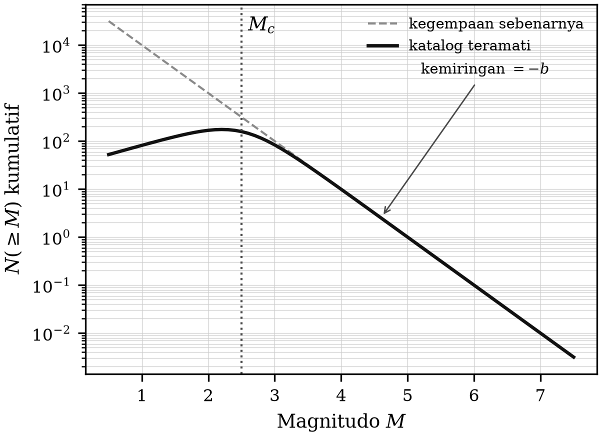
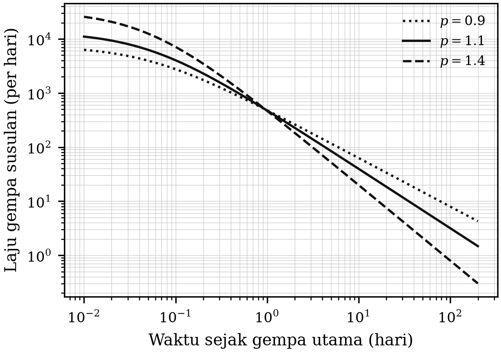

# BAB 8 — STATISTIK KEGEMPAAN

::: {custom-style="Tujuan"}
**Tujuan Pembelajaran.** Setelah mempelajari bab ini mahasiswa mampu:
(1) menerapkan hukum Gutenberg–Richter dan menaksir nilai-$a$ serta nilai-$b$;
(2) menentukan magnitudo kelengkapan katalog dan menjelaskan akibatnya bila
diabaikan;
(3) menerapkan hukum Omori–Utsu pada rangkaian gempa susulan;
(4) menjelaskan konsep pemicuan gempa melalui perubahan tegangan Coulomb; dan
(5) menganalisis rangkaian gempa susulan Yogyakarta 2006 sebagai contoh.
:::

## 8.1 Hukum Gutenberg–Richter

Hubungan paling terkenal dalam statistik kegempaan menyatakan bahwa jumlah
kumulatif gempa $N$ yang bermagnitudo lebih besar atau sama dengan $M$
memenuhi

$$\log_{10} N(\ge M) = a - b\,M \text{~~~~~~~~~~~~~~~~} (8.1)$$

dengan $a$ menyatakan tingkat kegempaan daerah (bergantung luas daerah dan
lama pengamatan) dan $b$ menyatakan perbandingan antara gempa kecil dan gempa
besar.

Untuk sebagian besar daerah tektonik, $b \approx 1{,}0$. Artinya: **setiap
turun satu satuan magnitudo, jumlah gempa bertambah sepuluh kali lipat.**
Dalam satu daerah yang setiap tahun mengalami satu gempa $M \ge 6$, dapat
diharapkan sekitar sepuluh gempa $M \ge 5$, seratus gempa $M \ge 4$, dan
seterusnya.

Penyimpangan nilai $b$ dari 1,0 bersifat informatif:

- $b > 1$ lazim dijumpai pada daerah vulkanik dan daerah dengan tekanan fluida
  tinggi — banyak gempa kecil, sedikit gempa besar. Kenaikan nilai $b$ di
  bawah gunung api sering menyertai peningkatan aktivitas.
- $b < 1$ menandakan konsentrasi tegangan yang tinggi, misalnya pada asperitas
  megathrust.

Penaksiran $b$ yang baku memakai metode kemungkinan maksimum (Aki, 1965):

$$\hat{b} = \frac{\log_{10} e}{\overline{M} - \left(M_c - \tfrac{\Delta M}{2}\right)} \text{~~~~~~~~~~~~~~~~} (8.2)$$

dengan $\overline{M}$ magnitudo rata-rata gempa yang $\ge M_c$, $M_c$
magnitudo kelengkapan, dan $\Delta M$ langkah pembulatan magnitudo katalog.

::: {custom-style="ImageCaption"}
**Gambar 8.1.** Distribusi frekuensi–magnitudo Gutenberg–Richter. Di bawah
magnitudo kelengkapan $M_c$, kurva membelok karena gempa kecil tidak semuanya
terdeteksi — bukan karena gempa kecil memang lebih jarang.
:::

## 8.2 Magnitudo kelengkapan

**Magnitudo kelengkapan** $M_c$ adalah magnitudo terkecil yang seluruh
kejadiannya masih tercatat lengkap oleh jaringan. Di bawah $M_c$, katalog
tidak lengkap, dan grafik Gutenberg–Richter membelok ke bawah.

Kekeliruan yang paling sering dilakukan pemula adalah **memasukkan data di
bawah $M_c$ ke dalam regresi**, yang selalu menghasilkan nilai $b$ yang terlalu
kecil. Aturannya sederhana dan tidak dapat ditawar: **tentukan $M_c$ lebih
dahulu, buang data di bawahnya, baru hitung $b$.**

Nilai $M_c$ bergantung pada kerapatan jaringan dan tingkat derau, dan
karenanya **berubah terhadap waktu dan tempat**. Untuk Indonesia, $M_c$
katalog nasional membaik secara nyata setelah perluasan jaringan pasca-2004.
Untuk sebuah jaringan sementara yang rapat seperti jaringan gempa susulan
Yogyakarta 2006, $M_c$ setempat dapat turun jauh di bawah nilai katalog
nasional — itulah sebabnya jaringan semacam itu dapat mendeteksi ribuan
kejadian yang tidak terlihat oleh jaringan permanen.

## 8.3 Gempa susulan: hukum Omori–Utsu

Laju gempa susulan meluruh terhadap waktu mengikuti hukum Omori yang
dimodifikasi Utsu:

$$n(t) = \frac{K}{(t+c)^{p}} \text{~~~~~~~~~~~~~~~~} (8.3)$$

dengan $n(t)$ laju gempa susulan per satuan waktu, $t$ waktu sejak gempa
utama, $K$ tetapan yang bergantung produktivitas, $c$ tetapan kecil yang
mengoreksi ketidaklengkapan katalog pada saat-saat pertama, dan $p$ eksponen
peluruhan yang umumnya berkisar 0,9–1,5.

Untuk $p \approx 1$, hukum ini memberikan aturan praktis yang mudah diingat:
**laju gempa susulan pada hari kedua kira-kira separuh laju hari pertama, pada
hari kesepuluh sekitar sepersepuluh, dan seterusnya.** Rangkaian gempa susulan
tidak "berhenti" pada suatu hari tertentu, melainkan meluruh terus sampai
terbenam dalam kegempaan latar.

Dua hubungan tambahan yang berguna:

**Hukum Båth.** Magnitudo gempa susulan terbesar rata-rata sekitar 1,2 satuan
di bawah magnitudo gempa utama, hampir tidak bergantung pada magnitudo gempa
utamanya.

**Produktivitas.** Jumlah gempa susulan bertambah secara eksponensial terhadap
magnitudo gempa utama.

::: {custom-style="ImageCaption"}
**Gambar 8.2.** Peluruhan laju gempa susulan menurut hukum Omori–Utsu untuk
beberapa nilai $p$, digambar pada skala log–log.
:::

::: {custom-style="Kotak"}
**Kotak 8.1 — "Apakah ini gempa awalan?"** Pertanyaan yang selalu diajukan
masyarakat dan wartawan setelah gempa. Jawaban jujurnya: **secara statistik,
sekitar 5 persen gempa diikuti gempa yang lebih besar dalam beberapa hari
berikutnya, dan tidak ada cara untuk mengetahui sebelumnya apakah suatu gempa
termasuk yang 5 persen itu.** Rangkaian gempa Lombok 2018 adalah contohnya:
gempa $M_w$ 6,4 pada 29 Juli diikuti gempa $M_w$ 6,9 pada 5 Agustus.

Karena itu pernyataan resmi yang benar bukan "gempa susulan akan makin
mengecil dan tidak berbahaya", melainkan "laju gempa susulan akan meluruh,
tetapi masih ada kemungkinan kecil terjadi gempa yang lebih besar; bangunan
yang sudah retak jangan ditempati". Perbedaan antara kedua kalimat itu dapat
berarti nyawa.
:::

## 8.4 Pemicuan gempa dan tegangan Coulomb

Gempa susulan tidak tersebar acak; sebarannya mengikuti pola perubahan
tegangan yang ditimbulkan gempa utama. Perubahan **tegangan Coulomb**
didefinisikan sebagai

$$\Delta CFS = \Delta\tau + \mu' \Delta\sigma_n \text{~~~~~~~~~~~~~~~~} (8.4)$$

dengan $\Delta\tau$ perubahan tegangan geser pada arah slip bidang penerima,
$\Delta\sigma_n$ perubahan tegangan normal (positif untuk pembukaan), dan
$\mu'$ koefisien gesekan efektif. Daerah dengan $\Delta CFS$ positif
"didorong lebih dekat" ke keruntuhan, dan di sanalah gempa susulan cenderung
berkelompok.

Analisis semacam ini telah diterapkan pada gempa Yogyakarta 2006 untuk
menjelaskan sebaran gempa susulannya, dan — yang menarik perhatian luas —
untuk membahas kemungkinan interaksi antara gempa itu dan aktivitas Gunung
Merapi yang sedang meningkat pada saat yang hampir bersamaan.

Model **ETAS** (*Epidemic-Type Aftershock Sequence*) memadukan
Gutenberg–Richter, Omori–Utsu, dan produktivitas menjadi satu model titik
proses, tempat setiap gempa dapat memicu gempa berikutnya. ETAS adalah dasar
bagi peramalan kegempaan operasional (*operational earthquake forecasting*)
yang sekarang dijalankan beberapa badan geologi dunia.

::: {custom-style="Kotak"}
**Kotak 8.2 — Rangkaian gempa susulan Yogyakarta 2006 sebagai bahan latihan.**

Jaringan sementara 16 stasiun yang digelar di sekitar zona sumber merekam
lebih dari dua ribu gempa susulan dalam beberapa minggu. Dari himpunan data
itu, empat analisis baku dapat dikerjakan mahasiswa dan menghasilkan
kesimpulan yang bermakna:

1. **Distribusi frekuensi–magnitudo.** Tentukan $M_c$, lalu taksir $b$.
   Bandingkan dengan nilai $b$ kegempaan latar daerah itu.
2. **Peluruhan Omori.** Plot laju kejadian terhadap waktu pada skala log–log
   dan taksir $p$ dan $c$.
3. **Sebaran ruang.** Relokasi hiposenter dengan model kecepatan lokal, lalu
   gambarkan peta dan penampang. Apakah sebarannya membentuk satu bidang, atau
   lebih dari satu?
4. **Penampang tegak.** Tentukan rentang kedalaman aktivitas dan kemiringan
   bidang yang terbentuk.

Analisis semacam inilah — bukan lokasi episenter gempa utama — yang menjadi
bukti utama dalam pembahasan Bab 14. Hasil yang dilaporkan dalam literatur
menunjukkan bahwa gempa susulan tidak berkumpul pada satu bidang tunggal yang
berimpit dengan jejak Sesar Opak, melainkan pada struktur di sebelah timurnya,
dan sebagian aktivitas terdistribusi pada lebih dari satu struktur.
:::

::: {custom-style="Ringkasan"}
**Ringkasan Bab 8**

1. Hukum Gutenberg–Richter, $\log N = a - bM$, dengan $b \approx 1$ untuk
   daerah tektonik umum.
2. Magnitudo kelengkapan $M_c$ harus ditentukan lebih dahulu; mengabaikannya
   selalu menghasilkan $b$ yang terlalu kecil.
3. Hukum Omori–Utsu memerikan peluruhan laju gempa susulan; $p$ umumnya
   0,9–1,5. Hukum Båth: gempa susulan terbesar sekitar 1,2 satuan di bawah
   gempa utama.
4. Sekitar 5 persen gempa diikuti gempa yang lebih besar; tidak ada cara
   mengenalinya lebih dahulu.
5. Sebaran gempa susulan mengikuti pola perubahan tegangan Coulomb; model ETAS
   memadukan semua hukum statistik menjadi satu model peramalan.
:::

::: {custom-style="Soal"}
**Soal Latihan**

**8.1** Suatu daerah memiliki $a = 5{,}0$ dan $b = 1{,}0$ untuk katalog
sepuluh tahun. Berapa gempa $M \ge 5$ yang diharapkan per tahun? Berapa
perioda ulang gempa $M \ge 7$?

**8.2** Dari sebuah katalog gempa susulan diperoleh magnitudo rata-rata
$\overline{M} = 2{,}45$ untuk data di atas $M_c = 2{,}0$ dengan
$\Delta M = 0{,}1$. Hitung $b$ dengan Persamaan (8.2).

**8.3** Sebuah gempa utama diikuti 400 gempa susulan pada hari pertama.
Dengan $p = 1{,}1$ dan $c = 0{,}05$ hari, perkirakan jumlah gempa susulan pada
hari ke-10 dan hari ke-30.

**8.4** Gempa utama bermagnitudo $M_w$ 6,3. Menurut hukum Båth, berapa
magnitudo gempa susulan terbesar yang diharapkan? Bandingkan dengan gempa
susulan terbesar yang tercatat setelah gempa Yogyakarta 2006.

**8.5** Jelaskan mengapa nilai $b$ yang tinggi di bawah gunung api dapat
ditafsirkan sebagai tanda peningkatan aktivitas, dan sebutkan sekurang-
kurangnya satu penjelasan alternatif yang harus disingkirkan lebih dahulu.
:::

::: {custom-style="Bacaan"}
**Bacaan Lanjut**

- Utsu, T., Ogata, Y. & Matsu'ura, R. S. (1995). The centenary of the Omori
  formula. *Journal of Physics of the Earth*, 43, 1–33.
- Wiemer, S. (2001). A software package to analyze seismicity: ZMAP.
  *Seismological Research Letters*, 72, 373–382.
- Stein, R. S. (1999). The role of stress transfer in earthquake occurrence.
  *Nature*, 402, 605–609.
- Ogata, Y. (1988). Statistical models for earthquake occurrences and residual
  analysis for point processes. *Journal of the American Statistical
  Association*, 83, 9–27.
:::
