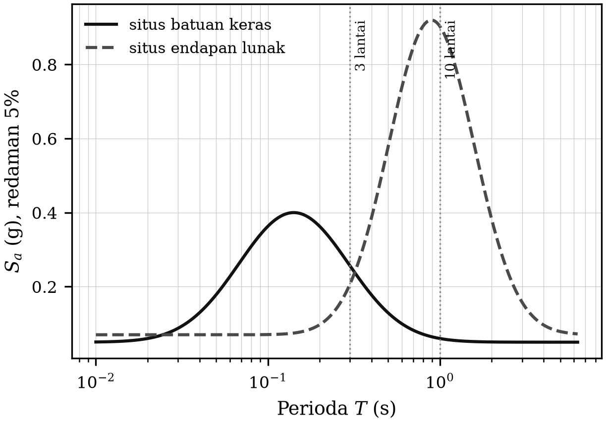
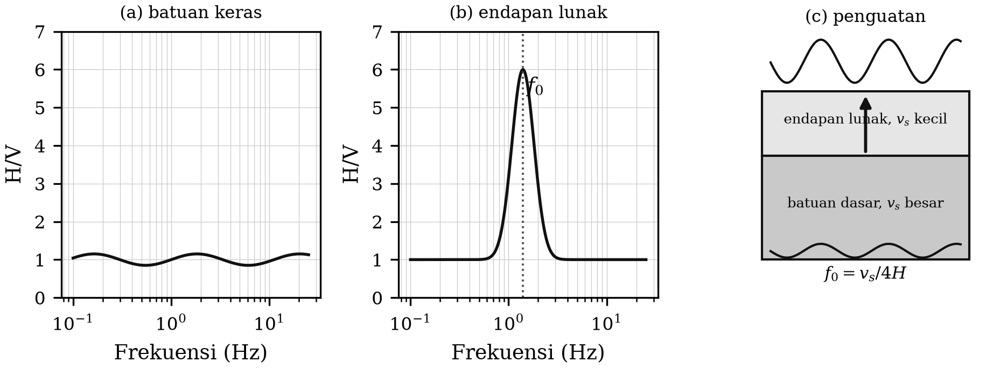

# BAB 9 — GERAKAN TANAH KUAT DAN EFEK SITUS

::: {custom-style="Tujuan"}
**Tujuan Pembelajaran.** Setelah mempelajari bab ini mahasiswa mampu:
(1) menyebutkan besaran gerakan tanah kuat (PGA, PGV, PGD, intensitas Arias,
durasi) dan memilih yang sesuai untuk keperluan tertentu;
(2) menjelaskan dan menghitung spektrum tanggapan;
(3) menerangkan efek situs, resonansi lapisan lunak, dan efek cekungan;
(4) menerapkan metode HVSR untuk mikrozonasi; dan
(5) menjelaskan pola kerusakan gempa Yogyakarta 2006 dengan konsep efek situs.
:::

## 9.1 Besaran gerakan tanah kuat

Bagi insinyur, yang penting bukan magnitudo di sumber melainkan **apa yang
dialami bangunan di suatu tempat**. Besaran yang dipakai:

- **PGA** (*peak ground acceleration*) — percepatan tanah maksimum, dalam
  satuan g atau cm/s². Berkaitan dengan gaya inersia pada bangunan kaku.
- **PGV** (*peak ground velocity*) — kecepatan tanah maksimum. Berkorelasi
  lebih baik dengan kerusakan pada bangunan menengah dan tinggi serta pada
  jaringan pipa.
- **PGD** (*peak ground displacement*) — simpangan maksimum; penting untuk
  jembatan bentang panjang.
- **Intensitas Arias** — integral kuadrat percepatan; ukuran energi total
  guncangan, dipakai dalam analisis stabilitas lereng dan likuefaksi:

  $$I_A = \frac{\pi}{2g}\int_0^{T_d} a(t)^{2}\,dt \text{~~~~~~~~~~~~~~~~} (9.1)$$

- **Durasi signifikan** — lama waktu antara 5 persen dan 95 persen $I_A$.
  Untuk likuefaksi dan keruntuhan progresif, durasi sering lebih menentukan
  daripada puncak.

**Peringatan penting:** PGA adalah nilai sesaat pada satu titik waktu dan
sering ditentukan oleh satu puncak berfrekuensi tinggi yang berdurasi sangat
pendek. Gempa dengan PGA tinggi tetapi berdurasi singkat dan berfrekuensi
tinggi dapat menimbulkan kerusakan jauh lebih ringan daripada gempa dengan PGA
lebih rendah tetapi berdurasi panjang dan berfrekuensi dekat frekuensi diri
bangunan. **Jangan pernah menilai bahaya hanya dari PGA.**

## 9.2 Spektrum tanggapan

Alat baku yang menghubungkan gerakan tanah dengan tanggapan bangunan adalah
**spektrum tanggapan** (*response spectrum*). Bayangkan sederet osilator orde
dua — sistem massa–pegas–peredam dengan redaman 5 persen, persis seperti
Persamaan (2.3) pada Bab 2 — masing-masing dengan perioda diri $T$ berbeda.
Setiap osilator dikenai rekaman percepatan tanah yang sama, lalu tanggapan
maksimumnya dicatat. Grafik tanggapan maksimum terhadap $T$ inilah spektrum
tanggapan.

$$S_a(T,\xi) = \max_t \left| \ddot{u}_{\text{total}}(t; T, \xi) \right| \text{~~~~~~~~~~~~~~~~} (9.2)$$

Kegunaannya langsung: sebuah bangunan bertingkat $n$ memiliki perioda diri
kira-kira $T \approx 0{,}1\,n$ detik, sehingga bangunan 3 lantai memiliki
$T \approx 0{,}3$ s dan bangunan 10 lantai $T \approx 1$ s. Dengan membaca
spektrum tanggapan pada perioda itu, insinyur memperoleh percepatan rencana
untuk bangunannya.

**Inilah jembatan antara seismologi dan rekayasa**, dan alasan mengapa
tanggapan sistem orde dua yang dipelajari pada Bab 2 muncul kembali di sini:
matematikanya sama persis; yang berubah hanyalah bahwa "seismometer"-nya
sekarang adalah gedung.

::: {custom-style="ImageCaption"}
**Gambar 9.1.** Spektrum tanggapan percepatan untuk redaman 5 persen: kurva
tanah keras dibandingkan dengan tanah lunak. Puncak spektrum tanah lunak
bergeser ke perioda yang lebih panjang dan bernilai jauh lebih besar.
:::

## 9.3 Persamaan prediksi gerakan tanah

**GMPE** (*Ground Motion Prediction Equation*), dahulu disebut hukum atenuasi,
memperkirakan besaran gerakan tanah dari parameter sumber dan lintasan. Bentuk
umumnya:

$$\ln Y = f_{\text{sumber}}(M) + f_{\text{lintasan}}(R, M) + f_{\text{situs}}(V_{s30}) + \epsilon \text{~~~~~~~~~~~~~~~~} (9.3)$$

dengan $Y$ besaran yang diprediksi (PGA, PGV, atau $S_a$ pada perioda
tertentu), $M$ magnitudo, $R$ jarak, $V_{s30}$ kecepatan gelombang S rata-rata
30 meter teratas, dan $\epsilon$ suku galat acak.

Tiga hal yang perlu dipahami:

1. **Sebaran GMPE sangat lebar.** Simpangan baku $\ln Y$ umumnya 0,5–0,7,
   yang berarti nilai sebenarnya dapat dua kali lebih besar atau setengah dari
   nilai median. Ketidakpastian ini adalah sumbangan terbesar bagi
   ketidakpastian analisis bahaya gempa.
2. **GMPE bersifat regional.** Persamaan yang diturunkan untuk daerah kerak
   aktif tidak berlaku untuk zona subduksi, dan sebaliknya. Peta bahaya gempa
   Indonesia memakai kelompok GMPE yang berbeda untuk sumber megathrust,
   *intraslab*, dan sesar dangkal.
3. **Suku situs sering yang paling menentukan** untuk kerusakan setempat, dan
   itulah pokok bahasan subbab berikut.

## 9.4 Efek situs

**Efek situs** adalah perubahan amplitudo, frekuensi, dan durasi gerakan tanah
akibat kondisi geologi dan geoteknik setempat. Tiga mekanisme utama:

**Kontras impedansi.** Impedansi seismik adalah $Z = \rho v_s$. Ketika
gelombang naik dari batuan keras berimpedansi tinggi ke endapan lunak
berimpedansi rendah, amplitudonya harus membesar agar fluks energi tetap
kekal. Perbandingan amplitudo kira-kira

$$A \approx \sqrt{\frac{\rho_1 v_{s1}}{\rho_2 v_{s2}}} \text{~~~~~~~~~~~~~~~~} (9.4)$$

Untuk batuan dasar dengan $\rho v_s = 2600 \times 1500$ dan endapan lunak
dengan $500 \times 200$, perbandingan ini menghasilkan penguatan sekitar enam
kali. Inilah pembenaran kuantitatif atas pengamatan lama yang sudah dicatat
dalam naskah asli Bab 1: **guncangan jauh lebih kuat pada tanah lunak dan
basah daripada pada tanah keras.**

**Resonansi lapisan.** Sebuah lapisan lunak setebal $H$ dengan kecepatan
$v_s$ di atas batuan dasar beresonansi pada frekuensi

$$f_n = \frac{(2n-1)v_s}{4H}, \qquad n = 1, 2, 3, \ldots \text{~~~~~~~~~~~~~~~~} (9.5)$$

Frekuensi dasar $f_0 = v_s/4H$ adalah besaran terpenting dalam mikrozonasi.
Untuk endapan setebal 50 m dengan $v_s = 200$ m/s, $f_0 = 1$ Hz — persis pada
pita perioda bangunan bertingkat rendah sampai menengah.

**Efek cekungan.** Pada cekungan sedimen, gelombang yang masuk dari tepi
terperangkap dan berubah menjadi gelombang permukaan yang terpantul bolak-balik
di dalam cekungan, sehingga durasi guncangan **jauh lebih panjang** daripada
di batuan sekitarnya. Efek ini tidak dapat ditirukan dengan model satu dimensi
dan memerlukan pemodelan dua atau tiga dimensi.

::: {custom-style="Kotak"}
**Kotak 9.1 — Resonansi ganda yang mematikan.** Bahaya terbesar terjadi
ketika **frekuensi diri lapisan tanah berimpit dengan frekuensi diri
bangunan**. Contoh klasiknya adalah gempa Mexico City 1985: gempa berpusat
lebih dari 350 km jauhnya, tetapi endapan danau bekas Danau Texcoco
beresonansi pada perioda sekitar 2 detik, yang persis merupakan perioda diri
gedung 10–20 lantai — dan gedung-gedung pada rentang tinggi itulah yang
runtuh, sementara gedung yang lebih rendah dan lebih tinggi relatif selamat.

Pelajarannya bagi Indonesia: pemetaan $f_0$ tanah dan pengaturan tinggi
bangunan yang diizinkan pada zona tertentu adalah tindakan mitigasi yang
murah dan sangat efektif.
:::

## 9.5 Metode HVSR untuk mikrozonasi

Cara paling praktis untuk memperkirakan $f_0$ tanah adalah metode **HVSR**
(*Horizontal-to-Vertical Spectral Ratio*), yang diperkenalkan Nakamura (1989).
Metode ini hanya memerlukan **satu seismometer tiga komponen** dan
**pengukuran derau ambien selama 20–30 menit** — tanpa gempa, tanpa sumber
buatan, tanpa lubang bor.

Prosedurnya:

1. Rekam derau ambien tiga komponen selama 20–30 menit.
2. Bagi rekaman menjadi jendela-jendela pendek (misalnya 20–40 s), buang
   jendela yang tercemar gangguan sesaat.
3. Hitung spektrum amplitudo tiap komponen, licinkan.
4. Hitung rasio

   $$HVSR(f) = \frac{\sqrt{H_{NS}(f)\,H_{EW}(f)}}{V(f)} \text{~~~~~~~~~~~~~~~~} (9.6)$$

5. Rata-ratakan atas semua jendela; frekuensi puncaknya adalah $f_0$.

Dari $f_0$ dan perkiraan $v_s$ rata-rata, tebal endapan lunak diperkirakan
dengan $H \approx v_s/(4f_0)$.

**Batas kesahihan yang wajib diketahui.** Metode HVSR memberikan $f_0$ dengan
andal, tetapi **puncak HVSR bukanlah besarnya penguatan**. Kesalahan
menyamakan tinggi puncak HVSR dengan faktor penguatan adalah kekeliruan yang
sangat umum dalam skripsi mahasiswa. Untuk memperoleh faktor penguatan
diperlukan analisis tanggapan tanah (misalnya metode ekivalen linear atau
taklinear) dengan profil $v_s$ yang terukur.

::: {custom-style="Kotak"}
**Kotak 9.2 — Efek situs pada gempa Yogyakarta 2006.**

Pola kerusakan gempa 27 Mei 2006 tidak dapat dijelaskan hanya dengan jarak
dari episenter. Dua ciri yang menonjol:

*Pertama*, kerusakan terberat memanjang mengikuti arah timur laut–barat daya,
sejajar dengan bidang sesar yang pecah, bukan melingkar mengelilingi
episenter. Ini adalah gejala **efek sumber**: pola radiasi dan keterarahan
rupture (*directivity*) menyalurkan energi lebih besar ke arah perambatan
rupture.

*Kedua*, dalam jarak yang hampir sama dari sumber, kerusakan di daerah
berendapan lunak jauh lebih parah daripada di daerah yang lebih dekat ke
batuan yang lebih keras. Cekungan Yogyakarta diisi endapan vulkanik muda dan
alluvial dari Merapi yang tebal dan lunak. Walter dkk. (2008) bahkan
mengajukan pertanyaan itu secara eksplisit dalam judul makalahnya: apakah
endapan lahar memperkuat guncangan sehingga menyebabkan bencana?

*Faktor ketiga* yang tidak boleh diabaikan adalah kerentanan bangunan. Sebagian
besar rumah yang runtuh adalah pasangan bata tanpa tulangan yang memikul
beban, tanpa kolom praktis dan sloof yang memadai — jenis bangunan yang
memiliki daktilitas hampir nol dan runtuh secara mendadak, seluruhnya, tanpa
peringatan.

**Kesimpulan mitigasi:** untuk gempa kerak dangkal, tiga faktor yang dapat
kita kendalikan hanyalah *tata ruang* (apa yang dibangun di atas endapan
lunak), *mutu bangunan*, dan *kesiapsiagaan*. Kita tidak dapat mengendalikan
magnitudo, tetapi kita dapat mengendalikan ketiganya. Justru karena itu,
mikrozonasi bukan sekadar latihan akademis.
:::

::: {custom-style="ImageCaption"}
**Gambar 9.2.** Kurva HVSR khas: (a) situs batuan keras, tanpa puncak jelas;
(b) situs endapan lunak, dengan puncak tajam pada frekuensi dasar $f_0$;
(c) skema penguatan gelombang pada lapisan lunak di atas batuan dasar.
:::

## 9.6 Likuefaksi

**Likuefaksi** terjadi bila pasir jenuh air yang lepas mengalami guncangan
berulang, sehingga tekanan air pori naik sampai menyamai tegangan total dan
tegangan efektif menjadi nol — tanah kehilangan kekuatan gesernya dan
berperilaku seperti cairan. Syaratnya: pasir lepas sampai sedang, muka air
tanah dangkal, dan guncangan yang cukup kuat serta cukup lama.

Peristiwa likuefaksi paling dahsyat dalam sejarah modern Indonesia terjadi
pada gempa Palu 2018, ketika aliran tanah di Petobo, Balaroa, dan Jono Oge
memindahkan tanah beserta bangunan di atasnya sejauh ratusan meter. Peristiwa
itu mengubah cara pandang perencanaan tata ruang di Indonesia: peta zona
rawan likuefaksi kini menjadi bagian dari perencanaan pembangunan.

::: {custom-style="Ringkasan"}
**Ringkasan Bab 9**

1. PGA, PGV, PGD, intensitas Arias, dan durasi masing-masing memerikan aspek
   gerakan tanah yang berbeda; PGA saja tidak memadai untuk menilai bahaya.
2. Spektrum tanggapan menghubungkan gerakan tanah dengan tanggapan bangunan;
   matematikanya sama dengan tanggapan seismometer pada Bab 2.
3. GMPE memperkirakan gerakan tanah dari magnitudo, jarak, dan kondisi situs,
   dengan sebaran yang lebar dan bersifat regional.
4. Efek situs timbul dari kontras impedansi, resonansi lapisan
   ($f_0 = v_s/4H$), dan efek cekungan.
5. HVSR memberikan $f_0$ dengan murah dan cepat, tetapi puncaknya bukan
   faktor penguatan.
6. Pola kerusakan gempa Yogyakarta 2006 dijelaskan oleh gabungan efek sumber
   (keterarahan rupture), efek situs (endapan lunak Cekungan Yogyakarta), dan
   kerentanan bangunan.
:::

::: {custom-style="Soal"}
**Soal Latihan**

**9.1** Sebuah lapisan lunak setebal 30 m memiliki $v_s = 180$ m/s di atas
batuan dasar dengan $v_s = 800$ m/s. Hitung $f_0$ dan tiga frekuensi resonansi
berikutnya, serta perkirakan faktor penguatan dari kontras impedansi bila
$\rho_1 = 1800$ dan $\rho_2 = 2400$ kg/m³.

**9.2** Bangunan berapa lantai yang paling terancam pada situs Soal 9.1?
Gunakan aturan $T \approx 0{,}1n$.

**9.3** Sebuah pengukuran HVSR menghasilkan puncak pada 1,4 Hz dengan
amplitudo 5. (a) Perkirakan tebal endapan bila $v_s = 220$ m/s. (b) Jelaskan
mengapa keliru bila disimpulkan bahwa guncangan di situs itu diperkuat lima
kali.

**9.4** Rancanglah survei mikrozonasi HVSR untuk Kota Yogyakarta: jumlah
titik, jarak antartitik, lama perekaman per titik, dan cara pengendalian mutu
data. Perkirakan waktu dan tenaga yang diperlukan.

**9.5** Jelaskan mengapa durasi guncangan sering lebih menentukan daripada PGA
dalam peristiwa likuefaksi.
:::

::: {custom-style="Bacaan"}
**Bacaan Lanjut**

- Kramer, S. L. (1996). *Geotechnical Earthquake Engineering*. Prentice Hall.
- Nakamura, Y. (1989). A method for dynamic characteristics estimation of
  subsurface using microtremor on the ground surface. *QR of RTRI*, 30, 25–33.
- SESAME Project (2004). *Guidelines for the implementation of the H/V spectral
  ratio technique on ambient vibrations*. European Commission.
- Walter, T. R. dkk. (2008). The 26 May 2006 magnitude 6.4 Yogyakarta
  earthquake south of Mt. Merapi volcano: did lahar deposits amplify ground
  shaking and thus lead to the disaster? *Geochemistry, Geophysics,
  Geosystems*, 9, Q05S13.
- Boore, D. M. & Atkinson, G. M. (2008). Ground-motion prediction equations.
  *Earthquake Spectra*, 24, 99–138.
:::
