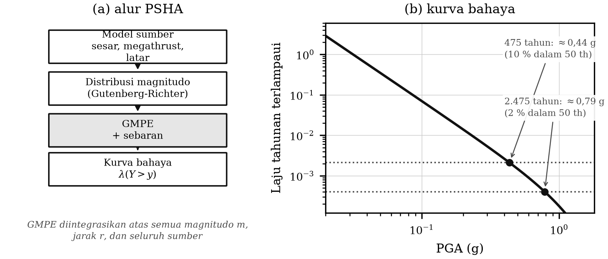

# BAB 10 — BAHAYA DAN RISIKO GEMPA

::: {custom-style="Tujuan"}
**Tujuan Pembelajaran.** Setelah mempelajari bab ini mahasiswa mampu:
(1) membedakan bahaya (*hazard*) dari risiko (*risk*);
(2) menjelaskan langkah-langkah analisis bahaya gempa deterministik dan
probabilistik;
(3) menafsirkan kurva bahaya dan peta bahaya beserta perioda ulangnya;
(4) menjelaskan kedudukan Peta Sumber dan Bahaya Gempa Indonesia 2017 dan SNI
1726 dalam praktik pembangunan; dan
(5) menerangkan pilihan-pilihan mitigasi beserta batasnya.
:::

## 10.1 Bahaya, kerentanan, risiko

Tiga istilah yang sering dipertukarkan padahal berbeda tajam:

**Bahaya** (*hazard*) adalah peluang terjadinya guncangan dengan tingkat
tertentu di suatu tempat dalam kurun waktu tertentu. Bahaya adalah sifat
alam; **kita tidak dapat menguranginya.**

**Kerentanan** (*vulnerability*) adalah tingkat kerusakan yang diderita
bangunan atau sistem bila mengalami guncangan tertentu. Kerentanan adalah
sifat yang kita bangun sendiri; **kita dapat menguranginya.**

**Risiko** (*risk*) adalah perkiraan kerugian, yang secara sederhana dapat
ditulis

$$\text{Risiko} = \text{Bahaya} \times \text{Kerentanan} \times \text{Keterpaparan} \text{~~~~~~~~~~~~~~~~} (10.1)$$

dengan **keterpaparan** (*exposure*) adalah nilai dan jumlah yang berada di
daerah itu — jumlah penduduk, jumlah bangunan, nilai aset.

Persamaan (10.1) memuat seluruh strategi mitigasi dalam satu baris. Karena
bahaya tidak dapat dikurangi, pengurangan risiko hanya dapat dilakukan melalui
**kerentanan** (memperbaiki mutu bangunan) dan **keterpaparan** (mengatur apa
yang dibangun di mana). Semua kebijakan mitigasi yang serius pada akhirnya
adalah salah satu dari kedua hal itu.

## 10.2 Analisis bahaya gempa deterministik

**DSHA** (*Deterministic Seismic Hazard Analysis*) menjawab pertanyaan:
"seberapa kuat guncangan bila gempa terbesar yang mungkin terjadi pada sumber
terdekat benar-benar terjadi?" Langkahnya:

1. Kenali semua sumber gempa di sekitar lokasi.
2. Tetapkan magnitudo maksimum tiap sumber.
3. Tentukan jarak terdekat dari tiap sumber ke lokasi.
4. Hitung gerakan tanah dengan GMPE.
5. Ambil nilai terbesar sebagai gerakan tanah rencana.

DSHA sederhana dan mudah dijelaskan, tetapi tidak memuat informasi **seberapa
sering** hal itu terjadi. Karena itu DSHA dipakai untuk bangunan yang
kegagalannya tidak dapat ditoleransi — bendungan besar, instalasi nuklir —
sedangkan untuk bangunan umum dipakai pendekatan probabilistik.

## 10.3 Analisis bahaya gempa probabilistik

**PSHA** (*Probabilistic Seismic Hazard Analysis*), yang dirumuskan Cornell
(1968), menghitung **laju tahunan terlampauinya** suatu tingkat gerakan tanah
$y$, dengan menjumlahkan sumbangan seluruh sumber, seluruh magnitudo, dan
seluruh jarak:

$$\lambda(Y > y) = \sum_{i} \nu_i \int_{M}\int_{R} P\left(Y > y \mid m, r\right) f_i(m)\, f_i(r)\, dm\, dr \text{~~~~~~~~~~~~~~~~} (10.2)$$

dengan $\nu_i$ laju tahunan gempa pada sumber ke-$i$ di atas magnitudo
minimum, $f_i(m)$ dan $f_i(r)$ fungsi kepadatan peluang magnitudo (dari
Gutenberg–Richter, Bab 8) dan jarak (dari geometri sumber), dan
$P(Y>y\mid m,r)$ peluang terlampauinya $y$ menurut GMPE beserta sebarannya.

Perioda ulang adalah kebalikan laju tahunan,

$$T_R = \frac{1}{\lambda} \text{~~~~~~~~~~~~~~~~} (10.3)$$

dan peluang terlampaui dalam kurun $t$ tahun, dengan anggapan proses Poisson,

$$P = 1 - e^{-\lambda t} \text{~~~~~~~~~~~~~~~~} (10.4)$$

::: {custom-style="Kotak"}
**Kotak 10.1 — Membaca "10 persen dalam 50 tahun".** Kriteria yang paling
sering dipakai dalam peraturan bangunan adalah gerakan tanah dengan peluang
terlampaui 10 persen dalam 50 tahun. Dengan Persamaan (10.4),
$\lambda = -\ln(0{,}9)/50 = 0{,}00211$ per tahun, yang berarti perioda ulang
sekitar **475 tahun**.

Untuk gempa maksimum yang dipertimbangkan (*maximum considered earthquake*),
kriterianya adalah 2 persen dalam 50 tahun, yang bersesuaian dengan perioda
ulang sekitar **2.475 tahun**.

Perlu ditegaskan: perioda ulang 475 tahun **bukan** berarti gempa itu terjadi
sekali tiap 475 tahun secara teratur. Ia berarti peluang terlampauinya sekitar
0,2 persen tiap tahun — dan peluang itu sama besar setiap tahun, tidak peduli
kapan gempa terakhir terjadi.
:::

Hasil PSHA disajikan dalam dua bentuk:

- **Kurva bahaya** untuk satu lokasi: gerakan tanah terhadap laju tahunan
  terlampaui.
- **Peta bahaya**: nilai gerakan tanah untuk perioda ulang tertentu, dipetakan
  atas seluruh wilayah.

::: {custom-style="ImageCaption"}
**Gambar 10.1.** (a) Skema alur PSHA dari model sumber, distribusi magnitudo,
dan GMPE menuju kurva bahaya. (b) Contoh kurva bahaya dengan penandaan perioda
ulang 475 dan 2.475 tahun.
:::

**Ketidakpastian dalam PSHA** dibagi menjadi dua jenis, dan pembedaan ini
penting:

- **Aleatorik** — keacakan alamiah yang tidak dapat dihilangkan, misalnya
  sebaran GMPE. Ditangani dengan integrasi dalam Persamaan (10.2).
- **Epistemik** — ketidaktahuan kita, misalnya model sumber mana yang benar
  atau GMPE mana yang paling sesuai. Ditangani dengan **pohon logika** (*logic
  tree*): beberapa model alternatif dijalankan dengan bobot masing-masing.

## 10.4 Peta bahaya gempa Indonesia dan SNI

Indonesia telah menyusun peta bahaya gempa nasional secara berkala, dengan
pemutakhiran besar pada 2010 dan 2017. **Peta Sumber dan Bahaya Gempa
Indonesia Tahun 2017**, disusun Pusat Studi Gempa Nasional (PuSGeN) di bawah
Kementerian Pekerjaan Umum dan Perumahan Rakyat, memuat model sumber gempa
yang jauh lebih rinci daripada pendahulunya: jumlah sesar aktif yang
dimodelkan bertambah dari 81 menjadi 295, katalog gempa dimutakhirkan dan
direlokasi dengan model kecepatan tiga dimensi, dan data topografi resolusi
tinggi dipakai untuk pemetaan sesar.

Peta ini menjadi dasar peraturan perencanaan bangunan tahan gempa
**SNI 1726**, yang menetapkan parameter percepatan spektral rencana untuk
setiap lokasi di Indonesia beserta kelas situs berdasarkan $V_{s30}$.

Rantai kelembagaannya penting untuk dipahami mahasiswa, karena di sinilah
seismologi menjadi kebijakan publik:

**data seismik → katalog dan model sumber → PSHA → peta bahaya → SNI → izin
mendirikan bangunan → bangunan yang berdiri.**

Setiap mata rantai yang lemah membatalkan yang berikutnya. Peta bahaya
terbaik di dunia tidak berguna bila tidak masuk ke dalam standar; standar
terbaik tidak berguna bila tidak ditegakkan dalam perizinan dan pengawasan
pembangunan.

::: {custom-style="Kotak"}
**Kotak 10.2 — Yang tidak tercakup peta bahaya.** Gempa Yogyakarta 2006
terjadi pada struktur yang tidak menonjol dalam model sumber yang berlaku saat
itu. Gempa Cianjur 2022 juga demikian. Kenyataan ini tidak membatalkan
kegunaan peta bahaya, tetapi mengingatkan dua hal.

*Pertama*, model sumber selalu tidak lengkap. Karena itu PSHA menyertakan
**sumber latar** (*background seismicity*) — kegempaan yang tersebar dan tidak
dikaitkan dengan sesar tertentu — yang justru dimaksudkan untuk menangkap
gempa dari struktur yang belum diketahui.

*Kedua*, dan lebih penting: **peraturan bangunan tahan gempa melindungi
terhadap guncangan, tanpa peduli sesar mana yang menghasilkannya.** Rumah
bertulang yang dibangun sesuai kaidah di Bantul akan bertahan lebih baik pada
gempa 2006, terlepas dari apakah sesar penyebabnya sudah tergambar di peta
atau belum. Inilah alasan mengapa penguatan mutu bangunan adalah tindakan
mitigasi yang paling kukuh terhadap ketidaktahuan kita sendiri.
:::

## 10.5 Pilihan mitigasi

Berdasarkan Persamaan (10.1), tindakan mitigasi dapat disusun menurut daya
ungkitnya:

1. **Bangunan tahan gempa.** Paling efektif. Untuk rumah tinggal sederhana di
   Indonesia, tiga hal terpenting adalah kolom praktis dan sloof yang
   tersambung menerus, pengikatan atap ke struktur, dan mutu adukan serta
   pelaksanaan yang memadai. Biaya tambahannya relatif kecil bila dilakukan
   sejak awal, dan sangat besar bila dikerjakan sebagai perkuatan kemudian.
2. **Tata ruang berbasis mikrozonasi.** Membatasi jenis dan tinggi bangunan
   pada zona endapan lunak, zona rawan likuefaksi, dan zona sempadan sesar.
3. **Perkuatan bangunan penting.** Rumah sakit, sekolah, dan gedung pemerintah
   yang harus tetap berfungsi setelah gempa.
4. **Sistem peringatan dini dan kesiapsiagaan.** Efektif untuk tsunami; sangat
   terbatas untuk gempa kerak dangkal di bawah kota (Bab 3, Kotak 3.1).
5. **Pendidikan dan latihan.** Latihan evakuasi, pengetahuan tentang tanda
   alam tsunami, dan pengetahuan tentang perilaku saat guncangan.
6. **Asuransi dan skema pembiayaan bencana.** Tidak mengurangi kerusakan,
   tetapi mempercepat pemulihan.

::: {custom-style="Kotak"}
**Kotak 10.3 — Tentang "prediksi gempa".** Perlu dinyatakan dengan jelas
dalam sebuah buku ajar: **peramalan gempa yang tepat waktu, tempat, dan
magnitudonya belum dapat dilakukan, dan tidak ada metode yang telah lolos
pengujian ilmiah untuk itu.** Berbagai prekursor yang pernah diusulkan —
perubahan kecepatan gelombang, gas radon, perilaku hewan, anomali
elektromagnetik — belum ada satu pun yang terbukti dapat diandalkan secara
berulang.

Yang dapat dilakukan seismologi adalah:
(a) **peramalan probabilistik jangka panjang** — inilah PSHA;
(b) **peramalan operasional jangka pendek** untuk gempa susulan — model ETAS
(Bab 8);
(c) **peringatan dini** dalam hitungan detik, setelah gempa mulai terjadi
(Bab 11).

Membedakan ketiganya dari "prediksi" adalah bagian dari tanggung jawab
profesional seorang seismolog dalam berkomunikasi dengan publik.
:::

::: {custom-style="Ringkasan"}
**Ringkasan Bab 10**

1. Risiko = bahaya × kerentanan × keterpaparan. Bahaya tidak dapat dikurangi;
   kerentanan dan keterpaparan dapat.
2. DSHA menjawab "seberapa kuat jika terjadi"; PSHA menjawab "seberapa sering
   terlampaui".
3. Perioda ulang 475 tahun setara dengan peluang terlampaui 10 persen dalam 50
   tahun, dan bukan berarti keteraturan waktu kejadian.
4. Ketidakpastian aleatorik ditangani dengan integrasi; ketidakpastian
   epistemik dengan pohon logika.
5. Peta Sumber dan Bahaya Gempa Indonesia 2017 memodelkan 295 sesar aktif dan
   menjadi dasar SNI 1726.
6. Tindakan mitigasi dengan daya ungkit terbesar adalah mutu bangunan dan
   pengaturan tata ruang.
7. Prediksi gempa jangka pendek belum dapat dilakukan; yang ada adalah
   peramalan probabilistik, peramalan gempa susulan, dan peringatan dini.
:::

::: {custom-style="Soal"}
**Soal Latihan**

**10.1** Hitung perioda ulang untuk peluang terlampaui 2 persen dalam 50 tahun
dan 10 persen dalam 100 tahun.

**10.2** Sebuah sumber sesar menghasilkan gempa $M \ge 5$ dengan laju 0,1 per
tahun dan memiliki $b = 1{,}0$ serta $M_{\max} = 7{,}0$. Hitung laju tahunan
gempa $M \ge 6$ dan $M \ge 6{,}5$ dari sumber itu.

**10.3** Jelaskan mengapa ketidakpastian GMPE bersifat aleatorik sedangkan
pemilihan GMPE bersifat epistemik, dan bagaimana keduanya masuk ke dalam
perhitungan PSHA.

**10.4** Menurut Persamaan (10.1), manakah yang lebih menurunkan risiko: (a)
memperbaiki mutu bangunan sehingga kerentanan turun 50 persen, atau (b)
memindahkan 20 persen penduduk keluar dari zona bahaya? Diskusikan pula
kelayakan sosial dan biaya masing-masing.

**10.5** Seandainya Anda menjadi penasihat pemerintah daerah DI Yogyakarta
setelah membaca Bab 7, 9, dan 10, susunlah tiga usulan kebijakan mitigasi
beserta alasan teknisnya, diurutkan menurut daya ungkit.
:::

::: {custom-style="Bacaan"}
**Bacaan Lanjut**

- Cornell, C. A. (1968). Engineering seismic risk analysis. *Bulletin of the
  Seismological Society of America*, 58, 1583–1606.
- McGuire, R. K. (2004). *Seismic Hazard and Risk Analysis*. EERI.
- Pusat Studi Gempa Nasional (2017). *Peta Sumber dan Bahaya Gempa Indonesia
  Tahun 2017*. Kementerian PUPR, Bandung.
- Badan Standardisasi Nasional. SNI 1726 tentang tata cara perencanaan
  ketahanan gempa untuk struktur bangunan gedung dan nongedung (edisi
  terbaru yang berlaku).
- Irsyam, M. dkk. (2020). Development of the 2017 national seismic hazard maps
  of Indonesia. *Earthquake Spectra*, 36(S1), 112–136.
:::
