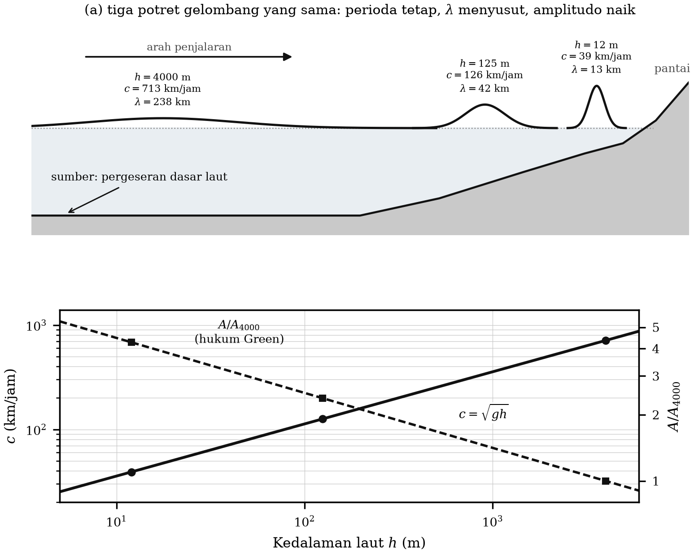
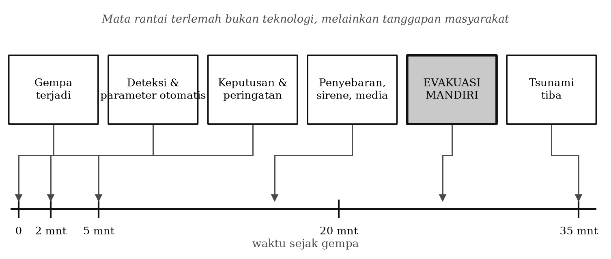

# BAB 11 — TSUNAMI DAN SISTEM PERINGATAN DINI

::: {custom-style="Tujuan"}
**Tujuan Pembelajaran.** Setelah mempelajari bab ini mahasiswa mampu:
(1) menjelaskan fisika penjalaran tsunami dan menghitung kecepatan serta waktu
tempuhnya;
(2) menyebutkan mekanisme pembangkit tsunami selain gempa megathrust;
(3) menjelaskan cara kerja InaTEWS dan batas-batasnya;
(4) menjelaskan prinsip peringatan dini gempa dan mengapa penerapannya
terbatas untuk gempa kerak dangkal; dan
(5) menarik pelajaran dari peristiwa tsunami besar di Indonesia.
:::

## 11.1 Fisika tsunami

Tsunami adalah gelombang gravitasi permukaan laut dengan panjang gelombang
jauh lebih besar daripada kedalaman laut, sehingga termasuk **gelombang air
dangkal** (*shallow water wave*) — walaupun terjadi di laut sedalam lima
kilometer. Kecepatannya

$$c = \sqrt{g h} \text{~~~~~~~~~~~~~~~~} (11.1)$$

dengan $g$ percepatan gravitasi dan $h$ kedalaman laut. Beberapa nilai:

| Kedalaman laut | Kecepatan | Setara |
|--:|--:|:--|
| 6.000 m | 243 m/s | 875 km/jam |
| 4.000 m | 198 m/s | 713 km/jam |
| 1.000 m | 99 m/s | 357 km/jam |
| 100 m | 31 m/s | 113 km/jam |
| 10 m | 9,9 m/s | 36 km/jam |

Dua sifat penting mengikuti dari Persamaan (11.1):

**Pendangkalan** (*shoaling*). Ketika tsunami memasuki perairan dangkal,
kecepatannya berkurang, sedangkan fluks energinya harus tetap. Akibatnya
panjang gelombang memendek dan amplitudonya membesar. Secara kasar, hukum
Green memberikan

$$\frac{H_2}{H_1} \approx \left(\frac{h_1}{h_2}\right)^{1/4} \text{~~~~~~~~~~~~~~~~} (11.2)$$

Gelombang setinggi setengah meter di laut dalam dapat menjadi beberapa meter
di pantai — dan jauh lebih tinggi lagi pada teluk sempit yang memusatkan
energi.

**Pembiasan.** Karena kecepatan bergantung kedalaman, muka gelombang tsunami
dibiaskan oleh topografi dasar laut dan cenderung membelok tegak lurus menuju
garis pantai, serta dipusatkan oleh punggungan bawah laut.

Perlu ditekankan bahwa yang datang bukan "satu gelombang", melainkan
rangkaian gelombang yang dapat berlangsung berjam-jam, dan **gelombang pertama
sering bukan yang terbesar**. Surutnya air laut secara tiba-tiba adalah tanda
bahwa yang tiba lebih dahulu adalah lembah gelombang; ini adalah peringatan
alam yang harus dikenali setiap penduduk pesisir.

::: {custom-style="ImageCaption"}
**Gambar 11.1.** Penjalaran tsunami dari sumber di zona subduksi menuju
pantai: perubahan kecepatan, panjang gelombang, dan tinggi gelombang akibat
pendangkalan.
:::

## 11.2 Mekanisme pembangkit tsunami

**1. Gempa megathrust.** Mekanisme yang paling umum. Pergeseran vertikal dasar
laut memindahkan kolom air di atasnya. Syarat kasar: magnitudo besar
($M_w \gtrsim 7$), sumber dangkal, di bawah laut, dan bermekanisme sesar naik
atau turun (gempa geser murni memindahkan air jauh lebih sedikit).

**2. Gempa tsunami** (*tsunami earthquake*). Gempa dengan rupture yang lambat
dan dangkal, sehingga guncangannya lemah dan berperioda panjang, tetapi
tsunaminya jauh lebih besar daripada yang diperkirakan dari magnitudo
gelombang badan. **Gempa Pangandaran 17 Juli 2006** ($M_w$ 7,7) adalah contoh
klasiknya: banyak penduduk pantai selatan Jawa tidak merasakan guncangan yang
mengkhawatirkan, sehingga tidak mengungsi, lalu tsunami datang. Jenis inilah
yang paling berbahaya bagi sistem peringatan yang mengandalkan magnitudo cepat
dari gelombang badan — dan alasan mengapa metode W-phase dan pengukuran
magnitudo perioda panjang menjadi penting.

**3. Longsoran bawah laut**, yang dapat dipicu gempa yang lebih kecil, dan
menghasilkan tsunami lokal yang sangat tinggi tetapi terbatas jangkauannya.

**4. Longsoran sisi gunung api dan letusan.** **Tsunami Selat Sunda 22
Desember 2018** dibangkitkan oleh runtuhnya sisi barat daya Anak Krakatau,
**tanpa didahului gempa yang berarti**. Sistem peringatan yang berbasis
seismik tidak mendeteksinya, dan tidak ada peringatan yang dikeluarkan
sebelum gelombang tiba. Peristiwa ini mengubah cara pandang terhadap
pemantauan tsunami di Indonesia, dan mendorong penambahan pemantauan berbasis
muka air laut dan pemantauan gunung api pesisir.

**5. Tsunami dari sesar geser plus longsoran.** **Tsunami Teluk Palu 28
September 2018** menyertai gempa bermekanisme geser yang seharusnya
menghasilkan perpindahan air kecil. Tsunami setinggi beberapa meter yang
terjadi dijelaskan oleh gabungan pergeseran dasar teluk dan longsoran bawah
laut di dalam teluk yang sempit dan dalam. Peristiwa ini menunjukkan bahwa
aturan praktis "gempa geser tidak menimbulkan tsunami" tidak dapat dipegang
secara mutlak.

## 11.3 InaTEWS

**InaTEWS** (*Indonesia Tsunami Early Warning System*) dibangun setelah
bencana Aceh 2004 dan diresmikan pada 2008. Sistem ini dioperasikan BMKG dan
merupakan hasil kerja sama internasional, antara lain dengan Jerman melalui
GFZ Potsdam.

**Alur kerja peringatan:**

1. **Deteksi.** Jaringan seismik nasional mendeteksi gempa secara otomatis.
2. **Penentuan parameter cepat.** Lokasi, kedalaman, dan magnitudo ditentukan
   otomatis oleh SeisComP dalam hitungan detik sampai dua menit.
3. **Keputusan peringatan.** Bila memenuhi kriteria — umumnya $M \ge 7$,
   kedalaman dangkal, dan berpusat di laut — sistem mengeluarkan peringatan.
   Tingkat bahaya dan perkiraan waktu tiba diambil dari **basis data skenario
   tsunami** yang telah dihitung sebelumnya untuk ribuan sumber potensial,
   karena pemodelan penuh terlalu lambat untuk peringatan.
4. **Penyebaran.** Peringatan disebarkan lewat berbagai jalur ke pemerintah
   daerah, BPBD, media, sirene, dan aplikasi.
5. **Pemutakhiran dan pengakhiran.** Peringatan diperbarui dengan data muka
   air laut (tide gauge, buoy) dan diakhiri bila ancaman berlalu.

Sasaran waktu peringatan pertama adalah dalam hitungan beberapa menit setelah
gempa.

::: {custom-style="ImageCaption"}
**Gambar 11.2.** Alur kerja peringatan dini tsunami: dari deteksi gelombang P,
penentuan parameter, pencocokan skenario, sampai penyebaran peringatan dan
evakuasi. Sumbu waktu menunjukkan mengapa "rantai terakhir" sering menjadi
yang paling menentukan.
:::

::: {custom-style="Kotak"}
**Kotak 11.1 — Rantai terlemah bukan teknologi.** Untuk sumber dekat pantai —
dan hampir seluruh sumber tsunami di Indonesia adalah sumber dekat — waktu
antara gempa dan tibanya gelombang hanya **20 sampai 40 menit**, bahkan
kurang untuk teluk sempit. Dalam waktu sesingkat itu, peringatan harus
dikeluarkan, diterima, dipercaya, dan **ditindaklanjuti dengan evakuasi
mandiri**.

Pengalaman menunjukkan bahwa mata rantai yang paling sering gagal bukanlah
seismometer atau perangkat lunaknya, melainkan mata rantai terakhir: apakah
orang di pantai tahu harus ke mana, apakah jalur evakuasi jelas, dan apakah
mereka bergerak tanpa menunggu pengumuman.

Karena itu satu pesan tunggal harus diajarkan kepada penduduk pesisir dan
diulang tanpa bosan: **guncangan kuat di pantai adalah peringatan itu sendiri
— jangan menunggu sirene, segera menuju tempat tinggi.**
:::

## 11.4 Peringatan dini gempa

**EEW** (*Earthquake Early Warning*) berbeda dari peringatan tsunami. Ia
memanfaatkan dua kenyataan fisis: gelombang P menjalar lebih cepat daripada
gelombang S dan gelombang permukaan yang merusak, dan sinyal listrik menjalar
jauh lebih cepat daripada keduanya. Bila gelombang P terdeteksi di stasiun
dekat sumber, peringatan dapat dikirim ke tempat yang lebih jauh sebelum
gelombang S tiba.

Waktu peringatan yang tersedia kira-kira

$$t_w \approx \frac{R}{v_s} - \frac{R}{v_p} - t_{\text{proses}} \text{~~~~~~~~~~~~~~~~} (11.3)$$

Dengan $v_p = 6{,}0$ dan $v_s = 3{,}5$ km/s, selisih waktu tiba S–P bertambah
sekitar 12 detik untuk tiap 100 km jarak. Setelah dikurangi waktu pemrosesan
dan penyebaran, waktu peringatan yang berguna hanya tersedia untuk lokasi yang
cukup jauh dari sumber.

Konsekuensinya bersifat menentukan bagi Indonesia. Untuk gempa megathrust yang
berpusat di lepas pantai dan merusak kota di daratan, EEW dapat memberikan
puluhan detik — cukup untuk menghentikan kereta, membuka pintu lift,
mematikan jalur gas, dan berlindung. Tetapi untuk **gempa kerak dangkal tepat
di bawah kota — seperti Yogyakarta 2006 — daerah yang paling parah berada di
dalam "zona buta"**, tempat gelombang S tiba sebelum peringatan apa pun dapat
sampai. Aritmetika Kotak 3.1 pada Bab 3 tidak dapat dilawan dengan teknologi.

**Kesimpulan yang harus dipegang:** EEW adalah pelengkap, bukan pengganti,
bagi bangunan tahan gempa.

::: {custom-style="Kotak"}
**Kotak 11.2 — Tiga peristiwa, tiga pelajaran.**

**Aceh 2004.** Tidak ada sistem peringatan sama sekali di Samudra Hindia.
Lebih dari 200 ribu orang meninggal, sebagian di negara-negara yang gelombang
tsunaminya baru tiba berjam-jam kemudian — waktu yang sangat cukup untuk
evakuasi seandainya peringatan ada. **Pelajaran: sistem peringatan regional
mutlak diperlukan.** InaTEWS lahir dari peristiwa ini.

**Pangandaran 2006.** Sistem sudah mulai ada, tetapi gempa ini adalah gempa
tsunami dengan guncangan yang lemah, sehingga penduduk tidak merasa perlu
mengungsi. **Pelajaran: magnitudo cepat dari gelombang badan dapat sangat
meremehkan potensi tsunami; diperlukan pengukuran perioda panjang, dan
diperlukan pendidikan bahwa guncangan lemah yang lama juga berbahaya di
pantai.**

**Selat Sunda 2018.** Tsunami dibangkitkan longsoran gunung api tanpa gempa
pemicu yang berarti, sehingga sistem berbasis seismik tidak mendeteksinya.
**Pelajaran: tidak semua tsunami didahului gempa; pemantauan muka air laut,
pemantauan gunung api pesisir, dan pengenalan tanda alam tetap diperlukan.**
:::

::: {custom-style="Ringkasan"}
**Ringkasan Bab 11**

1. Tsunami adalah gelombang air dangkal dengan $c=\sqrt{gh}$; pendangkalan
   memperbesar amplitudo mengikuti hukum Green.
2. Gelombang pertama sering bukan yang terbesar; surutnya air laut mendadak
   adalah tanda bahaya.
3. Pembangkit tsunami meliputi gempa megathrust, gempa tsunami berupture
   lambat, longsoran bawah laut, longsoran gunung api, dan gabungan sesar
   geser dengan longsoran.
4. InaTEWS mendeteksi gempa, menentukan parameter otomatis, mencocokkan dengan
   basis data skenario, lalu menyebarkan peringatan dalam hitungan menit.
5. Untuk sumber dekat, waktu evakuasi hanya 20–40 menit; mata rantai terlemah
   adalah tanggapan masyarakat, bukan teknologi.
6. EEW memberikan waktu peringatan yang sebanding dengan jarak, sehingga
   hampir tidak berguna untuk gempa dangkal tepat di bawah kota.
:::

::: {custom-style="Soal"}
**Soal Latihan**

**11.1** Sebuah gempa megathrust terjadi 250 km di selatan pantai Yogyakarta
pada laut sedalam rata-rata 3.000 m untuk 200 km pertama dan 500 m untuk 50 km
terakhir. Perkirakan waktu tiba tsunami di pantai. Bandingkan dengan sasaran
waktu peringatan InaTEWS dan simpulkan berapa waktu yang tersisa untuk
evakuasi.

**11.2** Gelombang tsunami setinggi 0,6 m di laut sedalam 4.000 m memasuki
perairan sedalam 10 m. Perkirakan tingginya dengan hukum Green. Sebutkan dua
faktor yang membuat perkiraan ini dapat meleset jauh.

**11.3** Jelaskan mengapa gempa bermekanisme geser umumnya kurang efektif
membangkitkan tsunami, dan mengapa gempa Palu 2018 menjadi pengecualian.

**11.4** Dengan Persamaan (11.3) dan waktu pemrosesan 5 detik, hitung waktu
peringatan EEW untuk lokasi berjarak 30, 100, dan 300 km dari sumber. Pada
jarak berapa peringatan mulai berguna untuk menghentikan kereta api?

**11.5** Susunlah materi penyuluhan satu halaman untuk penduduk pantai selatan
Yogyakarta tentang apa yang harus dilakukan bila merasakan guncangan kuat.
Gunakan hasil perhitungan Soal 11.1 sebagai dasar.
:::

::: {custom-style="Bacaan"}
**Bacaan Lanjut**

- Satake, K. (2015). Tsunamis. Dalam *Treatise on Geophysics*, 2nd ed.,
  Vol. 4. Elsevier.
- Kanamori, H. (1972). Mechanism of tsunami earthquakes. *Physics of the Earth
  and Planetary Interiors*, 6, 346–359.
- Lauterjung, J. dkk. (2010). *Real-time geo-hazards monitoring: the German
  Indonesian Tsunami Early Warning System (GITEWS)*. GFZ, Potsdam.
- Allen, R. M. & Melgar, D. (2019). Earthquake early warning: advances,
  scientific challenges, and societal needs. *Annual Review of Earth and
  Planetary Sciences*, 47, 361–388.
- Dokumentasi resmi InaTEWS, BMKG.
:::
