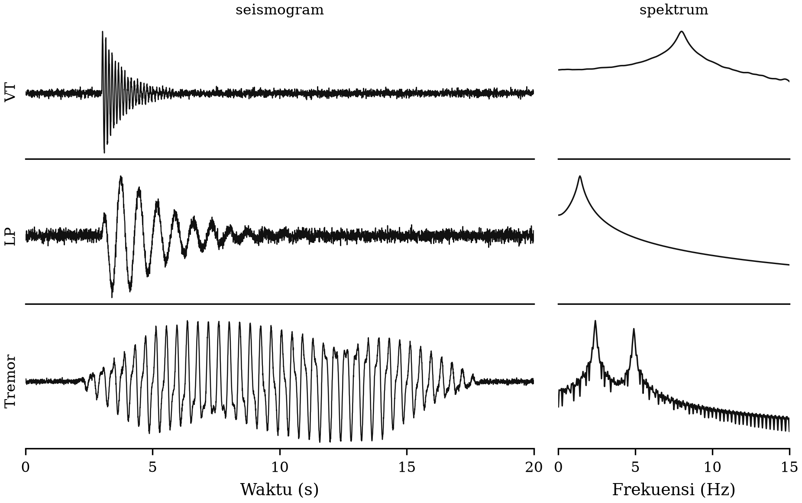

# BAB 12 — SEISMOLOGI GUNUNG API

::: {custom-style="Tujuan"}
**Tujuan Pembelajaran.** Setelah mempelajari bab ini mahasiswa mampu:
(1) mengenali dan membedakan jenis-jenis gempa gunung api dari seismogram dan
spektrumnya;
(2) menjelaskan tafsiran fisis masing-masing jenis;
(3) menerangkan bagaimana data seismik dipakai untuk menetapkan tingkat
aktivitas gunung api; dan
(4) menguraikan perkembangan pemantauan seismik Gunung Merapi.
:::

## 12.1 Mengapa gunung api memerlukan seismologi tersendiri

Sumber gempa vulkanik berbeda dari gempa tektonik dalam tiga hal. *Pertama*,
sumbernya sering melibatkan **fluida** — gas, air, magma — sehingga
mekanismenya tidak selalu berupa kopel ganda dan sering memiliki komponen
isotropik yang besar (Bab 5). *Kedua*, sumbernya **sangat dangkal**, biasanya
kurang dari 5 km, sehingga sangat peka terhadap struktur setempat yang rumit.
*Ketiga*, tujuan pengamatannya berbeda: bukan mempelajari satu peristiwa yang
sudah lewat, melainkan **memantau perubahan secara menerus** untuk mengambil
keputusan tentang tingkat kewaspadaan dan evakuasi.

## 12.2 Jenis-jenis gempa gunung api

Table: **Tabel 12.1.** Jenis gempa gunung api dan tafsirannya.

| Jenis | Ciri seismogram | Pita frekuensi | Tafsiran |
|:--|:--|:--|:--|
| **Vulkano-tektonik (VT)** | Fase P dan S jelas, awal tajam | 5–15 Hz | Patahan getas batuan akibat perubahan tegangan oleh magma |
| **Perioda panjang (LP)** | Awal tidak tajam, tanpa fase S jelas, berdering | 0,5–5 Hz | Resonansi retakan berisi fluida |
| **Sangat perioda panjang (VLP)** | Sinyal sangat lambat | < 0,5 Hz | Perpindahan massa fluida dalam volume besar |
| **Tremor vulkanik** | Getaran menerus, berdurasi menit sampai jam | 1–5 Hz | Aliran fluida menerus; sering mendahului letusan |
| **Guguran / awan panas** | Sinyal cigar, amplitudo naik-turun perlahan | Lebar | Runtuhan kubah lava dan aliran piroklastik |
| **Hibrida** | Awal tajam diikuti ekor berdering | Campuran | Patahan getas yang memicu resonansi fluida |
| **Letusan** | Sinyal amplitudo besar disertai gelombang udara | Lebar | Letusan eksplosif |

::: {custom-style="ImageCaption"}
**Gambar 12.1.** Seismogram dan spektrum skematis untuk gempa VT, LP, dan
tremor vulkanik. Perhatikan perbedaan ketajaman awal sinyal dan kandungan
frekuensinya.
:::

**Mengapa LP penting.** Gempa perioda panjang menandakan gerakan fluida, bukan
patahan batuan. Peningkatan laju LP dan pergeseran ke arah tremor menerus
sering merupakan tanda paling awal bahwa magma sedang bergerak ke permukaan.
Karena itu banyak keputusan menaikkan tingkat kewaspadaan gunung api di dunia
didasarkan pada perubahan jumlah dan sifat gempa LP.

## 12.3 Pemantauan dan pengambilan keputusan

Data seismik yang dipantau secara operasional:

- **Jumlah kejadian per hari** menurut jenis — inilah besaran yang paling
  banyak dipakai untuk keputusan.
- **RSAM** (*Real-time Seismic Amplitude Measurement*) — rata-rata amplitudo
  per selang waktu; ukuran sederhana namun sangat andal untuk melihat tren.
- **Energi seismik kumulatif**, yang bila digambar terhadap waktu sering
  memperlihatkan percepatan menjelang letusan.
- **Lokasi hiposenter**, terutama pendangkalannya terhadap waktu.
- **Nilai $b$** (Bab 8), yang cenderung naik saat tekanan fluida naik.

Di Indonesia, penetapan tingkat aktivitas gunung api — Normal (Level I),
Waspada (II), Siaga (III), dan Awas (IV) — dilakukan oleh PVMBG, Badan
Geologi, dengan data seismik sebagai salah satu masukan utama, bersama
deformasi (*tiltmeter*, GNSS), geokimia gas, dan pengamatan visual.

::: {custom-style="Kotak"}
**Kotak 12.1 — Gunung Merapi dan seismologi.**

Merapi adalah salah satu gunung api yang paling rapat dipantau di dunia, dan
menjadi laboratorium alam bagi Laboratorium Geofisika UGM sejak lama. Beberapa
hal yang menjadikannya penting bagi buku ini:

**Pemantauan jangka panjang.** Jaringan seismik Merapi menghasilkan salah satu
deret data terpanjang di Indonesia. Deret panjang inilah yang memungkinkan
pola prakursor dipelajari secara statistik, bukan hanya dari satu peristiwa.

**Derau latar sebagai bahan penelitian.** Naskah asli buku ini menyebutkan
tesis Woro (1985) tentang gangguan latar di Merapi, yang menyimpulkan bahwa
mikroseism di sana didominasi gelombang Rayleigh dari Samudra Hindia. Setengah
abad kemudian, derau yang sama justru dipakai secara aktif: melalui
interferometri derau ambien, perubahan kecil kecepatan gelombang di tubuh
gunung dapat dipantau secara menerus, dan perubahan itu berkaitan dengan
perubahan tekanan di dalam tubuh gunung.

**Struktur bawah permukaan.** Data MERAMEX (Bab 6) menghasilkan citra anomali
kecepatan rendah dan rasio $v_p/v_s$ tinggi di bawah kompleks Merapi, yang
ditafsirkan sebagai zona jenuh fluida dan lelehan.

**Peristiwa 2006 dan 2010.** Aktivitas Merapi meningkat pada 2006, hampir
bersamaan dengan gempa Yogyakarta 27 Mei. Kebetulan waktu ini memicu
pertanyaan ilmiah yang sah dan masih dibahas: apakah gempa tektonik dapat
memicu atau mempercepat aktivitas vulkanik melalui perubahan tegangan statik
dan dinamik (Bab 8)? Bukti untuk kasus Merapi 2006 tidak konklusif, dan
mahasiswa perlu belajar menghargai jawaban semacam itu. Letusan besar 2010
kemudian menjadi ujian nyata bagi sistem pemantauan dan evakuasi Indonesia,
dan menghasilkan salah satu himpunan data multiparameter terlengkap untuk
letusan besar gunung api tipe Merapi.
:::

::: {custom-style="Ringkasan"}
**Ringkasan Bab 12**

1. Sumber gempa vulkanik melibatkan fluida, sangat dangkal, dan dipantau untuk
   pengambilan keputusan — berbeda dari seismologi tektonik.
2. Jenis utama: VT, LP, VLP, tremor, guguran, hibrida, dan letusan; masing-
   masing memiliki tafsiran fisis sendiri.
3. Peningkatan gempa LP dan tremor sering menjadi tanda paling awal
   pergerakan magma.
4. Besaran operasional: jumlah kejadian per jenis, RSAM, energi kumulatif,
   pendangkalan hiposenter, dan nilai $b$.
5. Merapi menyediakan deret data panjang, citra struktur dari MERAMEX, dan
   pengalaman evakuasi 2010 yang menjadi rujukan nasional.
:::

::: {custom-style="Soal"}
**Soal Latihan**

**12.1** Jelaskan bagaimana Anda membedakan gempa VT dari gempa LP hanya
dengan melihat seismogram dan spektrumnya.

**12.2** Mengapa mekanisme sumber gempa LP sering memiliki komponen
non-kopel-ganda yang besar? Kaitkan dengan dekomposisi tensor momen pada
Subbab 5.6.

**12.3** Diberikan deret RSAM harian sebuah gunung api selama 60 hari yang
menunjukkan kenaikan eksponensial pada 10 hari terakhir. Rekomendasi apa yang
akan Anda berikan, dan data tambahan apa yang Anda perlukan sebelum
memberikannya?

**12.4** Rancanglah jaringan seismik untuk gunung api dengan diameter tubuh 15
km: jumlah stasiun, penempatan, jenis sensor, dan pertimbangan pasokan daya
serta telemetri di lereng gunung.

**12.5** Diskusikan bukti yang diperlukan untuk menyimpulkan bahwa sebuah
gempa tektonik memicu aktivitas vulkanik, dan mengapa kebetulan waktu saja
tidak memadai.
:::

::: {custom-style="Bacaan"}
**Bacaan Lanjut**

- McNutt, S. R. (2005). Volcanic seismology. *Annual Review of Earth and
  Planetary Sciences*, 33, 461–491.
- Chouet, B. A. (1996). Long-period volcano seismicity: its source and use in
  eruption forecasting. *Nature*, 380, 309–316.
- Zobin, V. M. (2017). *Introduction to Volcanic Seismology*, 3rd ed.
  Elsevier.
- Surono dkk. (2012). The 2010 explosive eruption of Java's Merapi volcano.
  *Journal of Volcanology and Geothermal Research*, 241–242, 121–135.
- Lühr, B.-G. dkk. (2013). Fluid ascent and magma storage beneath Gunung
  Merapi revealed by multi-scale seismic imaging. *Journal of Volcanology and
  Geothermal Research*, 261, 7–19.
:::
