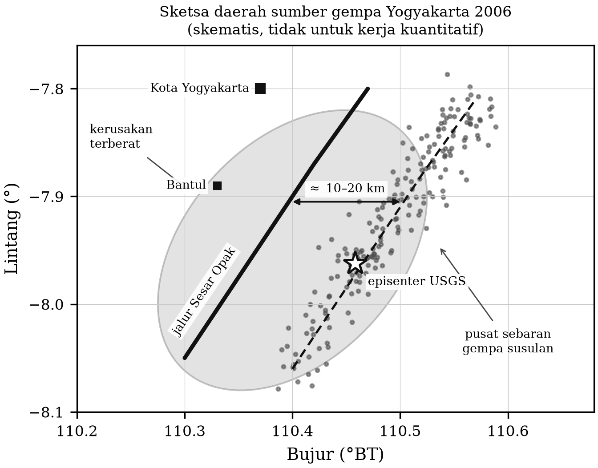

# BAB 14 — STUDI KASUS TERPADU: GEMPA YOGYAKARTA 27 MEI 2006

::: {custom-style="Tujuan"}
**Tujuan Pembelajaran.** Bab ini tidak memperkenalkan teori baru. Bab ini
merangkai seluruh isi buku menjadi satu penyelidikan utuh atas satu peristiwa,
sehingga mahasiswa mampu:
(1) menelusuri jalan dari data mentah sampai kesimpulan ilmiah;
(2) menilai kekuatan dan kelemahan berbagai jenis bukti;
(3) menjelaskan mengapa satu pertanyaan yang tampak sederhana — sesar mana
yang pecah — dapat bertahan sebagai pertanyaan terbuka selama bertahun-tahun;
dan
(4) menarik pelajaran mitigasi yang berdasar bukti.
:::

## 14.1 Peristiwa

Pada Sabtu pagi, **27 Mei 2006 pukul 05.53.58 WIB** (26 Mei 2006 pukul
22.53.58 UTC), gempa bumi mengguncang Daerah Istimewa Yogyakarta dan Jawa
Tengah bagian selatan. Menurut USGS, episenternya berada pada sekitar
7,96° LS dan 110,46° BT — kira-kira 20 km selatan-tenggara Kota Yogyakarta —
dengan kedalaman yang ditetapkan dangkal (sekitar 10 km) dan magnitudo momen
$M_w$ 6,3. Beberapa kajian memakai nilai $M_w$ 6,4.

Kerusakan yang ditimbulkannya jauh melampaui apa yang biasanya diperkirakan
untuk gempa bermagnitudo 6,3. Angka yang lazim dikutip: lebih dari **5.700
orang meninggal**, sekitar **38.000 orang luka-luka**, ratusan ribu rumah
rusak berat atau hancur, dan kerugian ekonomi lebih dari **3 miliar dolar
AS** — salah satu bencana gempa termahal dalam sejarah Indonesia setelah Aceh
2004.

Konteksnya menambah kerumitan: pada saat yang hampir bersamaan, **Gunung
Merapi sedang dalam fase aktivitas yang meningkat**, sehingga perhatian
lembaga kebencanaan dan sebagian sumber daya pemantauan sedang tertuju ke
utara, sementara bencana justru datang dari selatan.

## 14.2 Langkah 1 — Data

Data yang tersedia untuk mempelajari gempa ini berlapis-lapis, dan tiap lapis
menjawab pertanyaan yang berbeda (bandingkan Bab 2).

**Jaringan global dan regional.** Merekam gempa utama pada jarak teleseismik;
dari data inilah magnitudo momen dan tensor momen ditentukan (Bab 5). Namun
jaringan ini terlalu jarang untuk memisahkan dua struktur yang berjarak 10 km.

**Jaringan permanen Indonesia.** Pada 2006 masih jauh lebih jarang daripada
sekarang. Inilah salah satu alasan mengapa parameter awal gempa memiliki
ketidakpastian yang besar, terutama pada kedalaman.

**Jaringan sementara gempa susulan.** Beberapa hari setelah gempa utama, GFZ
Potsdam bersama mitra Indonesia menggelar jaringan sementara berisi **16
stasiun** di sekitar zona sumber. Dari jaringan inilah diperoleh lebih dari
**dua ribu gempa susulan**. Inilah himpunan data yang menentukan.

**Data geodetik.** Citra radar satelit ALOS/PALSAR sebelum dan sesudah gempa
memungkinkan pemetaan deformasi permukaan dengan InSAR, dan pengukuran GNSS
memberikan pergeseran titik.

**Data geologi dan makroseismik.** Pemetaan kerusakan, survei intensitas, dan
pemetaan geologi permukaan.

**Data prakejadian.** Model kecepatan dan gambaran struktur dari MERAMEX
(Bab 6), yang dikumpulkan dua tahun sebelumnya.

## 14.3 Langkah 2 — Parameter sumber

Penentuan parameter mengikuti Bab 4. Tiga catatan penting.

**Magnitudo.** Nilai awal yang dilaporkan berbeda-beda antarlembaga dan
antarjenis magnitudo — hal yang wajar dan justru menjadi contoh baik atas
pembahasan Subbab 4.5.4. Nilai yang bertahan sebagai rujukan adalah magnitudo
momen $M_w$ 6,3–6,4, karena hanya magnitudo momen yang terikat langsung pada
momen seismik.

**Kedalaman.** Inilah parameter yang paling sulit. Gempa ini sangat dangkal,
sehingga fase pP tidak dapat dipisahkan dari P (Subbab 4.4), dan jaringan
permanen terdekat tidak cukup rapat untuk mengendalikan kedalaman. Karena itu
kedalaman awal sering ditetapkan pada nilai baku (10 km) daripada
diselesaikan dari data. Kedalaman yang lebih baik akhirnya diperoleh dari
gempa susulan yang terekam jaringan sementara, yang menempatkan sebagian besar
aktivitas pada kedalaman kerak dangkal (kira-kira 5–15 km).

**Momen dan dimensi sesar.** Perhitungan lengkapnya sudah diberikan pada Kotak
4.3: $M_0 \approx 3{,}5\times10^{18}$ N·m, dengan slip rata-rata dalam orde
setengah meter pada bidang berukuran belasan sampai puluhan kilometer.
Perhatikan implikasinya: **bidang sesar yang pecah hanya berukuran sekitar
20 km — jauh lebih kecil daripada ketidakpastian yang perlu dipecahkan.**

## 14.4 Langkah 3 — Mekanisme sumber

Penyelesaian mekanisme sumber (Bab 5) menunjukkan **sesar geser yang hampir
tegak**, dengan dua bidang nodal: satu berjurus kira-kira **timur laut–barat
daya** dan satu lagi kira-kira **barat laut–tenggara**. Sumbu P dan T
berorientasi hampir horizontal, sesuai dengan rezim sesar geser.

Dan di sinilah persoalan bermula. Seperti telah ditegaskan pada Subbab 5.3,
**data polaritas gelombang P tidak dapat menentukan bidang nodal mana yang
merupakan bidang sesar**, dan **mekanisme sumber tidak memberi tahu di mana
bidang itu berada** — hanya bagaimana orientasinya.

Bidang berjurus timur laut–barat daya bersesuaian dengan arah umum **Sesar
Opak**, struktur yang sudah lama dikenal dan tergambar pada peta geologi
sepanjang Sungai Opak. Kesesuaian itu langsung menarik, dan pada hari-hari
pertama setelah gempa penjelasan yang beredar memang menyebut Sesar Opak
sebagai penyebabnya.

::: {custom-style="Kotak"}
**Kotak 14.1 — Jebakan penafsiran.** Kesesuaian antara sebuah bidang nodal
dan sebuah struktur yang sudah tergambar di peta terasa sangat meyakinkan,
justru karena kita **sudah tahu** struktur itu ada. Inilah salah satu bentuk
bias konfirmasi yang paling umum dalam seismologi terapan.

Uji yang benar bukanlah "apakah orientasinya cocok", melainkan **"apakah ada
bukti bebas yang menempatkan sumber pada struktur itu?"** Bukti bebas yang
tersedia ada dua: sebaran gempa susulan, dan deformasi permukaan. Keduanya
diperiksa pada subbab berikut.
:::

## 14.5 Langkah 4 — Gempa susulan

Analisis gempa susulan mengikuti Bab 4 dan Bab 8:

1. Bentuk gelombang dari 16 stasiun sementara diolah, fase P dan S dibaca.
2. Model kecepatan lokal — yang tersedia berkat MERAMEX — dipakai, dan
   diperbaiki dengan data gempa susulan itu sendiri.
3. Hiposenter ditentukan, lalu direlokasi. Dari sekitar 2.170 kejadian yang
   terkumpul, sekitar 2.141 berhasil direlokasi.
4. Hasilnya dipetakan dan digambar dalam penampang tegak.

**Hasil pokoknya**, sebagaimana dilaporkan dalam literatur (antara lain
Anggraini, 2013), adalah bahwa sebaran gempa susulan **tidak berpusat pada
jejak permukaan Sesar Opak**, melainkan bergeser ke arah timur sejauh sekitar
**10 sampai 20 km**, pada struktur yang sebelumnya tidak menonjol dalam peta.
Aktivitas terbatas pada kerak dangkal, dan pola sebarannya menunjukkan bahwa
lebih dari satu struktur menjadi aktif pada rangkaian tersebut.

::: {custom-style="ImageCaption"}
**Gambar 14.1.** Sketsa daerah sumber gempa Yogyakarta 2006: posisi episenter
instrumental, jalur Sesar Opak, daerah pusat sebaran gempa susulan yang
bergeser ke timur, dan daerah kerusakan terberat. Sketsa skematis untuk
keperluan pengajaran; untuk kerja kuantitatif gunakan peta dan katalog resmi.
:::

::: {custom-style="Kotak"}
**Kotak 14.2 — Mengapa relokasi begitu menentukan.** Jarak yang
diperdebatkan hanya 10–20 km. Ketelitian lokasi rutin dengan jaringan permanen
tahun 2006 berada pada orde yang sama besar. Dengan kata lain, **pertanyaan
ini tidak dapat dijawab tanpa jaringan sementara yang rapat dan tanpa
relokasi**.

Tiga hal yang membuat jawabannya dapat dipercaya:
(a) **jaringan yang mengelilingi sumber**, sehingga celah azimut kecil;
(b) **model kecepatan lokal** dari MERAMEX, sehingga tidak ada pergeseran
sistematis akibat model yang salah;
(c) **relokasi relatif** (Subbab 4.3.4), yang menghilangkan sebagian besar
sisa kesalahan model.

Hilangkan salah satu dari ketiganya, dan kesimpulannya menjadi tidak dapat
dipertahankan. Inilah alasan mengapa Bab 2, 4, 6, dan 8 semuanya diperlukan
untuk menjawab satu pertanyaan yang kedengarannya sederhana.
:::

## 14.6 Langkah 5 — Deformasi permukaan

Analisis InSAR memakai citra ALOS/PALSAR memberikan bukti yang sepenuhnya
bebas dari data seismik: peta perubahan jarak antara satelit dan permukaan
tanah akibat gempa. Pola deformasi yang terpetakan dapat dimodelkan sebagai
dislokasi pada bidang sesar, dan parameter bidang yang paling cocok
diselesaikan lewat inversi.

Hasil analisis semacam ini juga menempatkan bidang sesar yang pecah **di
sebelah timur jejak Sesar Opak**, sejalan dengan kesimpulan dari sebaran gempa
susulan. Kesesuaian antara dua jenis bukti yang benar-benar bebas — satu
berasal dari gelombang elastik, satu dari gelombang radar — jauh lebih kuat
daripada masing-masing sendirian.

Perlu ditambahkan bahwa kajian yang berbeda memberikan rincian parameter yang
tidak persis sama, dan sebagian penulis tetap mempertahankan peran struktur
Opak dalam bentuk tertentu. **Pertanyaan mengenai rincian geometri sumber
gempa ini masih menjadi bahan penelitian yang aktif sampai sekarang** —
termasuk oleh peneliti Indonesia — dan mahasiswa perlu memandang hal itu
sebagai keadaan yang sehat, bukan sebagai kegagalan.

## 14.7 Langkah 6 — Mengapa kerusakannya begitu parah

Empat faktor bekerja bersama-sama, dan tidak satu pun dapat menjelaskan
sendirian (bandingkan Bab 9 dan Kotak 7.1).

**1. Sumber sangat dangkal dan sangat dekat.** Gempa kerak dangkal tepat di
bawah daerah berpenduduk padat. Jarak hiposenter ke permukiman terparah hanya
belasan kilometer.

**2. Efek sumber.** Pola kerusakan memanjang timur laut–barat daya, sejajar
dengan bidang sesar, bukan melingkar mengelilingi episenter. Pola radiasi dan
keterarahan rupture menyalurkan energi lebih besar ke arah tertentu.

**3. Efek situs.** Cekungan Yogyakarta diisi endapan vulkanik dan alluvial
muda dari Merapi yang tebal dan lunak, yang memperkuat guncangan dan
memperpanjang durasinya (Subbab 9.4). Pertanyaan mengenai peran endapan ini
dikemukakan secara eksplisit oleh Walter dkk. (2008).

**4. Kerentanan bangunan.** Sebagian besar korban jiwa disebabkan runtuhnya
rumah tinggal berupa pasangan bata tanpa tulangan yang memikul beban, tanpa
kolom praktis dan sloof yang tersambung. Bangunan jenis ini runtuh secara
mendadak dan menyeluruh. Waktu kejadian — pagi hari ketika banyak orang masih
berada di dalam rumah — memperburuk keadaan.

::: {custom-style="Kotak"}
**Kotak 14.3 — Aritmetika yang tidak dapat dilawan.** Dengan
$v_p \approx 5{,}8$ km/s dan $v_s \approx 3{,}4$ km/s, pada jarak hiposenter
sekitar 20 km selisih waktu tiba S–P hanya sekitar 2–3 detik. Bahkan sistem
peringatan dini gempa yang sempurna — tanpa waktu pemrosesan dan tanpa
keterlambatan penyebaran sama sekali — tidak dapat memberikan peringatan yang
berguna bagi penduduk yang berada tepat di atas sumber.

**Untuk gempa kerak dangkal di bawah kota, satu-satunya mitigasi yang bekerja
adalah bangunan yang tidak runtuh.** Kalimat ini adalah kesimpulan teknis,
bukan pendapat, dan seluruh isi buku ini bermuara padanya.
:::

## 14.8 Langkah 7 — Pelajaran

**Untuk ilmu pengetahuan.**

1. Mekanisme sumber menentukan orientasi, bukan letak. Diperlukan bukti bebas
   untuk menentukan letak.
2. Jaringan sementara yang rapat dan digelar cepat setelah gempa memiliki nilai
   ilmiah yang tidak tergantikan.
3. Data prakejadian — seperti model kecepatan MERAMEX — memiliki nilai yang
   sering baru terungkap setelah peristiwa terjadi.
4. Bukti dari disiplin yang berbeda (seismologi, geodesi, geologi) yang saling
   menguatkan jauh lebih kukuh daripada satu jenis bukti sendirian.
5. Pertanyaan ilmiah boleh tetap terbuka. Menyatakan "belum konklusif" dengan
   jujur lebih bernilai daripada kepastian yang dipaksakan.

**Untuk mitigasi.**

1. Gempa merusak dapat berasal dari struktur yang belum terpetakan.
   Konsekuensinya bukan menunggu sampai semua sesar terpetakan, melainkan
   membangun dengan baik di mana pun (Kotak 10.2).
2. Mikrozonasi berbasis efek situs menjelaskan mengapa kerusakan sangat
   bervariasi pada jarak yang sama, dan karena itu langsung berguna bagi tata
   ruang.
3. Peringatan dini gempa bukan jawaban untuk gempa kerak dangkal di bawah
   kota.
4. Program perbaikan mutu rumah tinggal sederhana — kolom praktis, sloof,
   pengikatan atap — memiliki daya ungkit terbesar dan biaya terkecil.

**Untuk pendidikan seismologi di Indonesia.**

Gempa ini terjadi beberapa kilometer dari kampus tempat naskah buku ini
ditulis. Seluruh rantai pengetahuan yang diperlukan untuk memahaminya —
instrumentasi, penjalaran gelombang, penentuan lokasi, mekanisme sumber,
struktur bawah permukaan, statistik kegempaan, efek situs, analisis bahaya —
adalah persis isi buku ini. Dan sebagian besar penelitian yang menjawabnya
dikerjakan, atau melibatkan, orang Indonesia sendiri.

Itulah alasan buku ini disusun ulang dengan contoh-contoh Indonesia: bukan
karena contoh dari California dan Jepang tidak baik, melainkan karena
**seismologi yang paling penting bagi mahasiswa Indonesia adalah seismologi
yang bisa mereka periksa sendiri dengan berjalan kaki ke lapangan.**

::: {custom-style="Soal"}
**Proyek Akhir**

Bab ini paling baik dikerjakan sebagai proyek, bukan sebagai soal. Berikut
usulan proyek akhir mata kuliah, yang dapat dikerjakan berkelompok.

**Proyek A — Analisis gempa susulan.** Dapatkan katalog gempa susulan
Yogyakarta 2006 (atau rangkaian gempa lain di Indonesia). Kerjakan: penentuan
$M_c$, taksiran $b$, pencocokan hukum Omori–Utsu, peta episenter, dan
penampang kedalaman. Simpulkan geometri struktur yang aktif.

**Proyek B — Mikrozonasi kampus.** Lakukan pengukuran HVSR pada 20–30 titik di
lingkungan kampus dan sekitarnya. Petakan $f_0$, perkirakan tebal endapan, dan
bandingkan dengan peta geologi. Diskusikan implikasinya bagi bangunan yang
ada.

**Proyek C — Perbandingan katalog.** Bandingkan parameter gempa signifikan
Indonesia dari BMKG, USGS, dan GCMT untuk 20 kejadian. Analisis selisih
lokasi, kedalaman, dan magnitudo. Jelaskan sumber perbedaannya.

**Proyek D — Pengolahan ulang dengan alat modern.** Ambil rekaman menerus dari
sebuah rangkaian gempa susulan dan olah ulang dengan pendeteksi berbasis
pembelajaran mesin dan pencocokan templat. Berapa banyak kejadian tambahan
yang ditemukan? Bagaimana pengaruhnya terhadap $M_c$ dan $b$?

**Proyek E — Kajian bahaya lokasi.** Pilih satu lokasi di Indonesia. Susun
model sumber sederhana, terapkan GMPE, hitung kurva bahaya sederhana, dan
bandingkan dengan nilai yang tercantum dalam peta bahaya nasional. Jelaskan
setiap perbedaan.
:::

::: {custom-style="Bacaan"}
**Bacaan Lanjut**

- Walter, T. R. dkk. (2008). The 26 May 2006 magnitude 6.4 Yogyakarta
  earthquake south of Mt. Merapi volcano: did lahar deposits amplify ground
  shaking and thus lead to the disaster? *Geochemistry, Geophysics,
  Geosystems*, 9, Q05S13.
- Tsuji, T. dkk. (2009). Earthquake fault of the 26 May 2006 Yogyakarta
  earthquake observed by SAR interferometry. *Earth, Planets and Space*, 61,
  e29–e32.
- Anggraini, A. (2013). *The 26 May 2006 Yogyakarta earthquake, aftershocks
  and interactions*. Disertasi doktor, Universität Potsdam.
- Elnashai, A. S. dkk. (2007). *The Yogyakarta Earthquake of May 27, 2006*.
  MAE Center Report 07-02, University of Illinois.
- Koulakov, I. dkk. (2007). P and S velocity structure of the crust and upper
  mantle beneath Central Java. *Journal of Geophysical Research*, 112, B08310.
- Laporan resmi BMKG, Badan Geologi, dan Bappenas mengenai gempa Yogyakarta
  2006 dan rehabilitasi pascabencana.
:::
