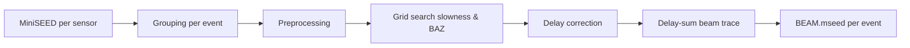
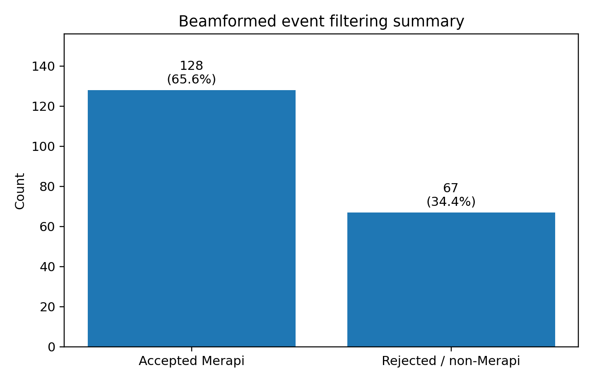
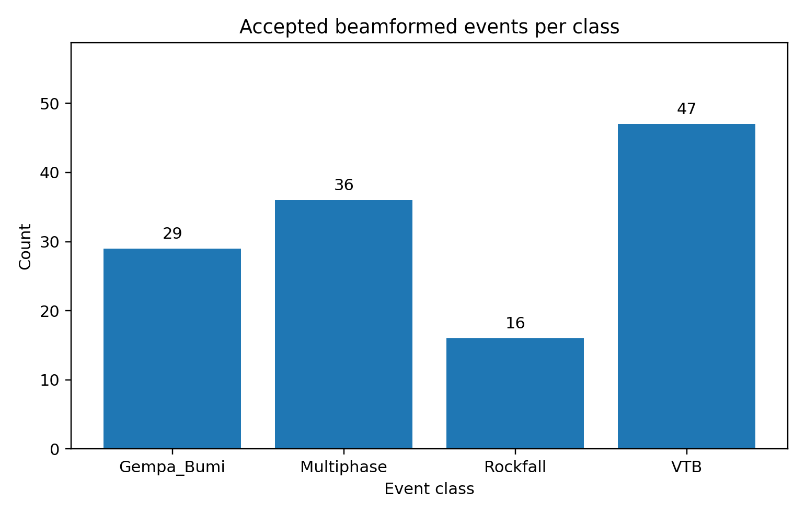
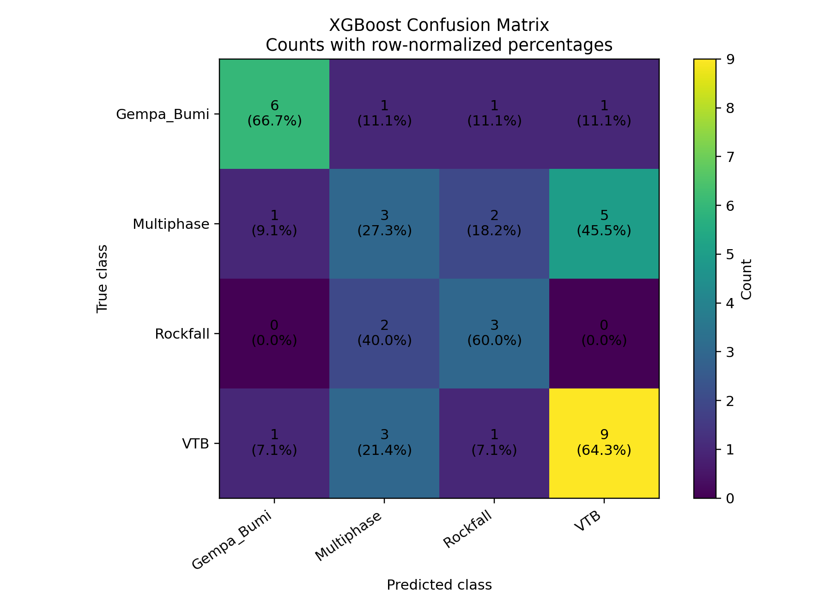
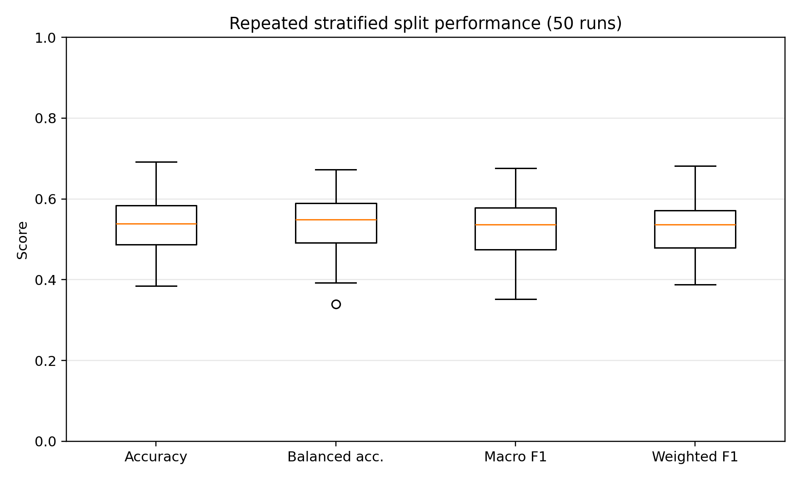
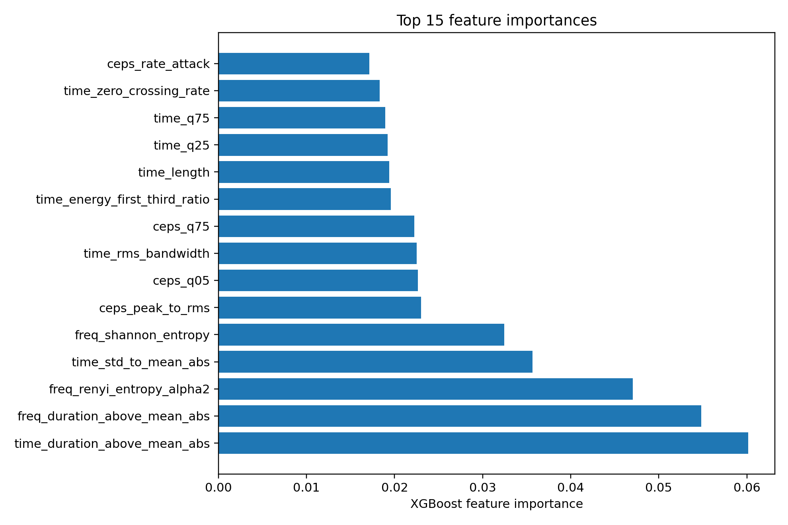
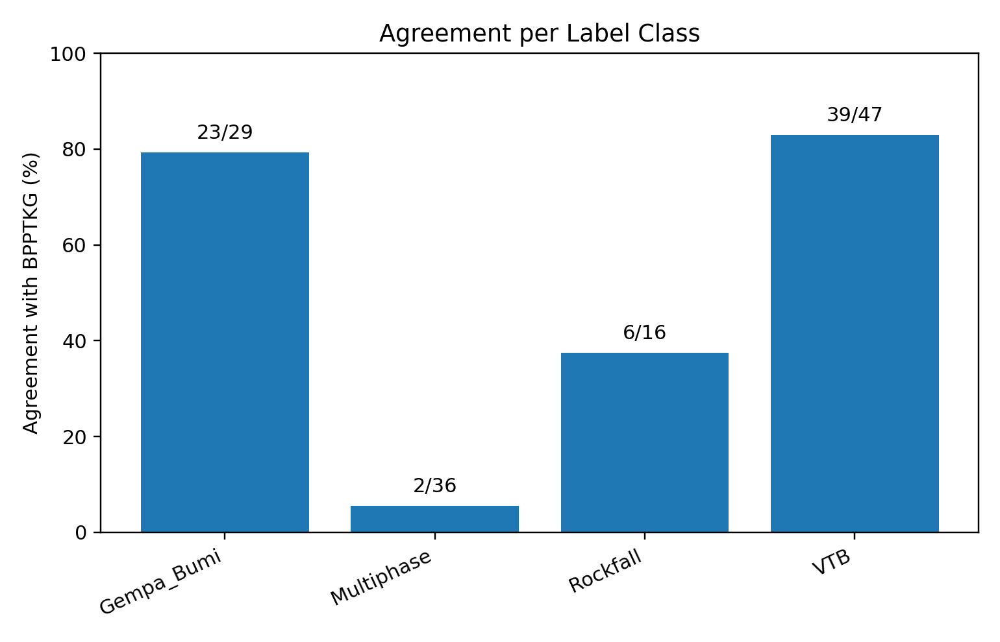
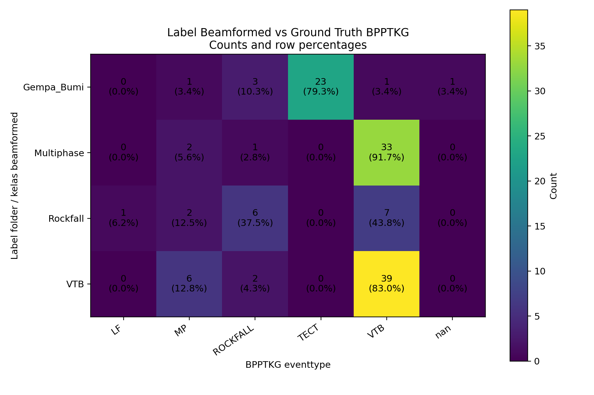

# Ringkasan Workflow Beamforming, XGBoost, dan Validasi BPPTKG — Event Merapi 2023

**Penyusun:** Wiwit Suryanto / ChatGPT  
**Data:** potongan event Merapi dari Raspberry Shake small-aperture array UGM dan bulletin BPPTKG 2023  
**Tujuan:** merangkum alur dari beamforming delay-sum, seleksi arah sumber Merapi, eksperimen supervised machine learning, sampai validasi label terhadap ground truth BPPTKG.

---

## 1. Metadata array UGM

Small-aperture array terdiri dari 5 sensor Raspberry Shake di selatan Merapi. Posisi array ini digunakan untuk menghitung delay relatif setiap sensor pada proses delay-and-sum beamforming.

| Station   | Code   |       Lat |        Lon |
|:----------|:-------|----------:|-----------:|
| UGM01     | RE5DE  | -7.692254 | 110.438530 |
| UGM02     | R6940  | -7.692179 | 110.441112 |
| UGM03     | R265F  | -7.694289 | 110.438977 |
| UGM04     | R7D17  | -7.693931 | 110.441316 |
| UGM05     | R0279  | -7.691258 | 110.440031 |

---

## 2. Struktur data awal

Data MiniSEED awal dikelompokkan ke dalam 4 folder label manual/awal:

- `Gempa_Bumi`
- `Multiphase`
- `Rockfall`
- `VTB`
<div style="background-color:#fff2cc; padding:16px; border-radius:8px;">
<pre><code>20230816_021020-021220_R0279.mseed
20230816_021020-021220_R6940.mseed
20230816_021020-021220_RE5DE.mseed</code></pre>
</div>

Setiap event direkam minimal oleh 3 sensor dan umumnya oleh 5 sensor. Nama file menyimpan informasi waktu event dan kode sensor, misalnya:

```text
20230816_021020-021220_R0279.mseed
20230816_021020-021220_R6940.mseed
20230816_021020-021220_RE5DE.mseed
```

---

## 3. Beamforming delay-sum

### 3.1 Prinsip umum

Untuk setiap event, file MiniSEED dari beberapa sensor dikelompokkan berdasarkan event ID. Setiap trace dipreprocess dengan langkah umum:

1. merge trace dan pilih channel utama,
2. detrend dan demean,
3. resampling/interpolasi bila sampling rate berbeda,
4. taper dan bandpass filter,
5. trim ke common time window,
6. normalisasi amplitudo/RMS,
7. grid search slowness dan backazimuth berbasis semblance,
8. delay correction dan stack menjadi satu trace beamformed.

Secara konseptual:



### 3.2 Hasil beamforming awal

Jumlah total event hasil beamforming yang tersimpan adalah:

| Tahap | Jumlah event |
|---|---:|
| Total beamformed event | 195 |
| Accepted Merapi setelah seleksi BAZ | 128 |
| Rejected / non-Merapi | 67 |



---

## 4. Seleksi backazimuth ke arah Merapi

Setelah beamforming, dilakukan seleksi arah sumber berdasarkan backazimuth.

Aturan seleksi:

- `Gempa_Bumi`: **diterima semua**, tidak diberi constraint arah.
- `Multiphase`, `Rockfall`, `VTB`: diterima bila mengarah ke utara/Merapi, yaitu:

```text
BAZ >= 350° atau BAZ <= 10°
```

Hasil accepted per kelas:

| event_class   |   accepted_count |   fraction_of_accepted_% |
|:--------------|-----------------:|-------------------------:|
| Gempa_Bumi    |               29 |                     22.7 |
| Multiphase    |               36 |                     28.1 |
| Rockfall      |               16 |                     12.5 |
| VTB           |               47 |                     36.7 |



Total accepted event untuk eksperimen selanjutnya adalah **128 event**.

---

## 5. Eksperimen supervised machine learning dengan XGBoost

### 5.1 Fitur yang digunakan

Eksperimen ML menggunakan fitur bergaya **Malfante dkk.** untuk volcano-seismic classification. Fitur dihitung dari tiga domain representasi:

1. **Temporal domain**: waveform asli setelah normalisasi energi.
2. **Frequency domain**: magnitude spectrum FFT.
3. **Cepstral-like domain**: representasi harmonik dari log-spectrum.

Pada setiap domain dihitung keluarga fitur:

- statistik: mean, standard deviation, skewness, kurtosis,
- energy descriptor: central energy index, RMS bandwidth, energy skewness, energy kurtosis,
- entropy: Shannon entropy dan Renyi entropy,
- shape descriptor dan rasio: attack/decay rate, peak-to-RMS, peak-to-mean, durasi di atas threshold, zero-crossing rate, rasio energi per segmen.

Total fitur yang dipakai: **102 fitur**.

### 5.2 Skema training-validasi

Karena jumlah data hanya 128 event, hasil single split harus dianggap sebagai baseline awal. Skema yang dijalankan:

| Parameter | Nilai |
|---|---:|
| Total event | 128 |
| Train fraction | 70% |
| Validation fraction | 30% |
| Validation support | 39 event |
| Repeated stratified split | 50 kali |
| Model | XGBoost multi-class |
| Class weighting | balanced sample weight |

### 5.3 Hasil single split 70:30

| Metric            |   Single split |   Repeated mean |   Repeated std |   Repeated min |   Repeated max |
|:------------------|---------------:|----------------:|---------------:|---------------:|---------------:|
| Accuracy          |         0.5385 |          0.5421 |         0.0705 |         0.3846 |         0.6923 |
| Balanced accuracy |         0.5456 |          0.5370 |         0.0720 |         0.3395 |         0.6724 |
| Macro F1          |         0.5316 |          0.5279 |         0.0726 |         0.3522 |         0.6760 |
| Weighted F1       |         0.5344 |          0.5325 |         0.0683 |         0.3876 |         0.6819 |

Classification report per kelas:

| Class      |   Precision |   Recall |   F1-score |   Support |
|:-----------|------------:|---------:|-----------:|----------:|
| Gempa_Bumi |      0.7500 |   0.6667 |     0.7059 |         9 |
| Multiphase |      0.3333 |   0.2727 |     0.3000 |        11 |
| Rockfall   |      0.4286 |   0.6000 |     0.5000 |         5 |
| VTB        |      0.6000 |   0.6429 |     0.6207 |        14 |

Confusion matrix XGBoost:

| True class   |   Gempa_Bumi |   Multiphase |   Rockfall |   VTB |
|:-------------|-------------:|-------------:|-----------:|------:|
| Gempa_Bumi   |            6 |            1 |          1 |     1 |
| Multiphase   |            1 |            3 |          2 |     5 |
| Rockfall     |            0 |            2 |          3 |     0 |
| VTB          |            1 |            3 |          1 |     9 |



### 5.4 Stabilitas repeated split

Repeated split 50 kali memberi estimasi yang lebih stabil daripada single split. Rata-rata akurasi berada sekitar **54%**, dengan variasi yang cukup besar karena dataset kecil dan tidak seimbang.



### 5.5 Fitur paling berpengaruh

Top 15 feature importance dari model XGBoost:

| feature                       |   importance |
|:------------------------------|-------------:|
| time_duration_above_mean_abs  |     0.060172 |
| freq_duration_above_mean_abs  |     0.054823 |
| freq_renyi_entropy_alpha2     |     0.047049 |
| time_std_to_mean_abs          |     0.035679 |
| freq_shannon_entropy          |     0.032450 |
| ceps_peak_to_rms              |     0.023019 |
| ceps_q05                      |     0.022665 |
| time_rms_bandwidth            |     0.022522 |
| ceps_q75                      |     0.022220 |
| time_energy_first_third_ratio |     0.019589 |
| time_length                   |     0.019384 |
| time_q25                      |     0.019227 |
| time_q75                      |     0.018955 |
| time_zero_crossing_rate       |     0.018325 |
| ceps_rate_attack              |     0.017139 |



### 5.6 Interpretasi hasil ML

Hasil ML menunjukkan:

- `Gempa_Bumi` relatif terpisah baik dari kelas lain.
- `VTB` juga cukup dikenali, tetapi masih tertukar dengan `Multiphase`.
- `Rockfall` belum stabil karena jumlah data kecil.
- `Multiphase` adalah kelas paling bermasalah, dengan recall rendah.

Kebingungan besar antara `Multiphase` dan `VTB` mengindikasikan bahwa sebagian label awal mungkin tidak konsisten secara katalog, atau secara fisik waveform/frekuensi keduanya memang overlap pada subset data ini.

---

## 6. Validasi terhadap ground truth bulletin BPPTKG

### 6.1 Asumsi matching waktu

Validasi dilakukan dengan mencocokkan event beamformed accepted terhadap bulletin BPPTKG 2023.

Asumsi waktu:

- waktu pada filename beamformed: **UTC**,
- waktu `eventdate` BPPTKG: **WIB**,
- konversi: **UTC + 7 jam = WIB**.

Aturan matching:

1. cari event BPPTKG yang jatuh di dalam window beamformed ±20 detik,
2. bila tidak ada, gunakan event terdekat dari start window dalam ±180 detik.

Dari 128 accepted beamformed event, **127 event berhasil dicocokkan** dengan bulletin BPPTKG.

### 6.2 Agreement label folder terhadap BPPTKG

| label_folder   |   correct |   total |   accuracy_% |
|:---------------|----------:|--------:|-------------:|
| Gempa_Bumi     |        23 |      29 |         79.3 |
| Multiphase     |         2 |      36 |          5.6 |
| Rockfall       |         6 |      16 |         37.5 |
| VTB            |        39 |      47 |         83.0 |



### 6.3 Confusion matrix label folder vs eventtype BPPTKG

| Label folder   |   LF |   MP |   ROCKFALL |   TECT |   VTB |   Tidak match |
|:---------------|-----:|-----:|-----------:|-------:|------:|--------------:|
| Gempa_Bumi     |    0 |    1 |          3 |     23 |     1 |             1 |
| Multiphase     |    0 |    2 |          1 |      0 |    33 |             0 |
| Rockfall       |    1 |    2 |          6 |      0 |     7 |             0 |
| VTB            |    0 |    6 |          2 |      0 |    39 |             0 |



### 6.4 Interpretasi validasi BPPTKG

Temuan utama:

1. **`Gempa_Bumi` cukup konsisten**  
   23 dari 29 event `Gempa_Bumi` cocok dengan `TECT` di bulletin BPPTKG, atau sekitar 79.3%.

2. **`VTB` paling konsisten**  
   39 dari 47 event `VTB` cocok dengan `VTB` BPPTKG, atau sekitar 83.0%.

3. **`Multiphase` sangat tidak konsisten dengan BPPTKG**  
   Dari 36 event folder `Multiphase`, hanya 2 yang cocok sebagai `MP`. Sebanyak 33 event justru dikatalogkan sebagai `VTB` oleh BPPTKG.

4. **`Rockfall` masih tercampur**  
   Dari 16 event `Rockfall`, hanya 6 yang cocok sebagai `ROCKFALL`. Sebagian besar sisanya masuk `VTB`, `MP`, dan `LF`.

Overall agreement label folder awal terhadap BPPTKG adalah sekitar **54.7%**.

---

## 7. Kesimpulan utama

1. Proses beamforming berhasil menghasilkan **195 event beamformed**.
2. Setelah seleksi backazimuth ke arah Merapi, tersisa **128 accepted event**.
3. Eksperimen XGBoost dengan fitur Malfante-like menghasilkan baseline akurasi sekitar **53.9%** pada single split dan sekitar **54.2%** pada repeated split mean.
4. Validasi terhadap BPPTKG menunjukkan bahwa label awal folder belum sepenuhnya konsisten dengan katalog resmi.
5. `Gempa_Bumi` dan `VTB` relatif valid, sedangkan `Multiphase` dan `Rockfall` perlu direlabel atau diverifikasi ulang.
6. Performa ML yang masih sedang kemungkinan besar bukan hanya karena model, tetapi juga karena **label noise** pada dataset training.

---

## 8. Rekomendasi langkah berikutnya

### 8.1 Gunakan label BPPTKG sebagai ground truth training

Eksperimen ML berikutnya sebaiknya memakai label `eventtype` BPPTKG hasil matching, bukan label folder awal. Label yang dapat dipakai:

- `TECT` untuk gempa bumi,
- `VTB`,
- `MP`,
- `ROCKFALL`,
- opsional `LF` bila jumlah data cukup.

### 8.2 Buat dataset baru hasil relabeling

Buat folder baru, misalnya:

```text
accepted_merapi_bpptkg_label/
├── TECT/
├── VTB/
├── MP/
├── ROCKFALL/
└── LF/
```

Event yang tidak match atau ambigu sebaiknya dikeluarkan dari training awal.

### 8.3 Re-run ML setelah relabeling

Setelah relabeling dengan ground truth BPPTKG, lakukan ulang:

1. feature extraction,
2. XGBoost/SVM/Random Forest baseline,
3. repeated stratified split,
4. confusion matrix,
5. feature importance,
6. validasi interpretasi fisik waveform dan spektrogram.

### 8.4 Tambahkan fitur fisik volcano-seismic

Selain fitur Malfante-like, sebaiknya tambahkan fitur yang lebih langsung secara fisik:

- dominant frequency,
- spectral centroid dalam Hz,
- spectral bandwidth dalam Hz,
- rasio energi band 0.5–2, 2–5, 5–10, 10–15 Hz,
- durasi efektif sinyal,
- envelope rise time dan decay time,
- peak envelope position,
- STA/LTA peak,
- semblance beamforming,
- best BAZ dan apparent velocity.

---

## 9. File hasil analisis

| File | Keterangan |
|---|---|
| `accepted_counts_per_class.csv` | Ringkasan accepted event per kelas |
| `beamforming_filter_summary.csv` | Ringkasan total beamformed, accepted, rejected |
| `assets/beamforming_filter_summary.png` | Grafik accepted vs rejected |
| `assets/beamforming_accepted_counts.png` | Grafik accepted event per kelas |
| `assets/xgboost_confusion_matrix_counts_percent.png` | Confusion matrix ML XGBoost |
| `assets/xgb_repeated_split_metrics.png` | Boxplot repeated split ML |
| `assets/xgb_feature_importance_top15.png` | Top 15 feature importance |
| `assets/agreement_per_class.png` | Agreement label folder vs BPPTKG per kelas |
| `assets/label_vs_bpptkg_confusion_matrix.png` | Confusion matrix label folder vs BPPTKG |

---

## 10. Catatan kehati-hatian

- Dataset 128 event masih kecil untuk klaim operasional.
- Kelas `Rockfall` hanya 16 event, sehingga hasil recall/precision sangat sensitif terhadap split data.
- Kelas `Multiphase` perlu dicek ulang karena mayoritas cocok dengan `VTB` BPPTKG.
- Validasi sangat tergantung pada asumsi waktu UTC/WIB dan toleransi matching. Perlu dicek ulang bila metadata MiniSEED memakai timezone berbeda.
- Untuk publikasi, sebaiknya dilakukan audit manual terhadap subset mismatch, terutama `Multiphase -> VTB` dan `Rockfall -> VTB`.
